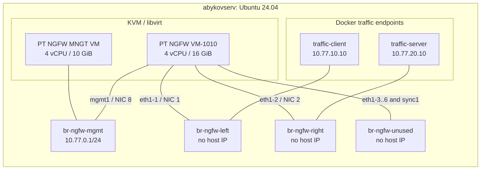

# PT NGFW 1.11.1 AuditD pilot on abykovserv

## Goal and safety boundary

This is a disposable, non-production experiment to determine which AuditD
configuration PT NGFW can sustain without losing the dataplane, management
access, or disk capacity. It does not expose the firewall to the home LAN or
the Internet and does not make PT NGFW the gateway for any existing service.

Ansible owns only the Ubuntu host, KVM/libvirt topology, server-local image
paths, and Docker traffic endpoints. It does not install software in the PT
appliances and does not apply AuditD rules there. PT documentation warns
against installing third-party software or updating base operating-system
components without vendor guidance. AuditD changes therefore remain an
explicit console/SSH experiment with a powered-off snapshot and a rollback
point.

The role is deliberately disabled by default. A normal site apply changes
nothing until `ngfw_lab_enabled: true` is set in the server-local
`/etc/ansible/local-overrides.yml`.

## Topology



The endpoint networks use Docker `ipvlan` on the two addressless libvirt
bridges. The host has no address on the left or right subnet. Consequently, it
must not be able to route `10.77.10.0/24` to `10.77.20.0/24`; forwarded traffic
has to traverse the NGFW dataplane. The unused dataplane and sync interfaces
are retained because the ready-made KVM image expects all eight interfaces.

Published minimums for the preview-sized management VM are 4 vCPU and 10 GiB.
The firewall VM uses 4 vCPU and 16 GiB. `host-passthrough` exposes the host CPU
features, and the role refuses to continue unless `/dev/kvm`, AMD-V/VT-x, and
the `pdpe1gb` flag are present. The pilot does not reserve 1 GiB HugeTLB pages
or change the host kernel command line automatically: that is a reboot-level
host change and the public requirement is CPU support for 1 GiB pages, not a
specific persistent reservation for this small lab.

Do not run the memory-heavy local LLM during comparable measurements. The two
VMs reserve 26 GiB before filesystem cache and container overhead; competing
LLM work would make the result impossible to interpret.

## Files and state

| Purpose | Server path | Git status |
| --- | --- | --- |
| Traffic Compose project | `/srv/apps/ngfw-lab` | Rendered by Ansible |
| Licensed base images | `/srv/app-data/ngfw-lab/images` | Never committed |
| Disposable overlays | `/srv/app-data/ngfw-lab/disks` | Never committed |
| Measurement exports | `/srv/app-data/ngfw-lab/reports` | Never committed by default |
| Rendered libvirt XML | `/etc/ngfw-lab` | Rendered by Ansible |

Expected image names:

```text
pt-ngfw-vm-1.11.1-1750-debian-12.qcow2
pt-ngfw-mngt-vm-1.11.1-1750-debian-12.qcow2
```

Base images are read-only inputs. The VMs write to copy-on-write overlays, so a
clean retry means powering the VMs off and replacing only the two overlays.

## Staged Ansible configuration

All host-specific switches belong in `/etc/ansible/local-overrides.yml`, not
Git. Start with infrastructure only:

```yaml
ngfw_lab_enabled: true
ngfw_lab_vms_enabled: false
ngfw_lab_start_vms: false
ngfw_lab_vm_autostart: false
ngfw_lab_start_traffic: false
```

Run the normal local apply. It installs KVM/libvirt tooling, creates four
isolated libvirt networks, creates two Docker ipvlan endpoint networks, and
renders the traffic Compose file. It does not define or start either VM.

Copy the two QCOW2 files to `/srv/app-data/ngfw-lab/images/`, then enable VM
definition without automatic start:

```yaml
ngfw_lab_enabled: true
ngfw_lab_vms_enabled: true
ngfw_lab_start_vms: false
ngfw_lab_vm_autostart: false
ngfw_lab_start_traffic: false
```

Run Ansible again. The role checks the image presence, creates copy-on-write
overlays, and defines both VMs. Start them manually for the first boot so that
console errors stay visible:

```bash
sudo virsh start pt-ngfw-mngt
sudo virsh start pt-ngfw-auditd
sudo virsh console pt-ngfw-mngt
sudo virsh console pt-ngfw-auditd
```

After initial PT configuration, either start the traffic endpoints manually or
set `ngfw_lab_start_traffic: true` and apply again:

```bash
cd /srv/apps/ngfw-lab
docker compose up -d --build
```

Automatic VM start stays disabled for the pilot. This avoids reserving 26 GiB
after every host reboot and prevents a failed AuditD experiment from returning
unattended.

Optional CPU pinning is available only after checking the live CPU topology.
The lists map guest vCPU 0..3 to host logical CPUs and must each contain exactly
four distinct values. Do not overlap the lists or use logical siblings as if
they were independent physical cores.

```yaml
ngfw_lab_ngfw_vcpu_pins: [0, 2, 4, 6]
ngfw_lab_mngt_vcpu_pins: [8, 10, 12, 14]
```

The example is illustrative, not a recommended value for abykovserv until
`lscpu --extended` has been inspected on the live host.

## Initial PT configuration

Use the PT quick-start procedure for first boot, licensing, MNGT enrollment,
zones, routes, and policy. Keep the lab addresses separate from home LAN:

| Component | Address |
| --- | --- |
| Host management bridge | `10.77.0.1/24` |
| MNGT VM | `10.77.0.10/24` |
| NGFW management | `10.77.0.20/24` |
| NGFW left dataplane | `10.77.10.1/24` |
| Traffic client | `10.77.10.10/24`, gateway `10.77.10.1` |
| NGFW right dataplane | `10.77.20.1/24` |
| Traffic server | `10.77.20.10/24`, gateway `10.77.20.1` |

Create the minimal allow policy from the left zone to the right zone. Do not
add host routes between the two data networks. With the NGFW VM powered off,
the client-to-server test must fail; if it succeeds, the topology has a bypass
and the AuditD experiment must not begin.

Reach the MNGT UI through an SSH tunnel to the host instead of advertising the
lab subnet through Tailscale. This keeps the lab private and avoids a persistent
route change.

## Baseline traffic and measurements

Use the [automatic traffic runner](ngfw-traffic-runner.md) for repeatable TCP,
UDP, small-packet, short-connection, HTTP, and DNS workloads. Each scenario has
a 2-minute warmup, a 10-minute measurement, and 3 minutes idle, repeated three
times. The default nine-scenario matrix takes 6 hours 45 minutes plus checks.
`python3 /srv/apps/ngfw-lab/runner.py plan` shows the exact commands without load.
The runner requires a recorded negative route check with NGFW powered off and
a healthy receiver, then a running/configured NGFW for the measured test.

Run one already configured AuditD profile at a time. Supply `--probe-argv-file`
for read-only guest observations and `--baseline` to compare with a completed
control run. `--traffic-only` explicitly records the absence of AuditD evidence.
Ansible only installs the runner and, when enabled, starts idle endpoints; it
never starts the workload matrix.

Record at least:

- offered and received bandwidth, retransmits, packet loss, and jitter;
- NGFW and MNGT vCPU time and memory from `virsh domstats`;
- host load, memory pressure, disk latency, and free space;
- NGFW management availability and dataplane reachability;
- `auditctl -s` values, especially `lost`, `backlog`, and backlog limit;
- AuditD log growth in bytes/second and events/second;
- any kernel, AuditD, or filesystem errors during the exact run window.

First run with the shipped AuditD state unchanged. That is the control; an
AuditD profile is not useful if its result cannot be compared with it.

## AuditD experiment ladder

AuditD has no ordinary severity level that can simply be lowered. Volume is
primarily controlled by the selected rules and event types. Move through these
profiles one at a time and reboot or reload only as required by the supported
PT procedure.

### Profile 0: inventory only

Capture the existing service state, `auditd.conf`, loaded rules, filesystem
free space, `auditctl -s`, and current event rate. Make no changes. Confirm how
AuditD was enabled during the earlier failed attempt; otherwise the pilot may
test a different failure mode.

### Profile 1: narrow administrative audit

Start only with authentication/identity changes, sudoers, time changes, and
the exact PT configuration files or service units that the test requires.
Avoid recursive directory watches and avoid broad executable trees. Use a
distinct key for each rule group so volume can be attributed later.

Candidate rule concepts, to be adapted to the actual appliance paths after a
read-only inventory:

```text
-w /etc/passwd -p wa -k identity
-w /etc/group -p wa -k identity
-w /etc/shadow -p wa -k identity
-w /etc/sudoers -p wa -k privilege
-w /etc/sudoers.d -p wa -k privilege
-a always,exclude -F msgtype=NETFILTER_PKT
```

Keep `NETFILTER_CFG` if it is emitted: configuration change evidence is useful
and is far less frequent than per-packet records. Do not add broad syscall
rules for `socket`, `connect`, `accept`, `sendto`, `recvfrom`, or `-S all`.
Those turn traffic volume into audit volume and are the leading hypothesis for
the previous failure.

Use a bounded logging envelope as a candidate, not as a blind replacement for
the shipped file. First compare every key with the appliance's current
`auditd.conf` and confirm support in its installed AuditD version:

```ini
write_logs = yes
log_format = RAW
flush = INCREMENTAL_ASYNC
freq = 100
max_log_file = 128
num_logs = 5
max_log_file_action = ROTATE
space_left = 25%
space_left_action = SYSLOG
admin_space_left = 10%
admin_space_left_action = SUSPEND
disk_full_action = SUSPEND
disk_error_action = SUSPEND
```

This caps the local rotated set at roughly 640 MiB and stops AuditD rather than
halting the firewall when storage is exhausted. It deliberately trades audit
completeness for appliance availability in this non-production pilot. Confirm
that the platform has another signal for the suspension and disk warning; if
not, the profile is not operationally acceptable.

For the kernel-side settings, keep the existing backlog value for the control
run, then test a bounded increase such as `-b 8192` only if the narrow rule set
shows short bursts. Use `-f 1`, never `-f 2`, in the pilot. Do not use a low
AuditD rate limit as the first fix: it converts excess volume into dropped
records. Never issue `auditctl -D` or deploy a rules file that begins with `-D`
until the shipped PT rules have been exported and the effect of removing them
has been explicitly reviewed.

### Profile 2: selected privileged execution

Add only the required privileged or administrative execution rules, scoped by
effective UID, architecture, and path where possible. Re-run the same traffic
matrix. Do not combine this step with filesystem recursion or network syscalls.

### Profile 3: bounded expansion

Add one rule family at a time. Measure its incremental event rate and disk
growth. A rule family that cannot be attributed and bounded is rejected even
if a short run appears healthy.

For the pilot, keep AuditD failure behavior non-fatal. Do not set kernel audit
failure mode to panic (`auditctl -f 2`), do not make disk-full action halt the
appliance, and do not lock the rule set with `-e 2` until a recovery method has
been proven. Rotation must have a finite size/count. Queue or rate-limit tuning
does not repair a rule set that audits every packet; it only changes whether
the appliance blocks or loses records.

## Stop criteria

The runner's [stop and observation contract](ngfw-traffic-runner.md#остановка-и-данные)
defines automated thresholds and their observation windows. It stops the current
workload and preserves the partial report. Snapshot restoration remains an
operator action. Kernel errors, swap behavior, administrative event presence,
and product health still require separate review. Thresholds are pilot limits,
not vendor capacity guarantees.

## Rollback and cleanup

Before the first AuditD change, power off both VMs and copy or snapshot the
overlays. Never take the reference snapshot while a VM is running. Keep the
original downloaded QCOW2 files unchanged.

For an AuditD-only failure, boot from the clean overlay and confirm that the
control traffic passes again. If the NGFW cannot boot, attach its overlay only
to an offline recovery VM or discard the overlay; do not modify the base image.

The role intentionally does not delete networks, images, disks, or VMs when
`ngfw_lab_enabled` is set back to false. Cleanup is destructive and must be a
separate explicit action with the two VM names and four network names reviewed
first.

## Acceptance result

The pilot is successful only when one minimal AuditD profile completes the full
traffic matrix with three repeats per scenario, after a cold VM start, with zero lost audit records, no
stop criterion, bounded log growth, and successful management/dataplane checks.
The result must name the exact rules, AuditD configuration, PT build, traffic
rates, and measurement timestamps. “AuditD enabled” without those details is
not a reproducible result.

## References

- [PT NGFW 1.11 quick start](https://help.ptsecurity.com/ru-RU/projects/ngfw/1.11/qsguide/8463685131)
- [PT NGFW 1.11 help](https://help.ptsecurity.com/ru-RU/projects/ngfw/1.11/help/12027908747)
