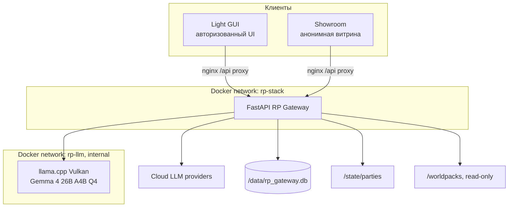
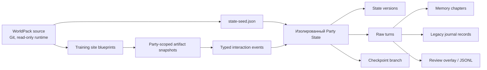

# Архитектура и границы

[← Главная](README.md) · [Далее: интерфейсы →](02-interfaces.md)

## Архитектурная идея

RP Stack отделяет «текст, который придумала модель» от «того, что действительно произошло». Gateway — единственный компонент, который может связать пользователя, мир, персонажа, модель, состояние и историю в одну партию.

```text
Party = WorldPack
      + PlayerCharacter
      + ModelProfile
      + ScenarioType
      + CanonicalState
      + TurnHistory
```

Браузер хранит cookie сессии и последнее выбранное представление. Он не является владельцем state, prompt history или provider key.

## Контейнеры и сети



Gateway не публикует host port. Снаружи доступны только nginx-контейнеры Light GUI и Showroom. Local LLM находится в отдельной internal-сети и не принимает запросы с LAN.

## Ответственность компонентов

| Компонент | Отвечает за | Не отвечает за |
|---|---|---|
| Light GUI | Чат, создание партии, GM-инструменты, Prompt Inspector, админка, безопасный рендеринг training artifacts | Правила, state, ключи провайдеров, долговременную память |
| Showroom | Витрина, анонимный запуск, минимальный чат, portal, training artifacts, рейтинг | Прямой доступ к party ID, скрытый scoring, администрирование без Gateway role |
| Gateway | Auth, party scope, state, history, правила, LLM routing, snapshots и события artifacts, branches, datasets | Верстку интерфейсов и ручное хранение секретов в браузере |
| WorldPack | Неизменяемый замысел мира, seed, prompts, authored training schedule, site blueprints и interaction policy | Выбор модели, party owner, runtime state конкретного прохождения |
| Narrator LLM | Финальная сцена, диалог и разрешённые текстовые поля artifact | Истину state, HTML/CSS/JS, scoring, права, выбор режима |
| Service model | Память, world-state drafts, генерация персонажей | Обычное ведение партии и использование party BYOK |
| Ansible | Доставка source/config/Compose на сервер | Игровое состояние и данные пользователей |

## Слои данных



- **WorldPack** — шаблон. Он не изменяется во время партии.
- **Party state** — текущие подтверждённые факты конкретного прохождения.
- **State versions** — история версий для rollback и audit.
- **Raw turns** — первичный журнал сообщений и фактических LLM-вызовов.
- **Memory chapters** — сжатые эпизоды для narrator prompt, но не замена raw history.
- **Legacy journal** — сохранённые записи прежних версий; текущий runtime их не генерирует.
- **Dataset labels** — отдельная кураторская разметка; она не переписывает игру.
- **Training artifact snapshot** — валидированный экземпляр шаблона с публичным текстом narrator; произвольный HTML модели не исполняется.
- **Interaction event** — типизированное действие `opened`, `submitted` или `reported`, которое Gateway привязывает к партии и учитывает детерминированно.

## Почему Gateway — authority

До LLM-вызова Gateway:

1. определяет владельца и партию;
2. загружает state и историю именно этой party/branch;
3. загружает неиспользованные типизированные события training artifacts;
4. интерпретирует текущую реплику;
5. выполняет режимный Rule Engine;
6. получает `Outcome` и предварительный state patch;
7. собирает ограниченный prompt и контракт ожидаемых artifacts.

После LLM-вызова Gateway валидирует текст, при необходимости просит исправление, применяет patch и сохраняет turn, request status и audit. Поэтому модель может красиво описать исход, но не заменить его другим.

## Основные границы совместимости

Текущий Compose содержит `rp-gateway`, `rp-light-gui`, `rp-showcase-gui` и опциональный `rp-local-llm`. SillyTavern-контейнера в нём нет.

При этом сохранены:

- `/v1/chat/completions` для OpenAI-compatible интеграций;
- SillyTavern lorebook JSON внутри некоторых WorldPacks;
- legacy single-campaign endpoints `/api/state`, `/api/world/*`.

Новые функции должны использовать party-scoped `/api/parties/{party_id}/...` или showroom-scoped `/api/showroom/...`.

## Связанные решения

- [Decision 006 — party flow](../../roles/apps/files/rp-stack/docs/decisions/006-light-gui-party-flow.md)
- [Decision 010 — scenario types](../../roles/apps/files/rp-stack/docs/decisions/010-party-scenario-types.md)
- [Compose](../../roles/apps/templates/rp-stack.compose.yml.j2)
