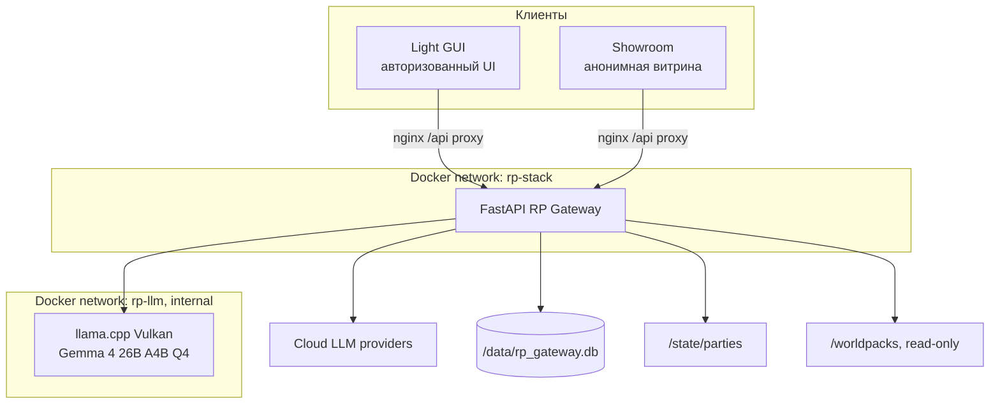
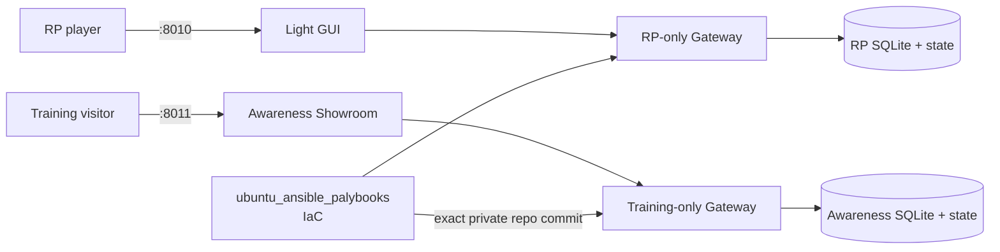
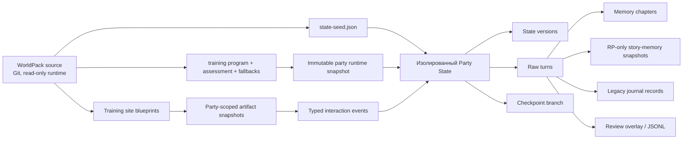
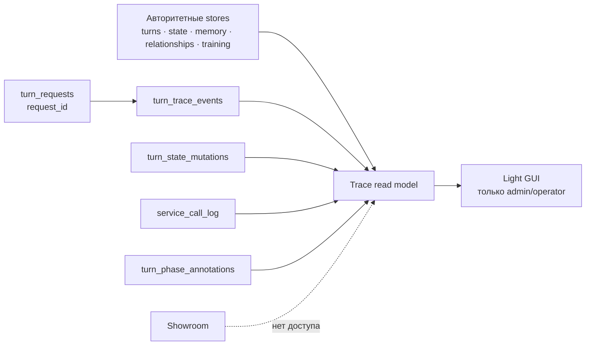
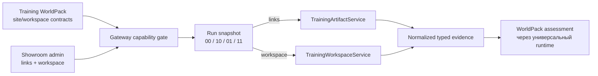

# Архитектура и границы

[← Главная](README.md) · [Далее: интерфейсы →](02-interfaces.md)

## Архитектурная идея

RP Stack отделяет «текст, который придумала модель» от «того, что действительно произошло». Gateway — единственный компонент, который может связать пользователя, мир, персонажа, модель, состояние и историю в одну партию.

```text
Party = WorldPack
      + PlayerCharacter
      + ModelProfile
      + ScenarioType
      + CanonicalState
      + TurnHistory
      + TrainingRuntimeSnapshot (если WorldPack объявил training_runtime)
      + RPStoryMemory (только scenario_type=rp)
```

Браузер хранит cookie сессии и последнее выбранное представление. Он не является владельцем state, prompt history или provider key.

## Контейнеры и сети



Gateway не публикует host port. Снаружи доступны только nginx-контейнеры Light GUI и Showroom. Local LLM находится в отдельной internal-сети и не принимает запросы с LAN.

### Принятая целевая граница

Decision 018 принят, но эта схема ещё не является live. После shadow-проверки
и cutover Showroom и Awareness переходят в отдельный application repository и
не используют RP SQLite, state root, cookies или Docker network:



Порт не является security boundary для cookie, поэтому новый project использует
собственные `awareness_gateway_session` и `awareness_showroom_visitor`. На
миграции переносится только configuration сценариев и covers; run/history/auth
identity начинается заново. Между Gateway нет runtime-вызовов, общей БД или
dual-write.

## Ответственность компонентов

| Компонент | Отвечает за | Не отвечает за |
|---|---|---|
| Light GUI | Чат, создание партии, GM-инструменты, Prompt Inspector, admin-only Turn Trace Workbench, админка, безопасный рендеринг training artifacts | Правила, state, ключи провайдеров, долговременную память |
| Showroom | Витрина, анонимный запуск, минимальный чат, portal, training artifacts, рейтинг | Прямой доступ к party ID, внутреннюю turn trace, скрытый scoring, администрирование без Gateway role |
| Gateway | Auth, party scope, state, history, универсальные интерпретаторы правил, LLM routing, диагностическую trace read model, snapshots и события artifacts, branches, datasets | Предметную программу обучения, верстку интерфейсов и ручное хранение секретов в браузере |
| WorldPack | Неизменяемый замысел мира, seed, prompts, executable training program/assessment/fallbacks, site/workspace blueprints и interaction policy | Выбор модели, party owner, runtime state конкретного прохождения |
| Narrator LLM | Финальная сцена, диалог и разрешённые текстовые поля artifact | Истину state, HTML/CSS/JS, scoring, права, выбор режима |
| Service model | Эпизодические главы, RP-only living story memory, world-state drafts, генерация персонажей | Обычное ведение партии, изменение canonical state и использование party BYOK |
| Ansible | Доставка source/config/Compose на сервер | Игровое состояние и данные пользователей |

## Слои данных



- **WorldPack** — шаблон. Он не изменяется во время партии.
- **Training runtime snapshot** — хешированный executable-контракт программы, оценки и fallback; обновление source влияет только на новые партии.
- **Party state** — текущие подтверждённые факты конкретного прохождения.
- **State versions** — история версий для rollback и audit.
- **Raw turns** — первичный журнал сообщений и фактических LLM-вызовов.
- **Memory chapters** — сжатые эпизоды для narrator prompt, но не замена raw history.
- **RP story memory** — кумулятивный реестр длинной RP-кампании; не создаётся для `training` и не является authority. Архивные агрегаты выведенного режима не исполняют новые memory jobs.
- **Legacy journal** — сохранённые записи прежних версий; текущий runtime их не генерирует.
- **Dataset labels** — отдельная кураторская разметка; она не переписывает игру.
- **Training artifact snapshot** — валидированный экземпляр шаблона с публичным текстом narrator; произвольный HTML модели не исполняется.
- **Interaction event** — типизированное действие `opened`, `submitted` или `reported`, которое Gateway привязывает к партии и учитывает детерминированно.

## Диагностический Turn Trace Workbench

Workbench не добавляет контейнер или второй state store. Корень трассы —
`(state_campaign_id, request_id)`, поэтому запрос остаётся видимым даже без
committed turn. Gateway объединяет существующие authoritative stores с
диагностическими событиями исполнения, точечными before/after для in-place
проекций, model attempts и пользовательскими аннотациями.



`turn_trace_events`, `turn_state_mutations`, `service_call_log` и аннотации не
читаются игровым runtime как вход. Ошибка диагностической записи не должна
изменить outcome, prompt, state patch, scoring или fallback. Workbench понимает
фактическую `rp_contract_revision`, а для legacy-партий —
`rp_contract_version`; незнакомые фазы остаются видимыми как generic nodes.
Admin-only gate не позволяет обычному владельцу партии увидеть скрытые
`AUTHORITATIVE_OUTCOME`, scoring или assessment-инструкции training runtime.

## Почему Gateway — authority

До LLM-вызова Gateway:

1. определяет владельца и партию;
2. загружает state и историю именно этой party/branch;
3. загружает immutable training-runtime snapshot и неиспользованные типизированные события training artifacts/workspace;
4. интерпретирует текущую реплику;
5. выполняет режимный Rule Engine; для нового training-контракта он интерпретирует WorldPack assessment без знания предметной области;
6. получает `Outcome` и предварительный state patch;
7. собирает ограниченный prompt, sanitized `ACTIVE_TRAINING_TURN_CONTRACT` и контракты только включённых artifacts/workspace.

После LLM-вызова Gateway валидирует текст, применяет patch и сохраняет turn,
request status и audit. Обычные режимы могут использовать repair. Новый
training runtime делает не более одного narrator-вызова и при нарушении
переходит к fallback текущего WorldPack-хода. Поэтому модель может заново
сформулировать сцену, но не заменить событие или score другим.

## Независимые training capabilities

> Статус: runtime реализован в IaC; применение ревизии и live-проверка фиксируются отдельно.

Showroom-сценарий имеет две независимые training-only настройки:
интерактивные ссылки и интерактивный рабочий диск. Наличие site/workspace
контракта в WorldPack будет означать поддержку, но не автоматическое включение.
Gateway проверит выбор и сохранит обе галки в immutable snapshot каждого run.



`TrainingWorkspaceService` работает как логический модуль Gateway, а не
новый синхронный контейнер. Открытие папки, файла или сайта останется
SQLite/JSON-операцией без LLM. Отдельный фоновый worker допустим только для
предварительной проверки и конвертации загружаемых документов.

## Основные границы совместимости

Текущий Compose содержит `rp-gateway`, `rp-light-gui`, `rp-showcase-gui` и опциональный `rp-local-llm`. SillyTavern-контейнера в нём нет.

Это описание остаётся верным до cutover Decision 018. Целевой RP Compose не
содержит `rp-showcase-gui` и training WorldPacks; Awareness Showroom поставляется
отдельным commit-pinned application через IaC.

При этом сохранены:

- `/v1/chat/completions` для OpenAI-compatible интеграций;
- SillyTavern lorebook JSON внутри некоторых WorldPacks;
- legacy single-campaign endpoints `/api/state`, `/api/world/*`.

Новые функции должны использовать party-scoped `/api/parties/{party_id}/...` или showroom-scoped `/api/showroom/...`.

## Связанные решения

- [Decision 006 — party flow](../../roles/apps/files/rp-stack/docs/decisions/006-light-gui-party-flow.md)
- [Decision 010 — scenario types](../../roles/apps/files/rp-stack/docs/decisions/010-party-scenario-types.md)
- [Decision 015 — training interaction capabilities](../../roles/apps/files/rp-stack/docs/decisions/015-training-scenario-interaction-capabilities.md)
- [Decision 017 — WorldPack-owned training runtime](../../roles/apps/files/rp-stack/docs/decisions/017-worldpack-owned-training-runtime.md)
- [Decision 018 — separate training and RP gateways](../../roles/apps/files/rp-stack/docs/decisions/018-separate-training-and-rp-gateways.md)
- [Plan 018 — Awareness Showroom project split](../../roles/apps/files/rp-stack/docs/plans/018-awareness-showroom-project-split.md)
- [Decision 027 — request-centric Turn Trace Workbench](../../roles/apps/files/rp-stack/docs/decisions/027-turn-trace-workbench.md)
- [Compose](../../roles/apps/templates/rp-stack.compose.yml.j2)
