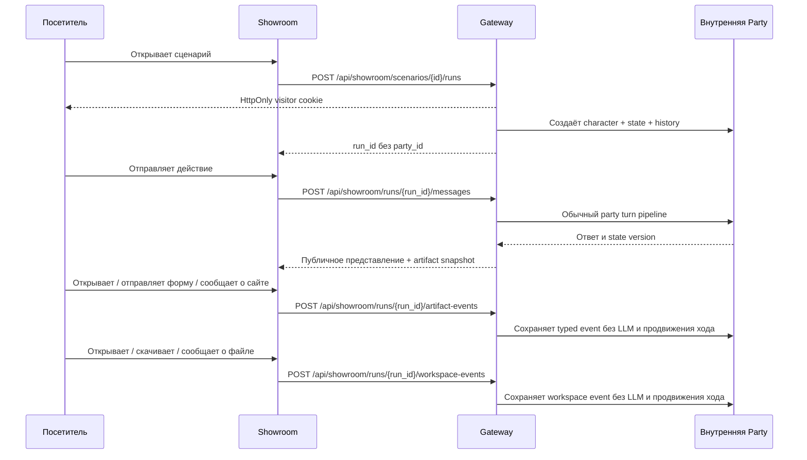

# Интерфейсы

[← Архитектура](01-architecture.md) · [Главная](README.md) · [Далее: жизненный цикл хода →](03-turn-lifecycle.md)

## Light GUI

Light GUI — основной интерфейс владельца партии. Это статические HTML/CSS/JavaScript, которые nginx отдаёт на `:8010` и проксирует `/api` в Gateway.

Основные возможности:

- вход через Gateway-сессию;
- список и создание партий;
- явный выбор WorldPack, персонажа, `scenario_type`, provider и narrator model;
- создание private generated WorldPack из короткого ручного prompt или загруженного `.md`: браузер читает Markdown как UTF-8-текст, показывает имя/размер/фрагмент и передаёт содержимое Gateway без HTML-rendering;
- основной чат с восстановлением pending-запроса после refresh;
- открытие валидированных training-сайтов и отправка накопленных событий перед следующим сообщением;
- сценарно-зависимое редактирование персонажей вручную и генерация служебной моделью: в `rp` обычная форма показывает только имя, статус, локацию и текущую цель, не изменяя скрытые расширенные поля; в `training` сохраняется полный редактор;
- выбор party-scoped BYOK-ключа;
- GM preview/apply/discard, state и rollback; отдельной RP-формы проверки нет;
- Prompt Inspector, реальный размер последнего prompt, память и lore cards; для `rp` панель памяти отдельно показывает living story snapshot, его revision и покрытие, а для `training` этого UI нет;
- checkpoints, branches и история LLM-autotest;
- 👍/👎 для полной пары «реплика игрока → ответ модели»;
- admin-раздел: пользователи, глобальная служебная модель, видимость миров, Showroom, автотесты и dataset review.

Light GUI не вызывает provider API напрямую. Даже если ключ введён пользователем, он сохраняется Gateway для конкретной партии и не возвращается в браузер целиком.

При создании мира ручное поле ограничено 6000 символами. Для `.md` действует отдельный предел: 1 МиБ на клиенте и 200 000 символов в Gateway. Такой файл становится стабильным world system prompt, поэтому для очень крупного мира пользователь должен выбрать narrator model с достаточным context window.

## Showroom

Showroom — отдельная витрина на `:8011` для прохождения опубликованных сценариев без регистрации.



`ShowroomScenario` и `WorldPack` — разные сущности. Scenario добавляет публичное название, описание, режим, модель, обложку, порядок и leaderboard policy к ссылке на WorldPack. Несколько сценариев могут использовать один мир.

Посетитель получает случайную HttpOnly-cookie. Gateway связывает её с `ShowroomRun`, а run — с внутренней Party. Публичному клиенту не выдаются raw party ID, скрытый score, rubric или answer key.

Для training-миров Showroom умеет:

- показывать immutable snapshot корпоративного портала до пяти персонажей;
- материализовать динамическую должность из описания сотрудника;
- отображать структурированные письма и чаты безопасными text nodes;
- открывать валидированные учебные сайты общим с Light GUI DOM-renderer;
- собирать opt-in leaderboard по numeric state path или числу ходов;
- хранить обратную связь 👍/👎 с проверкой владельца visitor cookie.

Обычные ссылки и вложения в structured content остаются неинтерактивными. Исключение — ссылка на валидированный training artifact: в письме и в блоке `СООБЩЕНИЕ` UI превращает только точное совпадение с выданным Gateway `display_url` в кнопку открытия сайта. Gateway отдаёт только публичный snapshot, UI собирает страницу из фиксированного blueprint без `innerHTML`, внешних ресурсов и исполняемого кода. Введённые значения не отправляются; Gateway получает только факт отправки формы.

После POST хода Showroom перечитывает canonical history из Gateway с
`cache: no-store`. Браузерный или промежуточный cache не может вернуть старую
историю и убрать pending-placeholder до появления уже сохранённой реплики.

## Административный контур

Админка живёт в Light GUI и использует те же Gateway session/role проверки. Она управляет:

- пользователями и их статусами;
- сменой паролей;
- глобальной служебной моделью;
- public/private видимостью WorldPacks;
- Showroom-сценариями и обложками;
- party-scoped LLM-vs-LLM autotests;
- review статусами партий и ходов;
- JSONL-экспортом одобренных samples.

Администратор не получает raw API key через публичный API: ответ содержит метаданные и последние четыре символа.

### Галки training-сценария

> Статус: UI и Gateway API реализованы в IaC; live-статус зависит от применённой ревизии.

После выбора `Тип сценария = Training` редактор Showroom должен показывать две
независимые галки:

```text
[ ] Подключить интерактивные ссылки
[ ] Подключить интерактивный диск
```

Для `rp` и `novel` они скрыты или заблокированы и всегда сохраняются как
`false`. Gateway, а не браузер, проверяет поддержку выбранным WorldPack. Один
сценарий хранит одну комбинацию; четыре копии мира и автоматические четыре
карточки не создаются. Для сравнения режимов администратор может опубликовать
несколько сценариев, ссылающихся на один WorldPack.

При старте Gateway копирует `interactive_links_enabled` и
`interactive_workspace_enabled` в run. Последующее редактирование сценария не
меняет уже начатую тренировку. Рабочая папка появляется в пользовательском UI
только при включённом snapshot-флаге; ссылки аналогично получают интерактивный
site snapshot только при включённом флаге.

## Compatibility API

Gateway сохраняет OpenAI-compatible `/v1/chat/completions` и legacy single-campaign endpoints. Они нужны для интеграций и отладки, но не должны становиться основой новых функций.

Party-scoped `POST /api/parties/{party_id}/checks` также сохранён для старых
клиентов. Для партии `rp-core.v2` он возвращает нейтральный narrative envelope,
не бросает кубик, не назначает success/failure и не создаёт запись проверки.

| Свойство | Light GUI | Showroom | `/v1/chat/completions` |
|---|---|---|---|
| Пользователь | Gateway account | Анонимная visitor cookie | Внешняя интеграция |
| Контекст | Явный `party_id` | `run_id -> party` внутри Gateway | Legacy/default campaign |
| Админ-инструменты | Да, по роли | Нет | Нет |
| Provider key | Server или party BYOK | Модель сценария | Заголовок/настройки совместимости |
| Рекомендуемый путь | Да | Да | Только compatibility |

## Исходники

- [Light GUI](../../roles/apps/files/rp-stack/rp-light-gui)
- [Showroom](../../roles/apps/files/rp-stack/rp-showcase-gui)
- [Showroom ADR](../../roles/apps/files/rp-stack/docs/decisions/012-public-showroom-scenarios.md)
- [Training capabilities ADR](../../roles/apps/files/rp-stack/docs/decisions/015-training-scenario-interaction-capabilities.md)
- [Gateway endpoints](../../roles/apps/files/rp-stack/rp-gateway/app/main.py)
