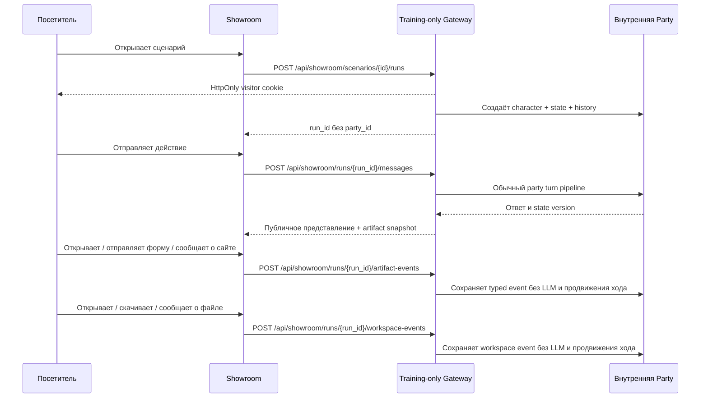

# Интерфейсы

[← Архитектура](01-architecture.md) · [Главная](README.md) · [Далее: жизненный цикл хода →](03-turn-lifecycle.md)

## RP contract revision

`PartySummary` совместимо хранит целое поле `rp_contract_revision` (`0..11`).
Gateway source поддерживает revision `11`, а activation inventory настроен на
observed `11` вместе с первым revision-11 WorldPack. Для declarations
`0..10` обычная новая RP-партия получает `min(WorldPack declared, observed)`.
Declared revision `11` требует observed `>=11` и иначе fail-closed, без
downgrade до `10`. Запрос создания
manual branch или autotest может явно передать candidate-ревизию в диапазоне
`0..11`; она хранится только у ветки и не меняет source party. Существующие поля и
endpoint сохраняются. Пустое поле в админской форме сохраняет revision исходной
партии. Existing party не повышается автоматически при изменении observed.

## Clean RP API Decision 043

При `RP_REBUILD_ENABLED=true` ordinary RP сохраняет прежние Party URL, но
использует новый строгий payload без revision/state/character compatibility:

- `GET /api/worldpacks` возвращает ровно `day-watch-moscow-v2` и summaries
  пресетов; detail дополнительно возвращает валидный `free_scenario_seed`;
- training query/payload не является compatibility-веткой: после C1 RP Gateway
  не публикует training WorldPacks/templates/player characters и отклоняет
  `scenario_type=training` до DB/provider write;
- `POST /api/parties` одним запросом принимает `world_id`, `scenario` типа
  `preset` или `free`, `model_profile_id` и опциональные narrator settings;
- `POST /api/parties/{id}/start` принимает только `idempotency_key`;
- `POST /api/parties/{id}/messages` принимает ровно `content`,
  `idempotency_key`, `expected_version`; stale version даёт `409` без replay;
- history возвращает `turn_kind`, `player_text`, `narrator_text` и committed
  version; provider failure даёт retryable `502`, не создаёт turn и возвращает
  исходный текст игрока;
- memory, jobs, runtime Lore, supervisor трёх ролей и Administrator proposals
  читаются отдельными owner-scoped endpoints; proposal меняется только явным
  `accept` или `reject` владельца Party.

Narrator profile фиксирует exact provider/base URL/model. Clean BYOK можно
сохранить только для этой связи; custom endpoint без exact Party key закрывается
до provider call. Скрытый, batch, short-context или retired profile нельзя
передать напрямую в create/start/message.

Обычные legacy RP state/world/branch/autotest/dataset/trace операции при cutover
не становятся compatibility-слоем: они возвращают `410` или фильтруют ordinary
RP. Training/Showroom не используют этот контракт: их единственный active source
находится в standalone project с целевым LAN-only `192.168.1.88:8011`. Light GUI
в source уже понимает clean API, но production-флаг выключен, поэтому live UX
ещё не переключён и не проверен.

### Light GUI при clean cutover

После активации clean-контура владелец партии видит новый внешний контракт:

- сначала выбирает World, затем авторский preset или собирает free Scenario;
- несохранённый opening не создаёт ход, а UI оставляет явный retry с тем же
  idempotency key;
- обычный ход отправляет exact optimistic version; `409` перечитывает Party без
  автоматического replay, а retryable отказ сохраняет текст и exact request;
- панель показывает три раздельные роли: Narrator, atomic service и Administrator;
- предложения Administrator принимает или отклоняет владелец Party, а не только
  пользователь с глобальной ролью admin;
- training UI и routes в RP Light GUI отсутствуют; пользователь проходит курсы
  через standalone Showroom на `:8011` после C1 apply.

## Light GUI

Light GUI — основной интерфейс владельца RP-партии. Это статические
HTML/CSS/JavaScript, которые nginx отдаёт на `:8010` и проксирует `/api` в RP
Gateway. C1 source ограничивает production Gateway режимом `rp`; до Ansible
apply живой сервер всё ещё использует прежний общий процесс.

Основные возможности:

- вход через Gateway-сессию;
- список и создание партий;
- явный выбор RP WorldPack, персонажа, provider и narrator model; после C1 apply
  training WorldPacks и создание `scenario_type=training` недоступны;
- party-scoped параметры narrator во вкладке «Управление» для поддерживаемых OpenRouter Luna, Luna Pro и DeepSeek V4 Flash;
- создание private generated WorldPack из короткого ручного prompt или загруженного `.md`: браузер читает Markdown как UTF-8-текст, показывает имя/размер/фрагмент и передаёт содержимое Gateway без HTML-rendering;
- основной чат с восстановлением pending-запроса после refresh;
- редактирование RP-персонажей вручную и генерация служебной моделью: обычная форма показывает только имя, статус, локацию и текущую цель, не изменяя скрытые расширенные поля;
- выбор party-scoped BYOK-ключа;
- GM preview/apply/discard, state и rollback; отдельной RP-формы проверки нет;
- Prompt Inspector, реальный размер последнего prompt, память и lore cards; панель памяти отдельно показывает living story snapshot, его revision и покрытие, revisions 2..8 готовят legacy correction со следующим ходом, а rev9 открывает отдельный GM draft/confirm; для rev8+ под narrator response показываются Lore Cards, реально попавшие в его prompt, и явная кнопка draft из завершённого хода;
- request-centric Turn Trace Workbench с main/background lanes, narrator/service attempts, state mutation diff и аннотациями;
- checkpoints, branches и история LLM-autotest;
- 👍/👎 для полной пары «реплика игрока → ответ модели»;
- admin-раздел RP Gateway: пользователи, глобальная служебная модель, видимость
  RP-миров, RP-autotests и dataset review; Showroom administration после C1
  принадлежит standalone training project.

Light GUI не вызывает provider API напрямую. Даже если ключ введён пользователем, он сохраняется Gateway для конкретной партии и не возвращается в браузер целиком.

### Authored presets и opening seeds в revision 11

Для revision-11 WorldPack в режиме `rp` `GET /api/worldpacks` возвращает отдельные top-level
списки `presets[]` (`id`, `title`) и `openings[]` (`id`, `title`,
`player_role`) вместе с `presets_default` и `openings_default`. Light GUI
показывает два selector до создания партии и отправляет только выбранные IDs:

```text
POST /api/player-characters/draft   {worldpack_id, ..., opening_id?}
POST /api/player-characters         {..., opening_id?}
POST /api/parties                   {..., preset_id?, opening_id?}
```

Omitted ID означает объявленный default, а не первый элемент массива.
Неизвестное или похожее на путь значение отклоняется; браузер не передаёт пути
WorldPack. `PlayerCharacterSummary` возвращает resolved `opening_id`.
`PartySummary` может вернуть выбранные `preset_id`, `opening_id` и audit-only
SHA-256, но не полные materialized prompt texts или state seed.

Для паков revisions `0..10` новые поля отсутствуют из ответа и форма сохраняет
прежний UX. Activation merge `80ab6d3` применён 27 августа 2026 года:
авторизованный Light GUI показал все три preset и четыре opening варианта,
передал выбранные `strategic` и `inquisition-observer`, а созданная ordinary
party сохранила оба ID и revision `11`. Это уровень `подключено`; отдельного
зарегистрированного causal probe и endurance-доказательства для revision 11 нет.

### Статус RP supervisor

Если WorldPack объявляет `manifest.files.rp_supervisor`, существующая панель
памяти дополнительно читает owner-scoped
`GET /api/parties/{party_id}/supervisor`. Она показывает режим, число canonical
playable units до следующей ретроспективы, статус последней оценки и фактически
выбранную глобальную служебную модель. Отдельного selector модели нет.

В `observe` UI прямо сообщает, что оценки не влияют на narrator. В `enforce`
он показывает число активных authored рекомендаций, но не раскрывает service
prompt или raw response. Party без opt-in контракта не получает ни вызовов, ни
лишнего блока в панели.

### Lore Cards в revision 8

History API возвращает для хода `metadata.prompt_assembly.lore_card_ids` и
читаемые `activated_lore_cards`. UI строит chips строго в порядке ID из metadata,
поэтому не показывает карточку, которую Gateway отбросил из финального prompt.

Кнопка «Сделать Lore Card из хода» вызывает party-scoped
`POST /api/parties/{party_id}/lore-cards/draft` с ID сохранённого complete turn.
Gateway возвращает только draft и заполняет им существующую видимую форму.
Пока игрок не проверил текст и не нажал «Подтвердить Lore Card», create endpoint
не вызывается и карточки в party storage нет. Свободный текст чата не запускает
draft classifier. Provider key и request остаются на стороне Gateway.

### Disabled clean Lore и PlayerCorrection

Кандидат [Decision 043](../../roles/apps/files/rp-stack/docs/decisions/043-rp-stack-rebuild.md)
за `RP_REBUILD_ENABLED=false` сохраняет публичные Lore paths, но делает их
типизированными Party operations. Явный
`POST /api/parties/{party_id}/lore-cards/draft` принимает один complete turn,
`kind`, ожидаемую версию и idempotency key. Existing async runner возвращает
плоский draft либо `no_candidate`; только отдельный
`POST /api/parties/{party_id}/lore-cards` сохраняет проверенную игроком карту.
`GET /api/parties/{party_id}/lore-cards` различает ровно `world`, `scenario` и
`runtime`, а immutable runtime-запись сохраняет выбранный до вызова
`authoring_kind=character|event|location`. Игрок может отредактировать содержимое
draft перед confirm; job, kind и единственный source turn при этом не меняются.

Явная коррекция использует три owner-scoped endpoint:

- `POST /api/parties/{party_id}/player-corrections/draft`;
- `GET /api/parties/{party_id}/player-corrections`;
- `POST /api/parties/{party_id}/player-corrections/{proposal_id}/decision`.

Draft получает только bounded ranked catalog целей и не меняет RAW, memory или
state. `accept` повторно проверяет Party version, catalog hash и exact target,
после чего создаёт неизменяемый overlay ровно для следующего narrator prompt;
`reject` ничего не проецирует. Exact duplicate и повтор того же решения
идемпотентны, stale decision возвращает `409`. Этот интерфейс ещё не является
production activation: нужны merge, apply, включение флага и отдельная live-
приёмка.

### Обращение к мастеру в revision 9

Composer rev9 RP party показывает отдельную кнопку «Мастеру». Она отправляет
`channel=gm` и обходит автоматический classifier. Обычная отправка использует
`channel=auto`: если local `gm_intent` не уверен или недоступен, API возвращает
`status=route_required`, UI показывает «Мастеру / В сцену», а turn/state не
меняются.

GM route возвращает `status=gm_draft` и strict `gm_patch_draft` с exact target,
`before` и `after`. UI показывает diff; confirm/reject отправляется отдельно в
`POST /api/parties/{party_id}/gm-corrections/decide`. Reject ничего не пишет.
Confirm создаёт одну внеигровую запись в истории: она отображается центральной
заметкой мастера, не получает 👍/👎, Lore Card draft или фиктивный narrator
response. Сцена и игровое время остаются прежними.

Кнопки «Исправить / Отозвать» в панели story memory для rev9 сразу открывают тот
же GM draft с exact target slot. Revisions 2..8 сохраняют прежний pending payload
со следующим игровым ходом. Rev9 legacy `story_memory_corrections[]` отклоняет,
чтобы один и тот же correction не мог пройти двумя разными путями.

### Параметры наратора

В «Управлении» параметры сохраняются вместе с выбранной моделью одной кнопкой и
действуют со следующего narrator-ответа. Значение «Авто» означает, что поле не
передаётся и модель использует свой default. Для Luna и Luna Pro доступны глубина
рассуждений и бюджет ответа; для DeepSeek V4 Flash дополнительно доступны
temperature и Top P. Короткое описание рядом с каждым полем объясняет влияние на
скорость, стоимость, вариативность и риск оборванного ответа. Неподдерживаемая
модель не показывает фиктивные disabled-настройки.

Настройки не меняют service model, memory jobs, relationship extraction,
auto-player или правила WorldPack. Gateway повторно проверяет диапазоны и
возможности выбранной модели; браузер не является authority. Смена модели через
старый payload без `narrator_settings` сохраняет параметры при повторном выборе
того же profile и сбрасывает их при переходе на другой profile.

Обычный `POST /api/parties/{party_id}/messages` сохраняет прежний контракт и
дополнительно принимает необязательный `story_memory_corrections[]` только для RP
revisions 2..8: `{field, fact_id, action: retract|replace, replacement_text?}`.
Gateway отклоняет неизвестную или уже неактивную цель до provider/state/turn;
authority и provenance не являются полями публичного payload.

При создании мира ручное поле ограничено 6000 символами. Для `.md` действует отдельный предел: 1 МиБ на клиенте и 200 000 символов в Gateway. Такой файл становится стабильным world system prompt, поэтому для очень крупного мира пользователь должен выбрать narrator model с достаточным context window.

### Read-only context и prompt diagnostics для branch

Candidate revision-7 follow-up добавляет один необязательный query-параметр к
существующим диагностическим endpoint:

```text
GET  /api/parties/{party_id}/context?branch_id={branch_id}
POST /api/parties/{party_id}/prompt/preview?branch_id={branch_id}
     {"content":"...", "source":"current|last"}
```

`branch_id` выбирает existing isolated branch только внутри той же party и owner
scope. Gateway сам разрешает её state store, source-party runtime settings и
persisted branch revision; raw `state_campaign_id` клиент не передаёт. При указанном
параметре ответ также содержит `branch_id`. Без параметра прежние source-party
path, preview body и response shape сохраняются без изменений. Неизвестная,
чужая или принадлежащая другой партии ветка возвращает `404`.

Оба endpoint остаются read-only: они не вызывают provider, не создают turn,
snapshot или branch и не меняют source/branch state. Wiring и excluded-turn
hardening merged в PR59/PR61, applied и live-проверены: excluded latest turn
`party_ad201794ce31` вернул один и тот же content-free `prompt_assembly` из turn
metadata, gateway trace, Prompt Inspector `source=last` и recorded context.
Registry-row Decision 030 имеет уровень `подключено`. Отдельный UI-control этим
контрактом не вводится.

### Turn Trace Workbench

Workbench доступен в Light GUI только пользователю с существующей ролью Gateway
`admin` (оператору). Обычный владелец партии не получает trace API. Ветка
выбирается явным `branch_id`; Gateway сам разрешает его в изолированный
`state_campaign_id`.

Замороженный API:

```text
GET  /api/turn-traces/parties
GET  /api/turn-traces/parties/{party_id}/branches
GET  /api/parties/{party_id}/turn-traces?branch_id&limit&before
GET  /api/parties/{party_id}/turn-traces/{request_id}?branch_id
POST /api/parties/{party_id}/turn-traces/{request_id}/annotations?branch_id
     {"annotation_id":"...","phase_key":"...","body":"..."}
```

Первые два endpoint возвращают партии и ветки для административной загрузки
страницы. Список возвращает
bounded summaries и непрозрачный cursor; тяжёлые prompt, response и
before/after загружаются detail-запросом. Экран показывает только реально
исполненные фазы, отличает main/background работу, repair/fallback и request без
committed turn. Для RP используется `rp_contract_revision`, если она есть, иначе
legacy `rp_contract_version`; неизвестная фаза отображается без клиентского enum.
В сравнении первый столбец всегда называет исполнителя и человеческое назначение
фазы, сохраняя `alignment_key` как вторичную техническую метку. Структурированные
данные раскрываются по JSON-сегментам, а сравнение показывает leaf-oriented
изменения по путям без повторного вывода неизменившейся части полного state/payload.
Единственная мутация из Workbench — идемпотентная аннотация существующей фазы;
она попадает в audit, но не меняет игру.

Обычный владелец партии и Showroom не получают страницу, ссылку или trace
endpoint: пользовательская session, visitor cookie и `run_id` не дают права на
внутренние prompt, ответы моделей, state diff или server-only training policy.

## Showroom

Showroom — отдельная витрина на `:8011` для прохождения опубликованных сценариев без регистрации.

Decision 018 сохраняет этот пользовательский адрес и публичный `run_id` API, но
меняет deployment ownership: C1 source закрепляет public
`tavern-awareness-showroom` через `awareness_showroom_repo_version` с
training-only Gateway и LAN-only bind `192.168.1.88:8011`. Выбор `rp` и создание
мира по prompt в нём отсутствуют. После Ansible apply старый Showroom на `:8011`
и общий Gateway больше не являются фактическим runtime для training.

Публичные `/api/showroom/**` и `run_id` не меняются: browser обращается к тому
же origin `:8011`, а Nginx нового Showroom проксирует `/api/*` только в свой
standalone Training Gateway. В ответах Showroom по-прежнему нет `party_id`.
Rollback window равен `0`: legacy UI и его RP source удаляются в той же
поставке и второго training route после apply нет.



`ShowroomScenario` и `WorldPack` — разные сущности. Scenario добавляет публичное название, описание, режим, модель, обложку, порядок и leaderboard policy к ссылке на WorldPack. Несколько сценариев могут использовать один мир.

Посетитель получает случайную HttpOnly-cookie. Gateway связывает её с `ShowroomRun`, а run — с внутренней Party. Публичному клиенту не выдаются raw party ID, скрытый score, rubric или answer key.

Для training-миров Showroom умеет:

- показывать immutable snapshot корпоративного портала до пяти персонажей;
- материализовать динамическую должность из описания сотрудника;
- отображать структурированные письма и чаты безопасными text nodes;
- открывать валидированные учебные сайты безопасным DOM-renderer standalone UI;
- собирать opt-in leaderboard по numeric state path или числу ходов;
- хранить обратную связь 👍/👎 с проверкой владельца visitor cookie.

Обычные ссылки и вложения в structured content остаются неинтерактивными. Исключение — ссылка на валидированный training artifact: в письме и в блоке `СООБЩЕНИЕ` UI превращает только точное совпадение с выданным Gateway `display_url` в кнопку открытия сайта. Gateway отдаёт только публичный snapshot, UI собирает страницу из фиксированного blueprint без `innerHTML`, внешних ресурсов и исполняемого кода. Введённые значения не отправляются; Gateway получает только факт отправки формы.

После POST хода Showroom перечитывает canonical history из Gateway с
`cache: no-store`. Браузерный или промежуточный cache не может вернуть старую
историю и убрать pending-placeholder до появления уже сохранённой реплики.

## Административный контур

После C1 граница администрирования совпадает с границей данных. Light GUI
использует RP Gateway session/role и управляет:

- пользователями и их статусами;
- сменой паролей;
- глобальной служебной моделью;
- public/private видимостью RP WorldPacks;
- party-scoped LLM-vs-LLM autotests;
- review статусами партий и ходов;
- JSONL-экспортом одобренных samples.

Сценарии, обложки, посетители и прохождения Showroom принадлежат standalone
Training Gateway. Опубликованный каталог поставляется из Git и не копируется из
старой RP SQLite. Старые строки остаются нетронутыми, но после C1 не доступны
через production RP Gateway. Живое разделение этой границы ожидает apply.

Администратор не получает raw API key через публичный API: ответ содержит метаданные и последние четыре символа.

### Галки training-сценария

> Статус: standalone UI/Gateway и Git-каталог закреплены C1 source; новый
> `:8011`, backup/restore и browser flow ожидают Ansible apply и live-проверку.

Standalone-редактор Showroom всегда создаёт `training` и не предлагает выбор
`rp`. Он показывает две независимые галки:

```text
[ ] Подключить интерактивные ссылки
[ ] Подключить интерактивный диск
```

Gateway, а не браузер, проверяет поддержку выбранным WorldPack. Один сценарий
хранит одну комбинацию; четыре копии мира и автоматические четыре карточки не
создаются. Для сравнения capability-комбинаций администратор может опубликовать
несколько сценариев, ссылающихся на один WorldPack.

При старте Gateway копирует `interactive_links_enabled` и
`interactive_workspace_enabled` в run. Последующее редактирование сценария не
меняет уже начатую тренировку. Рабочая папка появляется в пользовательском UI
только при включённом snapshot-флаге; ссылки аналогично получают интерактивный
site snapshot только при включённом флаге.

## Compatibility API

RP Gateway сохраняет OpenAI-compatible `/v1/chat/completions` и legacy
single-campaign endpoints. Они нужны для интеграций и отладки, но не должны
становиться основой новых функций. Training Gateway эти RP compatibility routes
не публикует.

Party-scoped `POST /api/parties/{party_id}/checks` также сохранён для старых
клиентов. Для партии `rp-core.v2` он возвращает нейтральный narrative envelope,
не бросает кубик, не назначает success/failure и не создаёт запись проверки.

| Свойство | Light GUI | Showroom | `/v1/chat/completions` |
|---|---|---|---|
| Пользователь | Gateway account | Анонимная visitor cookie | Внешняя интеграция |
| Контекст | Явный `party_id` | `run_id -> party` внутри Gateway | Legacy/default campaign |
| Админ-инструменты | Да, по роли | Нет | Нет |
| Provider key | Server или party BYOK | Модель сценария | Заголовок/настройки совместимости |
| Рекомендуемый путь | Да | Да | Только compatibility |
| Внутренняя turn trace | Только admin/operator | Нет | Нет |

## Исходники

- [Light GUI](../../roles/apps/files/rp-stack/rp-light-gui)
- [Standalone Awareness Showroom](https://github.com/abykovwww-byte/tavern-awareness-showroom)
- [Showroom ADR](../../roles/apps/files/rp-stack/docs/decisions/012-public-showroom-scenarios.md)
- [Project split plan](../../roles/apps/files/rp-stack/docs/plans/018-awareness-showroom-project-split.md)
- [Training capabilities ADR](../../roles/apps/files/rp-stack/docs/decisions/015-training-scenario-interaction-capabilities.md)
- [Turn Trace Workbench ADR](../../roles/apps/files/rp-stack/docs/decisions/027-turn-trace-workbench.md)
- [Gateway endpoints](../../roles/apps/files/rp-stack/rp-gateway/app/main.py)
