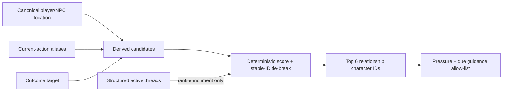
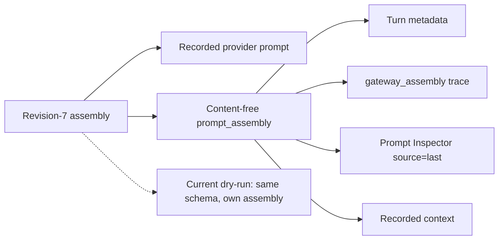
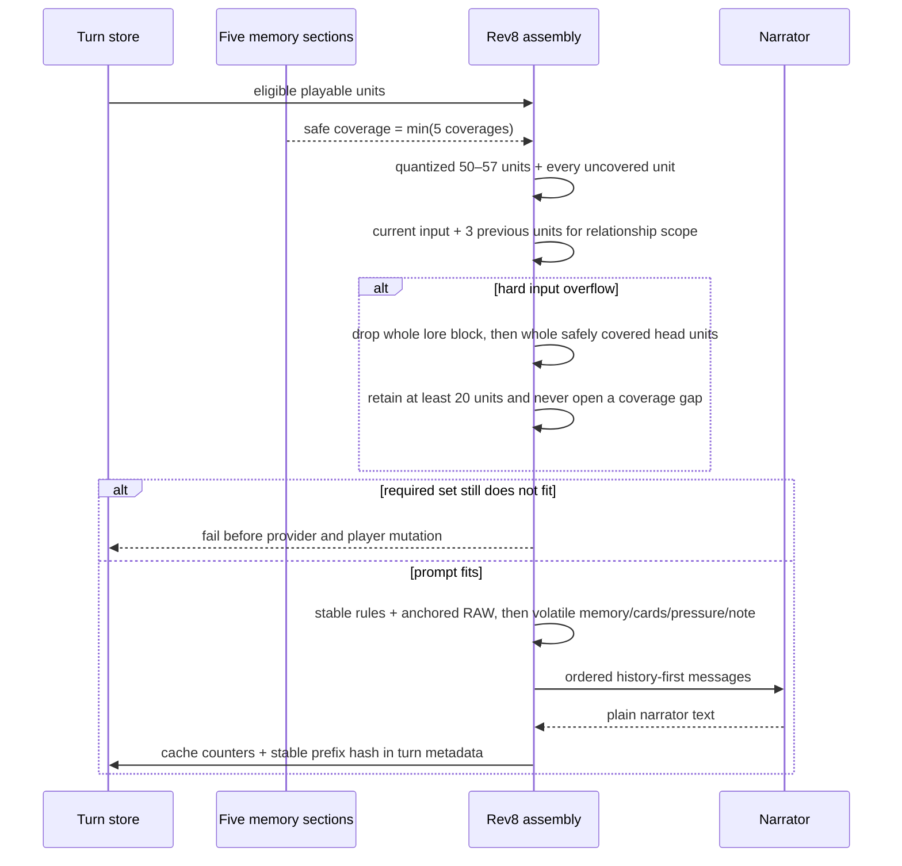
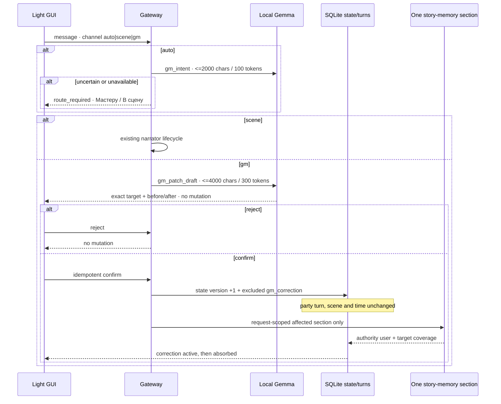
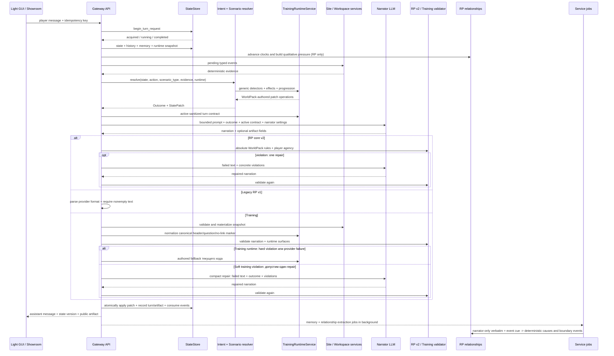
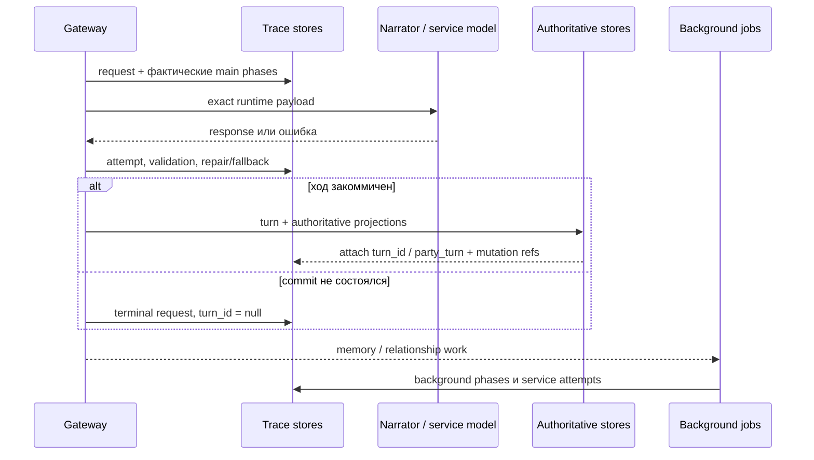
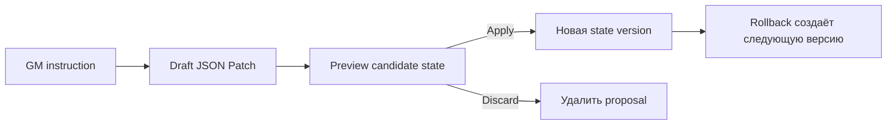

# Жизненный цикл игрового хода

[← Интерфейсы](02-interfaces.md) · [Главная](README.md) · [Далее: WorldPacks и режимы →](04-worldpacks-and-modes.md)

## Кумулятивный RP-контракт

- revision 1 убирает hidden D20/feasibility и оставляет нейтральное продолжение;
- revision 2 включает Gateway merge living-memory с устойчивыми tombstone-фактами;
- revision 3 валидирует абсолютные правила до commit, включая opening scene;
- revision 4 замыкает relationship cause/event в фактический provider prompt и
  наблюдаемое исполнение события;
- revision 5 фиксирует consumer-or-retire для активных state paths;
- revision 6 удерживает raw history неизменной и собирает выборочный prompt.
- revision 7 / DC1 защищает полный raw tail после effective
  story-memory coverage и fail-closed обрабатывает hard overflow.
- revision 7 / DC2 ограничивает relationship pressure производным
  pre-scene scope.
- revision 7 / DC3 принимает prompt authority, structural
  deduplication и content-free assembly diagnostics.
- revision 7 / DC4 подключает `scene_state`, minimal narrator bundle,
  deterministic continuity gate и atomic state/turn commit.
- revision 8 / S1 возвращает narrator якорное окно 50–57 игровых единиц
  плюс весь uncovered tail, хранит пять независимо покрываемых memory-секций,
  обновляет их одним штатным call с точечным structural retry и удаляет legacy
  scene/state/archive blocks только из rev8 prompt.
- revision 9 / S3 отделяет подтверждённое исправление игрока от действия в
  сцене и поглощает его одной затронутой секцией памяти.
- revision 10 / S4 добавляет optional authored world clock: local model оценивает
  только elapsed, а Gateway детерминированно исполняет cancelable events.

Все DC1–DC4 readiness rows имеют уровень `подключено`; отдельный pull-based
activation и post-apply stamp proof подтвердили effective observed `7` для новых
ordinary RP-parties. Код revision `8` / S1 слит и применён; отдельный
source-activation slice ранее подтвердил observed `8` для
`merchant-sviatoslav`. Следующий source rollout поднимает gate до `10`, но
effective runtime revision `10` появится только после отдельного Ansible apply
и создания новой ordinary party; existing parties не мигрируются. До живой
60-turn проверки registry 032 остаётся на ступени `каркас`.

На revision 3+ повторное нарушение абсолютного правила после одного repair
завершает запрос контролируемой ошибкой без новой state version и turn; это же
правило действует для admin autotest RP-веток. Только deterministic training runtime
может заменить невалидный ответ authored fallback. На revision 4+ due `favour`
создаёт служебное обязательство показать конкретную добровольную помощь, но остаётся
active до evidence-checked relationship extraction. Статус `resolved/delivered`
ставится лишь после положительной причины того же персонажа из реально записанной
сцены. Оба relationship-блока исключаются из публичного Prompt Inspector.

## Revision 7: DC1

[Decision 028](../../roles/apps/files/rp-stack/docs/decisions/028-rp-uncovered-tail-and-overflow.md)
применяется только к RP revision `7`. До activation apply она проверялась в
изолированной candidate branch; после apply исполняется в новых ordinary parties
с declared revision `7`.
Gateway берёт newest valid effective story-memory snapshot и включает каждую
non-excluded raw-пару новее его coverage. Перед narrator call snapshot читается
повторно; advance, rollback или исчезновение snapshot требуют полной пересборки
и новой сверки. После трёх нестабильных циклов запрос завершается до provider.

```mermaid
sequenceDiagram
    participant API as Gateway
    participant Store as StateStore
    participant Mem as RP story memory
    participant LLM as Narrator

    API->>Store: effective snapshot + all turns after coverage
    API->>API: assemble protected raw tail
    alt required prompt exceeds hard input budget
        API->>Mem: bounded catch_up(force=true)
        Mem-->>API: conditional snapshot / no plan / failure
        API->>Store: re-read coverage and rebuild full tail
    end
    alt rebuilt prompt fits
        API->>LLM: first narrator call; existing repair policy unchanged
    else still over budget
        API-->>API: sanitized PromptBudgetExceeded before player mutation
    end
```

Успешный maintenance snapshot может сохраниться даже при конечном overflow, но
player turn, state version и relationship projections не меняются. Deployed
Merchant canary подтвердил полный uncovered tail и explicit branch revision `7`.
Финальная paired canary закрыла overflow rule: `party_39f2d3cd6307` после
force-refresh coverage `1634 -> 1636` поместилась, вызвала narrator один раз и
committed ход; `party_4a07c4ad0613` после coverage `1638 -> 1640` осталась
`26917 > 4000` и завершилась failed до narrator без нового turn/state и без
relationship projection rows. Все строки Decision 028 имеют уровень
`подключено`; existing-party hashes не изменились.

Narrator этого же canary сместил действие в другую локацию и не подтвердил
устойчивость ролей. Это не опровергает точный DC1 prompt-presence proof, но не
является доказательством исправленной continuity или уровня `наблюдается`.

Чтобы сохранить эту границу, revision-7 relationship pressure до provider читает
только уже сохранённые derived rows и не создаёт отсутствующий trust seed. После
успешного commit штатный relationship advance материализует seed; revisions
`0..6` сохраняют прежнее поведение.

## Revision 7: DC2

[Decision 029](../../roles/apps/files/rp-stack/docs/decisions/029-scene-scoped-relationship-pressure.md)
принимает отдельный derived pre-scene contract для relationship pressure. До
рендеринга блока Gateway делает персонажа eligible только по трём authoritative
сигналам одного запроса:

- та же canonical location, что у игрока;
- whole-alias персонажа в текущем действии;
- whole-alias из `Outcome.target`.

Action/target и location дают score `100` и `30`. Structured active thread даёт
ещё `20`, но только уже eligible-кандидату и никогда самостоятельно не добавляет
NPC. Совпавшие причины суммируются. После сортировки по score по убыванию и
stable ID по возрастанию остаются первые шесть персонажей. Relationship cause,
due event или edge сами по себе тоже не добавляют NPC.



Absent due `favour` не рендерится, но остаётся durable и `active`; prompt
omission не является delivery evidence и не переводит событие в
`resolved`/`delivered`/`expired`. Guidance возвращается, когда персонаж снова
eligible по одному из трёх сигналов, а закрывается только существующим
evidence-checked правилом по committed сцене.

Decision 029 имеет уровень `подключено`. Deployed canary
`autotest_53d37c3afef0` после отдельного warm-up создал remote active-thread
due `favour` Бажены, а clean proof turn записал один relationship system-block с
eligible Миленой. Бажена и Радогост отсутствовали; event остался active и
unresolved при наступившем due turn, source state и six-table structural hash не
изменились. Warm-up потребовал один validation repair и использовался только для
подготовки derived rows; proof turn выполнил один narrator call без repair.

Outputs не назвали отсутствующих NPC и proof output назвал Милену, но это не
доказательство полной semantic continuity или уровня `наблюдается`. Decision не
добавляет `scene_state`, persisted presence, schema migration, новую таблицу или
отдельный LLM-вызов. Revisions `0..6` и `training` не меняются; DC2
evidence сам по себе observed rollout не активирует.

## Revision 7: DC3

[Decision 030](../../roles/apps/files/rp-stack/docs/decisions/030-rp-prompt-authority-and-deduplication.md)
document-first принимает третий slice для normal party-chat и admin-autotest
narrator turns. Revision-7 narrator request должен содержать ровно один mandatory
system block с prefix
`PROMPT_AUTHORITY_HIERARCHY`, stable `block_id=prompt_authority` и hierarchy
`AUTHORITATIVE_OUTCOME/current action > uncovered raw tail > RP_STORY_MEMORY >
archive`. Safety line `The current action is intent, not an automatic fact.` не
позволяет трактовать пользовательское намерение как уже committed canonical
факт. Current action остаётся последним сообщением.

Если одновременно присутствуют non-empty legacy `long_term_memory` candidate и
effective `RP_STORY_MEMORY`, первый не попадает к provider и фиксируется с reason
`structural_deduplication`. После этого selected optional blocks могут быть
удалены только целиком, только при фактическом hard provider token overflow и с
reason `hard_input_budget`. Soft percentage/character target не выполняет такую
eviction; required-set overflow остаётся на recovery/fail-before-provider пути
DC1.

Та же фактическая assembly создаёт content-free `prompt_assembly` с exact
`schema_version=rp-gateway.prompt-assembly.v1`, `rp_contract_revision=7`,
`authority_order=[authoritative_outcome_current_action, uncovered_raw_tail,
rp_story_memory, archive]`, `story_memory_covered_through_turn_id`, ordered block
IDs, raw-tail turn IDs и omissions. Diagnostic не содержит prompt/response text,
names, state values или secrets.



Для recorded turn значения metadata, trace, Prompt Inspector `source=last` и
recorded context обязаны совпадать, даже если ход позднее получил
`excluded_from_memory=1`: narrative-memory filtering не скрывает content-free
audit metadata. Current dry-run использует ту же schema для собственной assembly
и не сравнивается byte-for-byte с предыдущим ходом. Новая таблица, колонка,
provider field или provider call не добавляются; существующие JSON
metadata/trace stores остаются transport для diagnostic.

`prompt_assembly` и recorded `prompt_json` описывают initial full narrator
assembly и transport retries с теми же messages. Compact validation-repair
строит отдельный prompt и не заменяет эти recorded surfaces; exact repair input
остаётся в private admin Turn Trace. Проекция доступна как JSON/API поля preview
и context. Light GUI/shared UI/Showcase не получают отдельный renderer или
branch selector в этом slice.

Для штатной проверки isolated branch follow-up принимает optional `branch_id` на
read-only context и prompt-preview endpoint. Он выбирает branch state/runtime
revision, не меняя normal turn flow и не принимая raw `state_campaign_id`.
Wiring и четыре focused test merged в PR59 и applied. Excluded-turn visibility и
emitter-ID regression merged в PR61 и также applied; live parity ниже доказывает
deployed recorded path.

Applied canary
`autotest_2eb4d5e1a53f` / `branch_ccf0d535a98c` подтвердил exact structural
deduplication: primary attempt получил `403`, последующий transport
model-fallback `openrouter/auto` — `200`; оба получили exact same prompt.
Validation repair и Gateway safe-fallback text не использовались. Source revision `0`,
canonical state, combined projections и individual table hashes точно совпали с
baseline. `party_1bc1a1204dde` отдельно доказала actual hard-budget path: full
prompt `15360` при budget `15359` потерял целый optional
`relevant_characters`, записал reason `hard_input_budget` и committed после
одного mock-narrator call. Excluded latest turn `party_ad201794ce31` вернул
equal `prompt_assembly` на metadata, trace, Prompt Inspector `source=last` и
recorded context. Все три registry-row Decision 030 имеют уровень `подключено`;
external provider calls в двух новых deterministic canary не выполнялись.

DC3 не включает `scene_state`, structured response bundle, continuity validator,
fallback или atomic scene/turn commit, не мигрирует existing parties и не
доказывает semantic continuity. Opening-scene `prompt_assembly`
persistence/parity подтверждена DC4 canary. Observed revision `7` была включена
отдельным inventory rollout после всех readiness gates, а не самим DC3.

## Revision 7: DC4

[Decision 031](../../roles/apps/files/rp-stack/docs/decisions/031-rp-scene-state-and-atomic-continuity.md)
document-first принимает четвёртый slice. Provider private response остаётся
минимальным:

```text
schema_version = rp-gateway.rp-narrator-bundle.v1
narrative_text
scene_claims { location_id, present_character_ids[] }
scene_delta[]
```

`scene_claims` использует только existing known IDs. `scene_delta` допускает
bounded typed `move_player`, `character_arrive` и `character_depart`; arbitrary
JSON Patch и player belief/emotion/intent/goal fields запрещены. Explicit
non-negated first-person movement с named destination разрешает narrator выбрать
любой existing known location ID для player; этот allowance не переносится на
NPC, `Outcome.target`, negation, correction, mention или third-person text.

```mermaid
sequenceDiagram
    participant API as Gateway rev7
    participant LLM as Narrator
    participant Gate as Typed continuity gate
    participant DB as SQLite authority
    participant File as current.json mirror

    API->>LLM: prompt + minimal private bundle contract
    LLM-->>Gate: narrative + scene claims + typed delta
    alt hard schema / unknown / forbidden / unauthorized / claims mismatch
        Gate->>LLM: one concrete repair
        alt hard violation remains
            Gate-->>API: controlled error, no canonical commit
        else repaired bundle valid
            Gate->>DB: one atomic scene/state/turn/request commit
        end
    else authorized delta has unmatched evidence
        Gate->>Gate: immediate drop; no repair/provider call
        Gate->>DB: narration + anchored delta + audit + stale/as-of
    else bundle valid and anchored
        Gate->>DB: one atomic scene/state/turn/request commit
    end
    DB-->>File: best-effort mirror after commit
```

Unknown/unauthorized operation нельзя скрыть удалением delta: это hard violation
с одной repair-попыткой. Но well-typed authorized operation, чей normalized
evidence не найден, является soft сразу: Gateway не зовёт provider повторно,
drops operation, durable сохраняет actual value/evidence и audit, а committed
scene остаётся stale относительно последней reliable projection.

Finite stable affiliations Gateway берёт только из authored canonical
loyalty/faction и optional bounded WorldPack map. Узкий deterministic guard ищет
в affirmative normalized sentence whole aliases known character и recognized
affiliation; explicit чужое finite value — hard repairable conflict. Unknown
free prose и mechanic relationship roles не становятся semantic judge.

Safe fallback разрешён только после exhaustion transport attempts до parseable
bundle. Он atomically записывает noncanonical turn и stale/as-of scene marker с
`story_memory_canonical=false`. Gateway fallback prose исключается из
raw/story-memory/chapter/archive/retrieval/relationship canon, но player input и
unresolved marker явно передаются следующему prompt. Invalid received bundle
получает одну repair-попытку и не маскируется fallback.

Normal turn и opening используют одинаковые bundle/gate/fallback/atomic rules;
opening также сохраняет Decision 030 `prompt_assembly`. Scene-affecting explicit
world commands не пишут `scene_state` напрямую: их SQLite transaction помечает
projection stale, rollback восстанавливает historical projection либо stale
bootstrap. `current.json` записывается только после SQLite commit и остаётся
best-effort mirror.

Все четыре registry-строки Decision 031 имеют уровень `подключено` после merge,
apply и isolated production-store proof. `party_16f68f4f2ba3` подтвердила
accepted opening/normal, anchored apply и immediate unanchored drop+audit+stale;
`party_48fd541fdb8d` дважды получила exact hard location mismatch и не создала
turn/новую state version; `party_ad201794ce31` сохранила excluded noncanonical
fallback без fallback prose в следующем prompt и без relationship canon rows.
Это deterministic causal proof deployed paths, не semantic continuity или
`наблюдается`; последующая ordinary activation отдельно прошла apply/stamp-proof
boundary и не повышает readiness DC4.

## Revision 8: S1 history-first turn

[Decision 032](../../roles/apps/files/rp-stack/docs/decisions/032-rp-history-first-prompt-and-sectioned-memory.md)
принимает новый контракт только для RP `rp_contract_revision >= 8`. Source
activation выбирает для первого canary только новые партии `merchant-sviatoslav`;
существующие партии, остальные WorldPacks и `training` не меняются. Apply и
stamp-party подтвердили effective revision `8`; длинные live gates отложены до
полной реализации, поэтому readiness остаётся `каркас`.

История собирается целыми игровыми единицами. Opening — одно assistant-message;
только точная техническая реплика `[AUTO_START] Старт партии` подавляется.
Обычный narrative turn — неделимая пара `user + assistant`; пустой или `null`
`turn_kind` считается legacy narrative. `world_command`, `gm_correction` и
будущие non-game kinds в narrator history не входят.



Rev8 не читает и не рендерит `Relevant state summary`,
`RELEVANT_CHARACTERS`, `PROMPT_AUTHORITY_HIERARCHY`, scene boundary/reanchor/
transition allowance, legacy `LONG_TERM_PARTY_MEMORY`,
`UNCOMPACTED_ARCHIVE_FALLBACK` или `RETRIEVED_ARCHIVE_SCENES`. Scene bundle и
`scene_state` остаются compatibility-path только для revision `7`; rev8 narrator
возвращает plain text, а state/turn commit сохраняет общий atomic safety-контракт.
Точный prompt order и секционные memory-правила приведены в
[разделе о памяти](05-memory-and-retrieval.md#revision-8-history-first-prompt-и-пять-секций-памяти).

### Revision 8: S2 Lore Cards

При создании новой party Gateway до первого хода валидирует declared
`lore-cards/*.json` и копирует их в существующее party-scoped storage. В этом
пути нет provider request и нет записи обратно в WorldPack.

Перед narrator call тот же deterministic scan, что используется для
relationship presence, объединяет current player input, три предыдущих complete
eligible units и optional `Outcome.target`. Lore retrieval проверяет только
whole title/keywords; content не участвует в активации. После финального budget
точные card IDs записываются в `prompt_assembly`, а History API и Light GUI
проецируют их под соответствующим narrator response.

Draft является отдельным пользовательским действием после завершённого хода:
один bounded service call возвращает строгий JSON в форму, но не меняет memory.
Только последующий confirm вызывает существующий create endpoint. Поэтому draft
failure не меняет turn, canonical state или Lore Cards партии.

### Revision 9: S3 GM correction

[Decision 038](../../roles/apps/files/rp-stack/docs/decisions/038-rp-gm-corrections-and-player-overlay.md)
добавляет candidate path, который исполняется до обычного narrator lifecycle.



GM patch может только заменить/отозвать существующий memory fact, заменить
утверждение recent RAW либо существующее absolute rule. Добавление нового lore
или правила запрещено. Confirm не вызывает narrator. До absorption active
artifact входит в защищённый `ИСПРАВЛЕНИЯ ИГРОКА`; `gm_correction` исключён из
RAW, cadence, relationship extraction и игрового счётчика.

### Revision 10: S4 authored world clock

[Decision 039](../../roles/apps/files/rp-stack/docs/decisions/039-rp-world-clock-and-authored-events.md)
добавляет candidate path только для RP-партии с declared `world-clock.json`.

```mermaid
sequenceDiagram
    participant UI as Light GUI
    participant API as Gateway
    participant DB as SQLite authority
    participant Local as Local Gemma
    participant Pack as Authored events

    UI->>API: normal narrative turn N
    API->>DB: atomic turn commit + world_clock job N
    API-->>UI: response does not wait for clock
    DB->>Local: last recorded player+narrator only
    Local-->>DB: strict elapsed JSON
    DB->>Pack: deterministic conditions + supersession
    Pack-->>DB: facts + Lore Card toggles + fired status
    DB-->>API: pending one-shot announcement
    API->>API: validate direct date/fired-fact reversals; at most one repair
    API-->>UI: committed later response + horizon
```

Clock jobs применяются строго по `party_turn` и не владеют сценой. Если main
turn уже начался, job откладывается без расхода attempt. Condition, fired status,
durable world fact и authored Lore Card toggle записываются одной transaction;
`meta.turn` не меняется. Event удаляется из pending только успешным narrator
commit, который фактически получил его в bounded `СОБЫТИЯ МИРА` block.

Модель не создаёт событие и не подтверждает отмену: она возвращает только
elapsed. Marker берётся из typed state predicate либо owner-scoped explicit
confirmation. После исчерпания local retries записывается видимый
`PT0S/service_unavailable` без догоняющего скачка и без NVIDIA fallback.

Блок начинается с короткого указания, что текущая дата, произошедшие события и
durable facts — текущий канон. `OutputValidator` без дополнительного model call
ловит только прямые проверяемые откаты: например, после 12:00 нельзя снова
утверждать, что до сегодняшнего полудня осталось время, а при active fact об
истёкшем сроке — что этот срок ещё открыт. Первый такой ответ получает обычный
bounded narrator repair; повторное нарушение не коммитит ход. Это намеренно не
общий NLP-оракул времени: косвенные намёки и новые способы формулировки требуют
provider canary и при необходимости узкого расширения gate.

## Обычный ход



Для training prompt-контракт v2 явно содержит точные `header`, `question` и
`surfaces[]` активного хода из immutable snapshot WorldPack. Паки program v1/v2
нормализуются в одноэлементный список, а program v3 может объявить несколько
каналов с отдельными `count` и link policy. Обычный ответ содержит только
готовую реплику; интерактивный ход содержит один JSON bundle, а полный видимый
текст лежит в `narrative_text`. Gateway может снять одну добавленную провайдером
Markdown-обёртку JSON, но не ослабляет schema, slot и narrative validation.

После deterministic fallback повторно валидируется уже фактически выданный
текст. В metadata сохраняется итоговая валидность и причина исходного fallback,
а audit отдельно различает provider failure и Gateway validation failure.
Каждый записанный ход также несёт `transport_status`: `ok`, `provider_error`,
`provider_timeout` или `invalid_response`. Для RP сохраняется только успешный
непустой ответ, поэтому его записанный ход имеет `ok`; ошибочная попытка не
создаёт ход и измеряется через `audit_events`: `llm_http_error`, `llm_timeout`,
`llm_rate_limited` или `llm_invalid_response`. Последнее событие содержит только
`request_id`, модель и безопасную причину `empty_response`, без текста модели.

## Шаги подробно

### 1. Идемпотентность

Клиент отправляет `idempotency_key` и `X-Request-ID`. Gateway проверяет сохранённый результат и таблицу `turn_requests`:

- завершённый запрос возвращается повторно;
- уже выполняющийся запрос даёт `409` со статусом `running`;
- новый request получает lock.

Это позволяет восстановить ожидание после refresh и не отправить одну сцену модели дважды.

### Request-centric диагностическая трасса

`turn_requests` одновременно задаёт корень Turn Trace Workbench. Стабильная
идентичность исполнения — `(state_campaign_id, request_id)`, а `turn_id` и
`party_turn` присоединяются только после commit. Поэтому timeout, отказ
enforcement или исчерпанный fallback остаются доступны с `turn_id = null`.



Фазы не задаются фиксированным клиентским enum: сохраняется то, что реально
исполнялось в main или background lane. Для нового RP-пути trace detail сообщает
эффективную `rp_contract_revision`, а для старой партии — legacy
`rp_contract_version`. Workbench диагностирует этот pipeline, но его таблицы не
читаются Rule Engine, prompt assembly или delivery Decision 026.

### 2. Контекст партии

Gateway проверяет owner, загружает `Party`, создаёт party-specific `StateStore` и строит runtime settings из выбранного model profile, scenario type и party BYOK. Сохранённые `narrator_settings` валидируются по возможностям этого profile и добавляются только в narrator request; «Авто» не создаёт поле provider payload.

В prompt попадают только разрешённые слои: универсальные правила режима, world
prompts, memory chapters, budgeted raw history, lore cards, релевантные NPC,
sanitized state summary, outcome, RP-only `RELATIONSHIP_PRESSURE` и текущее действие.
Блок отношений содержит только имя персонажа, словесную метку полосы и
качественное давление активных причин и пограничных событий; числа, сроки,
внутренние event ID, сообщник, мишень и payload остаются в Gateway. Ненулевая
seed-причина и обычная извлечённая причина влияют уже на следующий RP prompt и
не ждут пересечения границы полосы. В rev7+ narrator-visible имя разрешается как
explicit `name/display_name` из state, затем первый declared alias relationship
model, затем humanized character ID. End-to-end regression для rev8 использует
state без `name` и требует реальный `RELATIONSHIP_PRESSURE` в recorded
`prompt_json` и `relationship_pressure` в `prompt_assembly.included_block_ids`.
Для нового training runtime
добавляется только текущий `ACTIVE_TRAINING_TURN_CONTRACT`: имя и роль игрока,
текущие `surfaces[]`, явно разрешённые state paths и включённые interaction
contracts. Score, assessment, fallback и будущие ходы до debrief не передаются.

Для revision `7` DC2 применяет к обоим relationship-блокам allow-list
из описанного выше derived scope. Durable cause и due `favour` отсутствующего
персонажа остаются в relationship store, но не заставляют narrator переносить
этого NPC в текущую сцену.

### 3. Детерминированное решение

`IntentParser` не вызывает LLM. `RuleEngine` получает state и явное действие игрока и возвращает:

- `Outcome` — что разрешено и чем закончилась попытка;
- JSON Patch — какие canonical fields должны измениться.

В `rp-core.v2` это нейтральный `narrative_continuation`: без D20, skill,
difficulty, score, success/failure и записи check. В `training` универсальный RuleEngine передаёт
текущую явную реплику и typed evidence в party snapshot
`TrainingRuntimeService`. Детекторы, веса, evidence labels, aggregates и
следующее окно берутся из WorldPack; Gateway не знает предмет курса и
продвигает ровно один предусмотренный turn.

### 4. Narrator LLM

Narrator получает уже рассчитанный результат. Его задача — сцена, диалог, темп и голос персонажей. Он не должен:

- менять outcome;
- превращать провал в скрытый успех;
- придумывать отсутствующий ресурс;
- раскрывать системный JSON или внутренние оценки;
- управлять действиями, убеждениями или эмоциями персонажа игрока;
- переходить в первое лицо персонажа игрока или создавать за него реплики.

Gateway пробует primary model и разрешённые fallback models выбранного provider.
Ручные параметры привязаны к primary model: Gateway требует совместимый
OpenRouter endpoint, исключает reasoning-текст из ответа и удаляет model-specific
`reasoning`, `temperature`, `top_p` и `max_tokens` перед несовместимым fallback.
Явные legacy-поля `temperature` и `max_tokens` конкретного start/message request
имеют приоритет над сохранёнными значениями Party.

`HTTP 200` без непустого финального `message.content` не считается успешной
репликой narrator. Gateway один раз повторяет тот же model с тем же payload;
только повторный пустой ответ переводит маршрут к разрешённой fallback model.
Если модели исчерпаны, сохраняется прежний `empty_response` audit и запрос
завершается без state/turn commit.

### 5. Валидация и repair

Для `rp-core.v2` Gateway проверяет player agency и типизированные абсолютные
правила WorldPack после ответа модели. Устойчивое переключение prose в русское
первое лицо персонажа игрока также отправляется в один существующий repair;
повторное нарушение или ошибка provider завершает запрос контролируемой ошибкой
до state/turn commit. Legacy-партии `rp-core.v1` сохраняют прежний однопроходный
контракт до явной миграции.

WorldPack runtime использует `TRAINING_REPAIR_ATTEMPTS`: canonical
header/question/no-link marker сначала чинятся без LLM, soft field/profile
нарушение может получить один repair с русским списком реально проваленных
ограничений, а hard identity/shape/URL/attachment/score или provider failure
сразу заменяется fallback того же хода.

Каждая попытка narrator ограничена настоящим wall-clock deadline через `asyncio.timeout`: лимит охватывает ожидание заголовков и чтение всего тела ответа, а не только паузу между сетевыми пакетами. Истечение deadline обрабатывается тем же безопасным timeout/fallback-контрактом, что и transport timeout.

Если ответ снова невалиден в валидируемом режиме, WorldPack-runtime training
записывает authored fallback того же хода, сохраняя surfaces, профиль и
включённые capabilities. Причина, число вызовов и validator status попадают в
metadata и audit.

### 6. Commit хода

Только после получения допустимого текста Gateway:

1. применяет patch новой версией state;
2. сохраняет player message, assistant response и точный `prompt_json`;
3. записывает provider response, outcome, model, repair/fallback metadata;
4. сохраняет check record только для legacy `rp-core.v1`; v2 его не создаёт;
5. завершает idempotent request;
6. пишет audit event.

Если процесс падает раньше, request отмечается как failed, а state не должен частично продвинуться.

После RP-хода очередь дополнительно получает `relationship_extraction`,
привязанный к `request_id` сохранённого хода. Служебная модель возвращает
ровно ключи `character_mention`, authored `event_id` и `evidence`; alias
`evidence_quote` не принимается. Evidence должна быть одним самодостаточным
verbatim-фрагментом именно из записанного `narrative_response`: player message
остаётся намерением и сам по себе больше не может породить relationship artifact.
Фрагмент должен явно показывать завершённое взаимодействие игрока с названным
персонажем, а не только присутствие, приближение, вопрос, обычное действие или
опасность персонажа; `shared_risk` требует общего конкретного риска для обоих в
этом же фрагменте. Для текущего bounded набора authored event IDs Gateway также
требует event-specific словесный признак самого события. Поэтому «подошёл и сел
рядом» не является `abandoned_in_need`, а вопрос о передаче вещи не является
`fair_deal`. Новые custom event IDs сохраняют прежний verbatim/alias контракт,
пока для них не определён отдельный deterministic cue.

Gateway проверяет evidence как точную нормализованную подстроку narrator text,
разрешает mention по alias-таблице WorldPack и только затем получает внутренний
`character_id`. Неоднозначное, неразрешимое или не verbatim упоминание получает
отдельный terminal audit code без retry; player-only цитата получает
`evidence_not_narrated`, а несоответствие типа события —
`event_evidence_mismatch`. Веса, затухание, полосы, раны, роли,
пограничные события, конечные часы и каскад вычисляются Gateway. Повтор задания
не создаёт вторую причину. В WorldPack `starosta` authored-событие
`trust_gained` создаёт положительную причину с тем же сроком, что
`kept_promise`, и потому попадает в качественное давление следующего хода без
обязательного boundary event. Для `training` модель отношений не загружается, job
не ставится и новые таблицы не получают строк.

Если `favour` достиг due turn, календарь сам по себе не доказывает исполнение.
Обязательство продолжает входить в narrator prompt, пока extractor не подтвердит
verbatim evidence положительного authored-события того же персонажа, которое
WorldPack явно пометил `resolves: ["favour"]`. Только после этого Gateway закрывает
событие как `delivered`; другое положительное событие, отрицательная или пустая
сцена оставляют его active для следующего хода. Delivery хранит глобальный source
turn ID: rollback этого хода возвращает событие в active, а запоздавшая extractor
job не может закрыть его по уже исключённой сцене.

Записанный ход содержит два номера с разной ответственностью. `turns.id` —
глобальный идентификатор строки в общей SQLite-базе; он связывает причину с
идемпотентностью и `excluded_from_memory` при rollback. `turns.party_turn` —
зафиксированный `state.meta.turn` конкретной партии; только по нему идут
затухание причин, часы событий, переходы полос и `RELATIONSHIP_PRESSURE`.
Extraction читает оба номера из уже записанного хода. Поэтому трафик других
партий не ускоряет локальное время отношений, а повтор обработки остаётся
идемпотентным по глобальному `turn_id`.

Каждый тип boundary event (`crack`, `ultimatum`, `plot`, `favour`, `strike`)
получает положительный `due_turn` из WorldPack clocks. До дедлайна событие может
закрыться как `resolved`, если его basis исчез; пропущенный срок даёт
`expired`. Истёкший `plot` детерминированно открывает конечный `strike`, а
`ultimatum` переводит полосу по существующему правилу resolution.

## Интерактивное действие между ходами

Открытие сайта, отправка формы и сообщение о подозрении не запускают narrator и не продвигают authored turn. UI отправляет idempotent event в party- или showroom-scoped endpoint; Gateway проверяет владельца, artifact, разрешённый тип действия и сохраняет только типизированный факт. При следующем игровом ходе неиспользованные события становятся evidence для RuleEngine и потребляются атомарно вместе с turn commit.

### Capability gate и рабочие файлы

> Ступень готовности: `подключено` в Gateway и Showroom; live-статус зависит от применённой ревизии.

Перед сборкой narrator prompt Gateway читает два флага из run snapshot.
Выключенная capability не добавляет prompt contract, не создаёт public snapshot,
не принимает события и не влияет на score. При включённом рабочем диске
`TrainingWorkspaceService` материализует authored файл в том же
narrator completion или из fallback. Открытие файла останется sub-turn event,
но его допустимость будет проверяться по интервалу доступности файла, а не
только по текущему surface turn сайта.

## Старт партии

`POST /api/parties/{party_id}/start` создаёт opening scene один раз. Для мира с
`training_runtime` Gateway валидирует и сохраняет immutable contract hash,
материализует первую authored window и использует тот же
normalize/soft-repair/hard-fallback контракт; ошибка provider сразу ведёт к
fallback. Повторный start защищён history/idempotency и не
создаёт вторую начальную сцену. Checkpoint branch копирует runtime snapshot,
поэтому обновление source WorldPack не меняет уже начатое прохождение.
Для RP start действует тот же контракт версии партии, что и для последующих
ходов: v2 проверяет абсолютные правила до commit, v1 сохраняет legacy-путь.

Opening scene получает отдельный wall-clock deadline `300` секунд на одну попытку
narrator, потому что стартовый prompt может включать большой импортированный мир.
Обычные последующие ходы используют deadline `150` секунд. Если provider не успел
передать полное тело стартового ответа, Gateway помечает `turn_requests` как
`failed` и возвращает HTTP `504`; Light GUI видит terminal status через endpoint
запроса и прекращает recovery polling, не оставляя партию в состоянии `running`.

## GM world changes

Изменение мира отделено от обычного хода:



Draft может быть быстрым детерминированным или созданным служебной моделью. Он не становится state до явного `apply`. Rollback не удаляет raw turns, memory или journal; он создаёт новую авторитетную версию, помечает перекрытые ходы `excluded_from_memory=1` и инвалидирует покрывающие их RP story-memory snapshots. Effective prompt и UI выбирают newest valid snapshot и перестраивают только non-excluded tail; поздний результат фоновой job атомарно отклоняется, если её turns или base snapshot уже отменены.

Партию можно штатно завершить через `POST /api/parties/{party_id}/complete`:
статус становится `completed`, а state, turns, audit и provider keys сохраняются.
Повторный вызов идемпотентен; существующий `/activate` снова делает партию
активной. Владелец завершает свою партию, администратор — любую. Статус
`archived` терминален: activate/start/message не возвращают агрегат в runtime.

## Фоновые задачи

Для revisions `0..7` сохраняется прежний episodic `memory` job. Только для
`scenario_type=rp` revisions `0..7` рядом ставится
`rp_story_memory`, который после четырёх новых ходов обновляет прежний
кумулятивный snapshot; в `training` этот второй job не создаётся. Архивные
агрегаты выведенного режима не исполняют новые ходы и не планируют новые
service jobs.

Revisions `8+` — отдельное исключение: episodic `memory` job не
создаётся, а pending legacy job завершается terminal no-op. До 51-й eligible
игровой единицы отсутствуют и snapshot, и `rp_story_memory` job. После порога
normal job берёт oldest-first batch не более восьми единиц и независимо
покрывает пять секций. Один основной OpenRouter call возвращает все пять;
Gateway проверяет только форму каждой секции и отдельно повторяет лишь
отсутствующую, нераспарсившуюся, не соответствующую schema или потерявшую
`fact_id` секцию. `finish_reason=length` считается отказом. Пустые массивы и
`current_situation=null` валидны и retry не вызывают. Затем normal cadence равен
четырём новым eligible units. Durable retry того же job повторяет только секции
со статусом `stale` или `failed`, а максимальное число попыток именно этого rev8
job равно двум. Safe coverage по-прежнему равен `min()` пяти coverages.

Rev9 confirm memory/RAW correction не ждёт normal threshold или cadence: он
создаёт request-scoped job с максимумом две попытки и пересобирает ровно
затронутую section. Остальные четыре coverage сохраняются. Artifact становится
`absorbed` только после persisted authority `user` fact/tombstone и покрытия
целевого turn; при отказе остаётся active в overlay. Rev9 relationship job
сохраняет пять attempts, но после последней ошибки получает terminal `stale`, а
уже committed игровой ход не откатывается.

Все задачи выполняются вне latency path: пользователь получает уже сохранённый
ответ, пока helper продолжает работу. Jobs имеют статус, retry policy и
восстанавливаются после перезапуска. Ошибка story-memory updater не откатывает
ход и не изменяет canonical state. Старый тип `journal` распознаётся только как
terminal no-op, чтобы задачи от прежних версий не зацикливались.

Все вызовы глобальной служебной модели — episodic memory, RP story memory,
relationship extraction, world instruction и генерация персонажа — проходят
через `ServiceModelClient`. Перед отправкой он фиксирует точные ordered messages,
после ответа — сырой provider response и статус в существующем диагностическом
`service_call_log`; секреты редактируются на записи. Журнал расширен nullable-
полями `request_id`, `party_turn`, `provider`, `model`, `attempt`, `latency_ms`,
`http_status`, `usage_json`, `error_json` и `trace_schema_version`, поэтому старые
строки остаются читаемыми. Все потребители передают полные ordered messages через
`service_prompt_text`; отдельный дублирующий журнал completions не создаётся.

Narrator-attempts, включая repair и ошибку до commit, пишутся в
`turn_trace_events`. Append-only авторитетные эффекты endpoint читает из их
существующих stores; `turn_state_mutations` сохраняет exact before/after только
для реально изменившихся in-place проекций. Все trace-таблицы диагностические и
не входят в canonical state/schema. По умолчанию
`SERVICE_CALL_LOG_RETENTION_DAYS=0`, то есть записи не удаляются по времени;
IaC рендерит это из `rp_stack_gateway_service_call_log_retention_days`, а
положительное host-specific значение из `/etc/ansible/local-overrides.yml`
явно включает очистку старых service rows.

## Код

- [Adjudicator](../../roles/apps/files/rp-stack/rp-gateway/app/services/adjudicator.py)
- [Rule Engine](../../roles/apps/files/rp-stack/rp-gateway/app/services/rule_engine.py)
- [Narrative client](../../roles/apps/files/rp-stack/rp-gateway/app/services/narrative.py)
- [Validator](../../roles/apps/files/rp-stack/rp-gateway/app/services/validator.py)
- [State store](../../roles/apps/files/rp-stack/rp-gateway/app/services/state_store.py)
- [RP story memory](../../roles/apps/files/rp-stack/rp-gateway/app/services/rp_story_memory.py)
- [Revision-8 history selection](../../roles/apps/files/rp-stack/rp-gateway/app/services/rp_history.py)
- [Service model client](../../roles/apps/files/rp-stack/rp-gateway/app/services/service_model_client.py)
- [Training artifacts](../../roles/apps/files/rp-stack/rp-gateway/app/services/training_artifacts.py)
- [Training runtime](../../roles/apps/files/rp-stack/rp-gateway/app/services/training_runtime.py)
- [Decision 017](../../roles/apps/files/rp-stack/docs/decisions/017-worldpack-owned-training-runtime.md)
- [Turn trace read model](../../roles/apps/files/rp-stack/rp-gateway/app/services/turn_trace.py)
- [Decision 027](../../roles/apps/files/rp-stack/docs/decisions/027-turn-trace-workbench.md)
- [Decision 028](../../roles/apps/files/rp-stack/docs/decisions/028-rp-uncovered-tail-and-overflow.md)
- [Decision 029](../../roles/apps/files/rp-stack/docs/decisions/029-scene-scoped-relationship-pressure.md)
- [Decision 030](../../roles/apps/files/rp-stack/docs/decisions/030-rp-prompt-authority-and-deduplication.md)
- [Decision 031](../../roles/apps/files/rp-stack/docs/decisions/031-rp-scene-state-and-atomic-continuity.md)
- [Decision 032](../../roles/apps/files/rp-stack/docs/decisions/032-rp-history-first-prompt-and-sectioned-memory.md)

### Legacy relationship-event deadlines

When an older database contains an active boundary event with a missing `due_turn`, `RelationshipMechanics` repairs it before advancing the party: `due_turn = opened_turn + clock` from the current WorldPack model. The repair is idempotent and changes only the derived `narrative_events` projection; raw turns and canonical state are not rewritten. Newly created schemas require `due_turn`.
