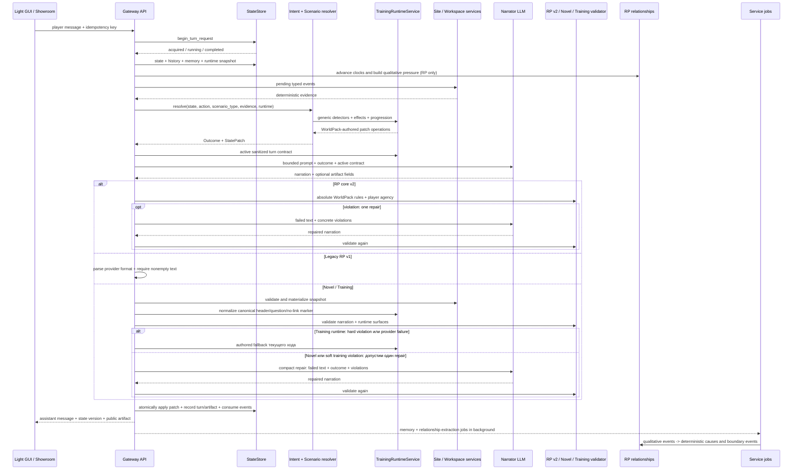
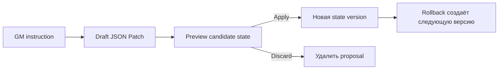

# Жизненный цикл игрового хода

[← Интерфейсы](02-interfaces.md) · [Главная](README.md) · [Далее: WorldPacks и режимы →](04-worldpacks-and-modes.md)

## Кумулятивный RP-контракт

- revision 1 убирает hidden D20/feasibility и оставляет нейтральное продолжение;
- revision 2 включает Gateway merge living-memory с устойчивыми tombstone-фактами;
- revision 3 валидирует абсолютные правила до commit, включая opening scene;
- revision 4 замыкает relationship cause/event в фактический provider prompt и
  наблюдаемое исполнение события;
- revision 5 фиксирует consumer-or-retire для активных state paths;
- revision 6 удерживает raw history неизменной и собирает выборочный prompt.

На revision 3+ повторное нарушение абсолютного правила после одного repair
завершает запрос контролируемой ошибкой без новой state version и turn. На revision
4+ due `favour` получает `resolved/delivered`, а narrator получает служебное
обязательство показать конкретную добровольную помощь в текущей сцене. Оба
relationship-блока исключаются из публичного Prompt Inspector.

## Обычный ход

Для training prompt-контракт v2 явно содержит точные `header`, `question` и
`surfaces[]` активного хода из immutable snapshot WorldPack. Паки program v1/v2
нормализуются в одноэлементный список, а program v3 может объявить несколько
каналов с отдельными `count` и link policy. Обычный ответ содержит только
готовую реплику; интерактивный ход содержит один JSON bundle, а полный видимый
текст лежит в `narrative_text`. Gateway может снять одну добавленную провайдером
Markdown-обёртку JSON, но не ослабляет schema, slot и narrative validation.

После deterministic fallback повторно валидируется уже фактически выданный
текст. В metadata сохраняется итоговая валидность и причина исходного fallback,
а audit отдельно различает provider failure и Gateway validation failure.
Каждый записанный ход также несёт `transport_status`: `ok`, `provider_error`,
`provider_timeout` или `invalid_response`. Для RP сохраняется только успешный
непустой ответ, поэтому его записанный ход имеет `ok`; ошибочная попытка не
создаёт ход и измеряется через `audit_events`: `llm_http_error`, `llm_timeout`,
`llm_rate_limited` или `llm_invalid_response`. Последнее событие содержит только
`request_id`, модель и безопасную причину `empty_response`, без текста модели.

## Шаги подробно

### 1. Идемпотентность

Клиент отправляет `idempotency_key` и `X-Request-ID`. Gateway проверяет сохранённый результат и таблицу `turn_requests`:

- завершённый запрос возвращается повторно;
- уже выполняющийся запрос даёт `409` со статусом `running`;
- новый request получает lock.

Это позволяет восстановить ожидание после refresh и не отправить одну сцену модели дважды.

### 2. Контекст партии

Gateway проверяет owner, загружает `Party`, создаёт party-specific `StateStore` и строит runtime settings из выбранного model profile, scenario type и party BYOK.

В prompt попадают только разрешённые слои: универсальные правила режима, world
prompts, memory chapters, budgeted raw history, lore cards, релевантные NPC,
sanitized state summary, outcome, RP-only `RELATIONSHIP_PRESSURE` и текущее действие.
Блок отношений содержит только имя персонажа, словесную метку полосы и
качественное давление активных причин и пограничных событий; числа, сроки,
внутренние event ID, сообщник, мишень и payload остаются в Gateway. Ненулевая
seed-причина и обычная извлечённая причина влияют уже на следующий RP prompt и
не ждут пересечения границы полосы. Для нового training runtime
добавляется только текущий `ACTIVE_TRAINING_TURN_CONTRACT`: имя и роль игрока,
текущие `surfaces[]`, явно разрешённые state paths и включённые interaction
contracts. Score, assessment, fallback и будущие ходы до debrief не передаются.

### 3. Детерминированное решение

`IntentParser` не вызывает LLM. `RuleEngine` получает state и явное действие игрока и возвращает:

- `Outcome` — что разрешено и чем закончилась попытка;
- JSON Patch — какие canonical fields должны измениться.

В `rp-core.v2` это нейтральный `narrative_continuation`: без D20, skill,
difficulty, score, success/failure и записи check. В `novel` случайных проверок
также нет. В `training` универсальный RuleEngine передаёт
текущую явную реплику и typed evidence в party snapshot
`TrainingRuntimeService`. Детекторы, веса, evidence labels, aggregates и
следующее окно берутся из WorldPack; Gateway не знает предмет курса и
продвигает ровно один предусмотренный turn.

### 4. Narrator LLM

Narrator получает уже рассчитанный результат. Его задача — сцена, диалог, темп и голос персонажей. Он не должен:

- менять outcome;
- превращать провал в скрытый успех;
- придумывать отсутствующий ресурс;
- раскрывать системный JSON или внутренние оценки;
- управлять действиями, убеждениями или эмоциями персонажа игрока.

Gateway пробует primary model и разрешённые fallback models выбранного provider.

### 5. Валидация и repair

Для `rp-core.v2` Gateway проверяет player agency и типизированные абсолютные
правила WorldPack после ответа модели. Допустим один существующий repair;
повторное нарушение или ошибка provider завершает запрос контролируемой ошибкой
до state/turn commit. Legacy-партии `rp-core.v1` сохраняют прежний однопроходный
контракт до явной миграции.

Для `novel` прежний `OutputValidator` и `MAX_REPAIR_ATTEMPTS` сохраняются.
WorldPack runtime отдельно использует `TRAINING_REPAIR_ATTEMPTS`: canonical
header/question/no-link marker сначала чинятся без LLM, soft field/profile
нарушение может получить один repair с русским списком реально проваленных
ограничений, а hard identity/shape/URL/attachment/score или provider failure
сразу заменяется fallback того же хода.

Каждая попытка narrator ограничена настоящим wall-clock deadline через `asyncio.timeout`: лимит охватывает ожидание заголовков и чтение всего тела ответа, а не только паузу между сетевыми пакетами. Истечение deadline обрабатывается тем же безопасным timeout/fallback-контрактом, что и transport timeout.

Если ответ снова невалиден в валидируемом режиме:

- для `novel` ход завершается ошибкой до применения state;
- для WorldPack-runtime training Gateway записывает authored fallback того же хода, сохраняя surfaces, профиль и включённые capabilities;
- причина, число вызовов и validator status попадают в metadata и audit.

### 6. Commit хода

Только после получения допустимого текста Gateway:

1. применяет patch новой версией state;
2. сохраняет player message, assistant response и точный `prompt_json`;
3. записывает provider response, outcome, model, repair/fallback metadata;
4. сохраняет check record только для legacy `rp-core.v1`; v2 его не создаёт;
5. завершает idempotent request;
6. пишет audit event.

Если процесс падает раньше, request отмечается как failed, а state не должен частично продвинуться.

После RP-хода очередь дополнительно получает `relationship_extraction`,
привязанный к `request_id` сохранённого хода. Служебная модель возвращает
только `character_mention`, authored `event_id` и evidence. Gateway проверяет
evidence как точную нормализованную подстроку текущего player+narrative текста,
разрешает mention по alias-таблице WorldPack и только затем получает внутренний
`character_id`. Неоднозначное, неразрешимое или не verbatim упоминание получает
отдельный terminal audit code без retry. Веса, затухание, полосы, раны, роли,
пограничные события, конечные часы и каскад вычисляются Gateway. Повтор задания
не создаёт вторую причину. В WorldPack `starosta` authored-событие
`trust_gained` создаёт положительную причину с тем же сроком, что
`kept_promise`, и потому попадает в качественное давление следующего хода без
обязательного boundary event. Для `training` модель отношений не загружается, job
не ставится и новые таблицы не получают строк.

Записанный ход содержит два номера с разной ответственностью. `turns.id` —
глобальный идентификатор строки в общей SQLite-базе; он связывает причину с
идемпотентностью и `excluded_from_memory` при rollback. `turns.party_turn` —
зафиксированный `state.meta.turn` конкретной партии; только по нему идут
затухание причин, часы событий, переходы полос и `RELATIONSHIP_PRESSURE`.
Extraction читает оба номера из уже записанного хода. Поэтому трафик других
партий не ускоряет локальное время отношений, а повтор обработки остаётся
идемпотентным по глобальному `turn_id`.

Каждый тип boundary event (`crack`, `ultimatum`, `plot`, `favour`, `strike`)
получает положительный `due_turn` из WorldPack clocks. До дедлайна событие может
закрыться как `resolved`, если его basis исчез; пропущенный срок даёт
`expired`. Истёкший `plot` детерминированно открывает конечный `strike`, а
`ultimatum` переводит полосу по существующему правилу resolution.

## Интерактивное действие между ходами

Открытие сайта, отправка формы и сообщение о подозрении не запускают narrator и не продвигают authored turn. UI отправляет idempotent event в party- или showroom-scoped endpoint; Gateway проверяет владельца, artifact, разрешённый тип действия и сохраняет только типизированный факт. При следующем игровом ходе неиспользованные события становятся evidence для RuleEngine и потребляются атомарно вместе с turn commit.

### Capability gate и рабочие файлы

> Ступень готовности: `подключено` в Gateway и Showroom; live-статус зависит от применённой ревизии.

Перед сборкой narrator prompt Gateway читает два флага из run snapshot.
Выключенная capability не добавляет prompt contract, не создаёт public snapshot,
не принимает события и не влияет на score. При включённом рабочем диске
`TrainingWorkspaceService` материализует authored файл в том же
narrator completion или из fallback. Открытие файла останется sub-turn event,
но его допустимость будет проверяться по интервалу доступности файла, а не
только по текущему surface turn сайта.

## Старт партии

`POST /api/parties/{party_id}/start` создаёт opening scene один раз. Для мира с
`training_runtime` Gateway валидирует и сохраняет immutable contract hash,
материализует первую authored window и использует тот же
normalize/soft-repair/hard-fallback контракт; ошибка provider сразу ведёт к
fallback. Повторный start защищён history/idempotency и не
создаёт вторую начальную сцену. Checkpoint branch копирует runtime snapshot,
поэтому обновление source WorldPack не меняет уже начатое прохождение.
Для RP start действует тот же контракт версии партии, что и для последующих
ходов: v2 проверяет абсолютные правила до commit, v1 сохраняет legacy-путь.

Opening scene получает отдельный wall-clock deadline `300` секунд на одну попытку
narrator, потому что стартовый prompt может включать большой импортированный мир.
Обычные последующие ходы используют deadline `150` секунд. Если provider не успел
передать полное тело стартового ответа, Gateway помечает `turn_requests` как
`failed` и возвращает HTTP `504`; Light GUI видит terminal status через endpoint
запроса и прекращает recovery polling, не оставляя партию в состоянии `running`.

## GM world changes

Изменение мира отделено от обычного хода:

Draft может быть быстрым детерминированным или созданным служебной моделью. Он не становится state до явного `apply`. Rollback не удаляет raw turns, memory или journal; он создаёт новую авторитетную версию и помечает перекрытые ходы `excluded_from_memory=1`, поэтому следующие RP story-memory snapshots не возвращают отменённую ветку.

Партию можно штатно завершить через `POST /api/parties/{party_id}/complete`:
статус становится `completed`, а state, turns, audit и provider keys сохраняются.
Повторный вызов идемпотентен; существующий `/activate` снова делает партию
активной. Владелец завершает свою партию, администратор — любую.

## Фоновые задачи

После сохранения хода Gateway всегда планирует episodic `memory` как service job. Только для `scenario_type=rp` рядом ставится второй job `rp_story_memory`, который после четырёх новых ходов обновляет кумулятивный living snapshot. В `training` и `novel` этот job не создаётся.

Обе задачи выполняются вне latency path: пользователь получает уже сохранённый ответ, пока helper продолжает работу. Jobs имеют статус, retry policy и восстанавливаются после перезапуска. Ошибка story-memory updater не откатывает ход и не изменяет canonical state. Старый тип `journal` распознаётся только как terminal no-op, чтобы задачи от прежних версий не зацикливались.

Все вызовы глобальной служебной модели — episodic memory, RP story memory,
relationship extraction, world instruction и генерация персонажа — проходят
через `ServiceModelClient`. Перед отправкой он фиксирует точные ordered messages,
после ответа — сырой provider response и статус в отдельном диагностическом
`service_call_log`; секреты редактируются на записи. Все потребители передают
полные ordered messages через `service_prompt_text`, поэтому вопрос верности
диагностического prompt закрыт. Таблица не входит в canonical state/schema.
Срок хранения конфигурируется `SERVICE_CALL_LOG_RETENTION_DAYS` и остаётся
отдельным открытым решением пользователя.

## Код

- [Adjudicator](../../roles/apps/files/rp-stack/rp-gateway/app/services/adjudicator.py)
- [Rule Engine](../../roles/apps/files/rp-stack/rp-gateway/app/services/rule_engine.py)
- [Narrative client](../../roles/apps/files/rp-stack/rp-gateway/app/services/narrative.py)
- [Validator](../../roles/apps/files/rp-stack/rp-gateway/app/services/validator.py)
- [State store](../../roles/apps/files/rp-stack/rp-gateway/app/services/state_store.py)
- [RP story memory](../../roles/apps/files/rp-stack/rp-gateway/app/services/rp_story_memory.py)
- [Service model client](../../roles/apps/files/rp-stack/rp-gateway/app/services/service_model_client.py)
- [Training artifacts](../../roles/apps/files/rp-stack/rp-gateway/app/services/training_artifacts.py)
- [Training runtime](../../roles/apps/files/rp-stack/rp-gateway/app/services/training_runtime.py)
- [Decision 017](../../roles/apps/files/rp-stack/docs/decisions/017-worldpack-owned-training-runtime.md)

### Legacy relationship-event deadlines

When an older database contains an active boundary event with a missing `due_turn`, `RelationshipMechanics` repairs it before advancing the party: `due_turn = opened_turn + clock` from the current WorldPack model. The repair is idempotent and changes only the derived `narrative_events` projection; raw turns and canonical state are not rewritten. Newly created schemas require `due_turn`.
