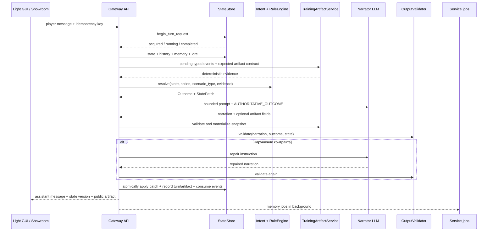
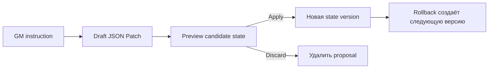

# Жизненный цикл игрового хода

[← Интерфейсы](02-interfaces.md) · [Главная](README.md) · [Далее: WorldPacks и режимы →](04-worldpacks-and-modes.md)

## Обычный ход

## Шаги подробно

### 1. Идемпотентность

Клиент отправляет `idempotency_key` и `X-Request-ID`. Gateway проверяет сохранённый результат и таблицу `turn_requests`:

- завершённый запрос возвращается повторно;
- уже выполняющийся запрос даёт `409` со статусом `running`;
- новый request получает lock.

Это позволяет восстановить ожидание после refresh и не отправить одну сцену модели дважды.

### 2. Контекст партии

Gateway проверяет owner, загружает `Party`, создаёт party-specific `StateStore` и строит runtime settings из выбранного model profile, scenario type и party BYOK.

В prompt попадают только разрешённые слои: world prompts, memory chapters, budgeted raw history, lore cards, лексически найденные архивные сцены, релевантные NPC, state summary, outcome и текущее действие.

### 3. Детерминированное решение

`IntentParser` не вызывает LLM. `RuleEngine` получает state и явное действие игрока и возвращает:

- `Outcome` — что разрешено и чем закончилась попытка;
- JSON Patch — какие canonical fields должны измениться.

В `rp` это может включать D20, skill, difficulty, modifiers и blockers. В `novel` случайных проверок нет. В `training` применяется authored schedule/scoring, включая накопленные типизированные события сайта, и продвигается ровно один предусмотренный turn.

### 4. Narrator LLM

Narrator получает уже рассчитанный результат. Его задача — сцена, диалог, темп и голос персонажей. Он не должен:

- менять outcome;
- превращать провал в скрытый успех;
- придумывать отсутствующий ресурс;
- раскрывать системный JSON или внутренние оценки;
- управлять действиями, убеждениями или эмоциями персонажа игрока.

Gateway пробует primary model и разрешённые fallback models выбранного provider.

### 5. Валидация и repair

`OutputValidator` проверяет соответствие state, outcome и режиму. При нарушении Gateway может выполнить один repair-вызов с конкретной инструкцией.

Если ответ снова невалиден:

- для обычных `rp`/`novel` ход завершается ошибкой до применения state;
- для разрешённых training/fallback сценариев Gateway может записать безопасный детерминированный текст, чтобы автопрогон не оборвался;
- причина, число вызовов и validator status попадают в metadata и audit.

### 6. Commit хода

Только после получения допустимого текста Gateway:

1. применяет patch новой версией state;
2. сохраняет player message, assistant response и точный `prompt_json`;
3. записывает provider response, outcome, model, repair/fallback metadata;
4. сохраняет check record для `rp`;
5. завершает idempotent request;
6. пишет audit event.

Если процесс падает раньше, request отмечается как failed, а state не должен частично продвинуться.

## Интерактивное действие между ходами

Открытие сайта, отправка формы и сообщение о подозрении не запускают narrator и не продвигают authored turn. UI отправляет idempotent event в party- или showroom-scoped endpoint; Gateway проверяет владельца, artifact, разрешённый тип действия и сохраняет только типизированный факт. При следующем игровом ходе неиспользованные события становятся evidence для RuleEngine и потребляются атомарно вместе с turn commit.

### Планируемая capability gate и рабочие файлы

> Статус: не реализовано.

Перед сборкой narrator prompt Gateway будет читать два флага из run snapshot.
Выключенная capability не добавляет prompt contract, не создаёт public snapshot,
не принимает события и не влияет на score. При включённом рабочем диске
`TrainingWorkspaceService` сможет материализовать authored файл в том же
narrator completion или из fallback. Открытие файла останется sub-turn event,
но его допустимость будет проверяться по интервалу доступности файла, а не
только по текущему surface turn сайта.

## Старт партии

`POST /api/parties/{party_id}/start` создаёт opening scene один раз. Для training-сценария Gateway также материализует первую authored window в state. Повторный start защищён history/idempotency и не должен создавать вторую начальную сцену.

## GM world changes

Изменение мира отделено от обычного хода:

Draft может быть быстрым детерминированным или созданным служебной моделью. Он не становится state до явного `apply`. Rollback не удаляет raw turns, memory или journal; он создаёт новую авторитетную версию.

## Фоновые задачи

После сохранения хода Gateway всегда планирует episodic `memory` как service job. Только для `scenario_type=rp` рядом ставится второй job `rp_story_memory`, который после четырёх новых ходов обновляет кумулятивный living snapshot. В `training` и `novel` этот job не создаётся.

Обе задачи выполняются вне latency path: пользователь получает уже сохранённый ответ, пока helper продолжает работу. Jobs имеют статус, retry policy и восстанавливаются после перезапуска. Ошибка story-memory updater не откатывает ход и не изменяет canonical state. Старый тип `journal` распознаётся только как terminal no-op, чтобы задачи от прежних версий не зацикливались.

## Код

- [Adjudicator](../../roles/apps/files/rp-stack/rp-gateway/app/services/adjudicator.py)
- [Rule Engine](../../roles/apps/files/rp-stack/rp-gateway/app/services/rule_engine.py)
- [Narrative client](../../roles/apps/files/rp-stack/rp-gateway/app/services/narrative.py)
- [Validator](../../roles/apps/files/rp-stack/rp-gateway/app/services/validator.py)
- [State store](../../roles/apps/files/rp-stack/rp-gateway/app/services/state_store.py)
- [RP story memory](../../roles/apps/files/rp-stack/rp-gateway/app/services/rp_story_memory.py)
- [Training artifacts](../../roles/apps/files/rp-stack/rp-gateway/app/services/training_artifacts.py)
