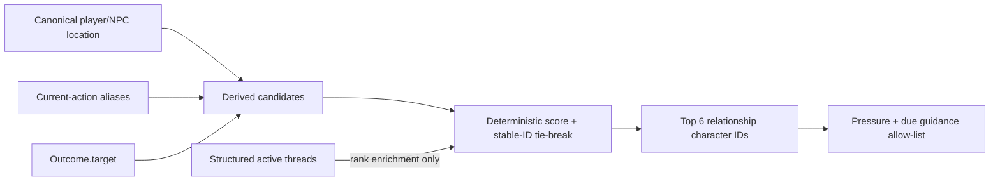
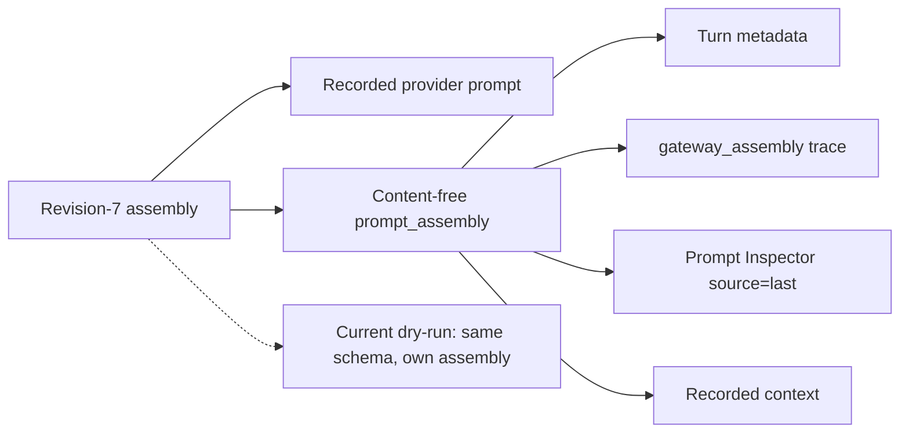
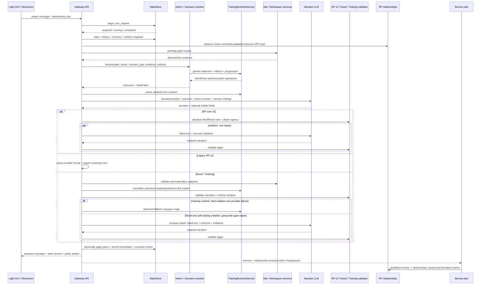
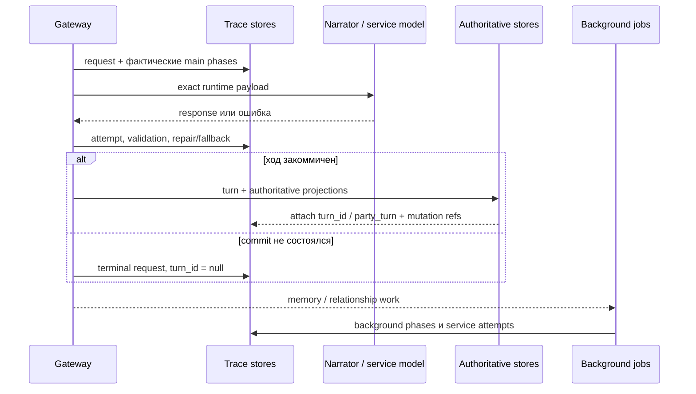
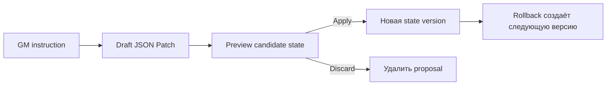

# Жизненный цикл игрового хода

[← Интерфейсы](02-interfaces.md) · [Главная](README.md) · [Далее: WorldPacks и режимы →](04-worldpacks-and-modes.md)

## Кумулятивный RP-контракт

- revision 1 убирает hidden D20/feasibility и оставляет нейтральное продолжение;
- revision 2 включает Gateway merge living-memory с устойчивыми tombstone-фактами;
- revision 3 валидирует абсолютные правила до commit, включая opening scene;
- revision 4 замыкает relationship cause/event в фактический provider prompt и
  наблюдаемое исполнение события;
- revision 5 фиксирует consumer-or-retire для активных state paths;
- revision 6 удерживает raw history неизменной и собирает выборочный prompt.
- candidate revision 7 / DC1 защищает полный raw tail после effective
  story-memory coverage и fail-closed обрабатывает hard overflow.
- candidate revision 7 / DC2 ограничивает relationship pressure производным
  pre-scene scope.
- candidate revision 7 / DC3 принимает prompt authority, structural
  deduplication и content-free assembly diagnostics; observed runtime остаётся
  на revision `6`.

На revision 3+ повторное нарушение абсолютного правила после одного repair
завершает запрос контролируемой ошибкой без новой state version и turn; это же
правило действует для admin autotest RP-веток. Только deterministic training runtime
может заменить невалидный ответ authored fallback. На revision 4+ due `favour`
создаёт служебное обязательство показать конкретную добровольную помощь, но остаётся
active до evidence-checked relationship extraction. Статус `resolved/delivered`
ставится лишь после положительной причины того же персонажа из реально записанной
сцены. Оба relationship-блока исключаются из публичного Prompt Inspector.

## Candidate revision 7: DC1

[Decision 028](../../roles/apps/files/rp-stack/docs/decisions/028-rp-uncovered-tail-and-overflow.md)
применяется только к RP candidate revision `7`; observed runtime остаётся `6`.
Gateway берёт newest valid effective story-memory snapshot и включает каждую
non-excluded raw-пару новее его coverage. Перед narrator call snapshot читается
повторно; advance, rollback или исчезновение snapshot требуют полной пересборки
и новой сверки. После трёх нестабильных циклов запрос завершается до provider.

```mermaid
sequenceDiagram
    participant API as Gateway
    participant Store as StateStore
    participant Mem as RP story memory
    participant LLM as Narrator

    API->>Store: effective snapshot + all turns after coverage
    API->>API: assemble protected raw tail
    alt required prompt exceeds hard input budget
        API->>Mem: bounded catch_up(force=true)
        Mem-->>API: conditional snapshot / no plan / failure
        API->>Store: re-read coverage and rebuild full tail
    end
    alt rebuilt prompt fits
        API->>LLM: first narrator call; existing repair policy unchanged
    else still over budget
        API-->>API: sanitized PromptBudgetExceeded before player mutation
    end
```

Успешный maintenance snapshot может сохраниться даже при конечном overflow, но
player turn, state version и relationship projections не меняются. Deployed
Merchant canary подтвердил на уровне `подключено` полный uncovered tail и
explicit branch revision `7`: recorded prompt содержал ровно eligible verbatim
pair после effective coverage, source raw/state hashes не изменились. Canary не
вошёл в hard-overflow, поэтому negative fail-before-provider requirement остаётся
`каркас`.

Narrator этого же canary сместил действие в другую локацию и не подтвердил
устойчивость ролей. Это не опровергает точный DC1 prompt-presence proof, но не
является доказательством исправленной continuity или уровня `наблюдается`.

Чтобы сохранить эту границу, revision-7 relationship pressure до provider читает
только уже сохранённые derived rows и не создаёт отсутствующий trust seed. После
успешного commit штатный relationship advance материализует seed; revisions
`0..6` сохраняют прежнее поведение.

## Candidate revision 7: DC2

[Decision 029](../../roles/apps/files/rp-stack/docs/decisions/029-scene-scoped-relationship-pressure.md)
принимает отдельный derived pre-scene contract для relationship pressure. До
рендеринга блока Gateway делает персонажа eligible только по трём authoritative
сигналам одного запроса:

- та же canonical location, что у игрока;
- whole-alias персонажа в текущем действии;
- whole-alias из `Outcome.target`.

Action/target и location дают score `100` и `30`. Structured active thread даёт
ещё `20`, но только уже eligible-кандидату и никогда самостоятельно не добавляет
NPC. Совпавшие причины суммируются. После сортировки по score по убыванию и
stable ID по возрастанию остаются первые шесть персонажей. Relationship cause,
due event или edge сами по себе тоже не добавляют NPC.



Absent due `favour` не рендерится, но остаётся durable и `active`; prompt
omission не является delivery evidence и не переводит событие в
`resolved`/`delivered`/`expired`. Guidance возвращается, когда персонаж снова
eligible по одному из трёх сигналов, а закрывается только существующим
evidence-checked правилом по committed сцене.

Decision 029 имеет уровень `подключено`. Deployed canary
`autotest_53d37c3afef0` после отдельного warm-up создал remote active-thread
due `favour` Бажены, а clean proof turn записал один relationship system-block с
eligible Миленой. Бажена и Радогост отсутствовали; event остался active и
unresolved при наступившем due turn, source state и six-table structural hash не
изменились. Warm-up потребовал один validation repair и использовался только для
подготовки derived rows; proof turn выполнил один narrator call без repair.

Outputs не назвали отсутствующих NPC и proof output назвал Милену, но это не
доказательство полной semantic continuity или уровня `наблюдается`. Decision не
добавляет `scene_state`, persisted presence, schema migration, новую таблицу или
отдельный LLM-вызов. Revisions `0..6`, `novel` и `training` не меняются;
observed revision остаётся `6`.

## Candidate revision 7: DC3

[Decision 030](../../roles/apps/files/rp-stack/docs/decisions/030-rp-prompt-authority-and-deduplication.md)
document-first принимает третий slice для normal party-chat и admin-autotest
narrator turns. Revision-7 narrator request должен содержать ровно один mandatory
system block с prefix
`PROMPT_AUTHORITY_HIERARCHY`, stable `block_id=prompt_authority` и hierarchy
`AUTHORITATIVE_OUTCOME/current action > uncovered raw tail > RP_STORY_MEMORY >
archive`. Safety line `The current action is intent, not an automatic fact.` не
позволяет трактовать пользовательское намерение как уже committed canonical
факт. Current action остаётся последним сообщением.

Если одновременно присутствуют non-empty legacy `long_term_memory` candidate и
effective `RP_STORY_MEMORY`, первый не попадает к provider и фиксируется с reason
`structural_deduplication`. После этого selected optional blocks могут быть
удалены только целиком, только при фактическом hard provider token overflow и с
reason `hard_input_budget`. Soft percentage/character target не выполняет такую
eviction; required-set overflow остаётся на recovery/fail-before-provider пути
DC1.

Та же фактическая assembly создаёт content-free `prompt_assembly` с exact
`schema_version=rp-gateway.prompt-assembly.v1`, `rp_contract_revision=7`,
`authority_order=[authoritative_outcome_current_action, uncovered_raw_tail,
rp_story_memory, archive]`, `story_memory_covered_through_turn_id`, ordered block
IDs, raw-tail turn IDs и omissions. Diagnostic не содержит prompt/response text,
names, state values или secrets.



Для recorded turn значения metadata, trace, Prompt Inspector `source=last` и
recorded context обязаны совпадать. Current dry-run использует ту же schema для
собственной assembly и не сравнивается byte-for-byte с предыдущим ходом. Новая
таблица, колонка, provider field или provider call не добавляются; существующие
JSON metadata/trace stores остаются transport для diagnostic.

Decision 030 остаётся на уровне `каркас`: source changes и offline gates
присутствуют локально (`15 passed` focused DC3, `104 passed` combined revision-7
и `445 passed` full Gateway; `scripts/ci.ps1` passed), но merge, apply и isolated
live proof ещё не выполнены. DC3 не включает `scene_state`, structured response bundle,
continuity validator, fallback или atomic scene/turn commit, не мигрирует
existing parties и не доказывает semantic continuity. Opening-scene
`prompt_assembly` persistence/parity остаётся pending gate четвёртого
opening/atomic-commit slice, поэтому observed revision `7` до его закрытия не
активируется и сейчас остаётся `6`.

## Обычный ход



Для training prompt-контракт v2 явно содержит точные `header`, `question` и
`surfaces[]` активного хода из immutable snapshot WorldPack. Паки program v1/v2
нормализуются в одноэлементный список, а program v3 может объявить несколько
каналов с отдельными `count` и link policy. Обычный ответ содержит только
готовую реплику; интерактивный ход содержит один JSON bundle, а полный видимый
текст лежит в `narrative_text`. Gateway может снять одну добавленную провайдером
Markdown-обёртку JSON, но не ослабляет schema, slot и narrative validation.

После deterministic fallback повторно валидируется уже фактически выданный
текст. В metadata сохраняется итоговая валидность и причина исходного fallback,
а audit отдельно различает provider failure и Gateway validation failure.
Каждый записанный ход также несёт `transport_status`: `ok`, `provider_error`,
`provider_timeout` или `invalid_response`. Для RP сохраняется только успешный
непустой ответ, поэтому его записанный ход имеет `ok`; ошибочная попытка не
создаёт ход и измеряется через `audit_events`: `llm_http_error`, `llm_timeout`,
`llm_rate_limited` или `llm_invalid_response`. Последнее событие содержит только
`request_id`, модель и безопасную причину `empty_response`, без текста модели.

## Шаги подробно

### 1. Идемпотентность

Клиент отправляет `idempotency_key` и `X-Request-ID`. Gateway проверяет сохранённый результат и таблицу `turn_requests`:

- завершённый запрос возвращается повторно;
- уже выполняющийся запрос даёт `409` со статусом `running`;
- новый request получает lock.

Это позволяет восстановить ожидание после refresh и не отправить одну сцену модели дважды.

### Request-centric диагностическая трасса

`turn_requests` одновременно задаёт корень Turn Trace Workbench. Стабильная
идентичность исполнения — `(state_campaign_id, request_id)`, а `turn_id` и
`party_turn` присоединяются только после commit. Поэтому timeout, отказ
enforcement или исчерпанный fallback остаются доступны с `turn_id = null`.



Фазы не задаются фиксированным клиентским enum: сохраняется то, что реально
исполнялось в main или background lane. Для нового RP-пути trace detail сообщает
эффективную `rp_contract_revision`, а для старой партии — legacy
`rp_contract_version`. Workbench диагностирует этот pipeline, но его таблицы не
читаются Rule Engine, prompt assembly или delivery Decision 026.

### 2. Контекст партии

Gateway проверяет owner, загружает `Party`, создаёт party-specific `StateStore` и строит runtime settings из выбранного model profile, scenario type и party BYOK. Сохранённые `narrator_settings` валидируются по возможностям этого profile и добавляются только в narrator request; «Авто» не создаёт поле provider payload.

В prompt попадают только разрешённые слои: универсальные правила режима, world
prompts, memory chapters, budgeted raw history, lore cards, релевантные NPC,
sanitized state summary, outcome, RP-only `RELATIONSHIP_PRESSURE` и текущее действие.
Блок отношений содержит только имя персонажа, словесную метку полосы и
качественное давление активных причин и пограничных событий; числа, сроки,
внутренние event ID, сообщник, мишень и payload остаются в Gateway. Ненулевая
seed-причина и обычная извлечённая причина влияют уже на следующий RP prompt и
не ждут пересечения границы полосы. Для нового training runtime
добавляется только текущий `ACTIVE_TRAINING_TURN_CONTRACT`: имя и роль игрока,
текущие `surfaces[]`, явно разрешённые state paths и включённые interaction
contracts. Score, assessment, fallback и будущие ходы до debrief не передаются.

Для candidate revision `7` DC2 применяет к обоим relationship-блокам allow-list
из описанного выше derived scope. Durable cause и due `favour` отсутствующего
персонажа остаются в relationship store, но не заставляют narrator переносить
этого NPC в текущую сцену.

### 3. Детерминированное решение

`IntentParser` не вызывает LLM. `RuleEngine` получает state и явное действие игрока и возвращает:

- `Outcome` — что разрешено и чем закончилась попытка;
- JSON Patch — какие canonical fields должны измениться.

В `rp-core.v2` это нейтральный `narrative_continuation`: без D20, skill,
difficulty, score, success/failure и записи check. В `novel` случайных проверок
также нет. В `training` универсальный RuleEngine передаёт
текущую явную реплику и typed evidence в party snapshot
`TrainingRuntimeService`. Детекторы, веса, evidence labels, aggregates и
следующее окно берутся из WorldPack; Gateway не знает предмет курса и
продвигает ровно один предусмотренный turn.

### 4. Narrator LLM

Narrator получает уже рассчитанный результат. Его задача — сцена, диалог, темп и голос персонажей. Он не должен:

- менять outcome;
- превращать провал в скрытый успех;
- придумывать отсутствующий ресурс;
- раскрывать системный JSON или внутренние оценки;
- управлять действиями, убеждениями или эмоциями персонажа игрока.

Gateway пробует primary model и разрешённые fallback models выбранного provider.
Ручные параметры привязаны к primary model: Gateway требует совместимый
OpenRouter endpoint, исключает reasoning-текст из ответа и удаляет model-specific
`reasoning`, `temperature`, `top_p` и `max_tokens` перед несовместимым fallback.
Явные legacy-поля `temperature` и `max_tokens` конкретного start/message request
имеют приоритет над сохранёнными значениями Party.

### 5. Валидация и repair

Для `rp-core.v2` Gateway проверяет player agency и типизированные абсолютные
правила WorldPack после ответа модели. Допустим один существующий repair;
повторное нарушение или ошибка provider завершает запрос контролируемой ошибкой
до state/turn commit. Legacy-партии `rp-core.v1` сохраняют прежний однопроходный
контракт до явной миграции.

Для `novel` прежний `OutputValidator` и `MAX_REPAIR_ATTEMPTS` сохраняются.
WorldPack runtime отдельно использует `TRAINING_REPAIR_ATTEMPTS`: canonical
header/question/no-link marker сначала чинятся без LLM, soft field/profile
нарушение может получить один repair с русским списком реально проваленных
ограничений, а hard identity/shape/URL/attachment/score или provider failure
сразу заменяется fallback того же хода.

Каждая попытка narrator ограничена настоящим wall-clock deadline через `asyncio.timeout`: лимит охватывает ожидание заголовков и чтение всего тела ответа, а не только паузу между сетевыми пакетами. Истечение deadline обрабатывается тем же безопасным timeout/fallback-контрактом, что и transport timeout.

Если ответ снова невалиден в валидируемом режиме:

- для `novel` ход завершается ошибкой до применения state;
- для WorldPack-runtime training Gateway записывает authored fallback того же хода, сохраняя surfaces, профиль и включённые capabilities;
- причина, число вызовов и validator status попадают в metadata и audit.

### 6. Commit хода

Только после получения допустимого текста Gateway:

1. применяет patch новой версией state;
2. сохраняет player message, assistant response и точный `prompt_json`;
3. записывает provider response, outcome, model, repair/fallback metadata;
4. сохраняет check record только для legacy `rp-core.v1`; v2 его не создаёт;
5. завершает idempotent request;
6. пишет audit event.

Если процесс падает раньше, request отмечается как failed, а state не должен частично продвинуться.

После RP-хода очередь дополнительно получает `relationship_extraction`,
привязанный к `request_id` сохранённого хода. Служебная модель возвращает
ровно ключи `character_mention`, authored `event_id` и `evidence`; alias
`evidence_quote` не принимается. Evidence должна быть одним самодостаточным
verbatim-фрагментом, который явно показывает завершённое взаимодействие игрока с
названным персонажем, а не только присутствие, обычное действие или опасность
персонажа; `shared_risk` требует общего конкретного риска для обоих в этом же
фрагменте. Gateway проверяет evidence как точную нормализованную подстроку текущего
player+narrative текста,
разрешает mention по alias-таблице WorldPack и только затем получает внутренний
`character_id`. Неоднозначное, неразрешимое или не verbatim упоминание получает
отдельный terminal audit code без retry. Веса, затухание, полосы, раны, роли,
пограничные события, конечные часы и каскад вычисляются Gateway. Повтор задания
не создаёт вторую причину. В WorldPack `starosta` authored-событие
`trust_gained` создаёт положительную причину с тем же сроком, что
`kept_promise`, и потому попадает в качественное давление следующего хода без
обязательного boundary event. Для `training` модель отношений не загружается, job
не ставится и новые таблицы не получают строк.

Если `favour` достиг due turn, календарь сам по себе не доказывает исполнение.
Обязательство продолжает входить в narrator prompt, пока extractor не подтвердит
verbatim evidence положительного authored-события того же персонажа, которое
WorldPack явно пометил `resolves: ["favour"]`. Только после этого Gateway закрывает
событие как `delivered`; другое положительное событие, отрицательная или пустая
сцена оставляют его active для следующего хода. Delivery хранит глобальный source
turn ID: rollback этого хода возвращает событие в active, а запоздавшая extractor
job не может закрыть его по уже исключённой сцене.

Записанный ход содержит два номера с разной ответственностью. `turns.id` —
глобальный идентификатор строки в общей SQLite-базе; он связывает причину с
идемпотентностью и `excluded_from_memory` при rollback. `turns.party_turn` —
зафиксированный `state.meta.turn` конкретной партии; только по нему идут
затухание причин, часы событий, переходы полос и `RELATIONSHIP_PRESSURE`.
Extraction читает оба номера из уже записанного хода. Поэтому трафик других
партий не ускоряет локальное время отношений, а повтор обработки остаётся
идемпотентным по глобальному `turn_id`.

Каждый тип boundary event (`crack`, `ultimatum`, `plot`, `favour`, `strike`)
получает положительный `due_turn` из WorldPack clocks. До дедлайна событие может
закрыться как `resolved`, если его basis исчез; пропущенный срок даёт
`expired`. Истёкший `plot` детерминированно открывает конечный `strike`, а
`ultimatum` переводит полосу по существующему правилу resolution.

## Интерактивное действие между ходами

Открытие сайта, отправка формы и сообщение о подозрении не запускают narrator и не продвигают authored turn. UI отправляет idempotent event в party- или showroom-scoped endpoint; Gateway проверяет владельца, artifact, разрешённый тип действия и сохраняет только типизированный факт. При следующем игровом ходе неиспользованные события становятся evidence для RuleEngine и потребляются атомарно вместе с turn commit.

### Capability gate и рабочие файлы

> Ступень готовности: `подключено` в Gateway и Showroom; live-статус зависит от применённой ревизии.

Перед сборкой narrator prompt Gateway читает два флага из run snapshot.
Выключенная capability не добавляет prompt contract, не создаёт public snapshot,
не принимает события и не влияет на score. При включённом рабочем диске
`TrainingWorkspaceService` материализует authored файл в том же
narrator completion или из fallback. Открытие файла останется sub-turn event,
но его допустимость будет проверяться по интервалу доступности файла, а не
только по текущему surface turn сайта.

## Старт партии

`POST /api/parties/{party_id}/start` создаёт opening scene один раз. Для мира с
`training_runtime` Gateway валидирует и сохраняет immutable contract hash,
материализует первую authored window и использует тот же
normalize/soft-repair/hard-fallback контракт; ошибка provider сразу ведёт к
fallback. Повторный start защищён history/idempotency и не
создаёт вторую начальную сцену. Checkpoint branch копирует runtime snapshot,
поэтому обновление source WorldPack не меняет уже начатое прохождение.
Для RP start действует тот же контракт версии партии, что и для последующих
ходов: v2 проверяет абсолютные правила до commit, v1 сохраняет legacy-путь.

Opening scene получает отдельный wall-clock deadline `300` секунд на одну попытку
narrator, потому что стартовый prompt может включать большой импортированный мир.
Обычные последующие ходы используют deadline `150` секунд. Если provider не успел
передать полное тело стартового ответа, Gateway помечает `turn_requests` как
`failed` и возвращает HTTP `504`; Light GUI видит terminal status через endpoint
запроса и прекращает recovery polling, не оставляя партию в состоянии `running`.

## GM world changes

Изменение мира отделено от обычного хода:



Draft может быть быстрым детерминированным или созданным служебной моделью. Он не становится state до явного `apply`. Rollback не удаляет raw turns, memory или journal; он создаёт новую авторитетную версию, помечает перекрытые ходы `excluded_from_memory=1` и инвалидирует покрывающие их RP story-memory snapshots. Effective prompt и UI выбирают newest valid snapshot и перестраивают только non-excluded tail; поздний результат фоновой job атомарно отклоняется, если её turns или base snapshot уже отменены.

Партию можно штатно завершить через `POST /api/parties/{party_id}/complete`:
статус становится `completed`, а state, turns, audit и provider keys сохраняются.
Повторный вызов идемпотентен; существующий `/activate` снова делает партию
активной. Владелец завершает свою партию, администратор — любую.

## Фоновые задачи

После сохранения хода Gateway всегда планирует episodic `memory` как service job. Только для `scenario_type=rp` рядом ставится второй job `rp_story_memory`, который после четырёх новых ходов обновляет кумулятивный living snapshot. В `training` и `novel` этот job не создаётся.

Обе задачи выполняются вне latency path: пользователь получает уже сохранённый ответ, пока helper продолжает работу. Jobs имеют статус, retry policy и восстанавливаются после перезапуска. Ошибка story-memory updater не откатывает ход и не изменяет canonical state. Старый тип `journal` распознаётся только как terminal no-op, чтобы задачи от прежних версий не зацикливались.

Все вызовы глобальной служебной модели — episodic memory, RP story memory,
relationship extraction, world instruction и генерация персонажа — проходят
через `ServiceModelClient`. Перед отправкой он фиксирует точные ordered messages,
после ответа — сырой provider response и статус в существующем диагностическом
`service_call_log`; секреты редактируются на записи. Журнал расширен nullable-
полями `request_id`, `party_turn`, `provider`, `model`, `attempt`, `latency_ms`,
`http_status`, `usage_json`, `error_json` и `trace_schema_version`, поэтому старые
строки остаются читаемыми. Все потребители передают полные ordered messages через
`service_prompt_text`; отдельный дублирующий журнал completions не создаётся.

Narrator-attempts, включая repair и ошибку до commit, пишутся в
`turn_trace_events`. Append-only авторитетные эффекты endpoint читает из их
существующих stores; `turn_state_mutations` сохраняет exact before/after только
для реально изменившихся in-place проекций. Все trace-таблицы диагностические и
не входят в canonical state/schema. По умолчанию
`SERVICE_CALL_LOG_RETENTION_DAYS=0`, то есть записи не удаляются по времени;
IaC рендерит это из `rp_stack_gateway_service_call_log_retention_days`, а
положительное host-specific значение из `/etc/ansible/local-overrides.yml`
явно включает очистку старых service rows.

## Код

- [Adjudicator](../../roles/apps/files/rp-stack/rp-gateway/app/services/adjudicator.py)
- [Rule Engine](../../roles/apps/files/rp-stack/rp-gateway/app/services/rule_engine.py)
- [Narrative client](../../roles/apps/files/rp-stack/rp-gateway/app/services/narrative.py)
- [Validator](../../roles/apps/files/rp-stack/rp-gateway/app/services/validator.py)
- [State store](../../roles/apps/files/rp-stack/rp-gateway/app/services/state_store.py)
- [RP story memory](../../roles/apps/files/rp-stack/rp-gateway/app/services/rp_story_memory.py)
- [Service model client](../../roles/apps/files/rp-stack/rp-gateway/app/services/service_model_client.py)
- [Training artifacts](../../roles/apps/files/rp-stack/rp-gateway/app/services/training_artifacts.py)
- [Training runtime](../../roles/apps/files/rp-stack/rp-gateway/app/services/training_runtime.py)
- [Decision 017](../../roles/apps/files/rp-stack/docs/decisions/017-worldpack-owned-training-runtime.md)
- [Turn trace read model](../../roles/apps/files/rp-stack/rp-gateway/app/services/turn_trace.py)
- [Decision 027](../../roles/apps/files/rp-stack/docs/decisions/027-turn-trace-workbench.md)
- [Decision 028](../../roles/apps/files/rp-stack/docs/decisions/028-rp-uncovered-tail-and-overflow.md)
- [Decision 029](../../roles/apps/files/rp-stack/docs/decisions/029-scene-scoped-relationship-pressure.md)
- [Decision 030](../../roles/apps/files/rp-stack/docs/decisions/030-rp-prompt-authority-and-deduplication.md)

### Legacy relationship-event deadlines

When an older database contains an active boundary event with a missing `due_turn`, `RelationshipMechanics` repairs it before advancing the party: `due_turn = opened_turn + clock` from the current WorldPack model. The repair is idempotent and changes only the derived `narrative_events` projection; raw turns and canonical state are not rewritten. Newly created schemas require `due_turn`.
