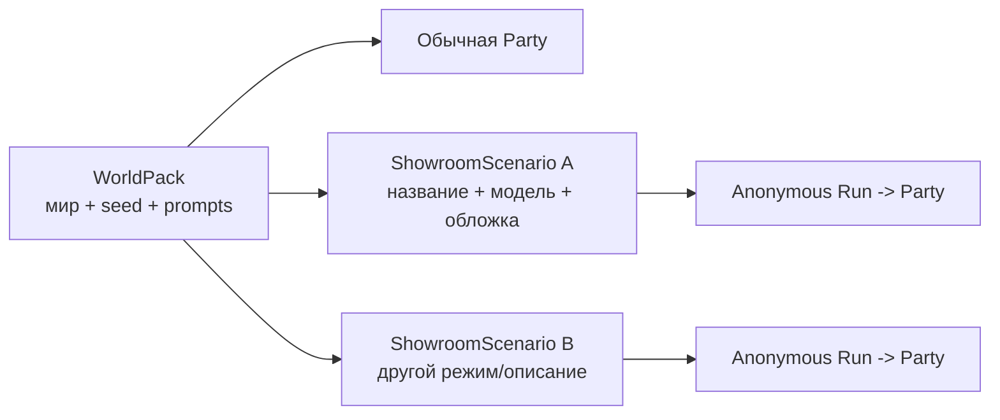

# WorldPacks и режимы сценария

[← Жизненный цикл хода](03-turn-lifecycle.md) · [Главная](README.md) · [Далее: память и retrieval →](05-memory-and-retrieval.md)

## Что такое WorldPack

WorldPack — версионируемый набор авторского контента и начального состояния. Он описывает мир, а не конкретное прохождение.

```text
worldpacks/<slug>/
├── manifest.json
├── state-seed.json
├── campaign-bible.md
├── prompts/
│   ├── gm-system.md
│   ├── authors-note.md
│   └── opening-scene.md
├── world-info/index.md
├── characters/index.md
├── rules/checks.md
├── rules/site-interactions.json
├── artifacts/sites/
│   ├── index.json
│   └── <blueprint>.json
├── quick-replies/notes.md
├── setup-flow.md
└── sillytavern/<slug>.json
```

Ключевые части:

- `manifest.json` — identity, title, status, player role, совместимые режимы и дополнительные capability metadata;
- `state-seed.json` — исходный canonical state для новой партии;
- `gm-system.md` и `authors-note.md` — активные runtime prompts;
- `campaign-bible.md` — авторский замысел, а для training — точная карта ходов;
- `rules/checks.md` — правила resolution/scoring;
- `artifacts/sites/` — фиксированные UI-blueprints с разрешёнными slots и actions;
- `rules/site-interactions.json` — server-only соответствие typed events детерминированным evidence и score;
- SillyTavern JSON — compatibility artifact, а не authority Light GUI.

При создании партии Gateway копирует seed в новый `state_campaign_id`. Изменение party state никогда не переписывает исходный WorldPack.

## Три режима

| Режим | Для чего | Механика Gateway | Что запрещено |
|---|---|---|---|
| `rp` | Ролевая игра с проверками | Intent, D20, skills, modifiers, blockers, check records, RP living story memory | LLM не может изменить рассчитанный outcome |
| `novel` | Совместный роман | Непрерывная проза, directorial input, state boundary patch без броска; chapters/raw без RP story memory | Dice, DC, skills, игровые меню, захват agency |
| `training` | Учебная симуляция и оценивание | Authored schedule, явные actions, deterministic score, validators, debrief gate; прежний memory path без RP story memory | Случайность, `/check`, подсказки и score до debrief |

Пользователь выбирает режим явно при создании Party. WorldPack объявляет только:

```json
{
  "scenario_types": {
    "recommended": "novel",
    "supported": ["novel", "rp"]
  }
}
```

Gateway отклоняет несовместимую комбинацию, но не меняет режим автоматически. Prompt мира не может снова включить механику, запрещённую контрактом режима.

## Текущие WorldPacks

| Slug | Название | Рекомендуемый режим | Поддержка | Особенности |
|---|---|---|---|---|
| `awareness` | Awareness | `training` | `training` | Недельный курс, 10 site blueprints, 6 интерактивных ходов (4 рискованных и 2 легитимных), corporate portal и собственный `awareness-score` |
| `awareness-one-day` | Awareness. One day | `training` | `training` | 10 сообщений, 10 site blueprints, 3 интерактивных хода (2 рискованных и 1 легитимный), 7 ходов без ссылок и детерминированный scoring |
| `ellinoid` | Эллиноид | `novel` | `novel`, `rp` | Совместный литературный сценарий |
| `incident-50` | Инцидент-50 | `training` | `training`, `rp` | Киберинцидент, может играться как обучение или RP |
| `mechanist-new-world` | Механист Нового Мира | `rp` | `rp`, `novel` | Долгая приключенческая партия |
| `smoke-gate-borderland` | Предел Дымных Врат | `rp` | `rp`, `novel` | Пограничное расследование; manifest не задаёт явный status |

Таблица описывает source. Фактическая видимость может дополнительно меняться администратором в Gateway DB.

## Public и private

Администратор может назначить WorldPack видимость:

- `public` — доступен пользователям, созданию Party и Showroom;
- `private` — виден администраторам, но не может быть использован обычным пользователем или опубликован в Showroom.

Default — `public`, чтобы старые миры сохранили поведение. Видимость хранится в Gateway registry, а source manifest остаётся версионируемым описанием пакета.

## WorldPack и ShowroomScenario



ShowroomScenario — storefront aggregate, а не копия мира. Это позволяет одному WorldPack иметь несколько публичных подач и leaderboard policies.

Для training-публикации WorldPack может содержать:

- `corporate_portal` — до пяти player-visible карточек; dynamic position материализуется один раз в run snapshot;
- `showroom_result` — принадлежащая миру привязка к numeric canonical state path.

Schedule, correctness и scoring никогда не переходят в portal metadata.

## Интерактивные учебные сайты

WorldPack заранее содержит ограниченный набор типовых site blueprints. Authored schedule указывает, на каком ходе какой template разрешён и какие публичные поля narrator должен вернуть вместе с письмом или чатом. Gateway валидирует bundle, материализует immutable snapshot и выдаёт capability URL; отдельного LLM-запроса и отдельного runtime-сервиса для сборки страницы нет.

Оба интерфейса используют один статический renderer из `ui-shared/`. Blueprint определяет стиль, структуру, поля формы и разрешённые действия; модель не генерирует HTML, CSS, JavaScript, URL назначения или scoring policy.

## План: поддержка links и workspace как независимых capabilities

> Статус: новая активация и workspace contract ещё не реализованы.

Детальный контракт означает, что мир поддерживает capability:

- `manifest.training_artifacts` — интерактивные ссылки;
- `manifest.training_workspace` — интерактивный рабочий диск.

Второй список boolean-флагов в manifest не добавляется: он мог бы разойтись с
детальными файлами. Showroom scenario выбирает разрешённое подмножество, а run
фиксирует выбор. Если capability опциональна, WorldPack обязан содержать
полноценный capability-off путь, чтобы обучение оставалось проходимым.

Планируемая workspace-часть пакета:

```text
artifacts/workspace/
├── folders.json
├── files/index.json
└── files/<blueprint>.json
rules/workspace-interactions.json
```

WorldPack владеет стабильными folder/file IDs, renderer, lifecycle, LLM slots,
fallback и server-only scoring policy. Реальные документы организации не
коммитятся в публичный WorldPack по умолчанию: Showroom связывает versioned
resource revision со стабильным `folder_id`, а run фиксирует точную версию.

## Создание миров

В репозитории есть два специализированных skill-контракта:

- `rp-world-pack-builder` — для `rp` и `novel`;
- `training-world-pack-builder` — для детерминированных учебных миров.

Оба требуют state schema validation, изоляцию party state и доставку через IaC. Training builder дополнительно требует authored decision surfaces, наблюдаемые score fields и отдельный debrief.

## Generated prompt worlds

Light GUI может создать простой private WorldPack из текста. Gateway детерминированно формирует registry entry и seed; отдельный LLM-вызов для этого не требуется. Такие миры принадлежат пользователю и могут использоваться обычным party flow.

## Источники

- [WorldPacks](../../roles/apps/files/rp-stack/worldpacks)
- [State schema](../../roles/apps/files/rp-stack/state/schema.json)
- [Scenario type ADR](../../roles/apps/files/rp-stack/docs/decisions/010-party-scenario-types.md)
- [RP builder skill](../../codex-skills/rp-world-pack-builder/SKILL.md)
- [Training builder skill](../../codex-skills/training-world-pack-builder/SKILL.md)
- [Training capability ADR](../../roles/apps/files/rp-stack/docs/decisions/015-training-scenario-interaction-capabilities.md)
