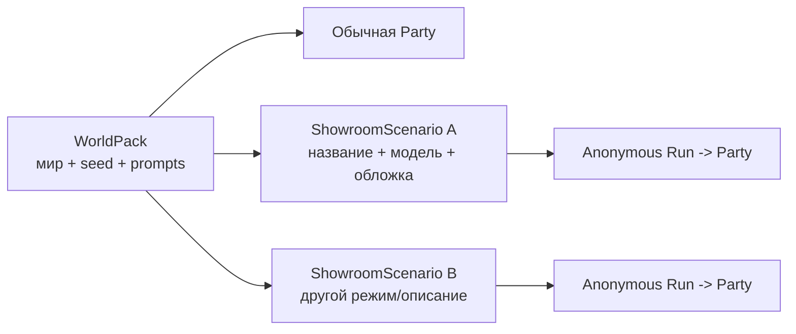

# WorldPacks и режимы сценария

[← Жизненный цикл хода](03-turn-lifecycle.md) · [Главная](README.md) · [Далее: память и retrieval →](05-memory-and-retrieval.md)

## RP contract в manifest

Актуальный RP WorldPack объявляет максимальную поддержанную версию:

```json
"rp_contract": {"schema_version": "rp-core.v2", "revision": 7}
```

Это capability pack, а не автоматическая активация. Gateway ограничивает обычные
партии значением `RP_CONTRACT_OBSERVED_REVISION`; revision выше effective
observed разрешена только изолированной checkpoint/autotest-ветке. `training` и
`novel` этот маркер не используют.

Candidate maximum `7` сам по себе не означает observed activation. Отдельный
rollout change задаёт `RP_CONTRACT_OBSERVED_REVISION=7`, но effective production
status подтверждается только после pull-based apply. Новая обычная RP-партия
получает `min(declared, observed)`, existing party остаётся pinned. PR1 не меняет
WorldPack content/state contract и не создаёт автоматическую migration.

## Что такое WorldPack

WorldPack — версионируемый набор авторского контента и начального состояния. Он описывает мир, а не конкретное прохождение.

```text
worldpacks/<slug>/
├── manifest.json
├── state-seed.json
├── campaign-bible.md
├── prompts/
│   ├── gm-system.md
│   ├── authors-note.md
│   └── opening-scene.md
├── world-info/index.md
├── characters/index.md
├── relationships/model.json
├── rules/checks.md
├── rules/site-interactions.json
├── training/
│   ├── program.json
│   ├── assessment.json
│   └── fallbacks.json
├── artifacts/sites/
│   ├── index.json
│   └── <blueprint>.json
├── quick-replies/notes.md
├── setup-flow.md
└── sillytavern/<slug>.json
```

Ключевые части:

- `manifest.json` — identity, title, status, player role, совместимые режимы и дополнительные capability metadata;
- `state-seed.json` — исходный canonical state для новой партии;
- `gm-system.md` и `authors-note.md` — активные runtime prompts;
- `campaign-bible.md` — авторский замысел, а для training — точная карта ходов;
- `training/program.json` — executable schedule, текущие output contracts, debrief и полные fallback;
- `training/assessment.json` — executable detectors, scoring/evidence effects и aggregates;
- `rules/checks.md` — человекочитаемое описание resolution/scoring, не runtime authority;
- `artifacts/sites/` — фиксированные UI-blueprints с разрешёнными slots и actions;
- `rules/site-interactions.json` — server-only соответствие typed events детерминированным evidence и score;
- SillyTavern JSON — compatibility artifact, а не authority Light GUI.

При создании партии Gateway копирует seed в новый `state_campaign_id`. Изменение party state никогда не переписывает исходный WorldPack.

RP-пак объявляет `"rp_contract": {"schema_version": "rp-core.v2"}`. Gateway
сохраняет версию в Party; отсутствие блока означает legacy v1 и не переключает
существующие партии автоматически. В `world_constraints` только правило с
`kind: absolute`, стабильным `id`, `source` и при необходимости
`forbidden_claims` получает post-response enforcement; остальные ограничения
считаются авторскими guidance.

WorldPack, у которого `scenario_types.supported` содержит `rp`, обязан объявить
WorldPack-owned модель отношений:

```json
"relationships": {
  "schema_version": "rp-relationships.v2",
  "model": "relationships/model.json"
}
```

Без блока `manifest.relationships` Gateway не сообщает ошибку и молча оставляет
слой отношений выключенным. Для паков без поддержки `rp` модель остаётся
опциональной.

В первом срезе модель владеет одной осью `loyalty`, alias-таблицей всех
персонажей состояния, границами и русскими метками полос, весами
authored-событий, ролями, ранами, конечными часами `crack`, `ultimatum`,
`plot`, `favour`, `strike` и монотонным `trust_mapping`. Ответ служебной модели
не содержит ID: Gateway разрешает точный `character_mention` по aliases и
проверяет verbatim evidence. Preflight-скрипт
`scripts/validate-relationships.py` проверяет наличие форм для каждого
персонажа state, уникальность нормализованных aliases, clocks и trust mapping;
неизвестные роли/раны, пересекающиеся границы и веса вне диапазона также
блокируют поставку. Конкретное положительное authored-событие добровольной помощи
должно объявить `resolves: ["favour"]`; без такого marker `favour` не считается
оказанной услугой. Validator требует хотя бы одно такое событие с положительным
весом. Это отдельный runtime-слой: он не меняет `state/schema.json`
и не переиспользует строковое поле `characters.*.loyalty`, где мир уже хранит
принадлежность или фракцию.

## Candidate revision 7: DC4 authored scene facts

[Decision 031](../../roles/apps/files/rp-stack/docs/decisions/031-rp-scene-state-and-atomic-continuity.md)
не делает новый manifest field обязательным и не мигрирует existing WorldPacks.
Candidate `scene_state` использует existing location/character IDs, canonical
character loyalty и declared faction IDs из pack/state. Если миру нужны другие
долгоживущие narrative roles, pack может опционально объявить bounded finite
`rp_contract.stable_affiliations` map с known character IDs, finite values и
whole aliases. Free-text profession/biography/goal/belief/emotion и mechanic
relationship roles в этот map не выводятся автоматически.

Gateway candidate guard рассматривает только affirmative normalized sentences с
known character alias и recognized authored affiliation alias. Явное чужое
finite value даёт hard repairable conflict; unknown free prose остаётся вне
deterministic gate. Это не второй LLM judge.

Location aliases тоже остаются optional refinement. Exact known ID или
unambiguous authored alias сужает player destination, но alias manifest не
является обязательным: explicit non-negated first-person movement с непустой
named-destination phrase позволяет narrator выбрать typed existing known
location ID. Такой all-known allowance существует только для player
`move_player`; NPC arrival/departure, `Outcome.target`, third-person mention,
correction и negation его не получают.

Registry 031 целиком имеет уровень `подключено`: implementation/tests merged и
applied, а isolated production-store proofs подтвердили accepted scene paths,
repeated mismatch без commit и noncanonical fallback. WorldPack schema не
расширялась, external provider calls в canary не выполнялись; это не semantic
continuity или уровень `наблюдается`. Ordinary activation выполняется отдельным
inventory rollout с обязательным post-apply proof.

## Три режима

| Режим | Для чего | Механика Gateway | Что запрещено |
|---|---|---|---|
| `rp` | Ролевая игра и совместная проза | Нейтральное продолжение сцены без скрытой механики, canonical state, absolute-rule validation/repair, relationship pressure и correction-aware living memory | D20, DC, skills, score, success/failure, механический `/check`, нарушение agency или абсолютного правила |
| `novel` | Совместный роман | Непрерывная проза, directorial input, state boundary patch без броска; chapters/raw без RP story memory | Dice, DC, skills, игровые меню, захват agency |
| `training` | Учебная симуляция и оценивание | Универсальный interpreter + WorldPack program/assessment/fallback, явные actions, deterministic score и debrief gate; прежний memory path без RP story memory | Случайность, `/check`, предметная логика в Gateway, подсказки и score до debrief |

Пользователь выбирает режим явно при создании Party. WorldPack объявляет только:

```json
{
  "scenario_types": {
    "recommended": "novel",
    "supported": ["novel", "rp"]
  }
}
```

Gateway отклоняет несовместимую комбинацию, но не меняет режим автоматически. Prompt мира не может снова включить механику, запрещённую контрактом режима.

## Executable training runtime

Новый training-мир объявляет `manifest.training_runtime` со схемой
`rp-training-runtime.v3`, а `program.json` — `rp-training-program.v3`. Gateway загружает `program.json`, `assessment.json` и
`fallbacks.json`, валидирует ссылки на state и сохраняет их общий hash/snapshot
для партии. После старта source WorldPack можно обновить: текущая party и её
branches продолжают работать на исходном snapshot, а новую ревизию получают
только новые партии.

Разделение ответственности принципиально:

| Сущность | Контракт |
|---|---|
| Gateway | Универсальные detector/effect primitives, state patch, prompt sanitization, canonical normalization, не более одного training-repair, validation и persistence |
| `program.json` | Ходы, `surfaces[]` с точным count по каналам, sender/channel/facts, format, prose `must_include`, optional `variation_budget`, role adaptation, links policy, debrief, turn-level fallback |
| `assessment.json` | Наблюдаемые text/UI detectors, правила, баллы, counters, evidence, aggregates |
| Narrator LLM | Новая естественная формулировка только текущей сцены |
| Site/workspace services | Независимые опциональные snapshots и typed sub-turn evidence |

До debrief LLM не получает score resources, assessment, future turns или
fallback. Он видит только активный контракт, профиль игрока, явно разрешённый
visible state и включённые interaction contracts. Regex остаются только в
валидаторе. Gateway сам подставляет canonical header/question и no-link marker.
Мягкая ошибка полей/профиля получает не более одного training-repair; hard
ошибка identity/shape/URL/attachment/score или ошибка provider сразу ведёт к
authored fallback.

`variation_budget` — опциональный список разрешённой вариативности текущего
хода: например тема, формулировки тела, время внутри authored window, деталь
задачи и тон. Отсутствие поля валидно. Legacy-пары v1 и v2 продолжают
загружаться без переписывания или смены contract hash, но builder создаёт новые
курсы по v3. Prompt-контракт всегда отдаёт `surfaces` списком. Каждый заявленный
маркер обязан встретиться ровно `count` раз, а незаявленный канал — hard error.

Замена фишинговой программы на ОБЖ поэтому меняет WorldPack JSON, prompts и
seed, но не Gateway. Предметного compatibility resolver больше нет: training
pack обязан объявить `training_runtime` и хранить расписание, scoring и fallback
в собственных данных.

## Текущие WorldPacks

| Slug | Название | Рекомендуемый режим | Поддержка | Особенности |
|---|---|---|---|---|
| `awareness` | Awareness | `training` | `training` | WorldPack-owned runtime v3, 10 многоканальных ходов, 6 интерактивных site turns, corporate portal и собственный `awareness-score`; предметной логики в Gateway нет |
| `awareness-one-day` | Awareness. One day | `training` | `training` | WorldPack-owned runtime, 10 LLM-сообщений, site turns 4/6/9, 7 ходов без ссылок и score 60/30/10 |
| `ellinoid` | Эллиноид | `novel` | `novel`, `rp` | Совместный литературный сценарий |
| `incident-50` | Инцидент-50 | `training` | `training`, `rp` | Киберинцидент, может играться как обучение или RP |
| `mechanist-new-world` | Механист Нового Мира | `rp` | `rp`, `novel` | Долгая приключенческая партия |
| `smoke-gate-borderland` | Предел Дымных Врат | `rp` | `rp`, `novel` | Пограничное расследование; manifest не задаёт явный status |

Таблица описывает source. Фактическая видимость может дополнительно меняться администратором в Gateway DB.

## Public и private

Администратор может назначить WorldPack видимость:

- `public` — доступен пользователям, созданию Party и Showroom;
- `private` — виден администраторам, но не может быть использован обычным пользователем или опубликован в Showroom.

Default — `public`, чтобы старые миры сохранили поведение. Видимость хранится в Gateway registry, а source manifest остаётся версионируемым описанием пакета.

## WorldPack и ShowroomScenario



ShowroomScenario — storefront aggregate, а не копия мира. Это позволяет одному WorldPack иметь несколько публичных подач и leaderboard policies.

Для training-публикации WorldPack может содержать:

- `corporate_portal` — до пяти player-visible карточек; dynamic position материализуется один раз в run snapshot;
- `showroom_result` — принадлежащая миру привязка к numeric canonical state path.

Schedule, correctness и scoring никогда не переходят в portal metadata.

## Интерактивные учебные сайты

WorldPack заранее содержит ограниченный набор типовых site blueprints. Authored schedule указывает, на каком ходе какой template разрешён и какие публичные поля narrator должен вернуть вместе с письмом или чатом. Gateway валидирует bundle, материализует immutable snapshot и выдаёт capability URL; отдельного LLM-запроса и отдельного runtime-сервиса для сборки страницы нет.

Оба интерфейса используют один статический renderer из `ui-shared/`. Blueprint определяет стиль, структуру, поля формы и разрешённые действия; модель не генерирует HTML, CSS, JavaScript, URL назначения или scoring policy.

## Links и workspace как независимые capabilities

> Статус: активация, workspace contract и runtime реализованы в IaC.

Детальный контракт означает, что мир поддерживает capability:

- `manifest.training_artifacts` — интерактивные ссылки;
- `manifest.training_workspace` — интерактивный рабочий диск.

Второй список boolean-флагов в manifest не добавляется: он мог бы разойтись с
детальными файлами. Showroom scenario выбирает разрешённое подмножество, а run
фиксирует выбор. Если capability опциональна, WorldPack обязан содержать
полноценный capability-off путь, чтобы обучение оставалось проходимым.

Workspace-часть пакета:

```text
artifacts/workspace/
├── folders.json
├── files/index.json
└── files/<blueprint>.json
rules/workspace-interactions.json
```

WorldPack владеет стабильными folder/file IDs, renderer, lifecycle, LLM slots,
fallback и server-only scoring policy. Реальные документы организации не
коммитятся в публичный WorldPack по умолчанию: Showroom связывает versioned
resource revision со стабильным `folder_id`, а run фиксирует точную версию.

## Создание миров

В репозитории есть два специализированных skill-контракта:

- `rp-world-pack-builder` — для `rp` и `novel`;
- `training-world-pack-builder` — для детерминированных учебных миров.

Оба требуют state schema validation, изоляцию party state и доставку через IaC. Training builder дополнительно требует authored decision surfaces, наблюдаемые score fields и отдельный debrief.

## Generated prompt worlds

Light GUI может создать простой private WorldPack из текста. Gateway детерминированно формирует registry entry и seed с `rp-core.v2`; отдельный LLM-вызов для этого не требуется. Такие миры принадлежат пользователю и могут использоваться обычным party flow.

Источник generated-мира выбирается явно:

- `text` — ручной prompt до 6000 символов; он нормализуется в одну строку и сохраняется в manifest/state по прежнему контракту;
- `markdown_file` — произвольный UTF-8 `.md` до 200 000 символов; полный текст сохраняется рядом с generated pack как `world.md` и подключается через `manifest.files.gm_system`;
- для Markdown в manifest и canonical state остаётся только фрагмент до 6000 символов, а полный документ читается как стабильный `WORLD_SYSTEM_PROMPT`. Это не дублирует сотни килобайт в state/API и сохраняет prompt-prefix caching.

Gateway сохраняет basename исходного файла и размер текста как метаданные, но не исполняет Markdown и не превращает его в HTML. Сценарный контракт `rp` / `novel` / `training` всё равно имеет приоритет над инструкциями импортированного мира.

## Источники

- [WorldPacks](../../roles/apps/files/rp-stack/worldpacks)
- [State schema](../../roles/apps/files/rp-stack/state/schema.json)
- [Scenario type ADR](../../roles/apps/files/rp-stack/docs/decisions/010-party-scenario-types.md)
- [RP builder skill](../../codex-skills/rp-world-pack-builder/SKILL.md)
- [Training builder skill](../../codex-skills/training-world-pack-builder/SKILL.md)
- [Training capability ADR](../../roles/apps/files/rp-stack/docs/decisions/015-training-scenario-interaction-capabilities.md)
- [WorldPack training runtime ADR](../../roles/apps/files/rp-stack/docs/decisions/017-worldpack-owned-training-runtime.md)
- [Decision 028: uncovered tail и overflow](../../roles/apps/files/rp-stack/docs/decisions/028-rp-uncovered-tail-and-overflow.md)
- [Decision 031: scene state и atomic continuity](../../roles/apps/files/rp-stack/docs/decisions/031-rp-scene-state-and-atomic-continuity.md)
