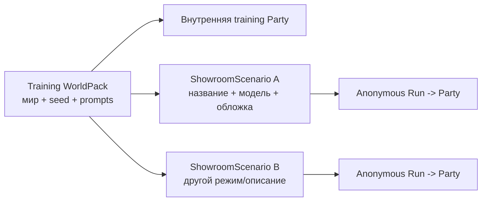

# WorldPacks и режимы сценария

[← Жизненный цикл хода](03-turn-lifecycle.md) · [Главная](README.md) · [Далее: память и retrieval →](05-memory-and-retrieval.md)

> Срез 6 Decision 043 подключил новый World/Scenario контракт к clean API за
> `RP_REBUILD_ENABLED`. Detail единственного World отдаёт server-built
> `free_scenario_seed`; Party сохраняет отдельные immutable snapshots и hashes.
> Inventory пока держит флаг выключенным. Разделы о manifest и revisions 0–11
> ниже описывают временно действующий legacy runtime до шага 12 и не являются
> compatibility-слоем нового loader.

## RP contract в manifest

Текущая максимальная declared revision RP WorldPack — `11`; revisions `0..10`
сохраняют прежний контракт:

```json
"rp_contract": {"schema_version": "rp-core.v2", "revision": 11}
```

Source понимает revision `11`, а применённая activation-поставка настраивает
observed `11`. Gateway ограничивает обычные
партии значением `RP_CONTRACT_OBSERVED_REVISION`; revision выше effective
observed разрешена только изолированной checkpoint/autotest-ветке. `training`
этот маркер не использует.

Declared revision сама по себе не означает observed activation. Исторический
rollout `RP_CONTRACT_OBSERVED_REVISION=7` прошёл pull-based apply и post-apply
stamp proof 23 августа 2026 года; отдельный rollout затем подтвердил revision
`8`. Текущий source inventory задаёт observed gate `11`; declared revision
`10` остаётся у `merchant-sviatoslav` и `day-watch-moscow`, а отдельный
`day-watch-moscow-v2` объявляет revision `11`. Новая обычная RP-партия
получает `min(declared, observed)`, existing party остаётся pinned; остальные
WorldPacks сохраняют declarations `6/7`. Source merge сам по себе не доказывает
runtime activation. Для revision `11` эти отдельные шаги выполнены 27 августа
2026 года: activation merge `80ab6d3` применён, а новая ordinary party сохранила
effective revision `11`.

Revision-11 pack и observed `11` поставляются вместе: ordinary party не получает
молчаливую effective revision `10` для manifest revision `11`. Source merge не
равен runtime activation; текущий live-сервер подтверждён уже после Ansible
apply, а existing parties не мигрировались автоматически.

## Git ownership после Decision 018

В объединённом C1/O2 source ownership уже разделено. RP WorldPacks
остаются в `ubuntu_ansible_palybooks`, а единственные активные source-копии
`awareness` и `awareness-one-day` принадлежат public project
`tavern-awareness-showroom`; его deployed revision задаётся
`awareness_showroom_repo_version` и проверяется на сервере через `git rev-parse
HEAD`. Standalone принимает только
`training`, а RP source и Gateway — только `rp`; один активный
WorldPack не дублируется между repositories. Zero-window apply удаляет
старые копии из managed checkout, но сохраняет legacy RP SQLite,
state и backups; оперативного topology rollback нет, сбои исправляются
fix-forward через application/IaC PR и повторный apply.

Новый project публикует только packs с
`scenario_types: {recommended: training, supported: [training]}` и не разрешает
prompt-generated worlds. `incident-50` остаётся RP-only в исходном project.
Training runtime по-прежнему остаётся generic interpreter: предметная программа,
score и debrief принадлежат WorldPack, а не Gateway.

## Decision 043, срезы 3–7: World и Scenario

Новый авторский source разделён по владельцам:

- `world.json` → `WorldDefinition`: законы и канон мира, фракции, места,
  базовые NPC, онтология отношений и seed lore;
- `scenario-presets/*.json` → отдельные `ScenarioPresetDefinition`:
  игрок и его способности, старт и initial state, активные NPC, стартовые
  отношения, стиль, формат, сложность, opening и локальные отклонения.

`WorldDefinition` не принимает `player_role`, `openings`, `presets`, `state_seed`
или `rp_supervisor`. Production loader/schema в `app/rp` — единственный
исполняемый владелец нового формата; `validate-repository.py` его не
дублирует. Loader закрывается на неизвестном ID, выходе пути за каталог
и несовпадении `world_id`.

В этом срезе перенесён только `day-watch-moscow-v2`: его канон,
персонажи и lore, четыре старта и три стиля. Пресет и свободно
собранный Scenario материализуются одинаково: партия хранит
отдельные `WorldSnapshot` / `ScenarioSnapshot` и SHA-256, поэтому
последующее изменение source не переписывает её стартовый контракт. Clean API и
Light GUI source теперь поддерживают preset и server-built free seed, но
production inventory ещё не активирован; deploy и live-проверка не выполнялись.

## Что такое WorldPack

WorldPack — версионируемый набор авторского контента и начального состояния. Он описывает мир, а не конкретное прохождение.

```text
worldpacks/<slug>/
├── manifest.json
├── state-seed.json
├── campaign-bible.md
├── prompts/
│   ├── gm-system.md
│   ├── authors-note.md
│   ├── opening-scene.md
│   └── openings/<id>/
│       ├── opening-scene.md
│       └── state-seed.json
├── presets/<id>/
│   ├── gm-system.md
│   └── authors-note.md
├── world-info/index.md
├── characters/index.md
├── relationships/model.json
├── lore-cards/
│   └── <group>.json
├── world-clock.json
├── rules/checks.md
├── rules/site-interactions.json
├── training/
│   ├── program.json
│   ├── assessment.json
│   └── fallbacks.json
├── artifacts/sites/
│   ├── index.json
│   └── <blueprint>.json
├── quick-replies/notes.md
├── setup-flow.md
└── sillytavern/<slug>.json
```

Ключевые части:

- `manifest.json` — identity, title, status, player role, совместимые режимы и дополнительные capability metadata;
- `state-seed.json` — исходный canonical state для новой партии;
- `gm-system.md` и `authors-note.md` — активные runtime prompts;
- `campaign-bible.md` — авторский замысел, а для training — точная карта ходов;
- `lore-cards/*.json` — optional reviewed compact context для новых rev8 RP parties, объявленный через `manifest.files.lore_cards`;
- `world-clock.json` — optional rev10 authored date/events contract; Gateway,
  а не модель, применяет его условия и последствия;
- `training/program.json` — executable schedule, текущие output contracts, debrief и полные fallback;
- `training/assessment.json` — executable detectors, scoring/evidence effects и aggregates;
- `rules/checks.md` — человекочитаемое описание resolution/scoring, не runtime authority;
- `artifacts/sites/` — фиксированные UI-blueprints с разрешёнными slots и actions;
- `rules/site-interactions.json` — server-only соответствие typed events детерминированным evidence и score;
- SillyTavern JSON — compatibility artifact, а не authority Light GUI.

При создании партии Gateway копирует seed в новый `state_campaign_id`. Изменение party state никогда не переписывает исходный WorldPack.

RP-пак объявляет `"rp_contract": {"schema_version": "rp-core.v2"}`. Gateway
сохраняет версию в Party; отсутствие блока означает legacy v1 и не переключает
существующие партии автоматически. В `world_constraints` только правило с
`kind: absolute`, стабильным `id`, `source` и при необходимости
`forbidden_claims` получает post-response enforcement; остальные ограничения
считаются авторскими guidance.

WorldPack, у которого `scenario_types.supported` содержит `rp`, обязан объявить
WorldPack-owned модель отношений:

```json
"relationships": {
  "schema_version": "rp-relationships.v2",
  "model": "relationships/model.json"
}
```

Без блока `manifest.relationships` Gateway не сообщает ошибку и молча оставляет
слой отношений выключенным. Для паков без поддержки `rp` модель остаётся
опциональной.

В первом срезе модель владеет одной осью `loyalty`, alias-таблицей всех
персонажей состояния, границами и русскими метками полос, весами
authored-событий, ролями, ранами, конечными часами `crack`, `ultimatum`,
`plot`, `favour`, `strike` и монотонным `trust_mapping`. Ответ служебной модели
не содержит ID: Gateway разрешает точный `character_mention` по aliases и
проверяет verbatim evidence. Preflight-скрипт
`scripts/validate-relationships.py` проверяет наличие форм для каждого
персонажа state, уникальность нормализованных aliases, clocks и trust mapping;
неизвестные роли/раны, пересекающиеся границы и веса вне диапазона также
блокируют поставку. Конкретное положительное authored-событие добровольной помощи
должно объявить `resolves: ["favour"]`; без такого marker `favour` не считается
оказанной услугой. Validator требует хотя бы одно такое событие с положительным
весом. Это отдельный runtime-слой: он не меняет `state/schema.json`
и не переиспользует строковое поле `characters.*.loyalty`, где мир уже хранит
принадлежность или фракцию.

## Revision 11: narrative presets и opening seeds

[Decision 041](../../roles/apps/files/rp-stack/docs/decisions/041-rp-narrative-presets-and-opening-seeds.md)
задаёт два обязательных непустых top-level каталога для revision-11 pack:

```json
{
  "presets": [
    {"id": "action", "title": "Действие",
     "world_system_prompt": "presets/action/gm-system.md",
     "world_authors_note": "presets/action/authors-note.md"}
  ],
  "presets_default": "action",
  "openings": [
    {"id": "independent", "title": "Независимый старт",
     "player_role": "Независимый зарегистрированный Иной",
     "prompt": "prompts/openings/independent/opening-scene.md",
     "state_seed": "prompts/openings/independent/state-seed.json"}
  ],
  "openings_default": "independent"
}
```

ID уникален внутри каталога и соответствует
`^[a-z0-9][a-z0-9_-]{0,63}$`. Defaults всегда explicit. Все пути существуют
внутри pack; seed имеет строгое имя и путь
`prompts/openings/<id>/state-seed.json`, чтобы рекурсивная state-schema проверка
не пропустила его.

Legacy root declarations остаются точными default aliases:
`files.gm_system=prompts/gm-system.md`,
`files.authors_note=prompts/authors-note.md`,
`files.opening_scene=prompts/opening-scene.md`,
`files.state_seed=state-seed.json`. Каждый root payload byte-equal выбранному
default, а root `player_role` равен роли default opening.

Preset — полная пара prompt, не набор фрагментов. С заголовками Gateway
`WORLD_SYSTEM_PROMPT` ограничен 5000, `WORLD_AUTHORS_NOTE` — 1500 символами.
System rules не сокращаются автоматически; preset-specific scene forms и
conflict prohibitions автор помещает в authors note и проверяет как prose.
Repository gate проверяет структуру, пути, непустой текст, aliases и размеры,
но не делает вид, что понимает семантику текста.

Revision-11 mechanism имеет уровень `подключено`: применённый сервер отдал
каталоги `day-watch-moscow-v2` в авторизованный Light GUI, а ordinary party
сохранила не-default `strategic` и `inquisition-observer`, их hashes, полный seed
и revision `11`. Выбранные материалы присутствовали в реальных narrator prompts;
зарегистрированный causal probe и endurance для более высоких ступеней не
выполнялись.

## Optional RP supervisor contract

WorldPack может добавить `manifest.files.rp_supervisor` со strict
`rp-gateway.rp-supervisor.v1`. Контракт фиксирует `50` playable units, cadence
`8`, максимум `2` advisories, подтверждение отклонения на `3` последовательных
оценках, retention `30` дней и ровно шесть canonical rule IDs. В `observe`
правила содержат только title/rubric; corridor и authored below/above advisory
разрешены только в `enforce`.

Первый opt-in — `day-watch-moscow-v2` в режиме `observe`. Это не повышает RP
revision, не меняет preset/opening snapshot и не вводит отдельную service model.
`scene_mobility` оценивает развитие ситуации и ритм, а не каноническую локацию:
место действия остаётся задачей narrator и существующих игровых контрактов.

## Revision 7: DC4 authored scene facts

[Decision 031](../../roles/apps/files/rp-stack/docs/decisions/031-rp-scene-state-and-atomic-continuity.md)
не делает новый manifest field обязательным и не мигрирует existing WorldPacks.
Candidate `scene_state` использует existing location/character IDs, canonical
character loyalty и declared faction IDs из pack/state. Если миру нужны другие
долгоживущие narrative roles, pack может опционально объявить bounded finite
`rp_contract.stable_affiliations` map с known character IDs, finite values и
whole aliases. Free-text profession/biography/goal/belief/emotion и mechanic
relationship roles в этот map не выводятся автоматически.

Gateway candidate guard рассматривает только affirmative normalized sentences с
known character alias и recognized authored affiliation alias. Явное чужое
finite value даёт hard repairable conflict; unknown free prose остаётся вне
deterministic gate. Это не второй LLM judge.

Location aliases тоже остаются optional refinement. Exact known ID или
unambiguous authored alias сужает player destination, но alias manifest не
является обязательным: explicit non-negated first-person movement с непустой
named-destination phrase позволяет narrator выбрать typed existing known
location ID. Такой all-known allowance существует только для player
`move_player`; NPC arrival/departure, `Outcome.target`, third-person mention,
correction и negation его не получают.

Registry 031 целиком имеет уровень `подключено`: implementation/tests merged и
applied, а isolated production-store proofs подтвердили accepted scene paths,
repeated mismatch без commit и noncanonical fallback. WorldPack schema не
расширялась, external provider calls в canary не выполнялись; это не semantic
continuity или уровень `наблюдается`. Последующая ordinary activation прошла
отдельный inventory rollout и обязательный post-apply proof; это не повышает
readiness DC4.

## Revision 8: authoring boundary и activation canary

[Decision 032](../../roles/apps/files/rp-stack/docs/decisions/032-rp-history-first-prompt-and-sectioned-memory.md)
меняет только то, как Gateway читает RP WorldPack для narrator. Source activation
и stamp-party подтвердили effective `8` только для новых
`merchant-sviatoslav`. `day-watch-moscow` теперь также объявляет совместимость
до revision `10`, но получит её на сервере только после отдельного apply и только
в новых партиях; persisted parties не мигрируют.

Для rev-8 pack авторские prompt-файлы должны укладываться целиком,
включая заголовок Gateway: `gm-system.md` — не более 5 000 символов,
`authors-note.md` — не более 1 500. Lore попадает в prompt только целыми
карточками в суммарный блок не более 4 000 символов. Эти лимиты не разрешают
дублировать `state-seed.json` в prose: общий state, scene contracts и character
JSON больше не сериализуются narrator-у. Подпись NPC в relationship block
берётся из `characters.*.name`, затем из первого alias relationship model, а при
их отсутствии — из humanized character ID.

RAW-окно задаётся Gateway-настройкой `RP_RAW_HISTORY_WINDOW_TURNS` с default 50
и hard minimum 20, а не полем WorldPack. Recent start квантуется по восемь,
поэтому штатное окно содержит 50–57 units. Rules/world/absolute и RAW идут до
изменчивых memory/lore/pressure/authors-note; WorldPack не должен требовать
обратного порядка или помещать turn/revision/timestamp counters в rule prefix.
Opening scene хранится как assistant
unit; только точная техническая строка `[AUTO_START] Старт партии` подавляется.
Narrator rev-8 возвращает plain text, поэтому pack не должен требовать scene
bundle или поля `scene_claims`. Installed builder skill повторяет эти правила.
Для этого canary Ansible apply и отдельный revision stamp новой партии уже
пройдены; длинные narrative gates остаются отдельной более высокой ступенью.

### Revision 8: authored Lore Cards

[Decision 037](../../roles/apps/files/rp-stack/docs/decisions/037-rp-authored-lore-cards-and-confirmed-drafts.md)
добавляет optional manifest path:

```json
"files": {
  "lore_cards": "lore-cards"
}
```

Каждый JSON использует schema `rp-gateway.worldpack-lore-cards.v1` и список
cards со стабильными ASCII keys, title, непустыми exact keywords, content и
boolean flags. Повторный key запрещён. NPC card имеет `key=npc:<character-id>`,
canonical relationship name, все русские aliases, цель, жёсткие границы и
скрытые факты; `always_on` для неё всегда `false`.

Developer может получить candidate через
`scripts/author-worldpack-lore-cards.py`, но модель вызывается только во время
authoring. Человек сверяет результат с source и коммитит его. Runtime не
генерирует библиотеку мира и не меняет WorldPack: при создании новой rev8 party
Gateway лишь валидирует и копирует cards в её party storage. Empty keywords,
duplicate key, missing NPC aliases и меньше 15 карточек у «Купца» останавливают
repository validation.

### Revision 10: authored world clock

[Decision 039](../../roles/apps/files/rp-stack/docs/decisions/039-rp-world-clock-and-authored-events.md)
добавляет optional manifest path только для explicit candidate update:

```json
"files": {
  "world_clock": "world-clock.json"
}
```

Файл имеет закрытую схему `rp-gateway.world-clock.v1`: `initial_date`,
ISO-8601 `max_step`, typed `markers` и authored `events`. Event condition может
быть только `date_gte`, `after_event` или `after_confirmed`; каждое событие
обязано перечислить хотя бы один `superseded_by` marker. Marker либо имеет
bounded `state_equals` predicate по разрешённому canonical path, либо требует
явного подтверждения игрока через Gateway.

В v1 разрешены только два consequence: durable `world_fact` и enable/disable
существующей authored Lore Card по stable key. Свободный state patch,
перемещение NPC или текстовое решение модели не проходят validation. Если
персонаж уехал, authored fact говорит narrator об отсутствии; отдельный
presence registry не создаётся, а NPC card всё ещё может подняться по имени.

`merchant-sviatoslav` остаётся первым authored-clock canary и содержит четыре
cancelable события, включая Вятичский поход. `day-watch-moscow` также объявляет
revision `10`, но не `files.world_clock`: произвольная стартовая точка сохраняется,
а clock state, elapsed jobs и scheduled events для такой партии не создаются.
Revision `10` сама по себе не требует календаря. Source gate поднят до `10`, но
обычная новая партия получит S4 только после отдельного Ansible apply; прежние
партии останутся на закреплённой revision.

## Два активных режима в разных процессах

| Режим | Для чего | Механика Gateway | Что запрещено |
|---|---|---|---|
| `rp` | Ролевая игра и совместная проза | Нейтральное продолжение сцены без скрытой механики, canonical state, absolute-rule validation/repair, relationship pressure и correction-aware living memory | D20, DC, skills, score, success/failure, механический `/check`, нарушение agency или абсолютного правила |
| `training` | Учебная симуляция и оценивание | Универсальный interpreter + WorldPack program/assessment/fallback, явные actions, deterministic score и debrief gate; прежний memory path без RP story memory | Случайность, `/check`, предметная логика в Gateway, подсказки и score до debrief |

После C1 process mode не выбирается между двумя значениями внутри одного
Gateway: Light GUI создаёт только `rp`, Showroom — только `training`. Каждый
Gateway fail-closed отклоняет чужой режим до state/provider writes. WorldPack
объявляет совместимость:

```json
{
  "scenario_types": {
    "recommended": "rp",
    "supported": ["rp"]
  }
}
```

Gateway отклоняет несовместимую комбинацию, но не меняет режим автоматически. Prompt мира не может снова включить механику, запрещённую контрактом режима.

Сохранённые training Party и ShowroomScenario старой RP SQLite не конвертируются
и не копируются в standalone project. Владелец снял их перенос и завершение как
блокер C1. Сама старая БД остаётся нетронутой, а production RP Gateway скрывает
эти resources. Source/контейнер удаляются zero-window поставкой, но строки и
таблицы SQLite физически не удаляются.

## Executable training runtime

Новый training-мир объявляет `manifest.training_runtime` со схемой
`rp-training-runtime.v3`, а `program.json` — `rp-training-program.v3`. Gateway загружает `program.json`, `assessment.json` и
`fallbacks.json`, валидирует ссылки на state и сохраняет их общий hash/snapshot
для партии. После старта source WorldPack можно обновить: текущая party и её
branches продолжают работать на исходном snapshot, а новую ревизию получают
только новые партии.

Разделение ответственности принципиально:

| Сущность | Контракт |
|---|---|
| Gateway | Универсальные detector/effect primitives, state patch, prompt sanitization, canonical normalization, не более одного training-repair, validation и persistence |
| `program.json` | Ходы, `surfaces[]` с точным count по каналам, sender/channel/facts, format, prose `must_include`, optional `variation_budget`, role adaptation, links policy, debrief, turn-level fallback |
| `assessment.json` | Наблюдаемые text/UI detectors, правила, баллы, counters, evidence, aggregates |
| Narrator LLM | Новая естественная формулировка только текущей сцены |
| Site/workspace services | Независимые опциональные snapshots и typed sub-turn evidence |

До debrief LLM не получает score resources, assessment, future turns или
fallback. Он видит только активный контракт, профиль игрока, явно разрешённый
visible state и включённые interaction contracts. Regex остаются только в
валидаторе. Gateway сам подставляет canonical header/question и no-link marker.
Мягкая ошибка полей/профиля получает не более одного training-repair; hard
ошибка identity/shape/URL/attachment/score или ошибка provider сразу ведёт к
authored fallback.

`variation_budget` — опциональный список разрешённой вариативности текущего
хода: например тема, формулировки тела, время внутри authored window, деталь
задачи и тон. Отсутствие поля валидно. Legacy-пары v1 и v2 продолжают
загружаться без переписывания или смены contract hash, но builder создаёт новые
курсы по v3. Prompt-контракт всегда отдаёт `surfaces` списком. Каждый заявленный
маркер обязан встретиться ровно `count` раз, а незаявленный канал — hard error.

Замена фишинговой программы на ОБЖ поэтому меняет WorldPack JSON, prompts и
seed, но не Gateway. Предметного compatibility resolver больше нет: training
pack обязан объявить `training_runtime` и хранить расписание, scoring и fallback
в собственных данных.

## Текущие WorldPacks

| Slug | Название | Рекомендуемый режим | Поддержка | Особенности |
|---|---|---|---|---|
| `awareness` | Awareness | `training` | `training` | Активный и единственный source authority — standalone project; WorldPack-owned runtime v3, 10 многоканальных ходов, 6 интерактивных site turns, corporate portal и собственный `awareness-score` |
| `awareness-one-day` | Awareness. One day | `training` | `training` | Активный и единственный source authority — standalone project; 10 LLM-сообщений, site turns 4/6/9, 7 ходов без ссылок и score 60/30/10 |
| `day-watch-moscow` | Дневной Дозор: Москва в начале книги | `rp` | `rp` | Revision 10 без authored-календаря: свободный персонаж, точка входа из PlayerCharacter, authored Lore Cards и закрытые мотивации NPC |
| `day-watch-moscow-v2` | Дневной Дозор: Москва — четыре начала | `rp` | `rp` | Revision 11: presets `book/action/strategic`, четыре независимых opening seeds, 20 Lore Cards и те же 11 активных NPC; world clock не добавлен |
| `ellinoid` | Эллиноид | `rp` | `rp` | Совместный литературный сценарий |
| `incident-50` | Инцидент-50 | `rp` | `rp` | Киберинцидент остаётся в RP project как ролевая партия |
| `mechanist-new-world` | Механист Нового Мира | `rp` | `rp` | Долгая приключенческая партия |
| `merchant-sviatoslav` | Купец | `rp` | `rp` | Торговая и политическая кампания; первый authored-clock canary, 16 authored Lore Cards, GM corrections и authored world clock |
| `smoke-gate-borderland` | Предел Дымных Врат | `rp` | `rp` | Пограничное расследование; manifest не задаёт явный status |
| `starosta` | Староста | `rp` | `rp` | Деревенская ролевая кампания |

Таблица описывает C1 source ownership. До Ansible apply live-каталог остаётся
старым; после apply каждый Gateway показывает только packs своего process mode.

## Public и private

Администратор может назначить WorldPack видимость в registry конкретного
процесса:

- `public` в RP Gateway — доступен пользователям для создания RP Party, но не
  публикуется в Showroom;
- `public` в standalone Training Gateway — доступен Showroom и созданию
  training run;
- `private` — виден администраторам своего процесса, но недоступен обычному
  пользователю и не публикуется его интерфейсом.

Default — `public` внутри своего process mode, чтобы старые миры сохранили
поведение. RP и training registry не синхронизируют visibility, а source
manifest остаётся версионируемым описанием пакета.

## WorldPack и ShowroomScenario



ShowroomScenario — storefront aggregate, а не копия мира. Это позволяет одному
training WorldPack иметь несколько публичных подач и leaderboard policies внутри
standalone project; RP Gateway этот aggregate не публикует.

Для training-публикации WorldPack может содержать:

- `corporate_portal` — до пяти player-visible карточек; dynamic position материализуется один раз в run snapshot;
- `showroom_result` — принадлежащая миру привязка к numeric canonical state path.

Schedule, correctness и scoring никогда не переходят в portal metadata.

## Интерактивные учебные сайты

WorldPack заранее содержит ограниченный набор типовых site blueprints. Authored schedule указывает, на каком ходе какой template разрешён и какие публичные поля narrator должен вернуть вместе с письмом или чатом. Gateway валидирует bundle, материализует immutable snapshot и выдаёт capability URL; отдельного LLM-запроса и отдельного runtime-сервиса для сборки страницы нет.

Standalone Showroom использует собственный статический renderer из своего
`ui-shared/`. RP Light GUI training renderer не содержит. Blueprint определяет
стиль, структуру, поля формы и разрешённые действия; модель не генерирует HTML,
CSS, JavaScript, URL назначения или scoring policy.

## Links и workspace как независимые capabilities

> Статус: standalone workspace contract и runtime реализованы в source;
> production `:8011`, C1 apply и live-приёмка ещё не подтверждены.

Детальный контракт означает, что мир поддерживает capability:

- `manifest.training_artifacts` — интерактивные ссылки;
- `manifest.training_workspace` — интерактивный рабочий диск.

Второй список boolean-флагов в manifest не добавляется: он мог бы разойтись с
детальными файлами. Showroom scenario выбирает разрешённое подмножество, а run
фиксирует выбор. Если capability опциональна, WorldPack обязан содержать
полноценный capability-off путь, чтобы обучение оставалось проходимым.

Workspace-часть пакета:

```text
artifacts/workspace/
├── folders.json
├── files/index.json
└── files/<blueprint>.json
rules/workspace-interactions.json
```

WorldPack владеет стабильными folder/file IDs, renderer, lifecycle, LLM slots,
fallback и server-only scoring policy. Реальные документы организации не
коммитятся в публичный WorldPack по умолчанию: Showroom связывает versioned
resource revision со стабильным `folder_id`, а run фиксирует точную версию.

## Создание миров

В репозитории есть два специализированных skill-контракта:

- `rp-world-pack-builder` — для `rp`;
- `training-world-pack-builder` — для детерминированных учебных миров.

`rp-world-pack-builder` для нового RP-контура создаёт World и отдельные
Scenario по production loader/schema, но до переключения не выдаёт offline-
материализацию за играбельный live-мир. Training builder сохраняет
свой текущий контракт: state schema validation, authored decision surfaces,
наблюдаемые score fields и отдельный debrief.

## Generated prompt worlds

Light GUI может создать простой private WorldPack из текста. Gateway детерминированно формирует registry entry и seed с `rp-core.v2`; отдельный LLM-вызов для этого не требуется. Такие миры принадлежат пользователю и могут использоваться обычным party flow.

Источник generated-мира выбирается явно:

- `text` — ручной prompt до 6000 символов; он нормализуется в одну строку и сохраняется в manifest/state по прежнему контракту;
- `markdown_file` — произвольный UTF-8 `.md` до 200 000 символов; полный текст сохраняется рядом с generated pack как `world.md` и подключается через `manifest.files.gm_system`;
- для Markdown в manifest и canonical state остаётся только фрагмент до 6000 символов, а полный документ читается как стабильный `WORLD_SYSTEM_PROMPT`. Это не дублирует сотни килобайт в state/API и сохраняет prompt-prefix caching.

Gateway сохраняет basename исходного файла и размер текста как метаданные, но не исполняет Markdown и не превращает его в HTML. Сценарный контракт `rp` / `training` всё равно имеет приоритет над инструкциями импортированного мира.

## Источники

- [WorldPacks](../../roles/apps/files/rp-stack/worldpacks)
- [State schema](../../roles/apps/files/rp-stack/state/schema.json)
- [Scenario type ADR](../../roles/apps/files/rp-stack/docs/decisions/010-party-scenario-types.md)
- [RP builder skill](../../codex-skills/rp-world-pack-builder/SKILL.md)
- [Training builder skill](../../codex-skills/training-world-pack-builder/SKILL.md)
- [Training capability ADR](../../roles/apps/files/rp-stack/docs/decisions/015-training-scenario-interaction-capabilities.md)
- [WorldPack training runtime ADR](../../roles/apps/files/rp-stack/docs/decisions/017-worldpack-owned-training-runtime.md)
- [Decision 028: uncovered tail и overflow](../../roles/apps/files/rp-stack/docs/decisions/028-rp-uncovered-tail-and-overflow.md)
- [Decision 031: scene state и atomic continuity](../../roles/apps/files/rp-stack/docs/decisions/031-rp-scene-state-and-atomic-continuity.md)
- [Decision 032: history-first prompt и sectioned memory](../../roles/apps/files/rp-stack/docs/decisions/032-rp-history-first-prompt-and-sectioned-memory.md)
