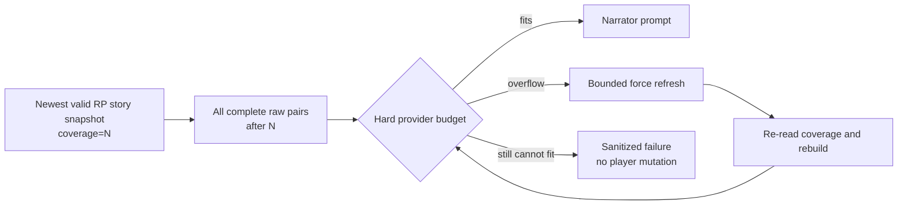
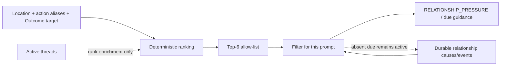
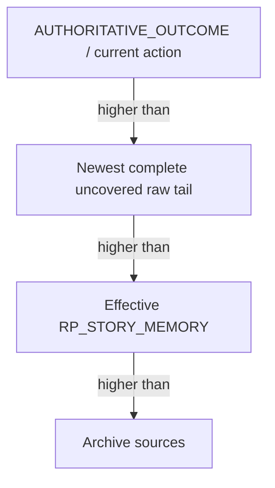
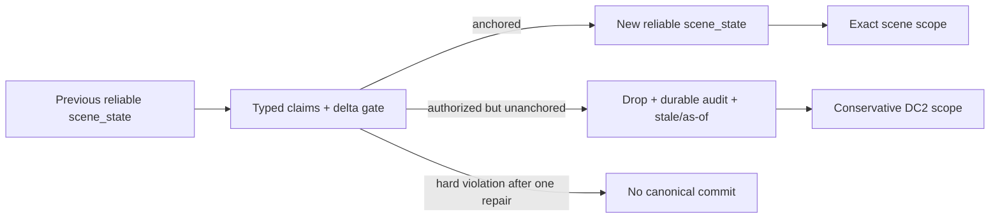
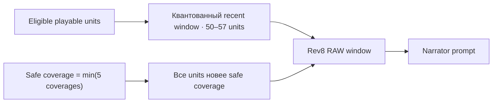
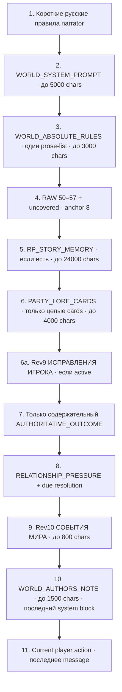
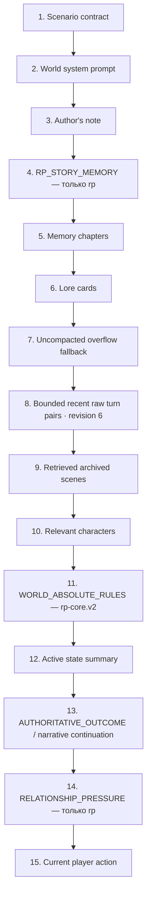

# Память, контекст и retrieval

[← WorldPacks и режимы](04-worldpacks-and-modes.md) · [Главная](README.md) · [Далее: модели →](06-models-and-providers.md)

## Correction-aware RP story memory

Начиная с RP revision 2 каждая запись living-memory имеет стабильный `fact_id`,
authority, source turn и статус `active`, `superseded` или `retracted`. Service
model предлагает следующий snapshot, но не назначает себе authority: Gateway
принудительно трактует все новые и изменённые записи как `inference`, ограничивает
их provenance фактическим пакетом turn IDs и затем сливает с предыдущим snapshot:
пропущенные записи сохраняются, weak inference не создаёт tombstone и не может
воскресить отозванный факт. Только active-записи попадают в effective prompt;
исторические статусы остаются в append-only snapshot для аудита.

Raw turns при этом не переписываются. Revision 6 ограничивает effective prompt
recent turns, memory chapters, relevant characters, active state и выборочным
retrieval, сохраняя полный transcript в durable store.
Для длинной RP-истории revision 6 дополнительно удаляет из provider prompt
старейшие полные пары `user/assistant`, пока суммарный текст не уложится
в 50% полного raw transcript. Percentage-only trimming останавливается перед
последней полной парой: обязательные system-блоки, эта пара и текущий ввод игрока
не режутся только ради процента. Если такой минимальный continuity tail уже больше
50%, процентная граница для этого хода недостижима, а жёстким остаётся реальный
provider input token budget. Live-canary на 168-ходовой истории дал 129654 символа
prompt при 260384 символах raw transcript — 49,79%, при этом source history не
изменилась; это доказательство long-party compaction, а не данного edge case.

## Revision 7: полный uncovered tail

DC1 из [Decision 028](../../roles/apps/files/rp-stack/docs/decisions/028-rp-uncovered-tail-and-overflow.md)
меняет continuity boundary только для RP revision `7`:

```text
coverage = effective_rp_story_memory.to_turn_id or 0
raw_tail = turns_for_memory(after_turn_id=coverage)
```

Каждая complete non-excluded raw-пара после coverage входит в narrator request
дословно и не удаляется ради мягкой 50% character-цели. Chapters не двигают
boundary, retrieval ограничен ходами `<= coverage`, а
`UNCOMPACTED_ARCHIVE_FALLBACK` для этого tail не создаётся.



Prompt Inspector и context diagnostics показывают effective/prompt coverage,
pending turns/tokens, configured threshold, hard-budget status и последний
force-refresh result; Inspector дополнительно перечисляет included raw turn IDs.
World/player prompt text в overflow payload не возвращается. Deployed Merchant
canary поднял точный tail и revision stamp до `подключено`: recorded prompt
содержал только полную eligible verbatim-пару после effective coverage, а source
raw/state hashes не изменились. Paired production-store canary закрыла
hard-overflow rule: `party_39f2d3cd6307` после force-refresh поместилась и
committed, а `party_4a07c4ad0613` после refresh осталась `26917 > 4000` и
завершилась до narrator без нового turn/state/relationship projection. Все
строки Decision 028 имеют уровень `подключено`. Ранний semantic output со сменой
локации не доказывает исправленную continuity или `наблюдается`; observed
rollout позднее прошёл отдельным inventory change и stamp proof.

## Revision 7: derived relationship scope

DC2 из
[Decision 029](../../roles/apps/files/rp-stack/docs/decisions/029-scene-scoped-relationship-pressure.md)
не превращает relationship history в scene authority. Перед рендерингом pressure
Gateway вычисляет одноразовый eligible allow-list только из canonical совпадения
локации, whole-alias в текущем действии или `Outcome.target`. Structured active
threads добавляют rank только уже eligible NPC и не расширяют allow-list.
Кандидаты сортируются детерминированно и ограничиваются top-6.



Relationship cause, edge, due clock или active thread без одного из трёх
eligibility-сигналов не добавляют NPC. Absent due `favour` остаётся durable и
`active`; его omission из prompt не является resolution evidence. Новая
state-проекция сцены и scene-state fast path не входят в DC2. Контракт имеет
уровень `подключено`: deployed isolated canary после warm-up записал один
relationship system-block с eligible Миленой, не включил remote active-thread
Бажену или Радогоста и сохранил due `favour` Бажены active и unresolved. Source
state и six-table structural hash не изменились. Это не доказывает semantic
continuity или уровень `наблюдается` и сам по себе не активирует observed
revision `7`.

## Revision 7: prompt authority и structural deduplication

DC3 из
[Decision 030](../../roles/apps/files/rp-stack/docs/decisions/030-rp-prompt-authority-and-deduplication.md)
document-first фиксирует для normal party-chat/admin-autotest turns один порядок
authority для пересекающихся continuity-слоёв:



Revision-7 provider prompt должен содержать ровно один mandatory system block
`PROMPT_AUTHORITY_HIERARCHY` со stable `block_id=prompt_authority` и той же
hierarchy, а safety line `The current action is intent, not an automatic fact.`
не позволяет считать действие игрока уже подтверждённым фактом. Block даёт typed
oracle recorded prompt и не несёт state/memory content.
Если одновременно существуют non-empty `long_term_memory` candidate и effective
`RP_STORY_MEMORY`, legacy block structural-suppressed с reason
`structural_deduplication`. При отсутствии effective snapshot legacy fallback
остаётся допустимым. Сравнение фраз, embeddings и LLM judge не используются;
stored turns, chapters, snapshots и archive rows не удаляются.

Budget-driven eviction selected optional block разрешён только при фактическом
hard provider token overflow, только целиком и с reason `hard_input_budget`.
Мягкая percentage/character цель этого не делает. Если required set всё равно
не помещается, действует bounded refresh/fail-before-provider DC1.

Canonical content-free `prompt_assembly` имеет exact
`schema_version=rp-gateway.prompt-assembly.v1`, `rp_contract_revision=7` и
`authority_order=[authoritative_outcome_current_action, uncovered_raw_tail,
rp_story_memory, archive]`. Он также хранит
`story_memory_covered_through_turn_id`, ordered included block IDs, exact raw-tail
turn IDs и `{block_id, reason}` для omissions. Prompt/response text, names, state
values и secrets в объект не входят.

Для recorded turn один объект обязан совпасть в turn `metadata_json`,
`gateway_assembly` trace, Prompt Inspector `source=last` и recorded context.
Current dry-run строит ту же schema для собственной assembly, поэтому не обязан
быть byte-equal предыдущему recorded turn. Новая таблица, колонка, provider field
или provider call не добавляются.

`excluded_from_memory` меняет eligibility хода для story memory/archive, но не
видимость его content-free `prompt_assembly` в recorded JSON/API diagnostics.
Проекция и committed `prompt_json` описывают initial full narrator assembly и
transport retries с теми же messages. Compact validation-repair не заменяет эти
surfaces; его exact input доступен отдельно в private admin Turn Trace. В Light
GUI/shared UI/Showcase отдельного renderer этой проекции нет.

Optional `branch_id` на read-only context и prompt preview нужен, чтобы штатно
прочитать assembly isolated candidate branch. Без него source-party response не
меняется; с ним Gateway выбирает branch store, source-party runtime settings и
persisted branch revision, не принимая raw `state_campaign_id` и не меняя
memory/state. Wiring merged в PR59, excluded-turn/emitter-ID hardening — в PR61;
оба applied и проверены deployed live proof.

Applied canary
`autotest_2eb4d5e1a53f` / `branch_ccf0d535a98c` подтвердил exact structural
deduplication. Primary attempt получил `403`, последующий transport
model-fallback `openrouter/auto` — `200`; оба получили exact same prompt.
Validation repair и Gateway safe-fallback text не использовались. Source revision `0`
и exact state/projection/table hashes остались baseline. Отдельная canary
`party_1bc1a1204dde` при full prompt `15360` и hard budget `15359` удалила
`relevant_characters` целым message, записала `hard_input_budget` и committed
после одного mock-narrator call. Excluded latest turn `party_ad201794ce31`
подтвердил exact parity metadata ↔ trace ↔ Prompt Inspector `source=last` ↔
recorded context. Все три registry-row имеют уровень `подключено`.

Decision 030 не вводит `scene_state`, response bundle, continuity validator,
fallback или atomic commit и не доказывает semantic continuity/`наблюдается`.
Opening-scene persistence/parity подтверждена четвёртым slice. Observed revision
`7` была включена отдельным inventory rollout после всех readiness gates.

## Revision 7: scene authority и noncanonical fallback

DC4 из
[Decision 031](../../roles/apps/files/rp-stack/docs/decisions/031-rp-scene-state-and-atomic-continuity.md)
document-first добавляет canonical `scene_state` внутрь state version. Non-stale
projection с known `location_id` и sorted `present_character_ids` становится
exact scope для relevant-character и relationship rendering. Stale projection
показывается только с exact as-of marker и временно возвращает conservative DC2
derived scope; она не выдаёт прошлое presence за текущее.

Minimal private bundle содержит один полный
`scene_claims {location_id, present_character_ids}` snapshot и bounded typed
`scene_delta`. Только normalized authorized and evidence-anchored delta меняет
projection. Well-typed authorized operation с unmatched evidence immediately
dropped без repair/provider call; metadata/audit сохраняет actual value/evidence,
а scene остаётся stale. Unknown/unauthorized transition или hard scene-claim
mismatch получает одну repair-попытку и затем no canonical commit.



Finite stable affiliations берутся только из authored loyalty/faction и optional
finite WorldPack map. Узкий known-character+recognized-affiliation sentence guard
может repair explicit conflicting finite fact; unknown free prose и mechanic
relationship roles не становятся memory authority.

Pre-bundle transport fallback хранится как explicit noncanonical turn с
`story_memory_canonical=false` и stale/as-of scene marker. Его Gateway-authored
narrator prose исключается из raw-story, RP story memory, chapters,
archive/retrieval и relationship consumers. Player input и unresolved marker не
теряются: следующий narrator prompt явно показывает их и последнюю reliable
as-of scene. Fallback поэтому durable для idempotency/audit, но не является
новым фактом мира.

Opening использует ту же boundary и сохраняет DC3 `prompt_assembly`. Все четыре
registry-строки Decision 031 имеют уровень `подключено`: deployed isolated
canaries подтвердили accepted opening/normal и anchored/drop-stale paths,
repeated hard mismatch без commit и excluded noncanonical fallback без утечки
prose/relationship canon. External provider calls не выполнялись; последующая
observed activation отдельно прошла apply/stamp-proof boundary и не повышает
readiness этих canaries.

## Revision 8: history-first prompt и пять секций памяти

[Decision 032](../../roles/apps/files/rp-stack/docs/decisions/032-rp-history-first-prompt-and-sectioned-memory.md)
задаёт S1 только для RP `rp_contract_revision >= 8`. Код S1 уже применён;
отдельный source-activation slice задаёт observed `8`, но declared `8` только у
`merchant-sviatoslav`. Apply и stamp-party подтвердили effective `8` без model
calls; live-проверки 25/60 отложены до полной реализации, поэтому registry
остаётся на ступени `каркас`.

### RAW `50–57 + uncovered`

Rev8 считает историю целыми playable units:

- opening scene — одно assistant-message; точный технический user-text
  `[AUTO_START] Старт партии` не передаётся narrator;
- narrative turn — одна неделимая пара `user + assistant`;
- `turn_kind = null` или пустое значение означает legacy narrative;
- `world_command`, `gm_correction` и будущие non-game kinds исключаются.

Для пяти секций вычисляется `safe_coverage = min(section.coverage)`. Recent start
квантуется вниз по восемь eligible units, поэтому штатное RAW window плавает от
50 до 57 units и сдвигает голову только один раз на восемь ходов. Фактическое
начало берётся не позже первой uncovered unit. Поэтому отставшая или частично
failed память расширяет дословное окно назад и не создаёт слепой участок между
памятью и transcript.



### Пять покрытий, один основной вызов

| Section key | Содержимое | Собственный статус |
|---|---|---|
| `situation` | current situation + canon | `coverage`, `fresh/stale/failed` |
| `threads` | active + resolved threads | `coverage`, `fresh/stale/failed` |
| `characters` | персонажи | `coverage`, `fresh/stale/failed` |
| `assets_and_rules` | inventory/assets + rules/abilities | `coverage`, `fresh/stale/failed` |
| `chronology_and_hooks` | chronology + unresolved hooks | `coverage`, `fresh/stale/failed` |

До появления 51-й eligible unit snapshot отсутствует и service job не
создаётся. Затем normal job выполняет один oldest-first batch не более восьми
целых units. Один основной OpenRouter request возвращает все пять секций.
После первого snapshot normal cadence — четыре новые eligible units. Partial
snapshot сразу доступен prompt с явными section status.

Ответ проверяется только по форме: наличие и JSON-тип секции, exact поля и типы
schema, корректные и сохранённые `fact_id`, а также
`finish_reason != length`. Смысловой оценки и требования непустоты нет:
пустые массивы и `current_situation=null` валидны, продвигают coverage и не
вызывают retry. Это не заставляет модель выдумывать изменение инвентаря или
событие там, где история его не подтверждает.

Только секция, не прошедшая structural validation, получает один отдельный
request; валидные секции общего ответа не повторяются. Durable retry того же job
повторяет только оставшиеся `stale/failed` секции. Typed user correction
применяется идемпотентно, а safe coverage после любой частичной пересборки
остаётся `min()` пяти section coverages.

Общий и точечный requests получают только complete units и не более 20 000
символов serialized messages. Если восемь units не помещаются, batch уменьшается
с хвоста; одна слишком большая unit не режется. Output limit равен `4000` tokens
для общего ответа и `800` для одной секции. Exact provider/model и retry policy описаны в
[разделе о моделях](06-models-and-providers.md#revision-8-sectioned-story-memory).

### Точный порядок rev8 prompt



Блоки 1–3 и первые 50 RAW units — повторяемая основа provider prefix. Память,
cards, corrections, relationship pressure, world events, author note и current
action находятся после неё и не обнуляют кэш длинной истории. В stable rules
нет turn number, state/revision IDs, timestamps, campaign ID или счётчиков.
`metadata_json` rev8-хода сохраняет `cached_prompt_tokens`, `prompt_tokens` и
`stable_prompt_prefix_hash`; hash относится к якорной основе, поэтому внутри
bucket остаётся тем же, хотя полный RAW растёт от 50 до 57 units.

Generic no-check outcome не рендерится. Rev8 также не читает и не рендерит
`Relevant state summary`, `RELEVANT_CHARACTERS`,
`PROMPT_AUTHORITY_HIERARCHY`, scene state/boundary/reanchor/transition
allowance, `LONG_TERM_PARTY_MEMORY`, `UNCOMPACTED_ARCHIVE_FALLBACK` или
`RETRIEVED_ARCHIVE_SCENES`. Scene bundle не запрашивается: narrator возвращает
plain text. Legacy storage и compatibility code revisions `0..7` не удаляются.

При hard input overflow Gateway сначала удаляет весь `PARTY_LORE_CARDS`, затем
может удалять с головы только целые safely covered RAW units. Он сохраняет не
меньше 20 units и никогда не удаляет uncovered unit. Если required set всё ещё
не помещается, запрос fail-closed завершается до provider и player mutation;
отдельные blocks, messages и turns не обрезаются.

Relationship scope для rev8 использует один deterministic scan: current player
input плюс три предыдущих eligible RAW units целиком. Отбор идёт по whole aliases
и optional `Outcome.target`; `scene_state`, seed location и active threads не
являются сигналами присутствия. Этот scan фильтрует
`RELATIONSHIP_PRESSURE`/due guidance и не создаёт отдельный
`RELEVANT_CHARACTERS` prompt block.

### S2: authored Lore Cards и тот же recent scan

Rev8 Lore Cards используют тот же current-plus-three scan и optional
`Outcome.target`, но проверяют только whole match `title` и `keywords`.
`content` не является поисковым полем: закрытая мотивация или улика внутри card
не может поднять карточку сама. Seed location, active threads и scene state не
добавляют кандидатов. `always_on` остаётся явным свойством карточки, а для
authored NPC cards запрещён.

WorldPack cards копируются в party storage только при создании новой rev8 party
и не требуют model call. `PARTY_LORE_CARDS` сериализует целые cards до 4 000
символов; общий input overflow удаляет весь block раньше covered RAW.
Финальный список ID сохраняется в `metadata.prompt_assembly.lore_card_ids`.
History API добавляет titles, а UI сохраняет exact порядок metadata под ответом.

Отдельный player action может попросить один service draft из выбранных complete
turns. Его строгий JSON только заполняет форму; persistent Lore Card появляется
после ручного confirm. Draft не становится canonical state и не запускается
автоматически из обычной реплики.

### S3: player correction overlay и поглощение одной секцией

Candidate rev9 хранит confirmed correction не в новом JSON мира, а как typed
artifact `rp-gateway.player-correction.v1` в metadata исключённого
`gm_correction` turn. Effective active versions образуют один bounded block
`ИСПРАВЛЕНИЯ ИГРОКА` после RAW, story memory и Lore Cards. Он прямо объявляет
старое RAW-утверждение исторической репликой, но не может менять absolute rules
или current action. В отличие от Lore Cards, этот block не удаляется как
optional context при overflow.

Лимит — 20 latest effective target slots. Новый slot сверх лимита отклоняется до
draft model; новая версия того же slot не занимает место. Когда последняя версия
slot уже `absorbed`, более старая active запись не возвращается в overlay.

Memory/RAW confirm запускает valve независимо от normal 50-turn threshold:

1. Gateway определяет одну из пяти section по target field;
2. один exact-section OpenRouter request пересобирает только её;
3. existing typed correction детерминированно помечает прежний fact
   `superseded/retracted` и создаёт replacement при `replace`;
4. terminal target/replacement получает authority `user` и source GM turn;
5. artifact становится `absorbed` только если exact результат сохранён и
   section coverage достиг target RAW/fact turn.

Остальные четыре section status/coverage не продвигаются, поэтому глобальный
safe coverage всё ещё равен `min()` пяти значений. Пустая structurally valid
section допустима; semantic retry ради содержимого запрещён. При двух неудачных
attempts overlay остаётся active и продолжает защищать следующий narrator
prompt.

### S4: world events не являются новым слоем памяти

Candidate rev10 хранит дату, fired statuses, durable facts и pending
announcements в canonical `state.world_clock`, а authored schedule — в
WorldPack `world-clock.json`. Local Gemma видит только последнюю записанную пару
player+narrator и возвращает elapsed; RAW, story memory, Lore Cards и весь
calendar ей не передаются.

Narrator получает один производный `СОБЫТИЯ МИРА` block до 800 символов после
relationship pressure и до author note/current action. Он содержит ещё не
объявленные события, помещающиеся durable facts и ближайший horizon. Event IDs
снимаются из pending только atomic commit успешного хода, поэтому failed
narrator attempt не превращается в потерянное событие. Эта проекция не
расширяет пять memory sections, не меняет их coverage и не создаёт archive.

## Слои памяти

В RP Stack слово «память» обозначает несколько независимых механизмов.

| Слой | Назначение | Для каких режимов | Authority |
|---|---|---|---:|
| Canonical state | Текущие подтверждённые факты и механика | Все | Да |
| Revision-7 `scene_state` (DC4, `подключено`) | Exact location/presence и stale/as-of boundary внутри state version | Только RP revision 7 | Да после accepted atomic commit; ordinary rollout активирован |
| Raw turns | Полный первичный диалог и metadata | Все | Нет, но это source history |
| Legacy RP story memory | Живой кумулятивный реестр всей истории | Только RP revisions 0..7 | Нет |
| Sectioned RP story memory v3 | Пять независимо покрываемых секций; safe coverage равен минимуму | Только RP revision 8+ | Нет |
| Rev9 player correction overlay | Подтверждённый replacement/retraction поверх RAW и story memory до absorption | Только RP revision 9+ | Player authority; ниже canonical absolute rules/current action |
| Rev10 world clock | Canonical date, authored event statuses/facts и одноразовая narrator/UI projection | Только RP revision 10+ с `world-clock.json` | Gateway authority; модель задаёт только elapsed |
| RP relationship causes | Неизменяемые причины, производная полоса и активные пограничные события | Только `rp` | Да, внутри механики отношений |
| Memory chapters | Неизменяемые сжатые эпизоды старых сцен | Все | Нет |
| Lore/retrieval | Rev8 authored/player-confirmed whole cards по title/keywords; legacy NPC и архивные сцены | Lore cards — party storage; legacy NPC/archive retrieval — revisions 0..7 | Нет |
| Legacy journal | Итоги прежних версий | Только совместимость | Нет |

Canonical state и типизированные абсолютные правила WorldPack всегда выше любого текста памяти. Raw turns не удаляются после сжатия. Ни story memory, ни chapter не могут превратить попытку игрока или слух в подтверждённый факт.

## RP story memory: legacy schema revisions 2..7

Для revisions `2..7` `RPStoryMemoryUpdater` поддерживает отдельный bounded
snapshot для каждой RP-партии. Revision `8` использует описанную выше sectioned
schema v3. Legacy v2 — аналог постоянно обновляемого файла-сводки длинной
кампании со следующей схемой:

```text
schema_version
canon
rules_and_abilities
inventory_and_assets
characters
active_threads
resolved_threads
unresolved_hooks
current_situation
chronology
```

После каждого RP-хода Gateway ставит job `rp_story_memory`. По умолчанию реальное обновление начинается после четырёх новых ходов; ручная команда «Собрать сейчас» может форсировать неполный пакет. Глобальная service model получает предыдущий snapshot, ограниченный пакет новых подтверждённых turns и компактный excerpt canonical state без `characters.*.secrets`. Она обязана вернуть полный replacement JSON, а не patch.

В схеме `rp-gateway.rp-story-memory.v2` `current_situation` — один объект, а
остальные содержательные поля — массивы объектов. Каждая запись содержит
`text`, `status: active|superseded|retracted`, `authority` и
`source_turn_ids`. Legacy-строки читаются как `legacy_projection`, но начиная с
revision 2 не активируются в effective prompt без отдельной доверенной миграции.
Из v2-записей в prompt попадают только active-факты, поэтому correction не стирает
аудит, но прекращает влияние ошибочного факта на следующие сцены.

Для RP revision 2+ Light GUI позволяет подготовить `retract` или `replace`
конкретной активной записи из восьми list-полей и отправляет эту типизированную
коррекцию вместе со следующим обычным ходом. Gateway валидирует `field/fact_id`
до provider call, сам назначает `user_correction`, сохраняет payload в metadata
того же committed turn и использует реальный turn ID как provenance. Клиент не
может назначить authority, status или source IDs. `current_situation` является
rolling single-object projection и этим list-entry API не редактируется.

Gateway накладывает подтверждённую коррекцию уже на prompt текущего хода, затем
на все следующие effective prompts до записи нового snapshot. Такая pending
проекция не меняет SQLite сама по себе: correction форсирует обычную append-only
сборку, а при задержке или retry service job прежний ошибочный факт всё равно не
возвращается в narration. Повторная correction уже неактивного факта отклоняется
до новой state version и turn.

При достижении char budget или лимита записей Gateway сначала удаляет weak
проекции. Tombstone и replacement с `user_correction` защищены; если полностью
защищённое поле не имеет безопасного слота, `replace` отклоняется на preflight,
а не превращается в частично применённую коррекцию.

Каждая удачная версия записывается в `rp_story_memory_snapshots` с `revision`, диапазоном покрытых turn IDs, state version и model. Старые snapshots остаются для аудита. Rollback помечает snapshot, покрывающий исключённый ход, как invalidated; narrator, public memory API и updater получают newest valid snapshot вместе с pending typed corrections. Conditional insert проверяет contributing turns и base snapshot в той же SQLite-операции, поэтому фоновая job, завершившаяся после rollback, не возвращает отменённую ветку. При fork последний valid snapshot, полностью покрытый checkpoint, копируется в новую campaign identity как revision 1.

Story memory существует **только при `scenario_type == "rp"`**:

- `training` не получает job, snapshot, API-поля, UI-блок, prompt-блок или отдельный token reserve;
- архивные агрегаты выведенного режима сохраняют чтение уже записанных chapters/raw/retrieval, но не запускают новые memory jobs;
- общая таблица SQLite сама по себе не активирует механизм для других режимов.

Ошибка service model fail-open: сохранённый игровой ход не откатывается, job
повторяется по общей retry policy, а effective prompt продолжает использовать
последний snapshot вместе с уже committed typed corrections.

## Эпизодические главы

Когда raw turns перестают помещаться в history budget, `MemorySummarizer` берёт старейший ещё не покрытый пакет и создаёт immutable `memory_chapter`. Глава хранит последовательность сцен, действия игрока, значимые реакции NPC, открытия, предметы, тон, открытые нити, отношения и обязательства.

Следующая глава не переписывает предыдущую. Покрытые raw turns остаются в SQLite, но больше не дублируются в обычном prompt. Пока chapter не создан, ограниченный `UNCOMPACTED_ARCHIVE_FALLBACK` временно удерживает выпавшие ходы в prompt.

Этот механизм не изменён для `training`.

Для candidate revision `8` episodic `memory` job отключён полностью, а pending
legacy job завершается terminal no-op. Raw rows и уже существующие chapters не
удаляются; они просто не становятся rev8 narrator input.

## Бюджет 132k

Общий stack limit остаётся 131072 токена:

```text
PARTY_CONTEXT_MAX_TOKENS                  131072
PARTY_CONTEXT_COMPLETION_RESERVE_TOKENS   16384
PARTY_CONTEXT_SYSTEM_RESERVE_TOKENS       32768
PARTY_CONTEXT_MIN_HISTORY_TOKENS            8192
RP_STORY_MEMORY_RESERVE_TOKENS             10000  # только rp
RP_STORY_MEMORY_PROMPT_MAX_CHARS           24000
PARTY_MEMORY_PROMPT_MAX_CHARS              60000
```

Для `rp` защитный raw-history budget по умолчанию равен:

```text
131072 - 16384 - 32768 - 10000 = 71920 tokens
```

Для `training` новый резерв равен нулю, поэтому прежний budget остаётся 81920 tokens. `RP_STORY_MEMORY_PROMPT_MAX_CHARS=24000` — это верхняя граница текста story block, а не постоянная гарантия использования 10k токенов. Фактический блок обычно меньше.

Для revisions `0..7`, если полный prompt всё же не помещается, Gateway сначала
удаляет/сокращает вторичные динамические слои. Canonical state,
`AUTHORITATIVE_OUTCOME` и текущее действие имеют более высокий приоритет, чем
story memory. Candidate rev8 не использует это legacy trimming: для него
действует только fail-closed policy из раздела выше.

## Размер контекста legacy service model revisions 0..7

Legacy-обновление story memory ограничено независимо от narrator:

- предыдущий snapshot — до 24000 символов;
- state excerpt — до 8000 символов;
- пакет новых turns — до 6000 приблизительных input tokens;
- ответ — до 6000 tokens.

Таким образом, настроенное окно локальной Gemma в 32768 tokens достаточно для
legacy update revisions `0..7`. Service model не получает весь 132k prompt
narrator и не должна перечитывать всю кампанию на каждом запуске: она сворачивает
предыдущий snapshot плюс только новый пакет. Candidate rev8 использует один
штатный OpenRouter request на пять секций и точечные structural retries с
лимитами 20 000 input characters и 4000/800 output tokens, описанные выше.

## Порядок RP prompt для revisions 0..7



Для `training` узел 4 отсутствует, а остальные блоки сохраняют прежний порядок. Текущее действие всегда последнее.

Candidate revision `8` использует отдельный history-first order, зафиксированный
выше; эта legacy-схема не является его fallback.

`RELATIONSHIP_PRESSURE` не является памятью или canonical state. Он каждый ход
вычисляется из party-scoped причин, сохранённой производной полосы и активных
пограничных событий. Нарратор видит только имя, словесную полосу и качественное
давление. Ненулевые seed-причины и обычные извлечённые причины отображаются без
ожидания пограничного события; числовое значение, веса, event ID, остаток часов,
идентификаторы сообщника и мишени и внутренний payload в prompt не попадают. Причины, связанные с ходом,
исключённым rollback-механизмом, не участвуют в сумме.

На revision `7` DC2 дополнительно фильтрует этот narrator-visible блок
по derived pre-scene allow-list. Фильтрация не удаляет causes/events и не меняет
их clocks или status; revisions `0..6` сохраняют прежний relationship rendering.

Начальный canonical `characters.*.trust` не переписывается и не превращается в
вторую шкалу: WorldPack `trust_mapping` один раз создаёт derived cause с
`source=seed` и `party_turn=0`. Текущее `trust` не включается в compact
character/relationship retrieval и не показывается Light GUI; для narrator
остаются только словесная полоса и качественное pressure причины или активного
пограничного события.

## Retrieval без embeddings

`search_archived_turns()` использует точные слова, упрощённые stems, символьные 3-граммы и небольшой recency bonus. По умолчанию возвращается до трёх party-scoped сцен и не больше 9000 символов. Lore cards выбираются по keywords/stems или флагу `always_on`. Relevant characters выбираются по упоминанию, общей локации, активным нитям и `Outcome.target`; поле `secrets` в narrator block не передаётся.

Для candidate revision `8` `search_archived_turns()` и
`RETRIEVED_ARCHIVE_SCENES` в narrator path отключены. Lore cards сохраняются, но
передаются только целыми карточками в общем лимите 4000 символов. Legacy
`RELEVANT_CHARACTERS` block также отключён; relationship-механика использует
current input + три предыдущих eligible units, как описано выше.

Embedding endpoint, vector store и cross-party semantic index не используются. Если понадобится vector retrieval, он должен сохранить обязательный party filter и объяснимость результатов.

## Изоляция и UI

Все memory-запросы используют `state_campaign_id`. Branch получает собственную campaign identity и копию допустимого snapshot на момент fork. Light GUI показывает effective RP story memory только у RP-партий: revision, покрытие, текущую ситуацию, канон, персонажей и сюжетные линии; committed correction видна здесь и до завершения фоновой сборки. Prompt Inspector отдельно показывает её фактическое присутствие и reserve.

## Источники

- [RP story memory service](../../roles/apps/files/rp-stack/rp-gateway/app/services/rp_story_memory.py)
- [Episodic memory service](../../roles/apps/files/rp-stack/rp-gateway/app/services/memory.py)
- [Prompt assembly](../../roles/apps/files/rp-stack/rp-gateway/app/services/narrative.py)
- [StateStore](../../roles/apps/files/rp-stack/rp-gateway/app/services/state_store.py)
- [Revision-8 history selection](../../roles/apps/files/rp-stack/rp-gateway/app/services/rp_history.py)
- [RP living-memory ADR](../../roles/apps/files/rp-stack/docs/decisions/016-rp-living-story-memory.md)
- [Long-context ADR](../../roles/apps/files/rp-stack/docs/decisions/009-long-context-memory-policy.md)
- [Decision 028: uncovered tail и overflow](../../roles/apps/files/rp-stack/docs/decisions/028-rp-uncovered-tail-and-overflow.md)
- [Decision 029: derived relationship scope](../../roles/apps/files/rp-stack/docs/decisions/029-scene-scoped-relationship-pressure.md)
- [Decision 030: prompt authority и structural deduplication](../../roles/apps/files/rp-stack/docs/decisions/030-rp-prompt-authority-and-deduplication.md)
- [Decision 031: scene state и atomic continuity](../../roles/apps/files/rp-stack/docs/decisions/031-rp-scene-state-and-atomic-continuity.md)
- [Decision 032: history-first prompt и sectioned memory](../../roles/apps/files/rp-stack/docs/decisions/032-rp-history-first-prompt-and-sectioned-memory.md)
