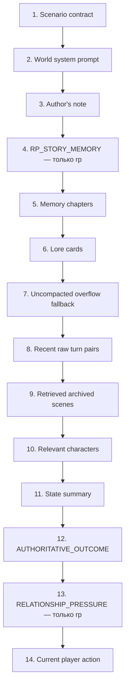

# Память, контекст и retrieval

[← WorldPacks и режимы](04-worldpacks-and-modes.md) · [Главная](README.md) · [Далее: модели →](06-models-and-providers.md)

## Слои памяти

В RP Stack слово «память» обозначает несколько независимых механизмов.

| Слой | Назначение | Для каких режимов | Authority |
|---|---|---|---:|
| Canonical state | Текущие подтверждённые факты и механика | Все | Да |
| Raw turns | Полный первичный диалог и metadata | Все | Нет, но это source history |
| RP story memory | Живой кумулятивный реестр всей истории | Только `rp` | Нет |
| RP relationship causes | Неизменяемые причины, производная полоса и активные пограничные события | Только `rp` | Да, внутри механики отношений |
| Memory chapters | Неизменяемые сжатые эпизоды старых сцен | Все | Нет |
| Lore/retrieval | Выбранные карточки, NPC и архивные сцены | Все | Нет |
| Legacy journal | Итоги прежних версий | Только совместимость | Нет |

Canonical state и `AUTHORITATIVE_OUTCOME` всегда выше любого текста памяти. Raw turns не удаляются после сжатия. Ни story memory, ни chapter не могут превратить попытку игрока или слух в подтверждённый факт.

## RP story memory

`RPStoryMemoryUpdater` поддерживает отдельный bounded snapshot для каждой RP-партии. Это аналог постоянно обновляемого файла-сводки длинной кампании со следующей схемой:

```text
schema_version
canon
rules_and_abilities
inventory_and_assets
characters
active_threads
resolved_threads
unresolved_hooks
current_situation
chronology
```

После каждого RP-хода Gateway ставит job `rp_story_memory`. По умолчанию реальное обновление начинается после четырёх новых ходов; ручная команда «Собрать сейчас» может форсировать неполный пакет. Глобальная service model получает предыдущий snapshot, ограниченный пакет новых подтверждённых turns и компактный excerpt canonical state без `characters.*.secrets`. Она обязана вернуть полный replacement JSON, а не patch.

Каждая удачная версия записывается в `rp_story_memory_snapshots` с `revision`, диапазоном покрытых turn IDs, state version и model. Старые snapshots остаются для аудита; narrator получает только последний. При fork последний snapshot, полностью покрытый checkpoint, копируется в новую campaign identity как revision 1.

Story memory существует **только при `scenario_type == "rp"`**:

- `training` не получает job, snapshot, API-поля, UI-блок, prompt-блок или отдельный token reserve;
- `novel` также продолжает использовать прежние chapters/raw/retrieval без story memory;
- общая таблица SQLite сама по себе не активирует механизм для других режимов.

Ошибка service model fail-open: сохранённый игровой ход не откатывается, предыдущий snapshot продолжает работать, а job повторяется по общей retry policy.

## Эпизодические главы

Когда raw turns перестают помещаться в history budget, `MemorySummarizer` берёт старейший ещё не покрытый пакет и создаёт immutable `memory_chapter`. Глава хранит последовательность сцен, действия игрока, значимые реакции NPC, открытия, предметы, тон, открытые нити, отношения и обязательства.

Следующая глава не переписывает предыдущую. Покрытые raw turns остаются в SQLite, но больше не дублируются в обычном prompt. Пока chapter не создан, ограниченный `UNCOMPACTED_ARCHIVE_FALLBACK` временно удерживает выпавшие ходы в prompt.

Этот механизм не изменён для `training`.

## Бюджет 132k

Общий stack limit остаётся 131072 токена:

```text
PARTY_CONTEXT_MAX_TOKENS                  131072
PARTY_CONTEXT_COMPLETION_RESERVE_TOKENS   16384
PARTY_CONTEXT_SYSTEM_RESERVE_TOKENS       32768
PARTY_CONTEXT_MIN_HISTORY_TOKENS            8192
RP_STORY_MEMORY_RESERVE_TOKENS             10000  # только rp
RP_STORY_MEMORY_PROMPT_MAX_CHARS           24000
PARTY_MEMORY_PROMPT_MAX_CHARS              60000
```

Для `rp` защитный raw-history budget по умолчанию равен:

```text
131072 - 16384 - 32768 - 10000 = 71920 tokens
```

Для `training` и `novel` новый резерв равен нулю, поэтому прежний budget остаётся 81920 tokens. `RP_STORY_MEMORY_PROMPT_MAX_CHARS=24000` — это верхняя граница текста story block, а не постоянная гарантия использования 10k токенов. Фактический блок обычно меньше.

Если полный prompt всё же не помещается, Gateway сначала удаляет/сокращает вторичные динамические слои. Canonical state, `AUTHORITATIVE_OUTCOME` и текущее действие имеют более высокий приоритет, чем story memory.

## Размер контекста service model

Обновление story memory ограничено независимо от narrator:

- предыдущий snapshot — до 24000 символов;
- state excerpt — до 8000 символов;
- пакет новых turns — до 6000 приблизительных input tokens;
- ответ — до 6000 tokens.

Таким образом, настроенное окно локальной Gemma в 32768 tokens достаточно для штатного update. Service model не получает весь 132k prompt narrator и не должна перечитывать всю кампанию на каждом запуске: она сворачивает предыдущий snapshot плюс только новый пакет.

## Порядок RP prompt



Для `training` узел 4 отсутствует, а остальные блоки сохраняют прежний порядок. Текущее действие всегда последнее.

`RELATIONSHIP_PRESSURE` не является памятью или canonical state. Он каждый ход
вычисляется из party-scoped причин, сохранённой производной полосы и активных
пограничных событий. Нарратор видит только имя, словесную полосу и качественное
давление. Ненулевые seed-причины и обычные извлечённые причины отображаются без
ожидания пограничного события; числовое значение, веса, event ID, остаток часов,
идентификаторы сообщника и мишени и внутренний payload в prompt не попадают. Причины, связанные с ходом,
исключённым rollback-механизмом, не участвуют в сумме.

Начальный canonical `characters.*.trust` не переписывается и не превращается в
вторую шкалу: WorldPack `trust_mapping` один раз создаёт derived cause с
`source=seed` и `party_turn=0`. Текущее `trust` не включается в compact
character/relationship retrieval и не показывается Light GUI; для narrator
остаются только словесная полоса и качественное pressure причины или активного
пограничного события.

## Retrieval без embeddings

`search_archived_turns()` использует точные слова, упрощённые stems, символьные 3-граммы и небольшой recency bonus. По умолчанию возвращается до трёх party-scoped сцен и не больше 9000 символов. Lore cards выбираются по keywords/stems или флагу `always_on`. Relevant characters выбираются по упоминанию, общей локации, активным нитям и `Outcome.target`; поле `secrets` в narrator block не передаётся.

Embedding endpoint, vector store и cross-party semantic index не используются. Если понадобится vector retrieval, он должен сохранить обязательный party filter и объяснимость результатов.

## Изоляция и UI

Все memory-запросы используют `state_campaign_id`. Branch получает собственную campaign identity и копию допустимого snapshot на момент fork. Light GUI показывает RP story memory только у RP-партий: revision, покрытие, текущую ситуацию, канон, персонажей и сюжетные линии. Prompt Inspector отдельно показывает её фактическое присутствие и reserve.

## Источники

- [RP story memory service](../../roles/apps/files/rp-stack/rp-gateway/app/services/rp_story_memory.py)
- [Episodic memory service](../../roles/apps/files/rp-stack/rp-gateway/app/services/memory.py)
- [Prompt assembly](../../roles/apps/files/rp-stack/rp-gateway/app/services/narrative.py)
- [StateStore](../../roles/apps/files/rp-stack/rp-gateway/app/services/state_store.py)
- [RP living-memory ADR](../../roles/apps/files/rp-stack/docs/decisions/016-rp-living-story-memory.md)
- [Long-context ADR](../../roles/apps/files/rp-stack/docs/decisions/009-long-context-memory-policy.md)
