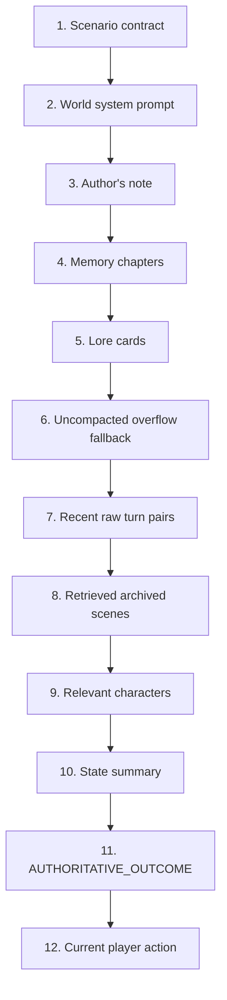

# Память, контекст и retrieval

[← WorldPacks и режимы](04-worldpacks-and-modes.md) · [Главная](README.md) · [Далее: модели →](06-models-and-providers.md)

## Пять разных механизмов

В RP Stack слово «память» не означает одну таблицу или один summary.

| Слой | Назначение | Authority | Хранение/поиск |
|---|---|---:|---|
| Canonical state | Текущие подтверждённые факты и механика | Да | Версионный JSON/SQLite |
| Raw turns | Полный первичный диалог и metadata | Нет, но это source history | SQLite, неизменяемо для review |
| Memory chapters | Сжатые старые эпизоды для narrator | Нет | Immutable party-scoped chapters |
| Legacy journal | Сохранённые итоги прежних версий | Нет | Таблица остаётся совместимой, активная сборка отключена |
| Retrieval | Возвращает релевантные lore/scenes/NPC | Нет | Лексический и структурный поиск |

State не заменяет сюжетную историю, а summary не может подтвердить факт, отсутствующий в state.

## Бюджет контекста

Текущая серверная политика:

```text
PARTY_CONTEXT_MAX_TOKENS                 131072
PARTY_CONTEXT_COMPLETION_RESERVE_TOKENS  16384
PARTY_CONTEXT_SYSTEM_RESERVE_TOKENS      32768
PARTY_CONTEXT_MIN_HISTORY_TOKENS          8192
MEMORY_SUMMARY_BATCH_TOKENS              10000
PARTY_MEMORY_CHAPTER_MAX_TOKENS           6000
PARTY_MEMORY_PROMPT_MAX_CHARS             60000
```

Gateway сначала учитывает меньший из stack limit и известного model context. Затем резервирует место под ответ и system/runtime blocks. Остаток используется для последних полных turn pairs.

Размер оценивается приближённо, поэтому это защитный budget, а не точный tokenizer конкретной модели. Prompt Inspector сохраняет и показывает фактический `prompt_json` последнего нового хода.

## Сборка prompt

Фактический порядок динамических слоёв:



Текущее действие всегда последнее. Это одновременно сохраняет его приоритет и позволяет провайдерам переиспользовать стабильный prefix.

## Эпизодические главы

Когда новые raw turns перестают помещаться в history budget, `MemorySummarizer` берёт старейший ещё не покрытый пакет и просит глобальную служебную модель создать одну хронологическую главу.

Глава сохраняет:

- последовательность сцен;
- действия игрока и значимые реакции NPC;
- открытия, локации, предметы и тон;
- подтверждённые факты;
- unresolved threads;
- изменения отношений;
- обещания игрока и обязательства NPC.

Глава immutable и содержит диапазон turn IDs, state version и model. Следующая глава не переписывает предыдущую.

Raw turns при этом не удаляются из SQLite. Если summary ещё не готов, Gateway может добавить ограниченный `UNCOMPACTED_ARCHIVE` fallback. Он защищает недавнюю непрерывность, но тоже имеет лимит символов; поэтому долговременная полнота обеспечивается durable raw history и последовательным созданием chapters, а не обещанием поместить весь лог в каждый LLM-вызов.

## Retrieval без embeddings

В широком архитектурном смысле RAG есть, но это не semantic vector RAG.

### Архивные сцены

`search_archived_turns()` ищет по точным словам, упрощённым стемам, символьным 3-граммам и небольшому recency bonus. По умолчанию возвращается до трёх сцен и не больше 9000 символов.

### Lore cards

Party lore cards выбираются по keywords/stems и флагу `always_on`. В prompt попадает ограниченное число карточек.

### Relevant characters

NPC выбираются детерминированно по:

- прямому упоминанию в текущем действии;
- общей локации с игроком;
- активным сюжетным нитям;
- `Outcome.target`.

В prompt попадает компактное представление только выбранных NPC и их нужных отношений. Поле `secrets` не передаётся.

### Чего нет

- endpoint `/embeddings`;
- embedding model;
- FAISS, Chroma, Qdrant, pgvector, Milvus;
- vector store в Compose;
- cross-party semantic index.

Это делает retrieval объяснимым и дешёвым, но ухудшает recall для синонимов и сложных перефразировок. Если появится измеримая проблема, безопасное расширение — hybrid lexical + vector с жёстким party filter, а не замена существующего механизма.

## Legacy journal

В schema/store сохраняются `journal_entries`, созданные прежними версиями, но текущий Gateway не публикует journal endpoints и не ставит новые journal jobs. Старый `journal` job завершается как no-op. Для актуального narrator context используются memory chapters, raw history и retrieval; для аудита — raw turns и audit events.

## Изоляция

Все запросы памяти, lore и archive search выполняются через `state_campaign_id`. Checkpoint branch получает собственную campaign identity и копии нужных слоёв на момент fork. Retrieval другой Party или branch запрещён архитектурно.

## Источники

- [Memory service](../../roles/apps/files/rp-stack/rp-gateway/app/services/memory.py)
- [Prompt assembly](../../roles/apps/files/rp-stack/rp-gateway/app/services/narrative.py)
- [Context budget](../../roles/apps/files/rp-stack/rp-gateway/app/services/context_budget.py)
- [Character retrieval](../../roles/apps/files/rp-stack/rp-gateway/app/services/character_retrieval.py)
- [Long-context ADR](../../roles/apps/files/rp-stack/docs/decisions/009-long-context-memory-policy.md)
