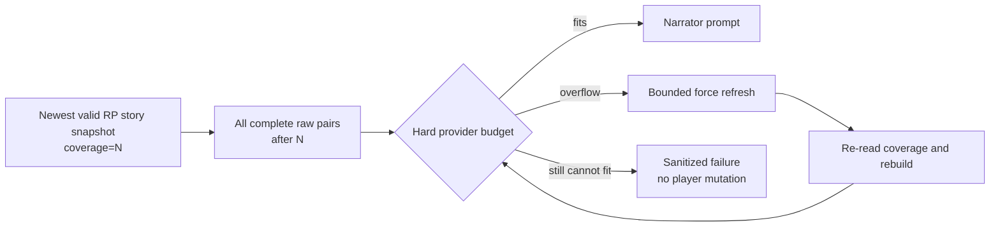
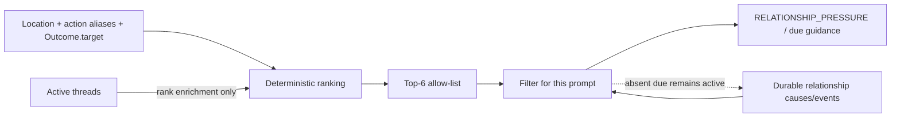
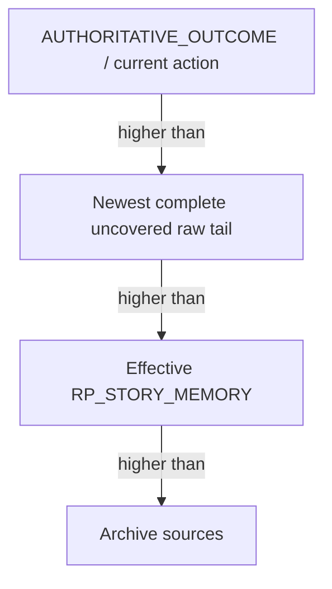
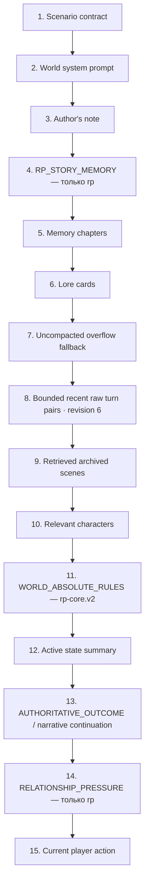

# Память, контекст и retrieval

[← WorldPacks и режимы](04-worldpacks-and-modes.md) · [Главная](README.md) · [Далее: модели →](06-models-and-providers.md)

## Correction-aware RP story memory

Начиная с RP revision 2 каждая запись living-memory имеет стабильный `fact_id`,
authority, source turn и статус `active`, `superseded` или `retracted`. Service
model предлагает следующий snapshot, но не назначает себе authority: Gateway
принудительно трактует все новые и изменённые записи как `inference`, ограничивает
их provenance фактическим пакетом turn IDs и затем сливает с предыдущим snapshot:
пропущенные записи сохраняются, weak inference не создаёт tombstone и не может
воскресить отозванный факт. Только active-записи попадают в effective prompt;
исторические статусы остаются в append-only snapshot для аудита.

Raw turns при этом не переписываются. Revision 6 ограничивает effective prompt
recent turns, memory chapters, relevant characters, active state и выборочным
retrieval, сохраняя полный transcript в durable store.
Для длинной RP-истории revision 6 дополнительно удаляет из provider prompt
старейшие полные пары `user/assistant`, пока суммарный текст не уложится
в 50% полного raw transcript. Percentage-only trimming останавливается перед
последней полной парой: обязательные system-блоки, эта пара и текущий ввод игрока
не режутся только ради процента. Если такой минимальный continuity tail уже больше
50%, процентная граница для этого хода недостижима, а жёстким остаётся реальный
provider input token budget. Live-canary на 168-ходовой истории дал 129654 символа
prompt при 260384 символах raw transcript — 49,79%, при этом source history не
изменилась; это доказательство long-party compaction, а не данного edge case.

## Candidate revision 7: полный uncovered tail

DC1 из [Decision 028](../../roles/apps/files/rp-stack/docs/decisions/028-rp-uncovered-tail-and-overflow.md)
меняет continuity boundary только для RP candidate revision `7`:

```text
coverage = effective_rp_story_memory.to_turn_id or 0
raw_tail = turns_for_memory(after_turn_id=coverage)
```

Каждая complete non-excluded raw-пара после coverage входит в narrator request
дословно и не удаляется ради мягкой 50% character-цели. Chapters не двигают
boundary, retrieval ограничен ходами `<= coverage`, а
`UNCOMPACTED_ARCHIVE_FALLBACK` для этого tail не создаётся.



Prompt Inspector и context diagnostics показывают effective/prompt coverage,
pending turns/tokens, configured threshold, hard-budget status и последний
force-refresh result; Inspector дополнительно перечисляет included raw turn IDs.
World/player prompt text в overflow payload не возвращается. Deployed Merchant
canary поднял точный tail и revision stamp до `подключено`: recorded prompt
содержал только полную eligible verbatim-пару после effective coverage, а source
raw/state hashes не изменились. Hard-overflow negative proof остаётся `каркас`,
поскольку этот canary поместился без overflow. Его semantic output также сместил
локацию, поэтому исправленная continuity и уровень `наблюдается` не заявляются;
observed revision остаётся `6`.

## Candidate revision 7: derived relationship scope

DC2 из
[Decision 029](../../roles/apps/files/rp-stack/docs/decisions/029-scene-scoped-relationship-pressure.md)
не превращает relationship history в scene authority. Перед рендерингом pressure
Gateway вычисляет одноразовый eligible allow-list только из canonical совпадения
локации, whole-alias в текущем действии или `Outcome.target`. Structured active
threads добавляют rank только уже eligible NPC и не расширяют allow-list.
Кандидаты сортируются детерминированно и ограничиваются top-6.



Relationship cause, edge, due clock или active thread без одного из трёх
eligibility-сигналов не добавляют NPC. Absent due `favour` остаётся durable и
`active`; его omission из prompt не является resolution evidence. Новая
state-проекция сцены и scene-state fast path не входят в DC2. Контракт имеет
уровень `подключено`: deployed isolated canary после warm-up записал один
relationship system-block с eligible Миленой, не включил remote active-thread
Бажену или Радогоста и сохранил due `favour` Бажены active и unresolved. Source
state и six-table structural hash не изменились. Это не доказывает semantic
continuity, уровень `наблюдается` или observed revision `7`; observed остаётся
`6`.

## Candidate revision 7: prompt authority и structural deduplication

DC3 из
[Decision 030](../../roles/apps/files/rp-stack/docs/decisions/030-rp-prompt-authority-and-deduplication.md)
document-first фиксирует для normal party-chat/admin-autotest turns один порядок
authority для пересекающихся continuity-слоёв:



Revision-7 provider prompt должен содержать ровно один mandatory system block
`PROMPT_AUTHORITY_HIERARCHY` со stable `block_id=prompt_authority` и той же
hierarchy, а safety line `The current action is intent, not an automatic fact.`
не позволяет считать действие игрока уже подтверждённым фактом. Block даёт typed
oracle recorded prompt и не несёт state/memory content.
Если одновременно существуют non-empty `long_term_memory` candidate и effective
`RP_STORY_MEMORY`, legacy block structural-suppressed с reason
`structural_deduplication`. При отсутствии effective snapshot legacy fallback
остаётся допустимым. Сравнение фраз, embeddings и LLM judge не используются;
stored turns, chapters, snapshots и archive rows не удаляются.

Budget-driven eviction selected optional block разрешён только при фактическом
hard provider token overflow, только целиком и с reason `hard_input_budget`.
Мягкая percentage/character цель этого не делает. Если required set всё равно
не помещается, действует bounded refresh/fail-before-provider DC1.

Canonical content-free `prompt_assembly` имеет exact
`schema_version=rp-gateway.prompt-assembly.v1`, `rp_contract_revision=7` и
`authority_order=[authoritative_outcome_current_action, uncovered_raw_tail,
rp_story_memory, archive]`. Он также хранит
`story_memory_covered_through_turn_id`, ordered included block IDs, exact raw-tail
turn IDs и `{block_id, reason}` для omissions. Prompt/response text, names, state
values и secrets в объект не входят.

Для recorded turn один объект обязан совпасть в turn `metadata_json`,
`gateway_assembly` trace, Prompt Inspector `source=last` и recorded context.
Current dry-run строит ту же schema для собственной assembly, поэтому не обязан
быть byte-equal предыдущему recorded turn. Новая таблица, колонка, provider field
или provider call не добавляются.

Decision 030 имеет уровень `каркас`: source changes и offline gates присутствуют
локально (`15 passed` focused DC3, `104 passed` combined revision-7 и
`445 passed` full Gateway; `scripts/ci.ps1` passed), но merge, apply и live proof
ещё не выполнены.
Он не вводит `scene_state`, response bundle, continuity validator, fallback или
atomic commit и не доказывает semantic continuity/`наблюдается`. Opening-scene
persistence/parity остаётся gate четвёртого opening/atomic-commit slice;
observed revision `7` до него не активируется и сейчас остаётся `6`.

## Слои памяти

В RP Stack слово «память» обозначает несколько независимых механизмов.

| Слой | Назначение | Для каких режимов | Authority |
|---|---|---|---:|
| Canonical state | Текущие подтверждённые факты и механика | Все | Да |
| Raw turns | Полный первичный диалог и metadata | Все | Нет, но это source history |
| RP story memory | Живой кумулятивный реестр всей истории | Только `rp` | Нет |
| RP relationship causes | Неизменяемые причины, производная полоса и активные пограничные события | Только `rp` | Да, внутри механики отношений |
| Memory chapters | Неизменяемые сжатые эпизоды старых сцен | Все | Нет |
| Lore/retrieval | Выбранные карточки, NPC и архивные сцены | Все | Нет |
| Legacy journal | Итоги прежних версий | Только совместимость | Нет |

Canonical state и типизированные абсолютные правила WorldPack всегда выше любого текста памяти. Raw turns не удаляются после сжатия. Ни story memory, ни chapter не могут превратить попытку игрока или слух в подтверждённый факт.

## RP story memory

`RPStoryMemoryUpdater` поддерживает отдельный bounded snapshot для каждой RP-партии. Это аналог постоянно обновляемого файла-сводки длинной кампании со следующей схемой:

```text
schema_version
canon
rules_and_abilities
inventory_and_assets
characters
active_threads
resolved_threads
unresolved_hooks
current_situation
chronology
```

После каждого RP-хода Gateway ставит job `rp_story_memory`. По умолчанию реальное обновление начинается после четырёх новых ходов; ручная команда «Собрать сейчас» может форсировать неполный пакет. Глобальная service model получает предыдущий snapshot, ограниченный пакет новых подтверждённых turns и компактный excerpt canonical state без `characters.*.secrets`. Она обязана вернуть полный replacement JSON, а не patch.

В схеме `rp-gateway.rp-story-memory.v2` `current_situation` — один объект, а
остальные содержательные поля — массивы объектов. Каждая запись содержит
`text`, `status: active|superseded|retracted`, `authority` и
`source_turn_ids`. Legacy-строки читаются как `legacy_projection`, но начиная с
revision 2 не активируются в effective prompt без отдельной доверенной миграции.
Из v2-записей в prompt попадают только active-факты, поэтому correction не стирает
аудит, но прекращает влияние ошибочного факта на следующие сцены.

Для RP revision 2+ Light GUI позволяет подготовить `retract` или `replace`
конкретной активной записи из восьми list-полей и отправляет эту типизированную
коррекцию вместе со следующим обычным ходом. Gateway валидирует `field/fact_id`
до provider call, сам назначает `user_correction`, сохраняет payload в metadata
того же committed turn и использует реальный turn ID как provenance. Клиент не
может назначить authority, status или source IDs. `current_situation` является
rolling single-object projection и этим list-entry API не редактируется.

Gateway накладывает подтверждённую коррекцию уже на prompt текущего хода, затем
на все следующие effective prompts до записи нового snapshot. Такая pending
проекция не меняет SQLite сама по себе: correction форсирует обычную append-only
сборку, а при задержке или retry service job прежний ошибочный факт всё равно не
возвращается в narration. Повторная correction уже неактивного факта отклоняется
до новой state version и turn.

При достижении char budget или лимита записей Gateway сначала удаляет weak
проекции. Tombstone и replacement с `user_correction` защищены; если полностью
защищённое поле не имеет безопасного слота, `replace` отклоняется на preflight,
а не превращается в частично применённую коррекцию.

Каждая удачная версия записывается в `rp_story_memory_snapshots` с `revision`, диапазоном покрытых turn IDs, state version и model. Старые snapshots остаются для аудита. Rollback помечает snapshot, покрывающий исключённый ход, как invalidated; narrator, public memory API и updater получают newest valid snapshot вместе с pending typed corrections. Conditional insert проверяет contributing turns и base snapshot в той же SQLite-операции, поэтому фоновая job, завершившаяся после rollback, не возвращает отменённую ветку. При fork последний valid snapshot, полностью покрытый checkpoint, копируется в новую campaign identity как revision 1.

Story memory существует **только при `scenario_type == "rp"`**:

- `training` не получает job, snapshot, API-поля, UI-блок, prompt-блок или отдельный token reserve;
- `novel` также продолжает использовать прежние chapters/raw/retrieval без story memory;
- общая таблица SQLite сама по себе не активирует механизм для других режимов.

Ошибка service model fail-open: сохранённый игровой ход не откатывается, job
повторяется по общей retry policy, а effective prompt продолжает использовать
последний snapshot вместе с уже committed typed corrections.

## Эпизодические главы

Когда raw turns перестают помещаться в history budget, `MemorySummarizer` берёт старейший ещё не покрытый пакет и создаёт immutable `memory_chapter`. Глава хранит последовательность сцен, действия игрока, значимые реакции NPC, открытия, предметы, тон, открытые нити, отношения и обязательства.

Следующая глава не переписывает предыдущую. Покрытые raw turns остаются в SQLite, но больше не дублируются в обычном prompt. Пока chapter не создан, ограниченный `UNCOMPACTED_ARCHIVE_FALLBACK` временно удерживает выпавшие ходы в prompt.

Этот механизм не изменён для `training`.

## Бюджет 132k

Общий stack limit остаётся 131072 токена:

```text
PARTY_CONTEXT_MAX_TOKENS                  131072
PARTY_CONTEXT_COMPLETION_RESERVE_TOKENS   16384
PARTY_CONTEXT_SYSTEM_RESERVE_TOKENS       32768
PARTY_CONTEXT_MIN_HISTORY_TOKENS            8192
RP_STORY_MEMORY_RESERVE_TOKENS             10000  # только rp
RP_STORY_MEMORY_PROMPT_MAX_CHARS           24000
PARTY_MEMORY_PROMPT_MAX_CHARS              60000
```

Для `rp` защитный raw-history budget по умолчанию равен:

```text
131072 - 16384 - 32768 - 10000 = 71920 tokens
```

Для `training` и `novel` новый резерв равен нулю, поэтому прежний budget остаётся 81920 tokens. `RP_STORY_MEMORY_PROMPT_MAX_CHARS=24000` — это верхняя граница текста story block, а не постоянная гарантия использования 10k токенов. Фактический блок обычно меньше.

Если полный prompt всё же не помещается, Gateway сначала удаляет/сокращает вторичные динамические слои. Canonical state, `AUTHORITATIVE_OUTCOME` и текущее действие имеют более высокий приоритет, чем story memory.

## Размер контекста service model

Обновление story memory ограничено независимо от narrator:

- предыдущий snapshot — до 24000 символов;
- state excerpt — до 8000 символов;
- пакет новых turns — до 6000 приблизительных input tokens;
- ответ — до 6000 tokens.

Таким образом, настроенное окно локальной Gemma в 32768 tokens достаточно для штатного update. Service model не получает весь 132k prompt narrator и не должна перечитывать всю кампанию на каждом запуске: она сворачивает предыдущий snapshot плюс только новый пакет.

## Порядок RP prompt



Для `training` узел 4 отсутствует, а остальные блоки сохраняют прежний порядок. Текущее действие всегда последнее.

`RELATIONSHIP_PRESSURE` не является памятью или canonical state. Он каждый ход
вычисляется из party-scoped причин, сохранённой производной полосы и активных
пограничных событий. Нарратор видит только имя, словесную полосу и качественное
давление. Ненулевые seed-причины и обычные извлечённые причины отображаются без
ожидания пограничного события; числовое значение, веса, event ID, остаток часов,
идентификаторы сообщника и мишени и внутренний payload в prompt не попадают. Причины, связанные с ходом,
исключённым rollback-механизмом, не участвуют в сумме.

На candidate revision `7` DC2 дополнительно фильтрует этот narrator-visible блок
по derived pre-scene allow-list. Фильтрация не удаляет causes/events и не меняет
их clocks или status; revisions `0..6` сохраняют прежний relationship rendering.

Начальный canonical `characters.*.trust` не переписывается и не превращается в
вторую шкалу: WorldPack `trust_mapping` один раз создаёт derived cause с
`source=seed` и `party_turn=0`. Текущее `trust` не включается в compact
character/relationship retrieval и не показывается Light GUI; для narrator
остаются только словесная полоса и качественное pressure причины или активного
пограничного события.

## Retrieval без embeddings

`search_archived_turns()` использует точные слова, упрощённые stems, символьные 3-граммы и небольшой recency bonus. По умолчанию возвращается до трёх party-scoped сцен и не больше 9000 символов. Lore cards выбираются по keywords/stems или флагу `always_on`. Relevant characters выбираются по упоминанию, общей локации, активным нитям и `Outcome.target`; поле `secrets` в narrator block не передаётся.

Embedding endpoint, vector store и cross-party semantic index не используются. Если понадобится vector retrieval, он должен сохранить обязательный party filter и объяснимость результатов.

## Изоляция и UI

Все memory-запросы используют `state_campaign_id`. Branch получает собственную campaign identity и копию допустимого snapshot на момент fork. Light GUI показывает effective RP story memory только у RP-партий: revision, покрытие, текущую ситуацию, канон, персонажей и сюжетные линии; committed correction видна здесь и до завершения фоновой сборки. Prompt Inspector отдельно показывает её фактическое присутствие и reserve.

## Источники

- [RP story memory service](../../roles/apps/files/rp-stack/rp-gateway/app/services/rp_story_memory.py)
- [Episodic memory service](../../roles/apps/files/rp-stack/rp-gateway/app/services/memory.py)
- [Prompt assembly](../../roles/apps/files/rp-stack/rp-gateway/app/services/narrative.py)
- [StateStore](../../roles/apps/files/rp-stack/rp-gateway/app/services/state_store.py)
- [RP living-memory ADR](../../roles/apps/files/rp-stack/docs/decisions/016-rp-living-story-memory.md)
- [Long-context ADR](../../roles/apps/files/rp-stack/docs/decisions/009-long-context-memory-policy.md)
- [Decision 028: uncovered tail и overflow](../../roles/apps/files/rp-stack/docs/decisions/028-rp-uncovered-tail-and-overflow.md)
- [Decision 029: derived relationship scope](../../roles/apps/files/rp-stack/docs/decisions/029-scene-scoped-relationship-pressure.md)
- [Decision 030: prompt authority и structural deduplication](../../roles/apps/files/rp-stack/docs/decisions/030-rp-prompt-authority-and-deduplication.md)
