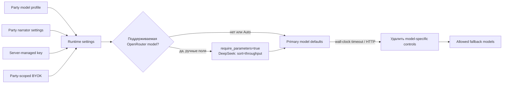
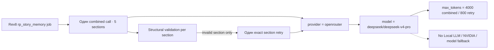
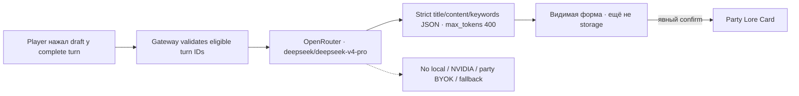
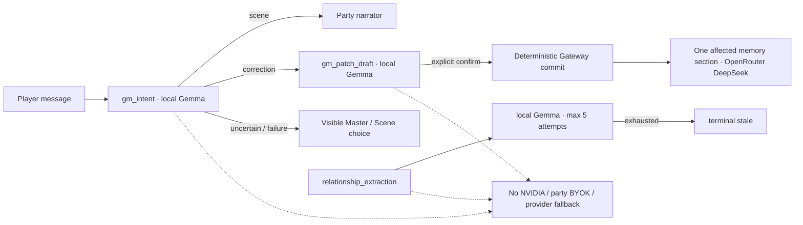

# Модели и провайдеры

[← Память и retrieval](05-memory-and-retrieval.md) · [Главная](README.md) · [Далее: обучение и датасеты →](07-training-autotests-datasets.md)

## Три роли моделей

| Роль | Scope | Для чего |
|---|---|---|
| Narrator model | Одна Party | Opening scene, обычные GM-ответы и repair |
| Служебная модель | Весь RP Stack | Long-term memory, world-state drafts, генерация персонажей |
| Auto-player model | Один LLM-autotest run | Генерирует действия тестового игрока по видимому transcript |

Эти роли нельзя молча смешивать. Модель партии не становится служебной, а party BYOK не используется глобальными service jobs.

## Провайдеры narrator

Gateway поддерживает OpenAI-compatible вызовы к:

- Gemini OpenAI compatibility API;
- OpenRouter;
- локальному llama.cpp endpoint.

Каталоги имеют статический fallback и могут обновляться live. UI сначала группирует provider, затем модели; OpenRouter дополнительно показывает curated RP top, free markers, цены из каталога и семейства вроде Claude, Gemini/Gemma, DeepSeek, Qwen, Llama и Mistral.

OpenRouter-варианты с суффиксом `:batch` не включаются в narrator picker и список моделей auto-player: пакетный режим не подходит для интерактивного хода. Уже сохранённая ссылка Party на такой профиль не удаляется автоматически, чтобы не нарушать целостность существующих данных.

Выведенные provider/model/log rows не переписываются. Поэтому историческая
Party может по-прежнему показывать прежний provider и model ID, но такой профиль
скрыт из активного каталога и блокирует activate/start/message до явного выбора
поддерживаемой модели. Новый запрос никогда не использует его как endpoint,
fallback или retry target.

Для обычного narrator picker Gateway скрывает модели с известным context меньше `131072`. Локальная Gemma имеет рабочее окно `32768`, поэтому не предлагается как narrator длинной партии. Она остаётся доступна для bounded auto-player и служебных задач.

## Модель партии

Model profile хранит provider, base URL, model ID, параметры, context metadata и источник ключа. При каждом ходе Gateway строит runtime settings именно выбранной Party.



Fallback не должен перескочить на другого provider с другим ключом. Ошибка и выбранная попытка попадают в audit/turn metadata.

### Ручные параметры narrator в Light GUI

На 15 августа 2026 года Gateway разрешает ручные параметры только для трёх
точных OpenRouter model ID. В интерфейсе «Авто» всегда означает отсутствие поля в
provider payload.

| Model ID | Глубина рассуждений | Temperature | Top P | Бюджет ответа |
|---|---|---|---|---|
| `openai/gpt-5.6-luna` | выкл., low, medium, high, xhigh, max; default medium | нет | нет | Auto, 1024–16384 из списка |
| `openai/gpt-5.6-luna-pro` | выкл., low, medium, high, xhigh, max; default medium | нет | нет | Auto, 1024–16384 из списка |
| `deepseek/deepseek-v4-flash` | выкл., high, xhigh; default high | `0..2` | `0..1` | Auto, 1024–16384 из списка |

`max` здесь — уровень reasoning для Luna, а не отдельный суффикс model ID.
Выбранный уровень передаётся как OpenRouter `reasoning`; при включённом reasoning
Gateway добавляет `exclude=true`, поэтому внутренний reasoning не попадает в
видимую реплику. `none` выключает reasoning. Бюджет — общий `max_tokens` для
рассуждения и итогового текста. Для DeepSeek рекомендуется менять temperature или
Top P по отдельности, хотя Gateway сознательно не запрещает их совместное
использование.

При любом непустом наборе ручных полей Gateway добавляет OpenRouter
`provider.require_parameters=true`, чтобы endpoint поддерживал переданные
параметры. Для `deepseek/deepseek-v4-flash` сохраняется
`provider.sort=throughput`: endpoint выбирается по скорости, а не стандартному
price-first порядку. При `403` (включая model-specific moderation), `410` и
временных provider-ошибках партия пробует настроенный fallback того же провайдера;
IaC default для OpenRouter — `openrouter/auto`. Перед fallback ручные параметры
primary model удаляются, поэтому несовместимый маршрут не получает их случайно.

`MODEL_ATTEMPT_TIMEOUT_SECONDS=150` является wall-clock deadline одной попытки narrator для обычного хода: он включает получение полного non-streaming ответа. Opening scene использует отдельный `PARTY_START_MODEL_ATTEMPT_TIMEOUT_SECONDS=300`, чтобы большой стартовый prompt, в том числе импортированный из Markdown, успевал завершиться. Для repair используется компактный prompt без повторной истории и memory; сохранённые параметры primary narrator и DeepSeek throughput policy остаются теми же. Таймаут opening scene становится HTTP `504` и terminal `failed` в `turn_requests`.

## Глобальная служебная модель

Администратор выбирает одну модель для всех текущих и будущих партий. Default в IaC — `local-gemma`.

Доступные типы:

- локальная Gemma через internal llama.cpp/Vulkan;
- десять недорогих OpenRouter service profiles из статического каталога.

Служебные задачи используют только stack-managed credentials. Пользовательский BYOK не передаётся им даже тогда, когда задача возникла внутри пользовательской Party.

### Текущие вызовы

| Функция | Модель |
|---|---|
| Opening scene | Narrator Party |
| Обычный GM-ответ | Narrator Party |
| Repair невалидного narration | Narrator Party |
| Journal summary | Не вызывается текущим runtime; сохранён только legacy storage/no-op job |
| Long-term memory chapter | Глобальная service model |
| RP living story-memory update | Revisions 0..7: глобальная service model; rev8+: один combined OpenRouter call и exact section retry только после structural failure; rev9 correction вызывает одну affected section |
| RP rev8 Lore Card draft из выбранных ходов | Exact OpenRouter `deepseek/deepseek-v4-pro`; один call, без fallback и без auto-save |
| RP rev9 GM intent / patch draft | Exact local Gemma; `2000/100` и `4000/300` input chars/output tokens, без fallback |
| RP relationship extraction | Revisions 0..8: глобальная service model; rev9: exact local Gemma, только `scenario_type=rp` |
| RP rev10 world-clock elapsed | Exact local Gemma; только последняя записанная пара, `4000/50`, strict elapsed JSON, без fallback |
| LLM world-state draft | Глобальная service model |
| Генерация/дополнение NPC | Глобальная service model |
| Intent parsing и context estimation | Без LLM |
| RuleEngine и scoring | Без LLM |
| OutputValidator | Без LLM |
| Auto-player | Отдельно выбранный OpenRouter или Local Gemma profile |

### Revision 8: sectioned story memory

[Decision 032](../../roles/apps/files/rp-stack/docs/decisions/032-rp-history-first-prompt-and-sectioned-memory.md)
вводит для rev8 memory явный маршрут, который не наследует `LLM_PROVIDER`,
глобальный `SERVICE_MODEL_CHOICE` или party BYOK:



Основной call возвращает все пять секций и пишет `section_key=all`. Gateway
проверяет наличие/JSON/schema/fact IDs и отклоняет любой ответ с
`finish_reason=length`. Только не прошедшая section получает отдельный call с
exact `section_key`; валидные, включая пустые, не повторяются. Каждый call
содержит не более 20 000 символов serialized messages и только complete playable
units. `service_call_log` сохраняет exact `provider`, `model`, `section_key` и
общий `update_id`. Partial failure не отменяет четыре удачные секции. Максимум
durable attempts именно у rev8 `rp_story_memory` job равен `2`; общий
`SERVICE_JOB_MAX_ATTEMPTS=5` сохраняется для relationship extraction и legacy
jobs.

Route реализован и применён как код. Activation и stamp-party подтвердили
effective revision `8` у новой партии `merchant-sviatoslav`; model calls в stamp
не выполнялись, а live gates 25/60 отложены до полной реализации, поэтому
registry status — `каркас`.

### Revision 8: Lore Card draft

[Decision 037](../../roles/apps/files/rp-stack/docs/decisions/037-rp-authored-lore-cards-and-confirmed-drafts.md)
задаёт отдельный exact route, не связанный с выбранной narrator или глобальной
local service profile:



Exact serialized messages ограничены 8 000 символами и содержат только
выбранные complete playable units. Один attempt записывается в
`service_call_log` с role `lore_card_draft`, provider `openrouter`, exact model,
redacted prompt и raw response/error. Stack-managed OpenRouter key не заменяется
party BYOK. `finish_reason=length`, transport error или schema failure возвращают
видимую ошибку и не создают Lore Card.

### Revision 9: GM и relationship routes

[Decision 038](../../roles/apps/files/rp-stack/docs/decisions/038-rp-gm-corrections-and-player-overlay.md)
не использует глобальный `SERVICE_MODEL_CHOICE` для трёх узких rev9 roles:



`local_service_model_settings` явно фиксирует provider/base URL/model и пустой
fallback list. `gm_intent` превращает любой transport/schema/length failure в
read-only `uncertain`; он не пробует cloud provider. Draft failure виден игроку
и не создаёт artifact. Relationship failure не блокирует игровой commit: durable
job повторяется до пяти раз и затем остаётся `stale` для оператора.

Memory absorption остаётся отдельным exact OpenRouter route с stack-managed key,
двумя attempts и `section_key` затронутой секции. Обычный rev8+ path по-прежнему
делает один combined call и повторяет только структурно невалидную секцию;
валидная пустая секция не является поводом для retry.

### Revision 10: world-clock route

[Decision 039](../../roles/apps/files/rp-stack/docs/decisions/039-rp-world-clock-and-authored-events.md)
фиксирует role `world_clock_elapsed` на отдельных local settings из
`LOCAL_LLM_BASE_URL` и local model alias. Она не читает global service choice,
`LLM_PROVIDER`, party narrator/BYOK или fallback list и всегда пишет
`provider=local` в `service_call_log`.

Serialized messages ограничены 4 000 символов и содержат только instruction и
player+narrator text одного уже committed turn. Output limit — 50 tokens;
strict JSON допускает только ISO-8601 `elapsed`. События, условия, markers и
последствия модель не видит и не создаёт: после ответа их применяет Gateway из
WorldPack.

Jobs идут строго по party turn, но gameplay не ждёт их. После terminal retry
Gateway применяет `PT0S` с `reason=service_unavailable`; пропущенное время не
догоняется, provider не меняется и NVIDIA не является retry-целью.

## Диагностика model attempts

Turn Trace Workbench сохраняет фактическую, а не реконструированную историю
вызовов. Каждая narrator-попытка, включая fallback/repair и ошибку без committed
turn, попадает в `turn_trace_events` с exact redacted request/response,
provider/model, attempt, latency, HTTP status, usage и безопасной ошибкой.

Служебные completions продолжают храниться в одном `service_call_log`. К нему
additive добавлены `request_id`, `party_turn`, `provider`, `model`, `attempt`,
`latency_ms`, `http_status`, `usage_json`, `error_json` и
`trace_schema_version`; legacy-строки с `null` остаются читаемыми. Диагностическая
копия редактирует секреты, не изменяя фактический payload, отправленный provider.
Статус завершённого service-вызова подтверждает транспортный ответ модели, но не
доменное применение результата: для relationship extraction его нужно сверять с
соседним audit `relationship_extraction_applied` или
`relationship_extraction_rejected` и последующими проекциями.
Для локальной Gemma Gateway дополнительно передаёт provider-level JSON Schema с
единственным корневым ключом `events` и точными полями события. Это предотвращает
неподдерживаемые alias-поля на этапе генерации; семантические проверки evidence и
атрибуции по-прежнему выполняет Gateway.

Оба источника связывает request-centric read model Gateway. Он доступен только
admin/operator через Light GUI, не отдаётся обычному владельцу партии или
Showroom и никогда не участвует в выборе модели, fallback policy, prompt
assembly или state commit. Retention по умолчанию unlimited:
`SERVICE_CALL_LOG_RETENTION_DAYS=0`; IaC рендерит его из
`rp_stack_gateway_service_call_log_retention_days`, а положительное значение из
`/etc/ansible/local-overrides.yml` явно включает очистку service log.

## Локальная Gemma

Текущая конфигурация:

```text
Model alias: gemma-4-26b-a4b-it-rp-q4
Runner: llama.cpp server, pinned Vulkan image
Device: /dev/dri/renderD128
GPU layers: 99
Context: 32768
Reasoning: off
Parallel slots: 1
Cloud fallback: none inside local profile
```

Модель и runner доступны только Gateway. Local profile никогда не переключается
на cloud fallback. Если сохранённый глобальный выбор указывает на local model, но
runner отключён конфигурацией или недоступен, служебная задача завершается на
local route и следует обычной retry/error policy без смены provider. OpenRouter
используется только когда администратор явно выбрал OpenRouter service profile;
party BYOK для него всё равно не используется. Выведенная или неизвестная
сохранённая service choice показывается как недоступная и не подменяется другой
моделью.

Окна 32768 tokens достаточно для legacy RP story-memory updater revisions
`0..7`: предыдущий snapshot ограничен 24000 символов, state excerpt — 8000
символов, новый turn batch — примерно 6000 input tokens, output — 6000 tokens.
Candidate rev8 memory calls этот local profile не используют: они закреплены
за exact OpenRouter route выше. Полный narrator prompt на 132k в Gemma не
передаётся ни в одном случае.

Основной объём GGUF может отражаться как mmap/GPU/UMA memory, поэтому `docker stats` не показывает всю фактическую нагрузку в RSS контейнера.

## Provider keys

Есть два контура:

1. **Server-managed secrets** в `/etc/ansible/local-overrides.yml` и сгенерированном runtime `.env` — для system/default и служебных вызовов.
2. **Party BYOK** в Gateway DB — один пользователь, одна Party, один provider/default key.

Outbound policy не отправляет browser Authorization в локальную Gemma. Для cloud provider Gateway формирует Bearer header из server key или разрешённого party key.

## Prompt caching

Стабильный prefix начинается с scenario/world rules, затем растёт transcript. Для
rev8 начало RAW window квантуется по восемь units, а изменчивые
`RP_STORY_MEMORY`, lore cards, corrections, relationship/world-event pressure,
author note и current action идут после истории. Повторяемая основа — rules и
первые 50 RAW units; окно между сдвигами растёт до 57.

Для OpenRouter Gateway может передавать `session_id`; для Anthropic-моделей
добавляется документированный ephemeral `cache_control`. S16 не добавляет новых
cache calls, headers или settings: DeepSeek и OpenAI полагаются на неявное exact
prefix matching. Rev8 копирует provider `usage.prompt_tokens` и
`usage.prompt_tokens_details.cached_tokens` в turn metadata как `prompt_tokens`
и `cached_prompt_tokens`, рядом сохраняется `stable_prompt_prefix_hash`. Cache
telemetry считается наблюдением provider, а не гарантией.

Gateway сохраняет из live-каталога OpenRouter цены обычного input/output, cache read и cache write. Light GUI показывает абсолютный ценовой уровень по опорному ходу: 95 000 входных и 650 выходных токенов. Для warm-оценки принимается 80% cached input, но только если каталог модели объявил цену cache read; рядом всегда показывается cold-оценка без скидки.

В селекторе OpenRouter рядом со значком уровня выводится сама оценка хода, например `[$ · ≈$0.017 warm]`. `warm` означает расчёт с 80% cached input; без объявленной cache-read цены показывается cold-оценка без этой пометки. Полная разбивка остаётся в карточке выбранной модели.

Границы значков: `$` — до $0.02 за опорный ход, `$$` — до $0.05, `$$$` — до $0.10, `$$$$` — до $0.25, `$$$$$` — выше $0.25. Это оценка по текущему каталогу, а не счёт: фактическая стоимость зависит от выбранного OpenRouter endpoint и реального cache hit, поэтому provider telemetry остаётся источником истины.

## Что требует актуализации

Списки моделей, цены, доступность и context windows — изменчивые данные. Source-каталоги в репозитории являются конфигурацией/подсказкой, но перед выбором модели или арендой GPU их нужно перепроверять у provider.

## Источники

- [Service models](../../roles/apps/files/rp-stack/rp-gateway/app/services/service_models.py)
- [Model catalog](../../roles/apps/files/rp-stack/rp-gateway/app/services/provider_catalog.py)
- [Provider auth](../../roles/apps/files/rp-stack/rp-gateway/app/services/provider_auth.py)
- [Narrative client](../../roles/apps/files/rp-stack/rp-gateway/app/services/narrative.py)
- [Service model client](../../roles/apps/files/rp-stack/rp-gateway/app/services/service_model_client.py)
- [Turn Trace Workbench](../../roles/apps/files/rp-stack/docs/decisions/027-turn-trace-workbench.md)
- [Decision 032: explicit rev8 memory routing](../../roles/apps/files/rp-stack/docs/decisions/032-rp-history-first-prompt-and-sectioned-memory.md)
- [Local LLM Compose](../../roles/apps/templates/rp-stack.compose.yml.j2)
- [Runtime variables](../../inventories/local/group_vars/server.yml)
