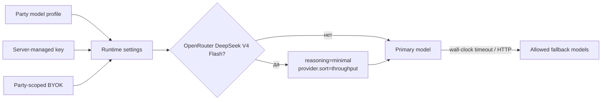

# Модели и провайдеры

[← Память и retrieval](05-memory-and-retrieval.md) · [Главная](README.md) · [Далее: обучение и датасеты →](07-training-autotests-datasets.md)

## Три роли моделей

| Роль | Scope | Для чего |
|---|---|---|
| Narrator model | Одна Party | Opening scene, обычные GM-ответы и repair |
| Служебная модель | Весь RP Stack | Long-term memory, world-state drafts, генерация персонажей |
| Auto-player model | Один LLM-autotest run | Генерирует действия тестового игрока по видимому transcript |

Эти роли нельзя молча смешивать. Модель партии не становится служебной, а party BYOK не используется глобальными service jobs.

## Провайдеры narrator

Gateway поддерживает OpenAI-compatible вызовы к:

- NVIDIA API;
- Gemini OpenAI compatibility API;
- OpenRouter;
- локальному llama.cpp endpoint.

Каталоги имеют статический fallback и могут обновляться live. UI сначала группирует provider, затем модели; OpenRouter дополнительно показывает curated RP top, free markers, цены из каталога и семейства вроде Claude, Gemini/Gemma, DeepSeek, Qwen, Llama и Mistral.

Для обычного narrator picker Gateway скрывает модели с известным context меньше `131072`. Локальная Gemma имеет рабочее окно `32768`, поэтому не предлагается как narrator длинной партии. Она остаётся доступна для bounded auto-player и служебных задач.

## Модель партии

Model profile хранит provider, base URL, model ID, параметры, context metadata и источник ключа. При каждом ходе Gateway строит runtime settings именно выбранной Party.



Fallback не должен перескочить на другого provider с другим ключом. Ошибка и выбранная попытка попадают в audit/turn metadata.

Для `deepseek/deepseek-v4-flash` через OpenRouter Gateway явно отправляет `reasoning.effort=minimal` и требует endpoint, поддерживающий параметры запроса. Ограничение `max_tokens` автоматически не добавляется. Provider routing сортируется по `throughput`, поэтому выбор endpoint оптимизируется по скорости генерации, а не по стандартному price-first порядку OpenRouter.

`MODEL_ATTEMPT_TIMEOUT_SECONDS=75` является wall-clock deadline одной попытки narrator для обычного хода: он включает получение полного non-streaming ответа. Opening scene использует отдельный `PARTY_START_MODEL_ATTEMPT_TIMEOUT_SECONDS=300`, чтобы большой стартовый prompt, в том числе импортированный из Markdown, успевал завершиться. Для repair используется компактный prompt без повторной истории и memory; на DeepSeek V4 Flash сохраняется тот же `minimal` reasoning. Таймаут opening scene становится HTTP `504` и terminal `failed` в `turn_requests`.

## Глобальная служебная модель

Администратор выбирает одну модель для всех текущих и будущих партий. Default в IaC — `local-gemma`.

Доступные типы:

- локальная Gemma через internal llama.cpp/Vulkan;
- десять недорогих OpenRouter service profiles из статического каталога.

Служебные задачи используют только stack-managed credentials. Пользовательский BYOK не передаётся им даже тогда, когда задача возникла внутри пользовательской Party.

### Текущие вызовы

| Функция | Модель |
|---|---|
| Opening scene | Narrator Party |
| Обычный GM-ответ | Narrator Party |
| Repair невалидного narration | Narrator Party |
| Journal summary | Не вызывается текущим runtime; сохранён только legacy storage/no-op job |
| Long-term memory chapter | Глобальная service model |
| RP living story-memory update | Глобальная service model, только `scenario_type=rp` |
| LLM world-state draft | Глобальная service model |
| Генерация/дополнение NPC | Глобальная service model |
| Intent parsing и context estimation | Без LLM |
| RuleEngine и scoring | Без LLM |
| OutputValidator | Без LLM |
| Auto-player | Отдельно выбранный OpenRouter или Local Gemma profile |

## Локальная Gemma

Текущая конфигурация:

```text
Model alias: gemma-4-26b-a4b-it-rp-q4
Runner: llama.cpp server, pinned Vulkan image
Device: /dev/dri/renderD128
GPU layers: 99
Context: 32768
Reasoning: off
Parallel slots: 1
Cloud fallback: none inside local profile
```

Модель и runner доступны только Gateway. Пока local runner доступен, local profile не переключается на cloud fallback. Если сохранённый глобальный выбор указывает на local model, но runner затем отключён конфигурацией, service runtime имеет отдельный stack-managed NVIDIA fallback для сохранения работоспособности; party BYOK для него всё равно не используется.

Окна 32768 tokens достаточно для RP story-memory updater: предыдущий snapshot ограничен 24000 символов, state excerpt — 8000 символов, новый turn batch — примерно 6000 input tokens, output — 6000 tokens. Это отдельный служебный запрос; полный narrator prompt на 132k в Gemma не передаётся.

Основной объём GGUF может отражаться как mmap/GPU/UMA memory, поэтому `docker stats` не показывает всю фактическую нагрузку в RSS контейнера.

## Provider keys

Есть два контура:

1. **Server-managed secrets** в `/etc/ansible/local-overrides.yml` и сгенерированном runtime `.env` — для system/default и служебных вызовов.
2. **Party BYOK** в Gateway DB — один пользователь, одна Party, один provider/default key.

Outbound policy не отправляет browser Authorization в локальную Gemma. Для cloud provider Gateway формирует Bearer header из server key или разрешённого party key.

## Prompt caching

Стабильный prefix начинается с scenario/world rules, затем растёт transcript. Для OpenRouter Gateway может передавать `session_id`; для Anthropic-моделей добавляется документированный ephemeral `cache_control`. Cache telemetry считается наблюдением provider, а не гарантией.

## Что требует актуализации

Списки моделей, цены, доступность и context windows — изменчивые данные. Source-каталоги в репозитории являются конфигурацией/подсказкой, но перед выбором модели или арендой GPU их нужно перепроверять у provider.

## Источники

- [Service models](../../roles/apps/files/rp-stack/rp-gateway/app/services/service_models.py)
- [Model catalog](../../roles/apps/files/rp-stack/rp-gateway/app/services/nvidia_catalog.py)
- [Provider auth](../../roles/apps/files/rp-stack/rp-gateway/app/services/provider_auth.py)
- [Local LLM Compose](../../roles/apps/templates/rp-stack.compose.yml.j2)
- [Runtime variables](../../inventories/local/group_vars/server.yml)
