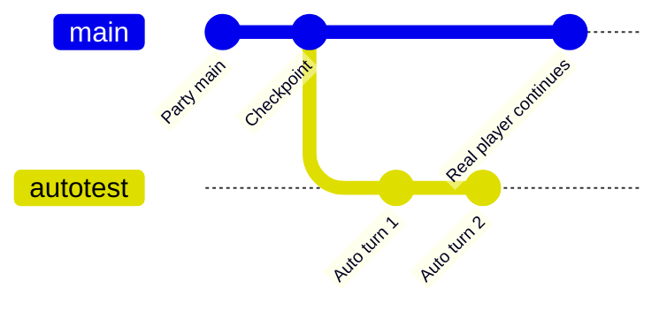

# Обучение, автотесты и датасеты

[← Модели и провайдеры](06-models-and-providers.md) · [Главная](README.md) · [Далее: данные и безопасность →](08-data-and-security.md)

## Training — это runtime-контракт

Training WorldPack не является обычным RP-миром с добавленным вопросником. Он описывает детерминированную учебную программу:

- фиксированное число decision surfaces;
- одно явное действие игрока на ход;
- `training/program.json` с authored schedule, surface validation, debrief и fallback;
- `training/assessment.json` с наблюдаемыми detectors, effects и aggregates;
- наблюдаемые score fields в canonical state;
- output templates и validators;
- точку debrief, до которой запрещены hints, correctness и remediation.

Gateway не бросает dice и не делегирует LLM решение
«правильно/неправильно». Модель заново оформляет только активную сцену, а
универсальный `TrainingRuntimeService` интерпретирует program/assessment
WorldPack и обновляет state. Предметные слова, веса и fallback не находятся в
Gateway.

```mermaid
flowchart LR
    Pack["WorldPack runtime snapshot"] --> Surface["Active surface N"]
    Surface --> LLM["One narrator call"]
    LLM --> Valid["WorldPack validation or fallback"]
    Valid --> Action["Явное действие игрока"]
    Action --> Rules["Generic detectors + authored rules"]
    Rules --> Score["Canonical score/evidence"]
    Score --> Next["Surface N+1"]
    Next -->|"final gate"| Debrief["Debrief из state"]
```



Для интерактивного surface путь расширяется без второго LLM-вызова: narrator возвращает письмо и разрешённые текстовые slots сайта одним bundle, Gateway создаёт snapshot, а `opened` / `submitted` / `reported` становятся типизированным evidence следующего хода. Отправка непустой формы считается `fail` только там, где это задаёт authored policy конкретной surface; содержимое полей не проверяется и не сохраняется.

Runtime-контракт хешируется и сохраняется на party. Branch копирует тот же
snapshot. Обновление файлов мира не переписывает активное обучение. На каждом
ходе prompt содержит только текущую surface, профиль игрока, разрешённый
visible state и включённые interaction contracts; score, future turns и
assessment появляются только в отдельном debrief.

Границы формата тоже принадлежат WorldPack: активный prompt получает точные
`header` и `question`, но не fallback. На обычном ходу модель возвращает только
видимый текст; при включённом interaction contract — один JSON object с полным
текстом в `narrative_text`. Одна provider-added Markdown fence нормализуется
Gateway до строгой schema validation; malformed или multiple bundles уходят в
authored fallback без второго LLM-вызова.

Live acceptance на `awareness-one-day` подтвердил полный путь: authored ход создал письмо и `corporate-sso` snapshot, Showroom открыл credential-form, Gateway принял `link_opened`, `credentials_submitted` и `site_closed`, а следующий ход атомарно пометил события consumed и добавил UI-evidence в canonical scoring. В тестовом fail-пути увеличились `credential-exposure`, `suspicious-artifacts-opened` и `unsafe-actions`; решение принял RuleEngine, не narrator.

В `awareness-one-day` итоговая модель оценки разделена на безопасность, ролевую уместность и деловую коммуникацию. Основание начисления сохраняется по конкретному ходу, а итоговые категории сверяются с canonical state, чтобы narrator не мог придумать красивое, но ложное объяснение баллов.

В authored расписании `awareness-one-day` сайты появляются только на ходах 4,
6 и 9. Ходы 4 и 9 рискованные, ход 6 легитимный; остальные семь сообщений
явно содержат `Ссылки: нет`. Одинаковое UI-affordance не раскрывает
правильность решения, а отключённая links capability использует тот же
WorldPack-authored no-link fallback.

Недельный `awareness` сохраняет прежний `player.resources.awareness-score` и
legacy compatibility resolver до отдельной миграции его программы. Сайты
появляются на ходах 1, 3, 5, 7, 8 и 9. Новую предметную логику в legacy-ветку
не добавляют: новые и мигрированные курсы используют `training_runtime`.

## Showroom и результат

WorldPack сам связывает публичный результат с numeric state path через `manifest.showroom_result`. Showroom scenario может включить leaderboard, но не выбирает, откуда взять score. Это сохраняет ownership оценки у authored training world.

Corporate portal — только presentational snapshot. Он не содержит schedule, rubric или скрытые ответы.

### Capability dimensions

Каждый Showroom run содержит обе training-only dimensions; leaderboard,
autotest, dataset и analytics consumers должны сохранять их как dimensions:

```json
{
  "interactive_links_enabled": true,
  "interactive_workspace_enabled": false
}
```

Результаты разных комбинаций нельзя молча смешивать: рабочий диск может давать
подсказки и менять сложность. Для фишингового файла public snapshot не содержит
классификацию; server-only policy превращает `file_opened` в score-once evidence.
Поздний `file_reported` добавляет новый факт, но не удаляет уже совершённое
небезопасное открытие. Typed workspace events уже поступают в RuleEngine;
downstream-отчёты не должны смешивать разные комбинации флагов.

## LLM-vs-LLM autotests

Администратор может запустить до 30 автоматических player turns. Auto-player выбирается независимо от narrator и поддерживает OpenRouter или Local Gemma.

### Изоляция через checkpoint branch



Фактически это не Git branch, а Gateway branch с собственной `state_campaign_id`.

Run:

1. создаёт checkpoint текущего head;
2. копирует state, training runtime snapshot, видимый turn prefix, checks, memory, journal и lore;
3. назначает branch-local IDs;
4. пишет новые ходы только в branch;
5. оставляет source Party доступной и неизменной;
6. показывает branch в read-only checkpoint tools, а не как отдельную Party.

Auto-player видит только public character description и player/GM transcript. Он не получает state, rubric, hidden score, answer key, Prompt Inspector или service data.

Runs сохраняют status, requested/completed turns, fallback count, provider/model, prompt, last action и error. Каждый narrator turn имеет idempotency key. Незавершённый run может продолжиться после рестарта Gateway без дублирования завершённого хода.

## Логи как исходный корпус

Каждый новый turn сохраняет:

- точные prompt messages;
- player и assistant text;
- provider response;
- state version;
- request и idempotency IDs;
- scenario type и WorldPack;
- narrator provider/model;
- authoritative outcome;
- публичные artifact snapshots и потреблённые typed evidence без значений полей;
- validator result, repair и fallback;
- training runtime contract hash;
- origin: human/main или autotest branch.

Это operational log, а не автоматически хороший датасет.

## Review overlay

Партия и каждый turn независимо имеют статус:

- `review` — требует проверки;
- `approved` — разрешён для export;
- `excluded` — исключён.

Экспортируется только пересечение `party approved AND turn approved`. Успешный HTTP, отсутствие validator errors или 👍 игрока не заменяют кураторское решение.

Автоматические tags включают mode, main/branch, opening, autotest, repaired, validator-invalid, fallback, missing-prompt, `player-liked` и `player-disliked`.

## Обратная связь игрока

👍/👎 относится к полной паре `player_message -> assistant_response` и хранится по Gateway turn ID. Состояния взаимоисключающие: positive, negative, none. Любое изменение создаёт audit event.

- Positive полезен как сигнал для поиска SFT candidates.
- Negative полезен для review/exclusion.
- Ни один из них не меняет approval автоматически.
- Dislike сам по себе не образует DPO pair: предпочтительного replacement ответа нет.

## JSONL для LoRA/QLoRA

Admin endpoint создаёт `rp-gateway.sft.v1`:

```json
{"messages":[{"role":"system","content":"..."},{"role":"user","content":"..."},{"role":"assistant","content":"..."}],"metadata":{"schema_version":"rp-gateway.sft.v1","sample_id":"campaign:turn","group_id":"campaign","scenario_type":"rp","worldpack_id":"mechanist-new-world","tags":["rp","main","player-liked"]}}
```

LoRA и QLoRA используют один формат данных. Loss должен применяться к assistant completion, а prompt messages остаются входом.

Legacy turns без `prompt_json` получают `missing-prompt` и не экспортируются. Gateway не реконструирует отсутствующий input «по памяти».

## Защита от leakage

Checkpoint branch получает копию runtime history, но не dataset labels. Это не позволяет автоматически продублировать одобренный main-line sample.

Train/validation/test делятся по `metadata.group_id` целыми campaign/branch или ещё крупнее по миру. Случайный split соседних turns запрещён: они содержат почти одинаковую prompt history.

## API

```text
GET/POST  /api/admin/autotests...
GET/POST  /api/parties/{party_id}/branches...
GET/POST  /api/parties/{party_id}/artifacts...
POST      /api/showroom/runs/{run_id}/artifact-events
GET       /api/showroom/runs/{run_id}/workspace
GET       /api/showroom/runs/{run_id}/workspace/files/{file_id}/content
POST      /api/showroom/runs/{run_id}/workspace-events
PATCH     /api/admin/datasets/parties/{party_id}
GET/PUT   /api/admin/datasets/parties/{party_id}/turns...
GET       /api/admin/datasets/export.jsonl
PUT       /api/parties/{party_id}/turns/{turn_id}/feedback
PUT       /api/showroom/runs/{run_id}/turns/{turn_id}/feedback
```

## Источники

- [Training builder contract](../../codex-skills/training-world-pack-builder/SKILL.md)
- [Autotest ADR](../../roles/apps/files/rp-stack/docs/decisions/011-admin-llm-autotests.md)
- [Dataset ADR](../../roles/apps/files/rp-stack/docs/decisions/013-party-dataset-capture.md)
- [Autotest service](../../roles/apps/files/rp-stack/rp-gateway/app/services/autotest.py)
- [Party and dataset store](../../roles/apps/files/rp-stack/rp-gateway/app/services/party_store.py)
- [Interactive artifact ADR](../../roles/apps/files/rp-stack/docs/decisions/014-interactive-training-site-artifacts.md)
- [Training capability ADR](../../roles/apps/files/rp-stack/docs/decisions/015-training-scenario-interaction-capabilities.md)
- [WorldPack training runtime ADR](../../roles/apps/files/rp-stack/docs/decisions/017-worldpack-owned-training-runtime.md)
- [Training runtime tests](../../roles/apps/files/rp-stack/rp-gateway/tests/test_training_runtime.py)
