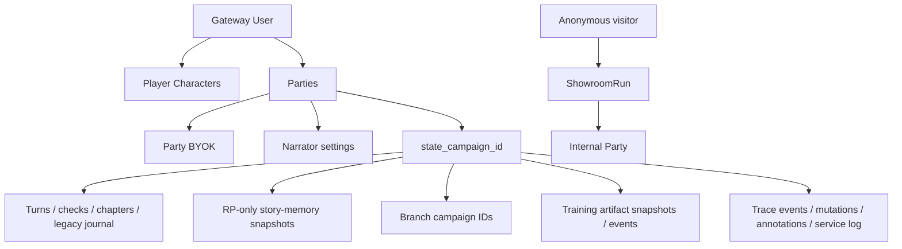

# Данные, изоляция и безопасность

[← Обучение и датасеты](07-training-autotests-datasets.md) · [Главная](README.md) · [Далее: эксплуатация →](09-operations-and-repository.md)

## Изоляция RP revision

Таблицы `parties` и `party_branches` хранят `rp_contract_revision` отдельно.
Миграция схемы присваивает существующим строкам revision `0` и не обновляет старые
партии автоматически. Ветка копирует checkpoint в отдельный `state_campaign_id`;
candidate-ревизия применяется только при выполнении этой ветки. Raw turns source
party и branch остаются раздельными и не переписываются при сборке prompt.

Candidate revision `7` расширяет допустимый revision range, но не меняет
изоляцию. Explicit observed остаётся `6`, existing party не получает новый
revision автоматически, а candidate выполняется только в отдельной
checkpoint/autotest branch.

DC1 не добавляет таблиц и не переписывает raw turns. Bounded force-refresh может
append-only сохранить новый `rp_story_memory_snapshots` как maintenance side
effect, но конечный `PromptBudgetExceeded` не создаёт player turn/state version
или relationship mutation. `audit_events` и `turn_requests` дают оператору
sanitized status; Prompt Inspector при overflow возвращает пустые
`messages/blocks` и не раскрывает world/player prompt text или secrets.

DC4 из
[Decision 031](../../roles/apps/files/rp-stack/docs/decisions/031-rp-scene-state-and-atomic-continuity.md)
остаётся document-first candidate. Он не добавляет таблицу: `scene_state`
планируется внутри authoritative `state_versions.state_json`, а private minimal
narrator bundle, normalized applied/dropped delta с actual bounded evidence и
before/after scene projection — в existing `turns.metadata_json` и private
audit/trace boundary. Public party response получает только narrator text и
безопасные fallback markers, не private bundle/evidence.

Accepted normal/opening bundle должен одной SQLite transaction сохранить state
version, scene projection, turn/private metadata и request completion. Ошибка
любой authoritative write откатывает весь набор. `current.json` записывается
best-effort только после SQLite commit; его failure не откатывает DB, а mirror
восстанавливается из SQLite. Scene-affecting explicit world command atomically
ставит stale/as-of marker, но не может напрямую патчить `scene_state`; rollback
восстанавливает historical projection либо stale bootstrap.

Pre-bundle transport fallback, напротив, планируется как committed
noncanonical turn: `story_memory_canonical=false`, last-reliable as-of и stale
scene marker сохраняются atomically. Gateway-authored fallback prose исключается
из raw-story, RP story memory, chapters, archive/retrieval и relationship canon;
player input и unresolved marker явно видны следующему prompt. Private evidence
имеет ту же retention/backup/owner-admin boundary, что turn, не копируется в
Prompt Inspector/public API и не экспортируется в dataset без обычного review.

Все registry-строки Decision 031 пока `каркас`: local source/offline gates
выполнены, но merge/apply/live отсутствуют; semantic continuity не доказана,
observed revision остаётся `6`.

## Где находятся данные

```text
/srv/apps/rp-stack                 managed application source
/srv/apps/rp-stack/worldpacks      committed immutable packs
/srv/apps/rp-stack/state           state schema и party state files
/srv/app-data/rp-stack/gateway     mutable Gateway data
/srv/app-data/rp-stack/gateway/rp_gateway.db
/srv/app-data/rp-stack/models      локальные model artifacts
/srv/backups/rp-stack              backups
```

SQLite используется несколькими service stores, но scope задаётся явными IDs и owner filters.

## Основные группы таблиц

| Группа | Примеры |
|---|---|
| Identity | `users`, `sessions`, `global_settings` |
| Party registry | `worldpacks`, `player_characters`, `model_profiles`, `parties` с `narrator_settings_json` |
| State/history | `campaigns`, `state_versions`, `turns`, `checks`, `state_patches`, `audit_events` |
| Memory | `rp_story_memory_snapshots`, `memory_chapters`, legacy `memory_summaries`, `journal_entries`, `lore_cards`, `service_jobs` |
| Reliability | `turn_requests`, `memory_checkpoints`, `party_branches`, `autotest_runs` |
| Dataset | `dataset_turn_labels`, `turn_feedback` |
| Showroom | `showroom_scenarios`, `showroom_visitors`, `showroom_runs` |
| Training artifacts | `training_artifacts`, `training_artifact_events` |
| Diagnostics | `turn_trace_events`, `turn_state_mutations`, `turn_phase_annotations`, `service_call_log` |
| Provider access | `provider_api_keys` |

## Изоляция пользователей и партий



Обычный API получает owner из Gateway session. `PartyStore` фильтрует parties и characters по `owner_user_id`; `StateStore` — по `state_campaign_id`. Admin role даёт административные операции, но сама игра всё равно адресуется конкретной Party.

`narrator_settings_json` — небольшой не-секретный JSON-объект в строке Party.
Gateway хранит только разрешённые `reasoning_effort`, `temperature`, `top_p` и
`max_tokens`, повторно валидирует их при сохранении и не копирует в глобальные
service settings. Миграция существующей базы добавляет поле с `{}` без изменения
выбранной модели или старых партий. API keys в этом JSON не хранятся.

Showroom использует отдельный visitor token. Run доступен только cookie-владельцу; raw party ID не возвращается клиенту.

`rp_story_memory_snapshots` всегда фильтруется по `state_campaign_id`. Updater получает NPC без поля `secrets`; в prompt narrator этот snapshot поступает только для RP-партии. Snapshot не имеет права менять canonical state и не создаётся для `training`.

## Безопасность training artifacts

Narrator не может передать произвольный HTML, CSS или JavaScript. Gateway принимает только известный blueprint и объявленные строковые slots, а UI строит DOM через text nodes под строгим CSP. Внешние ресурсы, навигация на реальные домены и произвольные form targets запрещены.

Значения credential-полей остаются в браузере: при submit клиент передаёт только тип события, artifact ID и idempotency key. Artifact snapshots содержат видимый учебный текст и поэтому подчиняются тем же правилам privacy/review, что и raw turns; server-only interaction policy и скрытый scoring в публичный API не выдаются.

Live-проверка с синтетическими значениями подтвердила этот privacy boundary: в `training_artifact_events` сохранились только тип события и идентификаторы полей `login` / `password`, а сами введённые строки в Gateway SQLite отсутствовали. Проверка не использовала реальные учётные данные.

### Workspace resources

Рабочий диск реализован для training-сценариев как versioned resource library,
immutable file revisions и server-only workspace interaction policy. Публичные
ответы и DOM не содержат признак `phishing`, correctness или score rule.

Ресурсы делятся минимум на `public_training` и `restricted_internal`. Текущая
анонимная visitor cookie Showroom не даёт достаточной авторизации для реальной
внутренней политики организации, поэтому restricted-документ должен быть
отклонён при публикации. Player-visible документ по умолчанию не попадает в LLM
prompt; оцениваемые требования кодируются отдельно в детерминированных правилах.

Конвертация Office/PDF, MIME inspection и malware scan, если потребуются,
выполняются до публикации асинхронно. Открытие файла не запускает Python
конвертацию, filesystem scan или LLM.

## Codex devkit и доступ к эксплуатации

`rp-stack-ops` предоставляет Codex только фиксированный read-only allowlist:
server revision, Ansible status/journal, Compose status, HTTP smoke, изолированный
Gateway pytest, bounded logs/provider summary, trace по строго проверенному
request ID и список backup-файлов. В MCP нет deploy, restore, delete, secret
rotation или произвольного shell.

Переменные `RP_STACK_OPS_HOST` и `RP_STACK_OPS_SSH` меняют только endpoint и
локальный SSH executable. Аргументы service/scope/lines/request ID валидируются
до построения server command, а вероятные bearer, API key, cookie, password,
secret и token редактируются из результата. Это защита от случайной утечки, но
не замена серверной авторизации и sandbox approval.

Project `PreToolUse` hook блокирует hard reset/clean, force push, recursive
delete, чтение server-only overrides, вероятные plaintext credentials и прямые
мутации `/srv/apps/rp-stack`, `/srv/app-data/rp-stack` и backups. Постоянные
секреты остаются только в `/etc/ansible/local-overrides.yml`.

Sentry, OpenTelemetry, PostHog и другая прикладная телеметрия в devkit не
добавляются: наблюдаемость приложения остаётся отдельным архитектурным решением.

## Аутентификация

- Пароли хранятся как PBKDF2-HMAC-SHA256 с отдельной солью и 260 000 итераций.
- Session token генерируется случайно, а в SQLite хранится SHA-256 hash.
- Login cookie — HttpOnly, `SameSite=Lax`; флаг `Secure` настраивается и в текущем HTTP/LAN профиле по умолчанию выключен.
- Роли: `admin` и `user`; пользователя можно disable/delete, при необходимости вместе с его data.

Bootstrap password создаёт отсутствующего admin, но не является механизмом автоматической смены уже существующего пароля.

## API keys

Cloud keys не должны попадать в Git. Server-managed значения задаются в `/etc/ansible/local-overrides.yml` и рендерятся в runtime `.env` на сервере.

Party BYOK:

- принадлежит одному owner и одной Party;
- не используется service model;
- не возвращается браузеру целиком — UI видит label, provider, base URL и `secret_hint`;
- удаляется вместе с Party.

### Важное ограничение at rest

`provider_api_keys.secret_value` сейчас хранится в Gateway SQLite в открытом виде, а не зашифрованным application key. API маскирует значение, но человек или процесс с доступом к DB/backup сможет прочитать секрет.

Следствия:

- Gateway data directory и backups нужно считать секретными;
- права на `/srv/app-data/rp-stack/gateway` должны быть минимальными;
- DB нельзя публиковать, прикладывать к issue или датасету;
- для более сильной модели угроз нужен отдельный at-rest encryption/keyring design.

## Сетевая поверхность

| Сервис | Host binding | Комментарий |
|---|---|---|
| Light GUI | LAN + Tailscale, `8010` | Gateway auth обязателен |
| Showroom | LAN + Tailscale, `8011` | Публичная витрина с visitor cookie |
| Gateway | Нет host port | Доступ только из `rp-stack` network |
| Local LLM | Нет host port, internal network | Доступ только Gateway |

Наличие Tailscale binding не делает Showroom или Light GUI интернет-публичными само по себе, но security зависит от ACL и настроек tailnet.

## WorldPack privacy

Этот GitHub-репозиторий публичный. Всё, что закоммичено в WorldPack, prompt, test fixture или Wiki, следует считать публичным.

Нельзя коммитить:

- реальные API keys и пароли;
- персональные данные;
- internal-only answer keys, которые нельзя раскрывать исходным кодом;
- реальные вредоносные payloads или operational secrets.

Private visibility в Gateway скрывает мир от runtime-пользователей и Showroom, но не делает уже закоммиченный public repository content секретным.

## Turn Trace Workbench и диагностические журналы

Request-centric read model объединяет существующие авторитетные записи с тремя
добавочными таблицами: `turn_trace_events` хранит факты исполнения и narrator
attempts, `turn_state_mutations` — exact before/after и фактический main/background
lane только для изменившихся
in-place проекций, а `turn_phase_annotations` — идемпотентные пользовательские
заметки. Существующий `service_call_log` сохраняет exact redacted ordered messages
и raw provider response служебной модели; второй журнал completions не создаётся.

Все записи изолированы по `state_campaign_id` и `request_id`. Gateway разрешает
`party_id` и опциональный `branch_id` только после admin-gate; обычный владелец
партии, Showroom visitor cookie и `run_id` не дают доступа к trace API. Это не
позволяет участнику training-сценария прочитать server-only
`AUTHORITATIVE_OUTCOME`, scoring и assessment policy из exact prompt. Аннотация
зеркалит безопасные метаданные в `audit_events`, но не меняет state, prompt,
scoring или модельный маршрут.

По умолчанию диагностические данные не истекают: новые trace-таблицы не имеют
TTL, а `SERVICE_CALL_LOG_RETENTION_DAYS=0` означает unlimited. Положительное
значение управляется IaC-переменной
`rp_stack_gateway_service_call_log_retention_days` (host-specific override — в
`/etc/ansible/local-overrides.yml`) и включает явную очистку старых service rows.
Это увеличивает privacy и
storage impact: exact prompt/response могут содержать нарратив пользователя,
поэтому входят в Gateway backup scope, не экспортируются в dataset автоматически
и должны редактировать вероятные ключи, bearer tokens, cookies и passwords на
записи диагностической копии.

Trace — только диагностика: ни одна игровая фаза не читает эти таблицы как
authority или readiness signal. Отказ записи трассы не должен менять outcome,
commit, repair/fallback или исполнение Decision 026.

### Импорт Markdown в generated WorldPack

Light GUI принимает только выбранный пользователем файл с расширением `.md`, проверяет предел 1 МиБ и читает его как текст. Gateway повторно проверяет basename, расширение, отсутствие NUL-байтов и предел 200 000 символов. MIME не считается источником доверия; содержимое не рендерится, не исполняется и не запускает конвертеры или filesystem scan.

Полный `world.md` хранится в private generated pack под `party_state_root` и используется только как world system prompt владельца. Он может содержать персональные или защищённые авторским правом данные и поэтому попадает в те же backup/privacy boundaries, что state и raw turns. Большой файл также расходует context window выбранной narrator model; импорт не обходит модельный лимит и не ослабляет scenario rules.

## Dataset и privacy gate

Raw logs могут содержать личные данные, copyrighted text, secrets или неудачное поведение модели. Поэтому export требует явного approval на уровне Party и turn. Рейтинг игрока — только сигнал; он не заменяет privacy review.

## Backup и restore

Backup содержит state, историю, диагностическую трассу, users, provider keys и dataset labels. Перед restore нужно проверить архив и точные target paths, остановить stack и только затем восстанавливать. Нельзя пересылать backup через публичные каналы.

## Источники

- [AuthStore](../../roles/apps/files/rp-stack/rp-gateway/app/services/auth_store.py)
- [StateStore](../../roles/apps/files/rp-stack/rp-gateway/app/services/state_store.py)
- [ShowroomStore](../../roles/apps/files/rp-stack/rp-gateway/app/services/showroom.py)
- [TrainingArtifactService](../../roles/apps/files/rp-stack/rp-gateway/app/services/training_artifacts.py)
- [Turn trace read model](../../roles/apps/files/rp-stack/rp-gateway/app/services/turn_trace.py)
- [Decision 027](../../roles/apps/files/rp-stack/docs/decisions/027-turn-trace-workbench.md)
- [Decision 028](../../roles/apps/files/rp-stack/docs/decisions/028-rp-uncovered-tail-and-overflow.md)
- [Decision 031](../../roles/apps/files/rp-stack/docs/decisions/031-rp-scene-state-and-atomic-continuity.md)
- [Compose networks](../../roles/apps/templates/rp-stack.compose.yml.j2)

### Relationship projection repair

The relationship-pressure projection stores active boundary events and their deadlines. When resuming an older party, Gateway idempotently restores a missing `due_turn` from `opened_turn` and the current WorldPack clock before processing the turn. This updates only the derived projection, not raw turns or canonical state; new rows require a non-null deadline.
