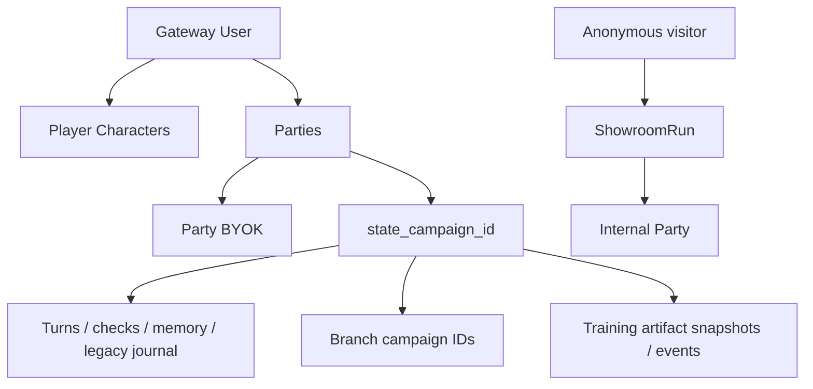

# Данные, изоляция и безопасность

[← Обучение и датасеты](07-training-autotests-datasets.md) · [Главная](README.md) · [Далее: эксплуатация →](09-operations-and-repository.md)

## Где находятся данные

```text
/srv/apps/rp-stack                 managed application source
/srv/apps/rp-stack/worldpacks      committed immutable packs
/srv/apps/rp-stack/state           state schema и party state files
/srv/app-data/rp-stack/gateway     mutable Gateway data
/srv/app-data/rp-stack/gateway/rp_gateway.db
/srv/app-data/rp-stack/models      локальные model artifacts
/srv/backups/rp-stack              backups
```

SQLite используется несколькими service stores, но scope задаётся явными IDs и owner filters.

## Основные группы таблиц

| Группа | Примеры |
|---|---|
| Identity | `users`, `sessions`, `global_settings` |
| Party registry | `worldpacks`, `player_characters`, `model_profiles`, `parties` |
| State/history | `campaigns`, `state_versions`, `turns`, `checks`, `state_patches`, `audit_events` |
| Memory | `memory_chapters`, legacy `memory_summaries`, `journal_entries`, `lore_cards`, `service_jobs` |
| Reliability | `turn_requests`, `memory_checkpoints`, `party_branches`, `autotest_runs` |
| Dataset | `dataset_turn_labels`, `turn_feedback` |
| Showroom | `showroom_scenarios`, `showroom_visitors`, `showroom_runs` |
| Training artifacts | `training_artifacts`, `training_artifact_events` |
| Provider access | `provider_api_keys` |

## Изоляция пользователей и партий



Обычный API получает owner из Gateway session. `PartyStore` фильтрует parties и characters по `owner_user_id`; `StateStore` — по `state_campaign_id`. Admin role даёт административные операции, но сама игра всё равно адресуется конкретной Party.

Showroom использует отдельный visitor token. Run доступен только cookie-владельцу; raw party ID не возвращается клиенту.

## Безопасность training artifacts

Narrator не может передать произвольный HTML, CSS или JavaScript. Gateway принимает только известный blueprint и объявленные строковые slots, а UI строит DOM через text nodes под строгим CSP. Внешние ресурсы, навигация на реальные домены и произвольные form targets запрещены.

Значения credential-полей остаются в браузере: при submit клиент передаёт только тип события, artifact ID и idempotency key. Artifact snapshots содержат видимый учебный текст и поэтому подчиняются тем же правилам privacy/review, что и raw turns; server-only interaction policy и скрытый scoring в публичный API не выдаются.

Live-проверка с синтетическими значениями подтвердила этот privacy boundary: в `training_artifact_events` сохранились только тип события и идентификаторы полей `login` / `password`, а сами введённые строки в Gateway SQLite отсутствовали. Проверка не использовала реальные учётные данные.

## Аутентификация

- Пароли хранятся как PBKDF2-HMAC-SHA256 с отдельной солью и 260 000 итераций.
- Session token генерируется случайно, а в SQLite хранится SHA-256 hash.
- Login cookie — HttpOnly, `SameSite=Lax`; флаг `Secure` настраивается и в текущем HTTP/LAN профиле по умолчанию выключен.
- Роли: `admin` и `user`; пользователя можно disable/delete, при необходимости вместе с его data.

Bootstrap password создаёт отсутствующего admin, но не является механизмом автоматической смены уже существующего пароля.

## API keys

Cloud keys не должны попадать в Git. Server-managed значения задаются в `/etc/ansible/local-overrides.yml` и рендерятся в runtime `.env` на сервере.

Party BYOK:

- принадлежит одному owner и одной Party;
- не используется service model;
- не возвращается браузеру целиком — UI видит label, provider, base URL и `secret_hint`;
- удаляется вместе с Party.

### Важное ограничение at rest

`provider_api_keys.secret_value` сейчас хранится в Gateway SQLite в открытом виде, а не зашифрованным application key. API маскирует значение, но человек или процесс с доступом к DB/backup сможет прочитать секрет.

Следствия:

- Gateway data directory и backups нужно считать секретными;
- права на `/srv/app-data/rp-stack/gateway` должны быть минимальными;
- DB нельзя публиковать, прикладывать к issue или датасету;
- для более сильной модели угроз нужен отдельный at-rest encryption/keyring design.

## Сетевая поверхность

| Сервис | Host binding | Комментарий |
|---|---|---|
| Light GUI | LAN + Tailscale, `8010` | Gateway auth обязателен |
| Showroom | LAN + Tailscale, `8011` | Публичная витрина с visitor cookie |
| Gateway | Нет host port | Доступ только из `rp-stack` network |
| Local LLM | Нет host port, internal network | Доступ только Gateway |

Наличие Tailscale binding не делает Showroom или Light GUI интернет-публичными само по себе, но security зависит от ACL и настроек tailnet.

## WorldPack privacy

Этот GitHub-репозиторий публичный. Всё, что закоммичено в WorldPack, prompt, test fixture или Wiki, следует считать публичным.

Нельзя коммитить:

- реальные API keys и пароли;
- персональные данные;
- internal-only answer keys, которые нельзя раскрывать исходным кодом;
- реальные вредоносные payloads или operational secrets.

Private visibility в Gateway скрывает мир от runtime-пользователей и Showroom, но не делает уже закоммиченный public repository content секретным.

## Dataset и privacy gate

Raw logs могут содержать личные данные, copyrighted text, secrets или неудачное поведение модели. Поэтому export требует явного approval на уровне Party и turn. Рейтинг игрока — только сигнал; он не заменяет privacy review.

## Backup и restore

Backup содержит state, историю, users, provider keys и dataset labels. Перед restore нужно проверить архив и точные target paths, остановить stack и только затем восстанавливать. Нельзя пересылать backup через публичные каналы.

## Источники

- [AuthStore](../../roles/apps/files/rp-stack/rp-gateway/app/services/auth_store.py)
- [StateStore](../../roles/apps/files/rp-stack/rp-gateway/app/services/state_store.py)
- [ShowroomStore](../../roles/apps/files/rp-stack/rp-gateway/app/services/showroom.py)
- [TrainingArtifactService](../../roles/apps/files/rp-stack/rp-gateway/app/services/training_artifacts.py)
- [Compose networks](../../roles/apps/templates/rp-stack.compose.yml.j2)
