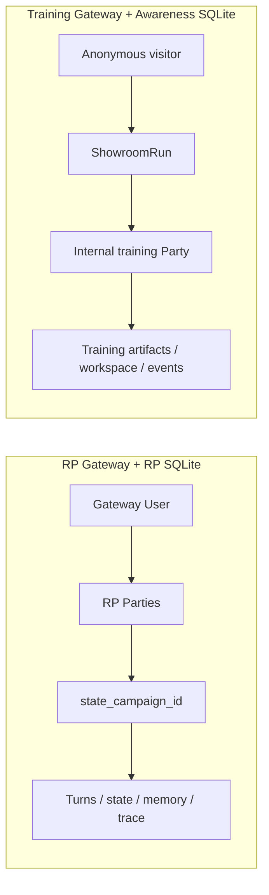

# Данные, изоляция и безопасность

[← Обучение и датасеты](07-training-autotests-datasets.md) · [Главная](README.md) · [Далее: эксплуатация →](09-operations-and-repository.md)

## Изоляция RP revision

Таблицы `parties` и `party_branches` хранят `rp_contract_revision` отдельно.
Миграция схемы присваивает существующим строкам revision `0` и не обновляет старые
партии автоматически. Ветка копирует checkpoint в отдельный `state_campaign_id`;
candidate-ревизия применяется только при выполнении этой ветки. Raw turns source
party и branch остаются раздельными и не переписываются при сборке prompt.

Revision `7` расширяет допустимый revision range, но не меняет изоляцию.
Отдельный activation change с explicit observed target `7` прошёл pull-based
apply и stamp proof; existing party не получает новый revision автоматически.
Checkpoint/autotest branch по-прежнему может явно закреплять допустимую revision
независимо от source party.

DC1 не добавляет таблиц и не переписывает raw turns. Bounded force-refresh может
append-only сохранить новый `rp_story_memory_snapshots` как maintenance side
effect, но конечный `PromptBudgetExceeded` не создаёт player turn/state version
или relationship mutation. `audit_events` и `turn_requests` дают оператору
sanitized status; Prompt Inspector при overflow возвращает пустые
`messages/blocks` и не раскрывает world/player prompt text или secrets.

DC4 из
[Decision 031](../../roles/apps/files/rp-stack/docs/decisions/031-rp-scene-state-and-atomic-continuity.md)
теперь доступен новым ordinary parties на observed revision `7`, а его delivery
gates остаются только `подключено`. Он не
добавляет таблицу: `scene_state` хранится внутри authoritative
`state_versions.state_json`, а private minimal
narrator bundle, normalized applied/dropped delta с actual bounded evidence и
before/after scene projection — в existing `turns.metadata_json` и private
audit/trace boundary. Public party response получает только narrator text и
безопасные fallback markers, не private bundle/evidence.

Accepted normal/opening bundle одной SQLite transaction сохраняет state
version, scene projection, turn/private metadata и request completion. Ошибка
любой authoritative write откатывает весь набор. `current.json` записывается
best-effort только после SQLite commit; его failure не откатывает DB, а mirror
восстанавливается из SQLite. Scene-affecting explicit world command atomically
ставит stale/as-of marker, но не может напрямую патчить `scene_state`; rollback
восстанавливает historical projection либо stale bootstrap.

Pre-bundle transport fallback, напротив, записывается как committed
noncanonical turn: `story_memory_canonical=false`, last-reliable as-of и stale
scene marker сохраняются atomically. Gateway-authored fallback prose исключается
из raw-story, RP story memory, chapters, archive/retrieval и relationship canon;
player input и unresolved marker явно видны следующему prompt. Private evidence
имеет ту же retention/backup/owner-admin boundary, что turn, не копируется в
Prompt Inspector/public API и не экспортируется в dataset без обычного review.

Все registry-строки Decision 031 имеют уровень `подключено`: implementation и
failure-boundary tests merged/applied, а isolated production-store proofs
подтвердили accepted atomic paths, repeated mismatch без commit и noncanonical
fallback без canonical leakage. Protected existing-party rows и state-file
hashes не изменились; external provider calls не выполнялись. Semantic
continuity не доказана; последующая ordinary activation отдельно прошла
post-apply stamp-proof boundary и не повышает readiness DC4.

### Revision 8: sectioned-memory migration

[Decision 032](../../roles/apps/files/rp-stack/docs/decisions/032-rp-history-first-prompt-and-sectioned-memory.md)
остаётся на уровне `каркас` до live gates. Source activation задаёт observed `8`
и declared `8` только для `merchant-sviatoslav`; apply и новая stamp-party уже
подтвердили effective `8` без model calls. Миграция сохраняет существующие snapshot rows,
добавляет nullable `base_snapshot_id` и `update_id` и заменяет legacy uniqueness
по `(campaign_id, to_turn_id)` на idempotency по `(campaign_id, update_id)`.
Legacy caller без `update_id` по-прежнему дедуплицируется по coverage; только
явный rev-8 same-coverage update требует `update_id` и актуальный base snapshot.

`service_call_log` получает nullable `section_key` и `update_id`: штатный общий
request пишет `section_key=all`, а структурно невалидная секция — свой exact key
в отдельной строке. Это позволяет доказать один-call normal path и точечный retry
без чтения prompt text. Политика retention и backup не меняется. Rev-8+ corrections пишут
зарезервированный authority `user`; при чтении sectioned snapshot legacy
`user_correction` нормализуется в `user`. Revisions `0..7` продолжают хранить и
возвращать `user_correction`. S1 сам не создаёт absorption/overlay; candidate S3
добавляет их только для revision `9` ниже.

Rev8 turn `metadata_json` также получает три content-free поля наблюдаемости:
`cached_prompt_tokens`, `prompt_tokens` и `stable_prompt_prefix_hash`. Первые два
копируются из сохранённого provider response, hash — SHA-256 повторяемой основы
rules + первых 50 RAW units. Prompt content в metadata не дублируется, схема
SQLite и retention policy ради этих полей не меняются.

### Revision 9: GM correction artifacts

[Decision 038](../../roles/apps/files/rp-stack/docs/decisions/038-rp-gm-corrections-and-player-overlay.md)
расширяет source revision range до `9`, но не меняет observed revision,
WorldPack declarations или existing party rows. Candidate не добавляет таблиц и
не переписывает RAW:

- typed `rp-gateway.player-correction.v1` хранится в
  `turns.metadata_json.player_correction` у строки
  `turn_kind=gm_correction`, `excluded_from_memory=1`;
- confirm atomically пишет `state_versions +1`, correction turn, completed
  `turn_requests` и audit, сохраняя party turn, scene и игровое время;
- memory/RAW target использует request-scoped existing `service_jobs` и
  `rp_story_memory_snapshots`; absorption меняет artifact status с `active` на
  `absorbed` только после durable user-authority projection и coverage gate;
- absolute rule replacement остаётся в canonical state version и сохраняет
  существующий rule ID/scope/kind.

Public owner-scoped History и memory API возвращают correction artifact для UI,
но модель не может передать authority/provenance в confirm: Gateway назначает их
сам. Proposal повторно сверяется с current state/snapshot и exact target, поэтому
клиент не может использовать confirm как произвольный state patch. Input
correction ограничен 600 символами и не усекается; GM drafts и prompt content
имеют ту же redaction/retention boundary, что остальные строки
`service_call_log`.

### Revision 10: world clock state and jobs

[Decision 039](../../roles/apps/files/rp-stack/docs/decisions/039-rp-world-clock-and-authored-events.md)
добавляет optional `world_clock` только в canonical party state. Он хранит дату,
processed party turn, confirmed markers, retained event statuses/IDs, durable
facts, pending announcements и последний elapsed reason. Новый отдельный
calendar/event store не создаётся.

`service_jobs.party_turn` и partial unique index дают один clock job на игровой
ход и строгий порядок применения. `lore_cards.authored_key` позволяет событию
переключить только заранее скопированную WorldPack card. Clock tick одной
`BEGIN IMMEDIATE` transaction пишет state version, statuses/facts, card flags и
audit; при active main turn он откладывается без расхода model attempt.

Turn `metadata_json.world_clock_events` хранит только безопасные occurred/horizon
labels для History/UI. Exact local prompt/response остаётся в существующем
`service_call_log` с прежней redaction/retention policy; новые TTL, backup scope
или provider credentials не добавляются.

### Revision 11: immutable WorldPack materialization

Для новой revision-11 party существующая строка `parties` хранит выбранные
`preset_id`, `opening_id` и internal JSON snapshot: точные system/authors/opening
тексты, выбранный `player_role`, полный state seed и SHA-256 каждого payload.
Новая content table не создаётся. Public party summary может вернуть IDs и
audit hashes, но исключает полные prompt texts и seed.

Выбор разрешается только по bounded ASCII ID внутри manifest, поэтому клиент не
задаёт filesystem path. Pack paths проходят repository/runtime containment
checks. Omitted ID означает explicit default; неизвестное или path-like значение
не даёт fallback. Player-character draft/create сохраняют resolved `opening_id`,
чтобы роль и opening будущей партии совпадали.

Branch/autotest descendant использует и наследует тот же source-party snapshot. Существующие партии не
backfill-ятся и не мигрируются; поздний WorldPack edit не переписывает их state
или prompt. Checksums служат аудитной сверкой и не создают телеметрию или новый
readiness signal.

### RP supervisor: typed retention без raw trace

Decision 040 добавляет `rp_supervisor_evaluations`, изолированную по
`state_campaign_id` и hash WorldPack-контракта. Строка хранит границы exact
50-unit окна, source request/turn, шесть typed оценок, выбранные authored
advisories, diagnostic flags, provider/model, status и latency. Prompt и raw
response не сохраняются ни здесь, ни в `service_call_log`.

TTL фиксирован на 30 дней и очищается при следующем сохранении/явной cleanup.
Rollback инвалидирует оценки, окно которых содержит исключённый turn; удаление
party удаляет их до turns. Они не входят в canonical state, story memory или
dataset и не используются как authority локации. `observe` никогда не создаёт
narrator advisory.

## Decision 043, срез 6: clean RP SQLite

`app/rp` владеет отдельной schema v7 по `RP_DATABASE_URL` (по умолчанию
`/data/rp_engine.db`). Хранилище начинается без старых партий и не читает, не
мигрирует и не меняет `rp_gateway.db`. В нём нет account/session/provider-key
таблиц или секретов; `owner_user_id` сохраняется только как owner scope Party.
В базе нет revision 0–11 или общего state-file mirror.

Строка Party хранит четыре обязательных source-поля:
`world_snapshot_json`, `world_hash`, `scenario_snapshot_json` и
`scenario_hash`, а также immutable Narrator binding: profile, provider, exact
base URL, model и settings. Production loader материализует World и Scenario
отдельно; база отклоняет изменение source или binding. Изменение исходников
влияет только на будущие Party.

Narration request сохраняется до provider call. Успех одной транзакцией пишет
RAW turn, increment Party version и фиксированные role jobs; provider failure не
оставляет частичного turn/version. Job claim не увеличивает attempts, recovery
возвращает `running` в `pending`, а actual failure увеличивает attempts. Guidance
Administrator имеет собственную revision и может обновляться несколько раз на
одной gameplay version.

Party BYOK остаётся в legacy `provider_api_keys` Gateway DB и никогда не
копируется в clean SQLite. Runtime читает только exact owner/Party/provider/base
URL key; mismatched custom key отклоняется до outbound call. Source path и volume
подготовлены, но inventory держит cutover-флаг выключенным; backup/restore,
фактическая пустота live DB и retention будут доказаны отдельно при apply/live
verification, а не этим текстом.

## Где находятся данные

```text
/srv/apps/rp-stack                 managed application source
/srv/apps/rp-stack/worldpacks      committed immutable packs
/srv/apps/rp-stack/state           state schema и party state files
/srv/app-data/rp-stack/gateway     mutable Gateway data
/srv/app-data/rp-stack/gateway/rp_gateway.db
/srv/app-data/rp-stack/models      локальные model artifacts
/srv/backups/rp-stack              backups

/srv/apps/awareness-showroom                 standalone training source
/srv/app-data/awareness-showroom/gateway     training Gateway data и SQLite
/srv/app-data/awareness-showroom/state       training party state
/srv/app-data/awareness-showroom/showroom-covers
/srv/backups/awareness-showroom              отдельные training backups
```

SQLite используется несколькими service stores, но scope задаётся явными IDs и owner filters.

## Основные группы таблиц

| Группа | Примеры |
|---|---|
| Identity | `users`, `sessions`, `global_settings` |
| Party registry | `worldpacks`, `player_characters`, `model_profiles`, `parties` с `narrator_settings_json` |
| State/history | `campaigns`, `state_versions`, `turns`, `checks`, `state_patches`, `audit_events` |
| Memory | `rp_story_memory_snapshots`, `memory_chapters`, legacy `memory_summaries`, `journal_entries`, `lore_cards`, `service_jobs` |
| Reliability | `turn_requests`, `memory_checkpoints`, `party_branches`, `autotest_runs` |
| RP supervision | `rp_supervisor_evaluations` (typed, 30-day TTL, no raw prompt/response) |
| Dataset | `dataset_turn_labels`, `turn_feedback` |
| Showroom | После C1 активные `showroom_scenarios`, `showroom_visitors`, `showroom_runs` находятся в standalone SQLite; старые RP-строки остаются нетронутыми и скрытыми |
| Training artifacts | После C1 активные `training_artifacts`, `training_artifact_events` принадлежат standalone SQLite; старые RP-строки сохраняются под read-only quarantine |
| Diagnostics | `turn_trace_events`, `turn_state_mutations`, `turn_phase_annotations`, `service_call_log` |
| Provider access | `provider_api_keys` |

## Изоляция пользователей и партий



Обычный API получает owner из Gateway session. `PartyStore` фильтрует parties и characters по `owner_user_id`; `StateStore` — по `state_campaign_id`. Admin role даёт административные операции, но сама игра всё равно адресуется конкретной Party.

`narrator_settings_json` — небольшой не-секретный JSON-объект в строке Party.
Gateway хранит только разрешённые `reasoning_effort`, `temperature`, `top_p` и
`max_tokens`, повторно валидирует их при сохранении и не копирует в глобальные
service settings. Миграция существующей базы добавляет поле с `{}` без изменения
выбранной модели или старых партий. API keys в этом JSON не хранятся.

Showroom использует отдельный visitor token. Run доступен только cookie-владельцу; raw party ID не возвращается клиенту.

После C1 apply это становится физической границей данных: Awareness Showroom
использует отдельные SQLite/state/covers/backup paths и cookies
`awareness_gateway_session` / `awareness_showroom_visitor`. Порты `8010` и
`8011` сами по себе cookies не изолируют. Общих writable volumes, dual-write и
runtime API между RP и training Gateway нет. Старые Showroom rows сохраняются в
legacy RP SQLite, но новый training runtime их не читает.

C1 source закрепляет exact application commit
`67244432659f6c25a268cbf788a8fa3af0f5b52f` и LAN-only
`192.168.1.88:8011`, но apply ещё не выполнен. Live I1 shadow продолжает
использовать отдельные paths на loopback `:18011`, а старый Showroom занимает
`:8011`. Старая RP SQLite не мигрируется и не изменяется; её training rows не
являются blocker по явному решению владельца. Полный training flow и restore
после C1 apply ещё не доказаны. Rollback window равен `0`: старый Showroom и
training source удаляются при том же apply, а SQLite/state/backups сохраняются.

### Git-каталог Showroom

Конфигурации опубликованных training-сценариев теперь являются
версионируемым application source, а не переносом legacy SQLite.
`SHOWROOM_CATALOG_PATH=/app/configs/showroom/scenarios.json` включает
согласование при startup:

- стабильный `key` адресует только строку `scenario_catalog_<key>` в
  standalone SQLite;
- profile выбирается только по exact `(provider, base_url, model)`, а не по
  legacy ID; zero/multiple active matches закрывают startup;
- `cover` явно задаёт относительный файл каталога либо `null`; файл повторно
  пишется в persistent covers только при изменении bytes/MIME, а `null`
  удаляет runtime drift для управляемого сценария;
- undeclared DB-сценарии не удаляются, а runs, parties, turns, state,
  visitors, sessions, users, provider keys, feedback и leaderboard rows не импортируются.

Каталог создаёт новые scenario IDs и не даёт доступ к legacy results. После
apply живые training runs и backups доказываются отдельно.

`rp_story_memory_snapshots` всегда фильтруется по `state_campaign_id`. Updater получает NPC без поля `secrets`; в prompt narrator этот snapshot поступает только для RP-партии. Snapshot не имеет права менять canonical state и не создаётся для `training`.

## Безопасность training artifacts

Narrator не может передать произвольный HTML, CSS или JavaScript. Gateway принимает только известный blueprint и объявленные строковые slots, а UI строит DOM через text nodes под строгим CSP. Внешние ресурсы, навигация на реальные домены и произвольные form targets запрещены.

Значения credential-полей остаются в браузере: при submit клиент передаёт только тип события, artifact ID и idempotency key. Artifact snapshots содержат видимый учебный текст и поэтому подчиняются тем же правилам privacy/review, что и raw turns; server-only interaction policy и скрытый scoring в публичный API не выдаются.

Историческая live-проверка прежнего общего runtime с синтетическими значениями
подтвердила этот privacy boundary: в `training_artifact_events` сохранились
только тип события и идентификаторы полей `login` / `password`, а сами введённые
строки в Gateway SQLite отсутствовали. Проверка не использовала реальные
учётные данные; standalone `:8011` требует отдельного post-C1 proof.

### Workspace resources

Рабочий диск реализован для training-сценариев как versioned resource library,
immutable file revisions и server-only workspace interaction policy. Публичные
ответы и DOM не содержат признак `phishing`, correctness или score rule.

Ресурсы делятся минимум на `public_training` и `restricted_internal`. Текущая
анонимная visitor cookie Showroom не даёт достаточной авторизации для реальной
внутренней политики организации, поэтому restricted-документ должен быть
отклонён при публикации. Player-visible документ по умолчанию не попадает в LLM
prompt; оцениваемые требования кодируются отдельно в детерминированных правилах.

Конвертация Office/PDF, MIME inspection и malware scan, если потребуются,
выполняются до публикации асинхронно. Открытие файла не запускает Python
конвертацию, filesystem scan или LLM.

## Codex devkit и доступ к эксплуатации

`rp-stack-ops` предоставляет Codex только фиксированный read-only allowlist:
server revision, Ansible status/journal, Compose status, HTTP smoke, изолированный
Gateway pytest, bounded logs/provider summary, trace по строго проверенному
request ID и список backup-файлов. В MCP нет deploy, restore, delete, secret
rotation или произвольного shell.

Переменные `RP_STACK_OPS_HOST` и `RP_STACK_OPS_SSH` меняют только endpoint и
локальный SSH executable. Аргументы service/scope/lines/request ID валидируются
до построения server command, а вероятные bearer, API key, cookie, password,
secret и token редактируются из результата. Это защита от случайной утечки, но
не замена серверной авторизации и sandbox approval.

Project `PreToolUse` hook блокирует hard reset/clean, force push, recursive
delete, чтение server-only overrides, вероятные plaintext credentials и прямые
мутации `/srv/apps/rp-stack`, `/srv/app-data/rp-stack` и backups. Постоянные
секреты остаются только в `/etc/ansible/local-overrides.yml`.

Sentry, OpenTelemetry, PostHog и другая прикладная телеметрия в devkit не
добавляются: наблюдаемость приложения остаётся отдельным архитектурным решением.

## Аутентификация

- Пароли хранятся как PBKDF2-HMAC-SHA256 с отдельной солью и 260 000 итераций.
- Session token генерируется случайно, а в SQLite хранится SHA-256 hash.
- Login cookie — HttpOnly, `SameSite=Lax`; флаг `Secure` настраивается и в текущем HTTP/LAN профиле по умолчанию выключен.
- Роли: `admin` и `user`; пользователя можно disable/delete, при необходимости вместе с его data.

Bootstrap password создаёт отсутствующего admin, но не является механизмом автоматической смены уже существующего пароля.

## API keys

Cloud keys не должны попадать в Git. Server-managed значения задаются в `/etc/ansible/local-overrides.yml` и рендерятся в runtime `.env` на сервере.

Party BYOK:

- принадлежит одному owner и одной Party;
- не используется service model;
- не возвращается браузеру целиком — UI видит label, provider, base URL и `secret_hint`;
- удаляется вместе с Party.

### Важное ограничение at rest

`provider_api_keys.secret_value` сейчас хранится в Gateway SQLite в открытом виде, а не зашифрованным application key. API маскирует значение, но человек или процесс с доступом к DB/backup сможет прочитать секрет.

Следствия:

- Gateway data directory и backups нужно считать секретными;
- права на `/srv/app-data/rp-stack/gateway` должны быть минимальными;
- DB нельзя публиковать, прикладывать к issue или датасету;
- для более сильной модели угроз нужен отдельный at-rest encryption/keyring design.

## Сетевая поверхность

| Сервис | Live до C1 apply | C1 source после apply |
|---|---|---|
| Light GUI | LAN + Tailscale, `8010` | Без изменений, RP Gateway auth обязателен |
| Showroom | Старый Showroom, LAN + Tailscale, `8011` | Standalone, LAN-only `192.168.1.88:8011`, visitor cookie |
| RP Gateway | Нет host port, общий legacy runtime | Нет host port, только `rp-stack` network и `scenario_type=rp` |
| Training Gateway | Shadow loopback `127.0.0.1:18011` | Нет отдельного host port; доступ только через standalone Showroom network |
| Local LLM | Нет host port, internal network | Без изменений; C1 не объединяет Docker networks |

Наличие Tailscale binding не делает Showroom или Light GUI интернет-публичными само по себе, но security зависит от ACL и настроек tailnet.

## WorldPack privacy

Этот GitHub-репозиторий публичный. Всё, что закоммичено в WorldPack, prompt, test fixture или Wiki, следует считать публичным.

Нельзя коммитить:

- реальные API keys и пароли;
- персональные данные;
- internal-only answer keys, которые нельзя раскрывать исходным кодом;
- реальные вредоносные payloads или operational secrets.

Private visibility в Gateway скрывает мир от runtime-пользователей и Showroom, но не делает уже закоммиченный public repository content секретным.

## Turn Trace Workbench и диагностические журналы

Request-centric read model объединяет существующие авторитетные записи с тремя
добавочными таблицами: `turn_trace_events` хранит факты исполнения и narrator
attempts, `turn_state_mutations` — exact before/after и фактический main/background
lane только для изменившихся
in-place проекций, а `turn_phase_annotations` — идемпотентные пользовательские
заметки. Существующий `service_call_log` сохраняет exact redacted ordered messages
и raw provider response обычных служебных completions; privacy-исключение
Decision 040 пишет только typed `rp_supervisor_evaluations`, не создавая второй
raw журнал completions.

Все записи изолированы по `state_campaign_id` и `request_id`. Gateway разрешает
`party_id` и опциональный `branch_id` только после admin-gate; обычный владелец
партии, Showroom visitor cookie и `run_id` не дают доступа к trace API. Это не
позволяет участнику training-сценария прочитать server-only
`AUTHORITATIVE_OUTCOME`, scoring и assessment policy из exact prompt. Аннотация
зеркалит безопасные метаданные в `audit_events`, но не меняет state, prompt,
scoring или модельный маршрут.

По умолчанию диагностические данные не истекают: новые trace-таблицы не имеют
TTL, а `SERVICE_CALL_LOG_RETENTION_DAYS=0` означает unlimited. Положительное
значение управляется IaC-переменной
`rp_stack_gateway_service_call_log_retention_days` (host-specific override — в
`/etc/ansible/local-overrides.yml`) и включает явную очистку старых service rows.
Это увеличивает privacy и
storage impact: exact prompt/response могут содержать нарратив пользователя,
поэтому входят в Gateway backup scope, не экспортируются в dataset автоматически
и должны редактировать вероятные ключи, bearer tokens, cookies и passwords на
записи диагностической копии.

Trace — только диагностика: ни одна игровая фаза не читает эти таблицы как
authority или readiness signal. Отказ записи трассы не должен менять outcome,
commit, repair/fallback или исполнение Decision 026.

### Импорт Markdown в generated WorldPack

Light GUI принимает только выбранный пользователем файл с расширением `.md`, проверяет предел 1 МиБ и читает его как текст. Gateway повторно проверяет basename, расширение, отсутствие NUL-байтов и предел 200 000 символов. MIME не считается источником доверия; содержимое не рендерится, не исполняется и не запускает конвертеры или filesystem scan.

Полный `world.md` хранится в private generated pack под `party_state_root` и используется только как world system prompt владельца. Он может содержать персональные или защищённые авторским правом данные и поэтому попадает в те же backup/privacy boundaries, что state и raw turns. Большой файл также расходует context window выбранной narrator model; импорт не обходит модельный лимит и не ослабляет scenario rules.

## Dataset и privacy gate

Raw logs могут содержать личные данные, copyrighted text, secrets или неудачное поведение модели. Поэтому export требует явного approval на уровне Party и turn. Рейтинг игрока — только сигнал; он не заменяет privacy review.

## Backup и restore

Backup содержит state, историю, диагностическую трассу, users, provider keys и dataset labels. Перед restore нужно проверить архив и точные target paths, остановить stack и только затем восстанавливать. Нельзя пересылать backup через публичные каналы.

Awareness backup находится в `/srv/backups/awareness-showroom` и не смешивается
с RP backup. После C1 apply test restore должен идти в отдельные временные target
paths и доказать SQLite integrity, наличие реального run, scoring/debrief и
resume data, не перезаписывая live data directory. Этот runtime gate ещё не
пройден. Zero-window C1/O2 не удаляет и не восстанавливает старую RP SQLite.

O2 в составе cutover удаляет только legacy source/container/source
declarations. Он не удаляет строки или таблицы SQLite, не запускает
`delete_user_data`, не очищает state и не перезаписывает backups.

## Источники

- [AuthStore](../../roles/apps/files/rp-stack/rp-gateway/app/services/auth_store.py)
- [StateStore](../../roles/apps/files/rp-stack/rp-gateway/app/services/state_store.py)
- [Standalone Awareness Showroom source](https://github.com/abykovwww-byte/tavern-awareness-showroom)
- [Turn trace read model](../../roles/apps/files/rp-stack/rp-gateway/app/services/turn_trace.py)
- [Decision 027](../../roles/apps/files/rp-stack/docs/decisions/027-turn-trace-workbench.md)
- [Decision 028](../../roles/apps/files/rp-stack/docs/decisions/028-rp-uncovered-tail-and-overflow.md)
- [Decision 031](../../roles/apps/files/rp-stack/docs/decisions/031-rp-scene-state-and-atomic-continuity.md)
- [Decision 032](../../roles/apps/files/rp-stack/docs/decisions/032-rp-history-first-prompt-and-sectioned-memory.md)
- [Compose networks](../../roles/apps/templates/rp-stack.compose.yml.j2)

### Relationship projection repair

The relationship-pressure projection stores active boundary events and their deadlines. When resuming an older party, Gateway idempotently restores a missing `due_turn` from `opened_turn` and the current WorldPack clock before processing the turn. This updates only the derived projection, not raw turns or canonical state; new rows require a non-null deadline.
