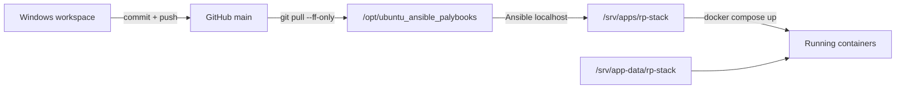

# Эксплуатация и карта репозитория

[← Данные и безопасность](08-data-and-security.md) · [Главная](README.md)

## Модель доставки

RP Stack развёртывается pull-based. GitHub не подключается к домашнему серверу.



Обычный цикл:

1. изменить source/IaC локально;
2. выполнить статические и focused checks;
3. commit и push в `origin/main`;
4. на `abykovserv` запустить `sudo systemctl start ansible-local-apply.service`;
5. проверить journal, containers, pytest и HTTP/UI.

Команда Ansible прогоняет весь `site.yml`, но роли идемпотентны. Apps role отслеживает изменённые app artifacts, а Docker Compose не должен пересоздавать неизменный сервис без изменения image/config.

## Статусы доставки

Это четыре разных утверждения:

| Статус | Что доказано |
|---|---|
| Локально готово | Файлы изменены и проверены в workspace |
| Закоммичено | Есть Git commit |
| Запушено | Commit доступен в GitHub |
| Развёрнуто и live verified | Сервер подтянул revision, Ansible завершился, runtime проверен |

Push не означает deploy, а healthy containers не доказывают корректный пользовательский сценарий.

## Серверные команды

```bash
sudo systemctl start ansible-local-apply.service
sudo systemctl status ansible-local-apply.service --no-pager -l
sudo journalctl -u ansible-local-apply.service -n 100 --no-pager
```

Проверка RP Stack:

```bash
cd /srv/apps/rp-stack
docker compose ps
docker compose logs --tail=100 rp-gateway rp-light-gui rp-showcase-gui
docker compose run --rm rp-gateway pytest
curl -fsS http://192.168.1.88:8010/health
curl -fsS http://192.168.1.88:8010/api/worldpacks
curl -fsS http://192.168.1.88:8011/health
```

Для UI-изменений дополнительно проверяются authenticated DOM, фактические API responses и применённая server revision.

## Live verification интерактивных training artifacts

Snapshot от 31 июля 2026 года для revision `8b8a8fe`:

| Проверка | Результат |
|---|---|
| Server checkout | `/opt/ubuntu_ansible_palybooks` указывает на `8b8a8fecdef857ed0d0acbcd183a742aa09c2227` |
| Ansible | `Result=success`; recap: `ok=65`, `changed=6`, `unreachable=0`, `failed=0` |
| Контейнеры | Gateway, Light GUI, Showroom и Local LLM в состоянии `healthy` |
| HTTP/API | Light GUI и Showroom вернули `200`; публичный список Showroom-сценариев вернул `200`; защищённый `/api/worldpacks` без сессии ожидаемо вернул `401` |
| Gateway tests | Полный контейнерный прогон: `123 passed`, `3 failed`; focused artifacts: `5 passed` |
| Static UI assets | Shared JS/CSS вернули корректные MIME types; CSP запрещает внешние формы, frames и objects |
| Browser | Showroom и авторизованный Light GUI загрузились без console errors; Showroom отобразил письмо, artifact trigger и DOM-собранный credential-form |
| Privacy | Синтетические значения полей не появились в Gateway DB; сохранились только field IDs |
| Scoring | `link_opened`, `credentials_submitted` и `site_closed` потреблены следующим ходом и отражены в canonical evidence/counters |

Три падения полной suite воспроизводят существующий baseline вокруг Awareness safe fallback и счётчика autotest fallback; focused suite новой функции чистая. Во время браузерного прогона один narrator-вызов OpenRouter вернул `403`, после чего training safe fallback сохранил HTTP `200`, authored surface и дальнейшее deterministic scoring. Это operational warning провайдера, а не потеря artifact event.

Live-прогон использовал существующую тестовую Showroom-партию и продвинул её до пятого authored хода; это намеренная тестовая запись в persistent history.

## Карта репозитория

```text
ubuntu_ansible_palybooks/
├── inventories/local/group_vars/server.yml
├── playbooks/site.yml
├── roles/apps/
│   ├── tasks/main.yml
│   ├── templates/rp-stack.compose.yml.j2
│   ├── templates/rp-stack.env.j2
│   └── files/rp-stack/
│       ├── rp-gateway/
│       ├── rp-light-gui/
│       ├── rp-showcase-gui/
│       ├── ui-shared/
│       ├── worldpacks/
│       ├── state/schema.json
│       ├── docs/decisions/
│       └── scripts/
├── codex-skills/
│   ├── abykovserv-iac-deploy/
│   ├── rp-world-pack-builder/
│   └── training-world-pack-builder/
└── docs/wiki/
```

## Gateway service map

| Файл | Ответственность |
|---|---|
| `app/main.py` | FastAPI composition, auth guards, public/party/admin endpoints |
| `services/party_store.py` | WorldPack registry, characters, profiles, parties, branches, autotests, dataset labels |
| `services/state_store.py` | State versions, turns, requests, checks, memory, journal, lore, audit, patches |
| `services/adjudicator.py` | Транзакционный pipeline хода и service jobs |
| `services/rule_engine.py` | Детерминированные исходы для режимов |
| `services/narrative.py` | Provider calls, prompt assembly, cache controls, model fallback |
| `services/validator.py` | Проверка narration и training debrief |
| `services/memory.py` | Immutable episodic chapters |
| `services/rp_story_memory.py` | RP-only cumulative living-memory snapshots и service-model update |
| `services/character_retrieval.py` | Выбор релевантных NPC без embeddings |
| `services/world_instructor.py` | Draft/preview/apply контракт изменения мира |
| `services/auth_store.py` | Users, sessions, provider keys, global settings |
| `services/showroom.py` | Scenarios, visitors, runs, portal snapshots, leaderboard |
| `services/training_artifacts.py` | Blueprint validation, party snapshots, idempotent events и public views |
| `services/autotest.py` | Ограниченный auto-player client |
| `services/service_models.py` | Глобальный service-model catalog/runtime |

## Где менять типовые функции

| Задача | Основные места |
|---|---|
| Новый endpoint | `rp-gateway/app/main.py`, schemas и tests |
| Изменить обработку хода | `adjudicator.py`, `rule_engine.py`, `validator.py` |
| Изменить prompt/memory | `narrative.py`, `memory.py`, `rp_story_memory.py`, `context_budget.py`, `state_store.py` |
| Изменить Light GUI | `rp-light-gui/index.html`, `app.js`, `styles.css` |
| Изменить Showroom | `rp-showcase-gui/` и `showroom.py` |
| Изменить training artifacts | `training_artifacts.py`, `ui-shared/`, оба UI и WorldPack contract |
| Новый RP/novel мир | `worldpacks/<slug>/` и `rp-world-pack-builder` |
| Новый training мир | `worldpacks/<slug>/` и `training-world-pack-builder` |
| Runtime/env/ports | `server.yml`, Compose/env templates |

### Планируемая зависимость training workspace

Decision 015 пока не меняет Compose и не требует Ansible apply. Будущая
реализация двух capability-флагов затронет Gateway schemas/ShowroomStore,
snapshot run, `TrainingArtifactService`, новый логический
`TrainingWorkspaceService`, StateStore, Showroom UI, shared safe renderers,
training builder contract и четыре комбинации тестов.

Новый контейнер не нужен для обычных JSON-файлов. Отдельный asynchronous worker
и новые persistent data paths допускаются только если будет одобрена загрузка и
предварительная конвертация реальных Office/PDF-ресурсов; это отдельное IaC
изменение, а не часть latency path открытия файла.

- [Decision 015](../../roles/apps/files/rp-stack/docs/decisions/015-training-scenario-interaction-capabilities.md)
- [Plan 015](../../roles/apps/files/rp-stack/docs/plans/015-training-scenario-interaction-capabilities.md)

## Проверки

Минимальный локальный набор для documentation-only change:

```powershell
git diff --check
```

Для кода Gateway:

```bash
python -m compileall rp-gateway/app
pytest
```

Для статических UI:

```bash
node --check app.js
node character-editor.test.js
node structured-content.test.js
node training-artifacts.test.js
```

Windows может не иметь runtime dependencies. Авторитетный Python test run — внутри rebuilt `rp-gateway` container на сервере. Локальный `compileall` или JS syntax check не является live proof.

Для WorldPack обязательны parse всех JSON и schema validation:

```powershell
python scripts\validate-state.py --state worldpacks\<slug>\state-seed.json --schema state\schema.json
```

## Secrets и local overrides

Host-specific и secret values находятся в:

```text
/etc/ansible/local-overrides.yml
```

Файл не коммитится. Не нужно переносить постоянные исправления напрямую в `/srv/apps/rp-stack`: следующий IaC apply может их заменить. Emergency hotfix должен быть немедленно отражён в Git.

## Rollback

Код откатывается новым revert/fix commit и повторным Ansible apply. Игровые данные восстанавливаются отдельно из `/srv/backups/rp-stack` после остановки контейнеров и проверки target paths.

## Базовые документы

- [Deployment skill](../../codex-skills/abykovserv-iac-deploy/SKILL.md)
- [Compose](../../roles/apps/templates/rp-stack.compose.yml.j2)
- [Operations](../../roles/apps/files/rp-stack/docs/operations.md)
- [Gateway tests](../../roles/apps/files/rp-stack/rp-gateway/tests)
