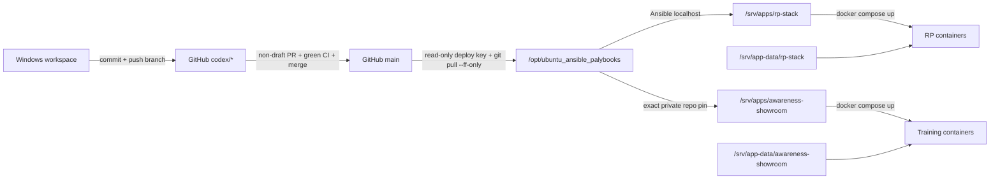

# Эксплуатация и карта репозитория

[← Данные и безопасность](08-data-and-security.md) · [Главная](README.md)

## Модель доставки

RP Stack развёртывается pull-based. GitHub не подключается к домашнему серверу.



Репозиторий приватный. Сервер читает его по SSH с отдельным read-only deploy key;
приватная часть ключа хранится только на `abykovserv`, не попадает в Git и не
используется для push.

Обычный цикл:

1. изменить source/IaC в `codex/`-ветке или изолированном worktree;
2. выполнить статические и focused checks;
3. сделать commit и push только рабочей ветки;
4. открыть non-draft PR, дождаться зелёного CI и смержить его в `main`;
5. пользователь интерактивно запускает на `abykovserv`
   `sudo systemctl start ansible-local-apply.service`;
6. проверить journal, containers, pytest и HTTP/UI.

Прямой push в `main` запрещён; готовую к merge работу нельзя оставлять в ветке.

Команда Ansible прогоняет весь `site.yml`, но роли идемпотентны. Apps role отслеживает изменённые app artifacts, а Docker Compose не должен пересоздавать неизменный сервис без изменения image/config.

## Статусы доставки

Это разные утверждения, которые нельзя сворачивать в одно:

| Статус | Что доказано |
|---|---|
| Локально готово | Файлы изменены и проверены в workspace |
| Закоммичено | Есть Git commit |
| Запушено | Commit доступен в GitHub |
| Ansible применён | Пользователь ввёл sudo-пароль интерактивно, сервер подтянул revision и apply завершился |
| Container/HTTP/browser verified | Соответствующий runtime-уровень проверен отдельно |

Push не означает deploy, а healthy containers не доказывают корректный пользовательский сценарий.

Готовность требований описывается отдельным словарём: `каркас` — код и модульные
тесты; `подключено` — исполнение в реальном тракте; `наблюдается` — эффект в
авторитетном хранилище и следующем prompt реальной партии; `держится` — повторные
последующие сцены без дрейфа. Реестры находятся в
`roles/apps/files/rp-stack/docs/decisions/registry/`, а Decision status не
заменяет ни одну из этих ступеней.

## Activation RP contract revision 7

Этот раздел фиксирует исторический activation proof revision 7. Упоминание
novel-party ниже сохранено только как evidence неизменности legacy-данных до
Decision 036; оно не описывает текущую возможность создать или продолжить такую
партию.

После закрытия всех registry-строк Plan 028 отдельный config-rollout задаёт
`rp_stack_gateway_rp_contract_observed_revision: 7`. Merge этого значения не
равен активации: effective production status появляется только после
интерактивного `ansible-local-apply.service`, проверки container env и создания
новой ordinary RP-party с persisted/runtime revision `7` без provider call.

Post-apply proof обязан также сохранить revisions всех ранее существовавших
parties/branches, оставить `novel` на `0` и WorldPack с declared revision `6` на
`6`. Rollback inventory к `6` ограничивает только будущие партии; уже созданная
revision-7 party остаётся pinned, автоматического downgrade нет.

Activation merge `a4076b0938f2b152f77e675e8545156ce783a8f3` применён 23 августа
2026 года с `16:21:00` до `16:23:40 MSK`; recap завершился с `ok=68`,
`changed=7`, `unreachable=0`, `failed=0`. Runtime env сообщил observed `7`.
Ordinary «Староста» `party_b286ed285388` сохранила revision `7` в API, SQLite и
runtime settings, control declared-6 party `party_7928b20be697` сохранила `6`,
а novel-party `party_517a98233313` сохранила `0`. У stamp parties не было turns,
turn requests или service/provider calls; rows/revisions прежних `63` parties и
`18` branches и их state-tree hashes не изменились, а novel follow-up повторил
equality для уже `65` parties. SQLite `quick_check` прошёл, четыре сервиса
healthy с `restarts=0`, оба UI вернули `200`, а deployed Gateway suite
завершилась `548 passed, 1 skipped`.

## RP contract revision 8: узкая source activation

[Decision 032](../../roles/apps/files/rp-stack/docs/decisions/032-rp-history-first-prompt-and-sectioned-memory.md)
и его registry rows остаются на ступени `каркас` до живых gates. Source rollout
задаёт `rp_stack_gateway_rp_contract_observed_revision: 8`, но declared revision
`8` получает только `merchant-sviatoslav`; остальные WorldPacks остаются на
`6/7`, existing parties не мигрируются. Ansible apply, container env и новая
stamp-party подтвердили effective revision `8` без narrator/service model calls.

Activation boundary revision `8` подтверждена. Более высокие readiness gates
по решению пользователя отложены до полной реализации RP-ядра:

1. на 25-й игровой единице prompt содержит 24 предыдущие playable units
   дословно, целевой порядок blocks и не использует fallback;
2. на 60-й единице отсутствуют episodic `memory` jobs/rows, один update сохраняет
   пять независимо покрываемых секций одним `section_key=all` call; forced
   structural failure не теряет четыре успеха и вызывает только exact section
   retry, а пустая валидная секция retry не получает;
3. safe coverage равен минимуму пяти section coverages, а RAW содержит
   квантованное окно 50–57 units плюс весь uncovered tail без gap; его начало и
   `stable_prompt_prefix_hash` меняются только при сдвиге восьмиходового якоря;
4. hard overflow удаляет целиком lore, затем только целые safely covered units,
   сохраняет минимум 20 и иначе fail-closed завершается до provider;
5. `service_call_log` показывает exact `provider=openrouter`,
    `model=deepseek/deepseek-v4-pro`, section input не более 20 000 символов,
    strict section JSON Schema без искусственного output `max_tokens`, отказ при
    фактическом `finish_reason=length`, не более двух durable job attempts и
    отсутствие fallback route для этих calls;
6. на 60-turn party `metadata_json` содержит `cached_prompt_tokens`,
   `prompt_tokens`, `stable_prompt_prefix_hash`; cache share не меньше 70% как
   минимум на пяти из каждых восьми последовательных ходов, а среднее по партии
   выше 8.6%.

Эти проверки являются будущими runtime gates, а не доказательством локальной
candidate-реализации и её deterministic test suite.

## RP contract revision 10: source activation

После поставки S2–S4 отдельный минимальный rollout задаёт
`rp_stack_gateway_rp_contract_observed_revision: 10`. `merchant-sviatoslav` и
`day-watch-moscow` объявляют revision `10`, но только первый содержит authored
world clock. Repository validation допускает revision `10` без
`files.world_clock`; объявленный календарь по-прежнему проверяется целиком.
Остальные WorldPacks остаются на своих `6/7`, а существующие партии сохраняют
закреплённую revision.

Merge этого значения не является runtime-активацией. После интерактивного
Ansible apply новая ordinary party «Купца» должна сохранить revision `10` в API,
SQLite и runtime settings. Затем 60-turn DeepSeek Flash party с подтверждённой
GM-коррекцией должна отдельно доказать секционную память, скользящее RAW-окно,
кэш после сдвига якоря, world clock, `RELATIONSHIP_PRESSURE` в следующем prompt
и отсутствие NVIDIA во всех provider/service routes. До этих проверок S1–S4 не
получают ступень выше `каркас` только из-за source activation.

Новая ordinary party `day-watch-moscow` после apply также должна сохранить
revision `10`, но не создавать `state.world_clock` и clock service jobs. Это
проверяет optional boundary, не является S4 clock canary и не мигрирует прежние
партии мира.

Первый production endurance от 2026-08-26 на
`party_c82153b0c2da` прошёл opening и 60 scene turns на DeepSeek Flash без
narrator fallback. `RELATIONSHIP_PRESSURE` дошёл до 57 prompt, normal memory
дважды обновила все пять секций одним OpenRouter-запросом, RAW anchor реально
сдвинулся с cold cache и снова прогрелся, world clock совпал с canonical state,
а NVIDIA не появилась ни в одном party/service route.

Тот же прогон честно выявил пять разрывов: карточка игрока исчезала после
opening и при repair; односекционная GM-коррекция застряла active из-за
collision replacement `fact_id`, а retry имел crash/race gaps; 42 valid-empty и
18 ошибочно terminal relationship responses дали ноль новых causes; due pressure
перенёс отсутствующую Милаву в текущую сцену; opening не видел canonical date.
Source closure сохраняет компактную карточку и active correction в repair,
делает absorption idempotent/latest-slot-safe, отправляет invalid relationship
output в существующий `retry -> stale`, запрещает pressure телепортировать NPC и
проецирует часы в opening. До повторной post-apply ручной партии весь этот набор
остаётся на уровне `каркас`.

## RP contract revision 11: mechanism and activation

[Decision 041](../../roles/apps/files/rp-stack/docs/decisions/041-rp-narrative-presets-and-opening-seeds.md)
поставлен двумя раздельными изменениями. PR #85 поднял Gateway source ceiling и
provider-canary argument до `0..11`, добавил API/storage/UI mechanism,
repository guards и docs, сохранив inventory observed `10`. Activation PR #86
добавил отдельный `day-watch-moscow-v2`, не меняя v1, и переключил source
inventory на observed `11`. Repository gate требует эти pack и observed value в
одной activation-поставке, поэтому ordinary party не может молча получить
effective revision `10` для revision-11 manifest.

Merge `80ab6d3f199b8935d4efdac7d5b55437dbb837e7` применён 27 августа 2026
года. Ansible recap: `ok=69`, `changed=7`, `unreachable=0`, `failed=0`; server
checkout совпал с merge, все 28 файлов deployed `day-watch-moscow-v2` совпали с
source по SHA-256, четыре контейнера остались healthy, HTTP smoke прошёл, а
production-image Gateway suite завершилась `657 passed, 1 skipped`.

Авторизованный Light GUI показал presets `book/action/strategic` и все четыре
opening seeds. Ordinary party `party_3e09b9092765` сохранила revision `11`,
`preset_id=strategic`, `opening_id=inquisition-observer`, audit hashes, выбранную
роль и полный seed с 11 NPC без world clock. Recorded prompts содержали выбранные
opening и preset. Auto-start дошёл до этого prompt, но выбранный тогда Gemini
profile вернул HTTP `400`; после переключения party на OpenRouter
`deepseek/deepseek-v4-flash` два последующих хода завершились HTTP `200` без
fallback и repair и продолжили сцену Инквизиции. Registry 041 поэтому имеет
уровень `подключено`; отдельного зарегистрированного causal probe и endurance для
`наблюдается` или `держится` нет.

## Codex devkit, worktrees и CI

Репозиторий содержит собственный Codex-контур:

```text
AGENTS.md                                      repository authority и delivery rules
.codex/config.toml                            project hooks
.codex/hooks.json                             PreToolUse policy
.agents/plugins/marketplace.json              repo-scoped plugin catalog
plugins/rp-stack-devkit/                      skill, read-only MCP/CLI, hooks, checklist
plugins/rp-stack-devkit/.mcp.json             объявление read-only MCP rp-stack-ops
scripts/ci.ps1                                агрегатная локальная диагностика
scripts/validate-adr-registry.py              readiness/oracle/causal registry guard
scripts/run-rp-stack-evals.ps1                offline/provider/browser eval entrypoint
.github/workflows/ci.yml                      GitHub Actions parity gate
docs/repository-work-standard.md              короткий проверяемый контракт окружения
scripts/sync-codex-skills.ps1                 repo -> installed skills check/install
```

`.codex/config.toml` содержит только `[features] hooks = true`; MCP объявлен
плагином через `plugins/rp-stack-devkit/.mcp.json`, а не через project
`[mcp_servers]`. Канонические standalone-скиллы находятся в `codex-skills/`;
копии в `%USERPROFILE%\.codex\skills\` применяются командой
`powershell.exe -File scripts/sync-codex-skills.ps1 -Mode Apply` и не
редактируются отдельно. После синхронизации или обновления плагина нужна новая
задача Codex.

На проверенной Windows-машине SSH использует явный ключ
`~/.ssh/id_ed25519_codex_abykovserv`; `ssh-agent` остановлен и отключён. Devkit
передаёт ключ через `-i`. `sudo -n` на сервере не проходит, поэтому Codex
останавливается на статусе `merged`, а apply запускает пользователь
интерактивно без передачи пароля в задачу.

Каждая независимая задача выполняется в `codex/` branch или отдельном worktree.
Codex пушит только рабочую ветку, открывает non-draft PR, дожидается зелёного CI
и сам мержит PR в `main`; прямой push в `main` запрещён, а готовая работа не
остаётся лежать в ветке.
Scheduled проверки также получают отдельный worktree и работают report-only:
они не merge/push/deploy/restore и не меняют живые Party без нового явного
запроса.

Локальный `scripts/ci.ps1` агрегирует проверки JSON, Wiki links/fences,
AGENTS/hooks/plugin, state и training contracts, workflow scripts, Python
syntax, JS syntax/tests и полный Gateway pytest. Его запускают при изменении
общего гейта, на integration/cutover и перед deployment, а обычный PR проверяет
затронутый риск focused-командами. GitHub Actions повторяет контракты на чистом
runner и добавляет `ansible-playbook --syntax-check`. Dependabot раз в неделю
проверяет GitHub Actions и Gateway Python dependencies.

`rp-stack-ops` — read-only интерфейс диагностики, а не альтернативный deploy
path. Публикация и apply остаются намеренно отдельными действиями. Для ручного
CLI:

```powershell
powershell.exe -File scripts/rp-stack-ops.ps1 -Action local_revision
powershell.exe -File scripts/rp-stack-ops.ps1 -Action compose_status
powershell.exe -File scripts/rp-stack-ops.ps1 -Action gateway_test -Scope training
powershell.exe -File scripts/rp-stack-ops.ps1 -Action loop_probe -PartyId <party_id>
powershell.exe -File scripts/rp-stack-ops.ps1 -Action causal_probe -PartyId <party_id> -Expectation seed_trust_influences_plot
powershell.exe -File scripts/rp-stack-ops.ps1 -Action service_llm_trace -PartyId <party_id> -Turn <party_turn>
```

`causal_probe` принимает только зарегистрированные expectation-ключи:
`seed_trust_influences_plot`, `relationship_pressure_reaches_next_turn_prompt`,
`relationship_event_has_canonical_character_attribution`,
`relationship_badge_has_canonical_character_attribution` и
`trust_gained_reaches_next_turn_prompt`. Пробы атрибуции и бейджа заканчиваются
на durable-проекции; остальные перечисленные цепочки дополнительно ищут
`RELATIONSHIP_PRESSURE` в более позднем prompt.

`loop_probe` возвращает только necessary-not-sufficient счётчики. Для
причинного утверждения используется `causal_probe`, который показывает каждую
ступень и точку обрыва. `service_llm_trace` читает точные редактированные записи
`service_call_log`; все три операции открывают SQLite через `mode=ro` и не имеют
пути записи.

Provider canary запускается только с `-ConfirmProviderRun`, использует Gateway
autotest branch, принимает повторные `-SemanticResponsesFile` и проверяет, что
source history/state не изменились. Полные
правила трёх уровней находятся в
[RP Stack evals](../../roles/apps/files/rp-stack/evals/README.md).

## Серверные команды

```bash
sudo systemctl start ansible-local-apply.service
sudo systemctl status ansible-local-apply.service --no-pager -l
sudo journalctl -u ansible-local-apply.service -n 100 --no-pager
```

Проверка live RP Stack до C1 apply:

```bash
cd /srv/apps/rp-stack
docker compose ps
docker compose logs --tail=100 rp-gateway rp-light-gui rp-showcase-gui
docker compose run --rm rp-gateway pytest
curl -fsS http://192.168.1.88:8010/health
curl -fsS http://192.168.1.88:8010/api/worldpacks
curl -fsS http://192.168.1.88:8011/health
```

### C1 Decision 018: source готов, apply ожидается

Живой runtime пока остаётся прежним: старый Showroom занимает `:8011`, а I1
shadow доступен только на loopback `:18011`. C1 source уже закрепляет exact
standalone commit `b72c481d616d6b8d654dc198d4973dce4e3e123c`, LAN-only
`192.168.1.88:8011`, production `SCENARIO_TYPE=rp` для старого Gateway и RP
Compose без `rp-showcase-gui`. Ни одно из этих переключений не считается
применённым до интерактивного Ansible apply.

```text
/srv/apps/awareness-showroom
/srv/app-data/awareness-showroom/gateway
/srv/app-data/awareness-showroom/state
/srv/app-data/awareness-showroom/showroom-covers
/srv/backups/awareness-showroom
```

Закреплённый application commit несёт Git-каталог
`/app/configs/showroom/scenarios.json`, а runtime `.env` включает его через
`SHOWROOM_CATALOG_PATH`. Gateway при startup идемпотентно согласует
только объявленные training configs и covers. Он не импортирует legacy
runs/users/sessions/keys и не удаляет посторонние DB-строки. Сценарии становятся
видимыми на production `:8011` только после apply и успешного startup.

External checkout — единственный явно opt-in ownership exception Apps role:

- root Git fetch/reset получают exact per-command
  `safe.directory=/srv/apps/awareness-showroom`;
- сразу после reset checkout и `.git` рекурсивно приводятся к
  `abykov:abykov`, чтобы операторский Git не получал `dubious ownership`;
- ownership-only change не входит в collector Compose restarts;
- tracked `.env.example` остаётся source-owned и не перезаписывается
  Ansible; server-only секреты по-прежнему рендерятся только в `.env`.

После C1 apply эти границы проверяются отдельно:

```bash
cd /srv/apps/awareness-showroom
git status --short
stat -c '%U:%G %n' . .git .env.example
docker compose exec -T awareness-gateway printenv SHOWROOM_CATALOG_PATH
test "$(git rev-parse HEAD)" = "b72c481d616d6b8d654dc198d4973dce4e3e123c"
curl -fsS http://192.168.1.88:8011/api/showroom/scenarios
```

`git status --short` должен быть пустым, путь каталога и exact pin — точными, а
owner трёх проверяемых paths — `abykov:abykov`. Отдельно в
`/srv/apps/rp-stack` проверяются отсутствие `rp-showcase-gui` в active Compose,
`SCENARIO_TYPE=rp`, HTTP `:8010` и отказ training payload до DB/provider write.
Эти shape checks ещё не доказывают provider-turn, scoring, debrief, resume или
backup/restore.

C1 apply переводит `:8011` на новый Showroom, а старый Compose становится
RP-only. `:8010` не меняется. Проекты не разделяют SQLite/state/cookies/network и
не вызывают Gateway друг друга. После apply обязательны оба полных Awareness
курса, реальный provider-turn, artifact/workspace scoring, debrief, resume,
browser check, SQLite integrity и backup/test-restore.

Владелец явно снял перенос истории, visitors/runs и ожидание legacy sessions как
блокеры C1. Старая RP SQLite остаётся нетронутой. Старый Showroom/training source
физически не удаляется до отдельной команды O2; до неё rollback возвращает
предыдущий IaC topology/pin, а новую SQLite не сливают обратно. Полный порядок и
acceptance matrix: [Plan 018](../../roles/apps/files/rp-stack/docs/plans/018-awareness-showroom-project-split.md).

Gateway строится из корня `rp-stack`: образ получает приложение и тесты из
`rp-gateway`, а также `/evals`, `/scripts` и `/worldpacks`, которые нужны полному
контейнерному pytest. Поэтому `docker compose run --rm rp-gateway pytest`
проверяет тот же acceptance evaluator и WorldPack-контракты, что repository CI,
а не урезанный набор без семантического оракула.

Для UI-изменений дополнительно проверяются authenticated DOM, фактические API responses и применённая server revision.

### Эксплуатация Turn Trace Workbench

Workbench не добавляет контейнер, порт или новый data path: API, SQLite-таблицы и
статические Light GUI assets доставляются существующими Gateway/Light GUI
образами, а данные входят в обычный `/srv/app-data/rp-stack/gateway` и backup.

После apply проверяются отдельно:

1. admin/operator list и detail для исходной party и выбранного `branch_id`;
2. failed request без committed turn и фактические main/background phases;
3. идемпотентная annotation и соответствующий audit event без state change;
4. отказ обычному owner и отсутствие trace route/page в Showroom;
5. legacy `rp_contract_version`, новая `rp_contract_revision` и generic rendering
   незнакомой фазы;
6. отсутствие секретов в exact diagnostic payload и рост SQLite/backup при
   unlimited retention.

Диагностический просмотр SQLite выполняется только через read-only `mode=ro`.
`SERVICE_CALL_LOG_RETENTION_DAYS=0` — unlimited default; положительный срок
задаётся через IaC-переменную
`rp_stack_gateway_service_call_log_retention_days` в
`/etc/ansible/local-overrides.yml` и проверяется отдельным cutoff-тестом. Healthy
container или HTTP `200` не заменяет authenticated admin-browser canary и
проверку сохранённых строк.

### Cutover controls Decision 043

IaC доставляет `RP_REBUILD_ENABLED`, отдельный `RP_DATABASE_URL`, kill switches
Narrator/atomic/Administrator, model choice Administrator и интервалы runner.
В committed server inventory `RP_REBUILD_ENABLED=false`: merge и обычный apply
ещё не активируют clean ordinary RP.

Перед включением отдельно проверяются: пустая clean DB, backup обоих SQLite,
exact container env, health, один preset и один free API-flow, provider
failure/retry без partial turn, restart с pending jobs без роста attempts,
owner-scoped Administrator decision и отсутствие ordinary legacy RP в
state/autotest/dataset/trace. Training и Showroom должны пройти свои retained
smokes; Training smoke включает фильтрованный каталог WorldPack, template,
draft/save персонажа и создание партии. После этого нужны authenticated Light
GUI smoke и настоящая Party;
pytest, CI, healthy container и HTTP `200` не являются live gameplay proof.

## Live verification интерактивных training artifacts

Snapshot от 31 июля 2026 года для revision `8b8a8fe`:

| Проверка | Результат |
|---|---|
| Server checkout | `/opt/ubuntu_ansible_palybooks` указывает на `8b8a8fecdef857ed0d0acbcd183a742aa09c2227` |
| Ansible | `Result=success`; recap: `ok=65`, `changed=6`, `unreachable=0`, `failed=0` |
| Контейнеры | Gateway, Light GUI, Showroom и Local LLM в состоянии `healthy` |
| HTTP/API | Light GUI и Showroom вернули `200`; публичный список Showroom-сценариев вернул `200`; защищённый `/api/worldpacks` без сессии ожидаемо вернул `401` |
| Gateway tests | Полный контейнерный прогон: `123 passed`, `3 failed`; focused artifacts: `5 passed` |
| Static UI assets | Shared JS/CSS вернули корректные MIME types; CSP запрещает внешние формы, frames и objects |
| Browser | Showroom и авторизованный Light GUI загрузились без console errors; Showroom отобразил письмо, artifact trigger и DOM-собранный credential-form |
| Privacy | Синтетические значения полей не появились в Gateway DB; сохранились только field IDs |
| Scoring | `link_opened`, `credentials_submitted` и `site_closed` потреблены следующим ходом и отражены в canonical evidence/counters |

Три падения полной suite воспроизводят существующий baseline вокруг Awareness safe fallback и счётчика autotest fallback; focused suite новой функции чистая. Во время браузерного прогона один narrator-вызов OpenRouter вернул `403`, после чего training safe fallback сохранил HTTP `200`, authored surface и дальнейшее deterministic scoring. Это operational warning провайдера, а не потеря artifact event.

Live-прогон использовал существующую тестовую Showroom-партию и продвинул её до пятого authored хода; это намеренная тестовая запись в persistent history.

## Карта репозитория

```text
ubuntu_ansible_palybooks/
├── inventories/local/group_vars/server.yml
├── playbooks/site.yml
├── roles/apps/
│   ├── tasks/main.yml
│   ├── templates/rp-stack.compose.yml.j2
│   ├── templates/rp-stack.env.j2
│   └── files/rp-stack/
│       ├── rp-gateway/
│       ├── rp-light-gui/
│       ├── rp-showcase-gui/
│       ├── ui-shared/
│       ├── worldpacks/
│       ├── state/schema.json
│       ├── docs/decisions/
│       └── scripts/
├── codex-skills/
│   ├── abykovserv-iac-deploy/
│   ├── rp-world-pack-builder/
│   └── training-world-pack-builder/
├── plugins/rp-stack-devkit/
├── .codex/
├── .github/workflows/ci.yml
├── AGENTS.md
├── scripts/ci.ps1
├── scripts/rp-stack-ops.ps1
├── scripts/run-rp-stack-evals.ps1
└── docs/wiki/
```

## Gateway service map

| Файл | Ответственность |
|---|---|
| `app/main.py` | FastAPI composition and lifespan, auth guards, public/party/admin endpoints |
| `services/party_store.py` | WorldPack registry, characters, profiles, parties, branches, autotests, dataset labels |
| `services/state_store.py` | State versions, turns, requests, checks, memory, journal, lore, audit, patches |
| `services/adjudicator.py` | Транзакционный pipeline хода и service jobs |
| `services/rule_engine.py` | Детерминированные исходы для режимов |
| `services/narrative.py` | Provider calls, prompt assembly, cache controls, model fallback |
| `services/validator.py` | Проверка narration и training debrief |
| `services/memory.py` | Immutable episodic chapters |
| `services/rp_story_memory.py` | RP-only cumulative living-memory snapshots и service-model update |
| `services/rp_history.py` | Revision-8 playable-unit eligibility, quantized RAW `50–57 + uncovered`, safe coverage и scan window |
| `services/character_retrieval.py` | Выбор релевантных NPC без embeddings |
| `services/world_instructor.py` | Draft/preview/apply контракт изменения мира |
| `services/auth_store.py` | Users, sessions, provider keys, global settings |
| `services/showroom.py` | Legacy-копия до O2; после C1 routes отсутствуют в RP Gateway |
| `services/training_artifacts.py` | Legacy-копия до O2; active training artifacts принадлежат standalone project |
| `services/autotest.py` | Ограниченный auto-player client |
| `services/service_models.py` | Глобальный service-model catalog/runtime |
| `services/service_model_client.py` | Exact redacted service-model log, request/attempt metadata и retention |
| `services/turn_trace.py` | Request/branch/revision-aware trace read model и аннотации |
| `app/rp/` | Clean RP schema/engine, Narrator/provider boundary, atomic/Administrator handlers и lifespan runner |

Gateway запускает восстановление через единый FastAPI `lifespan`, а не через
устаревшие `startup`/`shutdown` handlers. Для clean RP тот же lifespan возвращает
claimed job в `pending`, запускает два role loop, а на shutdown делает cancel и
await обоих loops. Legacy Training/Showroom recovery остаётся отдельным
ограниченным трактом.

## Где менять типовые функции

| Задача | Основные места |
|---|---|
| Новый endpoint | `rp-gateway/app/main.py`, schemas и tests |
| Изменить обработку хода | `adjudicator.py`, `rule_engine.py`, `validator.py` |
| Изменить clean RP Decision 043 | `app/rp/`, `app/main.py`, clean `test_rp_*`; сохранять Training/Showroom isolation и exact provider boundary |
| Изменить prompt/memory | `narrative.py`, `memory.py`, `rp_story_memory.py`, `rp_history.py`, `context_budget.py`, `state_store.py` |
| Изменить Light GUI | `rp-light-gui/index.html`, `app.js`, `styles.css` |
| Изменить Turn Trace Workbench | `turn_trace.py`, `state_store.py`, `narrative.py`, `service_model_client.py`, `main.py`, Light GUI trace assets и tests |
| Изменить Showroom | `tavern-awareness-showroom` (`rp-showcase-gui/` и training Gateway) |
| Изменить training artifacts | `tavern-awareness-showroom`: `training_artifacts.py`, `ui-shared/`, Showroom и training WorldPack contract |
| Новый RP мир | `worldpacks/<slug>/` и `rp-world-pack-builder` |
| Новый training мир | `tavern-awareness-showroom/worldpacks/<slug>/` и `training-world-pack-builder` |
| Runtime/env/ports | `server.yml`, Compose/env templates |

### Зависимость training workspace

Decision 015 не добавляет новый контейнер, но active runtime-файлы теперь живут
в `tavern-awareness-showroom` и доставляются обычным Ansible apply. Реализация
двух capability-флагов затрагивает training Gateway schemas/ShowroomStore,
snapshot run, `TrainingArtifactService`, логический
`TrainingWorkspaceService`, StateStore, Showroom UI, shared safe renderers,
training builder contract и четыре комбинации тестов.

Новый контейнер не нужен для обычных JSON-файлов. Отдельный asynchronous worker
и новые persistent data paths допускаются только если будет одобрена загрузка и
предварительная конвертация реальных Office/PDF-ресурсов; это отдельное IaC
изменение, а не часть latency path открытия файла.

- [Decision 015](../../roles/apps/files/rp-stack/docs/decisions/015-training-scenario-interaction-capabilities.md)
- [Plan 015](../../roles/apps/files/rp-stack/docs/plans/015-training-scenario-interaction-capabilities.md)

## Проверки

Минимальный локальный набор для documentation-only change:

```powershell
git diff --check
```

Для кода Gateway:

```bash
python -m compileall rp-gateway/app
pytest
```

Для clean RP Decision 043 из каталога `rp-gateway`:

```bash
python -m pytest -q tests/test_rp_turn_engine.py tests/test_rp_world_scenario.py tests/test_rp_narrator_memory.py tests/test_rp_mechanics.py tests/test_rp_runner.py tests/test_rp_provider.py tests/test_rp_gateway_integration.py tests/test_rp_gateway_lifecycle.py
```

Focused-прогон проверяет clean SQLite, HTTP contract, один provider boundary,
runner lifecycle и изоляцию retained legacy paths. Он не доказывает доступность
реального provider, качество прозы, apply, браузер или живую Party.

Агрегатная проверка из корня для изменения общего гейта, integration/cutover или
перед deployment; semantic acceptance запускается при изменении игровой
семантики:

```powershell
powershell.exe -File scripts/ci.ps1
powershell.exe -File scripts/run-rp-stack-evals.ps1 -Mode SemanticAcceptance
```

Candidate provider-canary запускается только с явным
`-RpContractRevision <revision>`; для DC1 это `-RpContractRevision 7`. Отчёт
должен подтвердить совпадение requested и effective revision созданной branch.
Revision-8 S1 до повышения readiness дополнительно требует отдельные 25/60-turn
gates из Decision 032; локальный source test или revision stamp их не заменяет.

Для статических UI:

```bash
node --check app.js
node character-editor.test.js
node structured-content.test.js
node training-artifacts.test.js
```

Windows может не иметь runtime dependencies. Авторитетный Python test run — внутри rebuilt `rp-gateway` container на сервере. Локальный `compileall` или JS syntax check не является live proof.

Для WorldPack обязательны parse всех JSON и schema validation:

```powershell
python scripts\validate-state.py --state worldpacks\<slug>\state-seed.json --schema state\schema.json
```

## Отдельное приложение USE Framework

USE Framework не входит в RP Stack и не меняет authority Gateway. Он описан отдельным элементом `docker_apps` в `inventories/local/group_vars/server.yml`, клонируется из закрытого GitHub-репозитория на полном commit SHA и обслуживается собственным Compose из application repository.

По решению владельца сервис публикуется как `0.0.0.0:8765`, включая LAN `192.168.1.88` и Tailscale `100.117.52.16`, без nginx и DNS. Постоянные данные находятся в `/srv/app-data/use-framework`, backup — в `/srv/backups/use-framework`. Приватный исходный реестр НС1 хранится только как `/srv/app-data/use-framework/import/ns1-assets.xlsx`; Ansible preflight запрещает запуск без него, а application bootstrap отклоняет тестовые `example.test` snapshots. Токен операций записи генерируется серверным Ansible в `/etc/ansible/use-framework-api-token` и попадает только в runtime `.env`. Credential `use_framework_github_token` обязателен только в `/etc/ansible/local-overrides.yml`; роль не сохраняет его в remote URL или `.env` приложения.

Полный runbook, включая health, backup/restore и rollback: [USE Framework на abykovserv](../use-framework.md).

## Secrets и local overrides

Host-specific и secret values находятся в:

```text
/etc/ansible/local-overrides.yml
```

Файл не коммитится. Не нужно переносить постоянные исправления напрямую в `/srv/apps/rp-stack`: следующий IaC apply может их заменить. Emergency hotfix должен быть немедленно отражён в Git.

Repair-лимиты разделены: `MAX_REPAIR_ATTEMPTS` сохраняет RP-поведение, а
`TRAINING_REPAIR_ATTEMPTS` (IaC:
`rp_stack_gateway_training_repair_attempts`, default `1`) разрешает не более
одной коррекции только для мягкого нарушения `training_runtime`. Значение `0`
возвращает training к немедленному authored fallback; hard violations и
provider failures repair не получают при любом значении.

## Rollback

Код откатывается новым revert/fix commit и повторным Ansible apply. Игровые данные восстанавливаются отдельно из `/srv/backups/rp-stack` после остановки контейнеров и проверки target paths.

## Базовые документы

- [Deployment skill](../../codex-skills/abykovserv-iac-deploy/SKILL.md)
- [Compose](../../roles/apps/templates/rp-stack.compose.yml.j2)
- [Operations](../../roles/apps/files/rp-stack/docs/operations.md)
- [Gateway tests](../../roles/apps/files/rp-stack/rp-gateway/tests)
- [Decision 027 — Turn Trace Workbench](../../roles/apps/files/rp-stack/docs/decisions/027-turn-trace-workbench.md)
- [Decision 032 — history-first prompt и sectioned memory](../../roles/apps/files/rp-stack/docs/decisions/032-rp-history-first-prompt-and-sectioned-memory.md)
