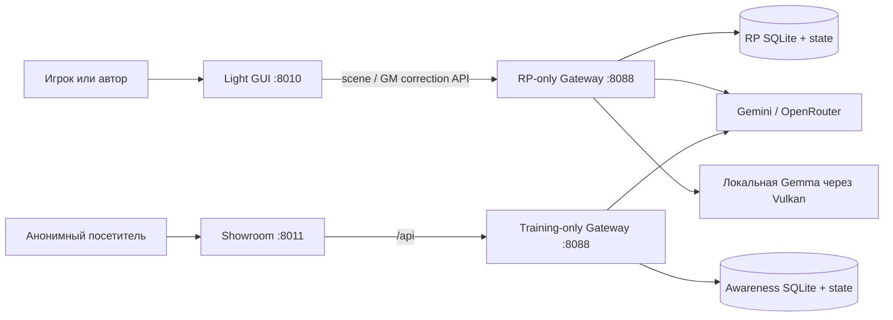

# RP Stack Wiki

RP Stack — это управляемая через Infrastructure as Code платформа для ролевых игр и детерминированных учебных симуляций. Пользователь видит чат и игровые инструменты, но состояние мира, правила, история, память, модели и права доступа принадлежат Gateway.

Эта Wiki проверена 30 августа 2026 года и отделяет source revision от фактического
runtime. RP-only living story memory реализована в исходном коде и описана в
[Decision 016](../../roles/apps/files/rp-stack/docs/decisions/016-rp-living-story-memory.md),
но статус push, Ansible apply и live verification всегда сообщается отдельно.

Срезы 6–7 [Decision 043](../../roles/apps/files/rp-stack/docs/decisions/043-rp-stack-rebuild.md)
подключают clean World/Scenario/Party, provider, runner и Light GUI за
`RP_REBUILD_ENABLED`. Перенесён только `day-watch-moscow-v2`; preset/free Party
получают независимые immutable snapshots и SHA-256. C1 source удаляет
Training/Showroom из RP source и передаёт их standalone project с целевым
LAN-only `192.168.1.88:8011`. Inventory держит RP cutover-флаг выключенным, а
C1 apply ещё не выполнен: живой сервер пока использует прежний общий runtime.

[Decision 036](../../roles/apps/files/rp-stack/docs/decisions/036-retire-novel-and-nvidia.md)
выводит из активного контракта режим совместного романа и NVIDIA provider.
Новые Party старого Gateway принимают только `rp`, а standalone
ShowroomScenario — только `training`. Архивные Novel-записи сохраняют прежние
list/read, Turn Trace и dataset export; старые training-строки RP SQLite после
zero-window C1/O2 сохраняются, но остаются скрытыми. Активные cloud providers — Gemini и OpenRouter, а
служебные роли явно выбирают local или OpenRouter без смены provider при отказе
local runner. PR
[#68](https://github.com/abykovwww-byte/ubuntu_ansible_palybooks/pull/68)
слит merge-коммитом `0fb0ab0dd794e55eb9b2177c227c1591f97841c0` и применён на
`abykovserv` 24 августа 2026 года. Ansible завершился с `failed=0`, четыре
контейнера остались healthy, production-image Gateway suite дала `548 passed, 1 skipped`,
а браузерная проверка обоих UI не нашла активных Novel/NVIDIA
вариантов. Startup migration архивировала единственную legacy Novel-партию;
исторические NVIDIA profiles/party references сохранены без переназначения.
Поэтому S0 имеет уровень `подключено`; реальный outage local service model и
provider turn для historical NVIDIA party на production намеренно не запускались.

Кумулятивная поставка RP-ядра S1–S6 описана в
[Decision 026](../../roles/apps/files/rp-stack/docs/decisions/026-rp-core-delivery.md).
Observed revision `6` была последним live-confirmed baseline перед continuity
activation. 23 августа 2026 года merge
`a4076b0938f2b152f77e675e8545156ce783a8f3` применён на `abykovserv`; container
env и ordinary-party stamp proof подтвердили effective observed revision `7`.
Существующие партии остаются на своей закреплённой revision; 50-turn endurance
для той rev7 activation не заявлялся. Более поздний rev10 60-turn прогон описан
ниже и не мигрировал старые партии.

PR1 следующего continuity cycle описан в
[Plan 028](../../roles/apps/files/rp-stack/docs/plans/028-rp-continuity-project-design.md)
и [Decision 028](../../roles/apps/files/rp-stack/docs/decisions/028-rp-uncovered-tail-and-overflow.md):
revision `7` сохраняет полный raw tail после effective story-memory
coverage и выполняет bounded recovery при hard overflow. Tail/stamp и paired
fit/reject overflow proofs имеют уровень `подключено`: production-store canary
после force-refresh либо вызвала narrator и committed ход, либо при оставшемся
`26917 > 4000` завершилась до narrator без нового turn/state/relationship
projection. Ранний Merchant narration, сместивший действие, не доказывает
semantic continuity или уровень `наблюдается`. Этот overflow evidence run
выполнялся при observed `6`; последующий activation stamp подтвердил ordinary
observed `7`, existing parties автоматически не мигрировали.

Второй отдельный slice принят в
[Decision 029](../../roles/apps/files/rp-stack/docs/decisions/029-scene-scoped-relationship-pressure.md).
Он ограничивает relationship pressure производным pre-scene набором из той же
локации, explicit current-action aliases или `Outcome.target`; active threads
только ранжируют уже eligible NPC. Absent due obligation остаётся active.
Контракт имеет уровень `подключено`: merge применён, а isolated revision-7
canary записал один relationship system-block с Миленой; Бажена и Радогост
отсутствовали, а due `favour` Бажены остался active после omission, хотя она
оставалась remote active-thread member. Это не доказывает semantic continuity
или уровень `наблюдается` и сам по себе не активирует observed rollout.

Третий document-first slice принят в
[Decision 030](../../roles/apps/files/rp-stack/docs/decisions/030-rp-prompt-authority-and-deduplication.md).
Для revision `7` он задаёт обязательный `PROMPT_AUTHORITY_HIERARCHY` block и
порядок outcome/current action → uncovered raw tail → `RP_STORY_MEMORY` →
archive; safety line уточняет, что current action — intent, а не автоматически
совершившийся факт. При наличии effective story snapshot non-empty legacy
`long_term_memory` candidate подавляется как `structural_deduplication`, а
optional blocks удаляются целиком только при реальном hard token overflow.
Content-free `prompt_assembly` должен фиксировать exact coverage, raw-tail IDs,
block identities и omission reasons с recorded parity между turn metadata,
trace, Prompt Inspector `source=last` и recorded context; current dry-run
использует ту же schema для собственной assembly. Это JSON/API diagnostic
initial full narrator assembly: compact validation-repair остаётся отдельной
attempt в private admin Turn Trace, а отдельного GUI renderer нет. Исключение
хода из narrative memory не должно скрывать его content-free projection.
Isolated live canary
`autotest_2eb4d5e1a53f` / `branch_ccf0d535a98c` подтвердил exact structural
deduplication: primary attempt получил `403`, последующий transport
model-fallback `openrouter/auto` — `200`; оба получили exact same prompt.
Validation repair и Gateway safe-fallback text не использовались; source revision `0`
и exact state/projection/table hashes не изменились. После PR61/apply excluded
latest turn `party_ad201794ce31` вернул exact equal `prompt_assembly` из metadata,
trace, Prompt Inspector `source=last` и recorded context. Отдельная canary
`party_1bc1a1204dde` при full prompt `15360` и hard budget `15359` удалила целый
`relevant_characters`, записала reason `hard_input_budget`, вызвала mock-narrator
один раз и committed turn/state; protected existing-party hashes не изменились.
Opening parity подтверждена четвёртым slice. Поэтому все три registry-row
Decision 030 имеют уровень `подключено`. Scope остаётся normal
party-chat/admin-autotest plus opening parity из DC4; semantic output не доказан,
отдельного GUI renderer нет. Activation выполняется отдельным inventory change.

Четвёртый document-first slice принят в
[Decision 031](../../roles/apps/files/rp-stack/docs/decisions/031-rp-scene-state-and-atomic-continuity.md).
Он задаёт revision-7-only canonical `scene_state`, минимальный private narrator
bundle с одним `{location_id, present_character_ids}` snapshot и bounded typed
`scene_delta`, deterministic continuity gate и atomic SQLite state/turn commit.
Authorized operation с unmatched evidence immediately dropped без repair с
durable value/evidence, audit и stale/as-of marker; hard schema, unknown ID,
forbidden field, unauthorized transition или scene-claim mismatch получает одну
repair-попытку, затем no commit. Finite authored loyalty/faction/optional stable
role защищает узкий alias-based narration guard; mechanic relationship roles и
unknown free prose не становятся semantic oracle. Pre-bundle transport fallback
сохраняется как noncanonical turn с `story_memory_canonical=false`, но его
narrator prose исключается из raw/story-memory/chapter/retrieval canon; player
input и unresolved as-of marker остаются явными для следующего prompt. Opening,
world-command stale policy и post-commit best-effort `current.json` входят в тот
же контракт. Все четыре registry-строки Decision 031 имеют уровень
`подключено`: isolated production-store proofs подтвердили accepted
opening/normal и anchored/drop-stale paths (`party_16f68f4f2ba3`), repeated hard
mismatch без commit (`party_48fd541fdb8d`) и excluded noncanonical fallback без
утечки prose/relationship canon (`party_ad201794ce31`). External provider calls
не выполнялись; это не уровень `наблюдается`. Отдельный inventory rollout теперь
применён и post-apply stamp proof подтвердил effective observed `7`.

History-first S1 описан в
[Decision 032](../../roles/apps/files/rp-stack/docs/decisions/032-rp-history-first-prompt-and-sectioned-memory.md).
Для RP revision `8` S1 переносит prompt-бюджет на дословное квантованное окно
50–57 игровых единиц плюс все ещё не покрытые единицы и на пять независимо
покрываемых секций story memory. Штатно все пять возвращаются одним OpenRouter
вызовом; отдельно повторяется только секция со структурно невалидным ответом,
а пустая валидная секция не повторяется. Безопасное покрытие равно минимуму пяти
section coverages. Rev8 narrator больше не получает legacy scene/state/archive
blocks и возвращает plain text; relationship scope определяется текущей
репликой и тремя предыдущими игровыми единицами. Rules и якорные первые 50 RAW
units образуют повторяемый provider prefix; память/cards/pressure/note находятся
в хвосте, а cache counters и hash основы сохраняются в turn metadata. Код S1 и
узкая activation применены на сервере: новая stamp-party «Купца» получила
effective revision `8`, но model calls не выполняла. Live-gates 25/60 отложены
до полной реализации RP-ядра, поэтому registry 032 остаётся на ступени
`каркас`; остальные packs и existing parties не мигрируют.

S2 описан в
[Decision 037](../../roles/apps/files/rp-stack/docs/decisions/037-rp-authored-lore-cards-and-confirmed-drafts.md).
Rev8 WorldPack может нести короткие reviewed Lore Cards: при создании новой
party они копируются без model call, а в ходе выбираются одним current-plus-three
scan только по whole title/keywords. Скрытый content не активирует сам себя.
Light GUI показывает под ответом точные поднятые cards из turn metadata и даёт
явно подготовить draft из завершённого хода; запись появляется только после
подтверждения игроком. Source/local readiness S2 пока остаётся `каркас`.

S3 описан в
[Decision 038](../../roles/apps/files/rp-stack/docs/decisions/038-rp-gm-corrections-and-player-overlay.md).
Candidate RP revision `9` отделяет обращение к мастеру от сцены: local Gemma
только классифицирует реплику и готовит bounded `before/after` draft, а канон
меняется лишь после явного confirm. Подтверждённая правка не сдвигает party turn,
сцену или игровое время, исключается из narrator RAW и временно защищает prompt
через `ИСПРАВЛЕНИЯ ИГРОКА`, пока одна затронутая section story memory не сохранит
её с authority `user`. Source/local readiness S3 — `каркас`. Первый применённый
revision-10 endurance подтвердил отдельный GM turn и реальный one-section call,
но выявил collision authority; текущий closure ещё ждёт повторного apply и
absorption-проверки. Ни одна существующая party не мигрируется.

S4 описан в
[Decision 039](../../roles/apps/files/rp-stack/docs/decisions/039-rp-world-clock-and-authored-events.md).
Revision `10` даёт WorldPack authored часы и cancelable global events:
local Gemma оценивает только elapsed последнего committed хода, а Gateway
атомарно применяет заранее написанные facts/Lore Card toggles. Narrator и Light
GUI получают короткое одноразовое событие с ближайшим horizon. Source/local
контур применён на `merchant-sviatoslav`; первый 25-ходовый DeepSeek Flash
canary подтвердил local clock jobs, authored event/fact и отсутствие NVIDIA, а
также выявил откат даты, ложное relationship evidence и потерянный alias. После
их исправления production party `party_c82153b0c2da` прошла opening и 60 обычных
ходов без narrator fallback: clock, sliding cache anchor и five-section memory
исполнились. Прогон одновременно выявил следующую группу разрывов: player card
исчезала после opening, invalid relationship outputs ошибочно завершались как
успех, due pressure переносил отсутствующего NPC, GM replacement не поглощался,
а opening не видел canonical date. Текущий closure-source закрывает именно эти
границы; до повторного apply и ручной партии readiness остаётся `каркас`.
`day-watch-moscow` отдельным compatible update также объявляет revision `10`,
но не содержит `world-clock.json`: новые партии получают cumulative rev8/rev9
контракты, а clock jobs, дата и `СОБЫТИЯ МИРА` для них не создаются.

[Decision 040](../../roles/apps/files/rp-stack/docs/decisions/040-rp-supervisor-rule-reassertion.md)
добавляет opt-in RP supervisor без новой revision и без authority над локацией.
После первых 56 canonical playable units и затем каждые восемь ходов Gateway
отдаёт глобальной служебной модели ровно последние 50 units для оценки шести
authored правил. `day-watch-moscow-v2` первым включает режим `observe`: оценки
хранятся и видны владельцу в панели памяти, но не меняют narrator prompt. Source
readiness Decision 040 остаётся `каркас` до apply и реального 50-turn baseline.

[Decision 041](../../roles/apps/files/rp-stack/docs/decisions/041-rp-narrative-presets-and-opening-seeds.md)
задаёт revision `11` и закрытые authored каталоги narrative presets/opening
seeds. Отдельная activation-поставка добавляет `day-watch-moscow-v2` рядом с
неизменённым v1 и настраивает inventory на observed `11`. Клиент выбирает
стабильные ID до создания партии, а Gateway один раз материализует полные
prompt/role/seed в её снимок. Activation merge `80ab6d3` применён 27 августа
2026 года; авторизованный Light GUI и ordinary party с non-default
`strategic`/`inquisition-observer` подтвердили реальный тракт, persisted snapshot
и выбранный prompt. Registry 041 имеет уровень `подключено`; causal probe и
endurance для более высоких ступеней не заявлены.

[Decision 042](../../roles/apps/files/rp-stack/docs/decisions/042-rp-explicit-gm-and-typed-lore-drafts.md)
сохраняет контракты typed Lore и Gateway-owned correction targets, а
[Decision 043](../../roles/apps/files/rp-stack/docs/decisions/043-rp-stack-rebuild.md)
принимает полный ребилд RP-контура вокруг World / Scenario / Party, трёх
раздельных модельных ролей и единственного мира `day-watch-moscow-v2`. Decision
043 вытесняет staged revision 8–12 rollout из 042; старый `Adjudicator` ради него
не расширяется. В срезах 6–7 clean `app/rp` подключён к существующим Party API,
provider client, FastAPI lifespan и Light GUI за `RP_REBUILD_ENABLED`. Новый
source-контракт возвращает один World, создаёт preset/free Party, коммитит
opening/ход только после успешного Narrator и ведёт три раздельные роли без
raw/fallback. После C1 RP UI/Gateway не имеют training path: обучение обслуживает
standalone Showroom. Apply, RP activation и live runtime ещё не выполнены;
inventory сохраняет флаг выключенным, поэтому страницы ниже явно различают
source-контракт и пока действующий production UX.

Интерактивные training artifacts из revision `8b8a8fe` применены на `abykovserv`
и прошли контейнерные, HTTP/API и браузерные live-проверки. Независимые флаги
links/workspace и рабочий диск реализованы в следующей IaC-ревизии согласно
[Decision 015](../../roles/apps/files/rp-stack/docs/decisions/015-training-scenario-interaction-capabilities.md);
её Ansible apply и live-проверка фиксируются отдельно.
Relationship pressure, deterministic attribution и упрощённый RP-контракт
`rp-core.v2` описаны в обновлённых разделах 03–05; их source revision, apply и
live-проверка всегда фиксируются раздельно.
Request-centric Turn Trace Workbench описан в
[Decision 027](../../roles/apps/files/rp-stack/docs/decisions/027-turn-trace-workbench.md):
это admin/operator-only диагностика Light GUI без доступа для обычного владельца
партии или Showroom. Такая граница не раскрывает участнику server-only training
policy из exact prompt. Workbench читает фактическую revision/version и фазы RP
core, но не является runtime authority, readiness oracle или зависимостью
реализации Decision 026.

## Главное за минуту

Ниже показана C1-топология, уже подготовленная в source. До интерактивного
Ansible apply живой сервер сохраняет прежний общий Gateway и старый Showroom на
`:8011`; target-схема ещё не является runtime-доказательством.

- **Gateway — authority своего процесса.** RP Gateway владеет только RP-партиями,
  а standalone Training Gateway — Showroom runs, scoring и training state; общей
  SQLite и runtime-вызовов между ними нет.
- **Party — единица изоляции.** `Party = WorldPack + PlayerCharacter + ModelProfile + NarratorSettings + ScenarioType + State + TurnHistory`.
- **LLM не определяет факты мира.** В `rp-core.v2` Gateway передаёт нейтральное продолжение сцены, активный state, абсолютные правила и relationship pressure, а затем проверяет ответ до commit; `training` по-прежнему получает детерминированный `AUTHORITATIVE_OUTCOME`.
- **Режим выбирается явно.** `rp` и `training` имеют разные runtime-контракты; WorldPack лишь объявляет совместимость. Выведенные записи старого режима доступны только как архивная история.
- **Учебные сайты — типизированные artifacts.** WorldPack задаёт безопасный шаблон, narrator заполняет только разрешённые текстовые поля, standalone Training Gateway хранит snapshot и события, а Showroom собирает безопасный DOM без загрузки training renderer в RP Light GUI.
- **История не равна памяти.** Сырые ходы хранятся постоянно, старые сцены сжимаются в эпизодические главы, а RP-партии дополнительно получают bounded living story memory. State остаётся отдельным авторитетным слоем; для `training` новый RP-слой полностью отключён.
- **Revision 7 включена для новых ordinary RP-партий.** Pull-based apply и stamp proof подтвердили effective observed `7`; все registry-строки DC1–DC4 остаются на уровне `подключено`. Semantic continuity, уровень `наблюдается` и миграция старых партий не заявляются.
- **Revision 10 активирована на уровне capability WorldPack.** «Купец» прошёл первый 60-turn production endurance как authored-clock canary; `day-watch-moscow` объявляет revision `10` без календаря. Текущий closure ещё не применён, а старые партии автоматически не мигрируют.
- **Revision 11 подключена на live-сервере.** Полные authored preset/opening выбираются по ID и закрепляются в party snapshot; applied `day-watch-moscow-v2` и ordinary party подтвердили non-default выбор и prompt path. Уровни `наблюдается` и `держится` без causal probe/endurance не заявляются.
- **RP supervisor пока только наблюдает.** Opt-in WorldPack получает шесть typed оценок по exact 50-turn окну каждые восемь ходов; `observe` ничего не подмешивает narrator и не вводит отдельную модель или локационную authority.
- **S2 оставляет Lore Cards короткими и управляемыми.** WorldPack cards reviewed до commit, hidden content не является trigger, exact raised IDs видны рядом с ответом, а service draft не сохраняется без подтверждения игрока.
- **S3 отделяет исправление от сцены.** Rev9 GM channel не вызывает narrator, показывает exact diff, сохраняет отдельный `gm_correction` и держит правку в защищённом overlay до one-section absorption; первый live-call выявил collision, исправленный повтор ещё впереди.
- **S4 отделяет время от канона.** Rev10 local Gemma возвращает только bounded elapsed; cancelable события и два разрешённых consequence применяет Gateway. Ordinary clock path уже исполнялся в 60-turn партии; исправленная opening-проекция и fallback retention ждут повторного live-proof.
- **Трасса начинается с request.** Workbench связывает запрос, фактические фазы и provider attempts даже без committed turn, а state и история остаются в существующих авторитетных хранилищах.
- **Параметры narrator принадлежат Party.** Light GUI позволяет настроить reasoning и бюджет ответа для Luna/Luna Pro, а для DeepSeek V4 Flash — также temperature и Top P; Gateway валидирует возможности модели и применяет их только к narrator-вызовам.
- **Развёртывание pull-based.** Изменения проходят `commit -> push рабочей ветки -> non-draft PR -> зелёный CI -> merge в main -> ansible-local-apply.service -> Docker Compose` на `abykovserv`.
- **Codex работает через repo policy.** `AGENTS.md`, project hooks, `rp-stack-devkit`, read-only ops MCP и три раздельных eval-уровня сохраняют authority и не смешивают local, pushed, applied и live-verified статусы.

## Текущие сервисы

Таблица ниже описывает фактический live runtime **до C1 apply**:

| Компонент | Доступ | Роль |
|---|---|---|
| Light GUI | `http://192.168.1.88:8010` и адрес Tailscale | Основной авторизованный интерфейс игры и администрирования |
| RP Showroom | `http://192.168.1.88:8011` и адрес Tailscale | Публичная витрина сценариев без регистрации |
| RP Gateway | Только внутренняя Docker-сеть, порт `8088` | API, правила, state, история, LLM-вызовы и хранение |
| Local LLM | Только внутренняя сеть `rp-llm`, порт `8080` | Gemma 4 26B A4B Q4 для служебных задач и опционального автотестового игрока |

> **C1 source подготовлен, apply ещё не выполнен:** public
> `tavern-awareness-showroom` закреплён exact commit
> `67244432659f6c25a268cbf788a8fa3af0f5b52f`. После apply `:8010` остаётся RP
> Light GUI, LAN-only `192.168.1.88:8011` обслуживается новым project, старый
> Showroom и training source отсутствуют в RP Compose/checkout, а старый Gateway
> принимает только `rp`. Rollback window по решению владельца равен `0`.
> Backup/restore и сквозная live-приёмка остаются отдельными проверками.
> Старую RP SQLite, state и backups C1/O2 не удаляет и не изменяет.

SillyTavern не входит в текущий Compose RP Stack. Lorebook JSON и совместимый `/v1/chat/completions` сохранены как legacy/compatibility-контур, но поддерживаемые браузерные пути — Light GUI и Showroom.

## Разделы

1. [Архитектура и границы](01-architecture.md) — компоненты, authority и потоки данных.
2. [Интерфейсы](02-interfaces.md) — Light GUI, Showroom, админка и compatibility API.
3. [Жизненный цикл хода](03-turn-lifecycle.md) — от сообщения игрока до state, валидации и фоновых задач.
4. [WorldPacks и режимы](04-worldpacks-and-modes.md) — новые World/Scenario, legacy WorldPacks, `rp` / `training`, публичность и архивная граница.
5. [Память, контекст и retrieval](05-memory-and-retrieval.md) — RP story memory, главы, raw history, бюджеты, lore, NPC и отсутствие embeddings.
6. [Модели и провайдеры](06-models-and-providers.md) — narrator, служебная модель, BYOK и local Gemma.
7. [Обучение, автотесты и датасеты](07-training-autotests-datasets.md) — детерминированный scoring, ветки и SFT JSONL.
8. [Данные, изоляция и безопасность](08-data-and-security.md) — SQLite, сессии, секреты, cookies и риски.
9. [Эксплуатация и карта репозитория](09-operations-and-repository.md) — IaC, пути, проверки и ключевые файлы.

## Базовые архитектурные правила

1. Canonical state и `AUTHORITATIVE_OUTCOME` выше текста модели, памяти и lore.
2. Любая игровая операция обязана разрешаться через `party_id` или безопасную Showroom-обёртку.
3. Сырые ходы, audit и state history не переписываются ради удобного summary или датасета.
4. Служебная модель глобальна и не использует пользовательские party BYOK-ключи.
5. Training-сценарий не использует случайный D20 и не раскрывает оценивание до debrief.
6. Секреты и локальные параметры хоста находятся вне Git, в `/etc/ansible/local-overrides.yml` и генерируемых server-only файлах.
7. Локальная Windows-машина — место редактирования и статических проверок, а не runtime RP Stack.

## Что пока не является реализованной функцией

- семантический RAG через embeddings и vector database;
- динамические или сгенерированные моделью варианты ответа игрока не реализованы;
  revision 11 использует только committed authored presets/opening seeds;
- встроенный GitHub Wiki-репозиторий — эта Wiki хранится в `docs/wiki/`, потому что `ubuntu_ansible_palybooks.wiki.git` ещё не инициализирован.

## Источники истины

- [Compose RP Stack](../../roles/apps/templates/rp-stack.compose.yml.j2)
- [Gateway API](../../roles/apps/files/rp-stack/rp-gateway/app/main.py)
- [World/Scenario loader/schema](../../roles/apps/files/rp-stack/rp-gateway/app/rp/content.py)
- [Архитектурные решения](../../roles/apps/files/rp-stack/docs/decisions)
- [WorldPacks](../../roles/apps/files/rp-stack/worldpacks)
- [Ansible-переменные](../../inventories/local/group_vars/server.yml)
