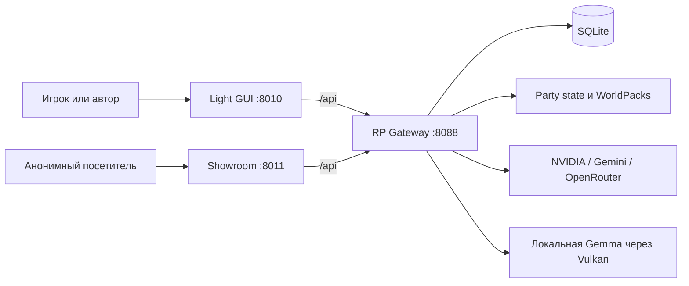

# RP Stack Wiki

RP Stack — это управляемая через Infrastructure as Code платформа для ролевых игр, совместного романа и детерминированных учебных симуляций. Пользователь видит чат и игровые инструменты, но состояние мира, правила, история, память, модели и права доступа принадлежат Gateway.

Эта Wiki проверена 12 августа 2026 года и отделяет source revision от фактического
runtime. RP-only living story memory реализована в исходном коде и описана в
[Decision 016](../../roles/apps/files/rp-stack/docs/decisions/016-rp-living-story-memory.md),
но статус push, Ansible apply и live verification всегда сообщается отдельно.

Кумулятивная поставка RP-ядра S1–S6 описана в
[Decision 026](../../roles/apps/files/rp-stack/docs/decisions/026-rp-core-delivery.md).
Candidate revision `6` применена на `abykovserv` и прошла изолированные
provider-canary. IaC поднимает observed revision до `6`: после применения этой
source revision новые обычные RP-партии получают `rp-core.v2` S1–S6. Существующие
партии остаются на своей закреплённой revision; 50-turn endurance пока не заявлен.
Интерактивные training artifacts из revision `8b8a8fe` применены на `abykovserv`
и прошли контейнерные, HTTP/API и браузерные live-проверки. Независимые флаги
links/workspace и рабочий диск реализованы в следующей IaC-ревизии согласно
[Decision 015](../../roles/apps/files/rp-stack/docs/decisions/015-training-scenario-interaction-capabilities.md);
её Ansible apply и live-проверка фиксируются отдельно.
Relationship pressure, deterministic attribution и упрощённый RP-контракт
`rp-core.v2` описаны в обновлённых разделах 03–05; их source revision, apply и
live-проверка всегда фиксируются раздельно.
Request-centric Turn Trace Workbench описан в
[Decision 027](../../roles/apps/files/rp-stack/docs/decisions/027-turn-trace-workbench.md):
это owner-scoped диагностика Light GUI без доступа из Showroom. Она читает
фактическую revision/version и фазы RP core, но не является runtime authority,
readiness oracle или зависимостью реализации Decision 026.

## Главное за минуту

- **Gateway — сервер игры.** Это не тонкий LLM-прокси: он владеет партиями, canonical state, ходами, памятью, совместимыми legacy-проверками, ветками, пользователями, моделями, Showroom и датасетами.
- **Party — единица изоляции.** `Party = WorldPack + PlayerCharacter + ModelProfile + ScenarioType + State + TurnHistory`.
- **LLM не определяет факты мира.** В `rp-core.v2` Gateway передаёт нейтральное продолжение сцены, активный state, абсолютные правила и relationship pressure, а затем проверяет ответ до commit; `training` по-прежнему получает детерминированный `AUTHORITATIVE_OUTCOME`.
- **Режим выбирается явно.** `rp`, `novel` и `training` имеют разные runtime-контракты; WorldPack лишь объявляет совместимость.
- **Учебные сайты — типизированные artifacts.** WorldPack задаёт безопасный шаблон, narrator заполняет только разрешённые текстовые поля, Gateway хранит snapshot и события, а оба UI используют общий DOM-renderer.
- **История не равна памяти.** Сырые ходы хранятся постоянно, старые сцены сжимаются в эпизодические главы, а RP-партии дополнительно получают bounded living story memory. State остаётся отдельным авторитетным слоем; для `training` новый RP-слой полностью отключён.
- **Трасса начинается с request.** Workbench связывает запрос, фактические фазы и provider attempts даже без committed turn, а state и история остаются в существующих авторитетных хранилищах.
- **Развёртывание pull-based.** Изменения проходят `commit -> push рабочей ветки -> non-draft PR -> зелёный CI -> merge в main -> ansible-local-apply.service -> Docker Compose` на `abykovserv`.
- **Codex работает через repo policy.** `AGENTS.md`, project hooks, `rp-stack-devkit`, read-only ops MCP и три раздельных eval-уровня сохраняют authority и не смешивают local, pushed, applied и live-verified статусы.

## Текущие сервисы

| Компонент | Доступ | Роль |
|---|---|---|
| Light GUI | `http://192.168.1.88:8010` и адрес Tailscale | Основной авторизованный интерфейс игры и администрирования |
| RP Showroom | `http://192.168.1.88:8011` и адрес Tailscale | Публичная витрина сценариев без регистрации |
| RP Gateway | Только внутренняя Docker-сеть, порт `8088` | API, правила, state, история, LLM-вызовы и хранение |
| Local LLM | Только внутренняя сеть `rp-llm`, порт `8080` | Gemma 4 26B A4B Q4 для служебных задач и опционального автотестового игрока |

SillyTavern не входит в текущий Compose RP Stack. Lorebook JSON и совместимый `/v1/chat/completions` сохранены как legacy/compatibility-контур, но поддерживаемые браузерные пути — Light GUI и Showroom.

## Разделы

1. [Архитектура и границы](01-architecture.md) — компоненты, authority и потоки данных.
2. [Интерфейсы](02-interfaces.md) — Light GUI, Showroom, админка и compatibility API.
3. [Жизненный цикл хода](03-turn-lifecycle.md) — от сообщения игрока до state, валидации и фоновых задач.
4. [WorldPacks и режимы](04-worldpacks-and-modes.md) — структура миров, `rp` / `novel` / `training`, публичность.
5. [Память, контекст и retrieval](05-memory-and-retrieval.md) — RP story memory, главы, raw history, бюджеты, lore, NPC и отсутствие embeddings.
6. [Модели и провайдеры](06-models-and-providers.md) — narrator, служебная модель, BYOK и local Gemma.
7. [Обучение, автотесты и датасеты](07-training-autotests-datasets.md) — детерминированный scoring, ветки и SFT JSONL.
8. [Данные, изоляция и безопасность](08-data-and-security.md) — SQLite, сессии, секреты, cookies и риски.
9. [Эксплуатация и карта репозитория](09-operations-and-repository.md) — IaC, пути, проверки и ключевые файлы.

## Базовые архитектурные правила

1. Canonical state и `AUTHORITATIVE_OUTCOME` выше текста модели, памяти и lore.
2. Любая игровая операция обязана разрешаться через `party_id` или безопасную Showroom-обёртку.
3. Сырые ходы, audit и state history не переписываются ради удобного summary или датасета.
4. Служебная модель глобальна и не использует пользовательские party BYOK-ключи.
5. Training-сценарий не использует случайный D20 и не раскрывает оценивание до debrief.
6. Секреты и локальные параметры хоста находятся вне Git, в `/etc/ansible/local-overrides.yml` и генерируемых server-only файлах.
7. Локальная Windows-машина — место редактирования и статических проверок, а не runtime RP Stack.

## Что пока не является реализованной функцией

- семантический RAG через embeddings и vector database;
- динамические варианты ответа игрока — пока только архитектурная идея, не API и не UI;
- встроенный GitHub Wiki-репозиторий — эта Wiki хранится в `docs/wiki/`, потому что `ubuntu_ansible_palybooks.wiki.git` ещё не инициализирован.

## Источники истины

- [Compose RP Stack](../../roles/apps/templates/rp-stack.compose.yml.j2)
- [Gateway API](../../roles/apps/files/rp-stack/rp-gateway/app/main.py)
- [Архитектурные решения](../../roles/apps/files/rp-stack/docs/decisions)
- [WorldPacks](../../roles/apps/files/rp-stack/worldpacks)
- [Ansible-переменные](../../inventories/local/group_vars/server.yml)
