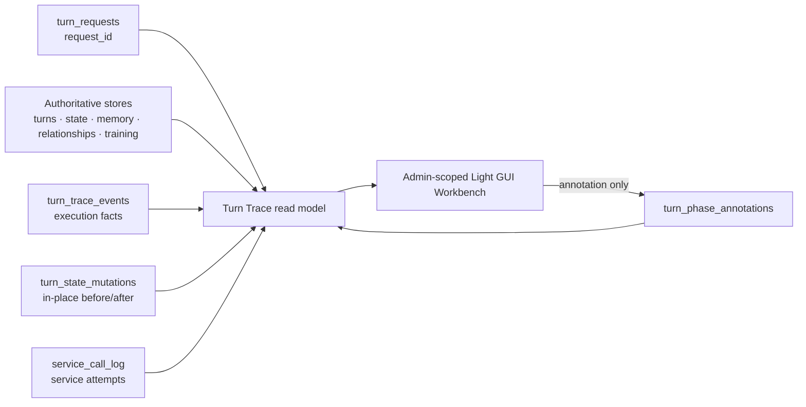

# Decision 027: Request-centric Turn Trace Workbench

**Дата:** 2026-08-12

## Status

**Decision status: Accepted.** Решение пользователя.

Decision 036 retains Novel here only because Turn Trace must render historical
stored requests; it is not an executable scenario contract.

Ступени реализации отдельных требований ведутся в
[`registry/027.yml`](registry/027.yml) по словарю
`каркас | подключено | наблюдается | держится`. Принятое архитектурное решение,
локальная реализация, commit, deploy и живая проверка остаются разными
утверждениями.

### Supersession

Это решение консолидирует и заменяет неопубликованные рабочие черновики
Decision 023 (сбор turn-centric трассы) и Decision 025 (операторский UI поверх
неё). Эти номера не являются отдельными принятыми решениями репозитория. В
частности, идентичность трассы теперь request-centric, а сбор и UI поставляются
одним диагностическим контуром без прежней жёсткой зависимости 025 от 023.

## Context

Существующие данные позволяют восстановить только часть обработки хода:

- `turn_requests` хранит жизненный цикл идемпотентного запроса, а `turns` —
  только успешно закоммиченный ход;
- `turns.prompt_json` показывает сохранённую сборку Gateway, но не каждую
  фактическую narrator-попытку, retry или repair;
- `state_versions`, checks, memory, отношения и training events являются
  разными авторитетными хранилищами своих эффектов;
- `service_call_log` уже хранит редактированные ordered messages и сырой ответ
  служебной модели, но прежняя запись недостаточно связана с request, веткой и
  конкретной попыткой;
- фоновые memory и relationship jobs могут завершиться уже после HTTP-ответа;
- checkpoint-ветки имеют собственный `state_campaign_id`, а глобальные
  `turns.id` после копирования не являются переносимой идентичностью хода;
- поставляемый RP-контракт развивается кумулятивными ревизиями, при этом старые
  партии продолжают нести legacy `rp_contract_version`.

Поэтому turn-centric экран, который начинается только с `turns.id`, теряет
самые важные случаи: timeout, повторное нарушение enforcement, исчерпанные
fallback-попытки и любой другой запрос без commit. Полная копия state в ещё один
«trace store» создала бы второй источник истины и неизбежный дрейф.

## Decision

### 1. Корень трассы — request, а не committed turn

Стабильная идентичность одной обработки — `(state_campaign_id, request_id)`.
Трасса создаётся с началом `turn_request` и существует даже тогда, когда
`turn_id` никогда не появился. После успешного commit Gateway присоединяет к
записям глобальный `turn_id` и локальный `party_turn`; оба поля до этого
допустимо равны `null`.

`turn_id` связывает строки общей SQLite-базы. `party_turn` отражает часы
конкретной партии или ветки. Ни одно из этих значений не заменяет `request_id`
как идентичность исполнения.

### 2. Party, branch и версия контракта определяются Gateway

API всегда начинается с `party_id`. Опциональный `branch_id` проходит обычную
проверку принадлежности партии и разрешается Gateway в отдельный
`state_campaign_id`. Клиент не может прислать произвольный campaign ID.

Трасса сохраняет эффективный контракт, который реально исполнялся:

1. для нового RP-пути — `rp_contract_revision`, если поле присутствует;
2. для legacy-записи — `rp_contract_version`;
3. для archived legacy `novel` и active `training` — фактический `scenario_type` без выдуманной
   RP-ревизии.

Набор фаз data-driven: endpoint возвращает только реально сработавшие узлы.
Новая ревизия может добавить фазу без миграции enum и без правки старых трасс;
неизвестный клиенту `alignment_key` отображается как обычный диагностический
узел.

### 3. Read model строится поверх существующих авторитетных хранилищ

Workbench не вводит отдельный authoritative state. Trace endpoint объединяет:

- `turn_requests`, `turns`, `state_versions`, `state_patches`, `checks` и
  `audit_events`;
- memory snapshots/chapters, relationship projections, `service_jobs` и
  training artifact/workspace events;
- расширенный `service_call_log`;
- три диагностических дополнения: `turn_trace_events`,
  `turn_state_mutations` и `turn_phase_annotations`.

Если before/after уже восстанавливается из append-only авторитетных строк,
endpoint ссылается на них и не копирует значение в новый журнал.
`turn_state_mutations` нужен только для in-place проекций, прежнее значение
которых иначе теряется. Типичный пример — изменение статуса relationship event
или character-axis projection.



### 4. `turn_trace_events` хранит факты исполнения

Одна строка содержит:

- `campaign_id`, `request_id`, nullable `turn_id` и `party_turn`;
- стабильный `phase_key` внутри request;
- открытый `alignment_key` для выравнивания одинаковых фаз разных ходов;
- `lane = main | background`;
- `event_type`, `status`, безопасный `payload_json`;
- `created_at` и nullable `completed_at`.

`phase_key` уникален в пределах request и позволяет идемпотентно обновить
`running` до terminal status. Фоновые service jobs используют lane
`background`; до их завершения трасса честно остаётся незавершённой, а не
подставляет пустые «успешные» узлы.

### 5. Narrator и service-model попытки сохраняются раздельно

Каждая narrator-попытка записывается в `turn_trace_events` с точным
редактированным provider payload, сырым ответом или безопасной ошибкой,
provider/model, номером попытки, признаком repair, latency, HTTP status и usage.
Это отличает первоначальную сборку от retry/repair и сохраняет отказ без turn.

Существующий `service_call_log` расширяется additive-полями `request_id`,
`party_turn`, `provider`, `model`, `attempt`, `latency_ms`, `http_status`,
`usage_json`, `error_json` и `trace_schema_version`. Старые строки остаются
читаемыми с `null` в новых колонках. Второй журнал служебных completion не
создаётся.

Секреты редактируются на записи диагностической копии. Runtime provider payload
не модифицируется логированием.

### 6. Мутации и аннотации диагностические

`turn_state_mutations` хранит `store_name`, `entity_key`, exact before/after,
фактический `lane`, `source`, `reason` и request/phase identity только для реально изменившейся
in-place проекции. Эти строки не читаются Rule Engine, memory updater или prompt
assembly.

`turn_phase_annotations` — единственный write-path Workbench. Запись содержит
клиентский idempotency key `annotation_id`, request, phase, server-derived author,
body и время. Gateway проверяет существование партии/ветки и фазы, ограничивает
текст и в той же операции зеркалит безопасные метаданные в `audit_events`.
Аннотация не меняет state, prompt, scoring, provider routing или delivery level.

### 7. API доступен только admin/operator и bounded

Замороженный HTTP-контракт:

```text
GET  /api/turn-traces/parties
GET  /api/turn-traces/parties/{party_id}/branches
GET  /api/parties/{party_id}/turn-traces?branch_id&limit&before
GET  /api/parties/{party_id}/turn-traces/{request_id}?branch_id
POST /api/parties/{party_id}/turn-traces/{request_id}/annotations?branch_id
     {"annotation_id":"...","phase_key":"...","body":"..."}
```

Все endpoint требуют существующую роль Gateway `admin`; отдельная роль
`operator` не вводится. Первые два endpoint дают операторской странице партии и
ветки для административного разбора. List endpoint возвращает bounded summaries
и непрозрачный cursor для следующей страницы;
крупные prompt/response и exact mutation details читаются только через detail.
Обычный владелец партии, Showroom visitor cookie, `run_id` и compatibility `/v1`
не дают доступа ни к чтению трассы, ни к аннотациям. Это также сохраняет
server-only training policy: exact prompt может содержать скрытые
`AUTHORITATIVE_OUTCOME`, scoring и assessment-инструкции, которые не являются
игровым API участника.

### 8. Light GUI — презентация, не новый runtime

Отдельная admin/operator-only страница Light GUI:

- показывает main/background lanes и terminal/non-terminal status;
- выравнивает несколько запросов по `alignment_key`;
- показывает Gateway assembly, каждую narrator/service attempt, enforcement,
  authoritative state references и before/after мутации;
- визуально отличает repair, fallback, отказ и request без commit;
- лениво загружает detail и позволяет добавить аннотацию к существующей фазе;
- отображает неизвестные фазы без предположения об их семантике.

GUI не вычисляет authoritative mutation diff из state и не обращается к SQLite.
Он отображает нормализованные server-side данные trace endpoint. Showroom не
получает страницу, ссылку или endpoint.

### 9. Retention по умолчанию не ограничен временем

Принято решение хранить диагностическую трассу постоянно для отладки. Новые
trace-таблицы не имеют автоматического TTL. Для `service_call_log` значение
`SERVICE_CALL_LOG_RETENTION_DAYS=0` означает unlimited и является default;
положительное число явно включает очистку старых записей. IaC задаёт default
через `rp_stack_gateway_service_call_log_retention_days: 0`, рендерит его в
Gateway `.env`, а осознанное host-specific значение может быть задано в
`/etc/ansible/local-overrides.yml`.

Unlimited retention не отменяет privacy boundary: журнал содержит пользовательский
нарратив и model output, входит в Gateway data/backup scope, не экспортируется в
dataset автоматически и доступен только через admin-scoped API. Дисковый рост,
редакция секретов и восстановление backup проверяются как эксплуатационные
свойства.

### 10. Независимость от RP core delivery

Workbench — независимая диагностика. Он не является runtime authority,
feature flag, readiness oracle или предусловие любого слайса Decision 026.
Ошибка записи/чтения диагностической трассы не должна менять результат хода,
state patch, prompt, scoring, repair/fallback policy или активацию
`rp_contract_revision`.

Совместимость односторонняя: Workbench читает фактическую revision/version и
реальные фазы ADR 026, но ADR 026 не читает таблицы Workbench. Удаление всех
`turn_trace_events`, `turn_state_mutations` и annotations не меняет повторное
исполнение runtime на той же входной фикстуре.

## Migration and compatibility

- SQLite migration только добавляет таблицы/индексы и nullable-колонки
  `service_call_log`; raw turns и прежние projection rows не переписываются.
- Исторические requests/turns остаются видимыми настолько, насколько их можно
  восстановить из старых stores; отсутствующие попытки не выдумываются.
- Новый trace schema version относится к диагностическому envelope и не меняет
  `state/schema.json` или публичные игровые модели.
- Party и checkpoint branch остаются разными `state_campaign_id`; запрос к
  branch никогда не объединяется с source party по совпавшему номеру хода.
- Существующие public interfaces сохраняются; добавляются пять admin-scoped
  endpoint, из них три адресуют конкретную party.

## Validation

Минимальные доказательства реализации:

1. успешный request получает события до commit и затем корректные `turn_id` и
   `party_turn`;
2. timeout/refused request без строки `turns` остаётся доступен по `request_id`;
3. main/background фазы появляются только если реально исполнялись;
4. legacy `rp_contract_version` и новый `rp_contract_revision` читаются без
   схемного конфликта, unknown phase рендерится generic;
5. branch trace изолирован от source party;
6. narrator и service attempts содержат exact redacted payload/response,
   latency/status/usage и не содержат внедрённый secret;
7. default `0` не удаляет старые service rows, положительный retention удаляет
   записи до cutoff;
8. admin читает party/branch trace, обычный owner и Showroom получают отказ;
9. annotation idempotently появляется в annotation store и `audit_events`, но
   не меняет state/history;
10. намеренный отказ trace recorder не меняет результат основного runtime;
11. list pagination bounded, а крупный detail загружается отдельно;
12. Light GUI Node tests покрывают построение URL, нормализацию, выравнивание и
    сравнение нескольких запросов, отсутствие capture, metadata-driven fallback,
    line diff, annotation payload и статические security/packaging guards.

Эти JS-тесты не являются DOM/browser-доказательством RP/training/failed-request
сценариев. Фактический рендер этих случаев, включая server-only training fields,
repair/fallback и request без commit, проверяется отдельным authenticated
admin-browser canary.

Полный offline gate, commit, push, Ansible apply, container tests, HTTP check и
authenticated browser check называются раздельно. Для documentation-only
изменения достаточно link/fence/registry validation и `git diff --check`; для
поставки Workbench нужен полный repository CI и живой admin-scoped canary.

## Consequences

Положительно: один request можно разобрать от входа до фоновых проекций, включая
ошибку без turn; ветки и ревизии не смешиваются; UI не реконструирует authority.

Отрицательно: exact prompt/response и unlimited retention увеличивают объём и
privacy impact Gateway backup. Асинхронная трасса может быть временно неполной,
поэтому клиент обязан показывать status и обновлять detail.

## Related decisions

- Unpublished working drafts Decision 023 and Decision 025 are superseded by
  this accepted request-centric decision and are not separate repository ADRs.
- [Decision 006: Light GUI party flow](006-light-gui-party-flow.md)
- [Decision 010: Party scenario types](010-party-scenario-types.md)
- [Decision 017: WorldPack-owned Training Runtime](017-worldpack-owned-training-runtime.md)
- [Decision 022: Readiness and observability policy](022-readiness-and-observability-policy.md)
- [Decision 024: Simplified RP core](024-simplified-rp-core.md)

## Non-goals

- event sourcing или замена `StateStore`;
- новая система телеметрии, OpenTelemetry, Sentry или PostHog;
- автоматическое доказательство `наблюдается`/`держится` по красивому графу;
- изменение active RP/training mechanics или legacy trace semantics;
- доступ Showroom к внутренним prompt, response, state diff или annotations;
- backfill отсутствующих raw provider attempts для старых ходов;
- отдельный сервис, контейнер или новая зависимость для Workbench.
