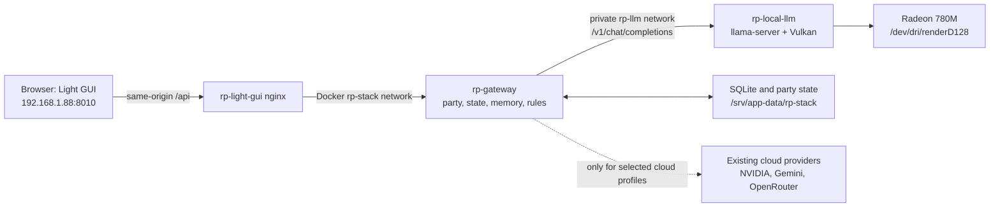

# Plan 011: Local Gemma 4 A4B Through Vulkan

Date: 2026-07-22

Status: Planned. This document describes the target deployment; it makes no
runtime or IaC changes by itself.

## Goal

Run one local RP narrator on `abykovserv` for the Light GUI:

- Model family: Gemma 4 26B A4B, initially a QAT Q4 GGUF artifact.
- Runtime: `llama-server` built with the Vulkan backend.
- Hardware: Ryzen 7 8845HS, Radeon 780M, 64 GB RAM, 1 TB SSD.
- First working context: 32k tokens, with Gateway-owned summaries and journal
  continuing to protect long campaigns.

The local narrator must be selectable as a normal party `ModelProfile`. The
browser must never receive a model URL, a model-runner credential, or a cloud
provider key.

## Non-Goals

- Do not publish `llama-server` to the LAN, Tailscale, or the internet.
- Do not replace the Gateway, the party model, SQLite state, or the Light GUI
  API.
- Do not claim that Gemma's 256k native window is a good interactive working
  setting on this APU. 32k is the initial operating budget; 48k and 64k are
  benchmarks, not defaults.
- Do not make a third-party abliterated GGUF the only recovery path. The
  official model and the selected derivative remain independently switchable.

## Target Architecture



`rp-local-llm` has no `ports:` block. It joins a dedicated internal `rp-llm`
network shared only with `rp-gateway`; Gateway remains on the existing
`rp-stack` network for Light GUI and legacy SillyTavern access.

## API Contract

There are two deliberately different endpoints.

| Caller | Endpoint | Purpose | Exposure |
| --- | --- | --- | --- |
| Light GUI browser | `POST /api/parties/{party_id}/messages` | Submit a player turn and receive the authoritative GM result. | Existing same-origin public UI API. |
| Light GUI browser | `GET /api/model-profiles` | List `local` alongside hosted profiles so a party can select it. | Existing same-origin public UI API. |
| Gateway only | `POST http://rp-local-llm:8080/v1/chat/completions` | Generate narration, repair prose, world drafts, and character drafts for a party using the local profile. | Docker-internal only. |
| Gateway only | `GET http://rp-local-llm:8080/health` and `GET /v1/models` | Startup/readiness checks and a sanitized model-availability probe. | Docker-internal only. |

The browser must continue to use the first endpoint, with its existing Gateway
session cookie, `X-Request-ID`, and idempotency key. It must not call
`/v1/chat/completions` directly. That keeps mechanical resolution, state
validation, party memory, audit history, and access control in one place.

For a local party, Gateway sends this OpenAI-compatible shape to the runner:

```json
{
  "model": "gemma-4-26b-a4b-it-rp-q4",
  "messages": ["Gateway-built system, memory, state, outcome, and party messages"],
  "temperature": 0.85,
  "max_tokens": 1200,
  "stream": false
}
```

The model name is a local `llama-server --alias`, not a promise about the
upstream artifact filename. This makes official and abliterated files
interchangeable without changing party rows or browser code.

## IaC Design

### 1. Host preflight

Add idempotent Ansible tasks before the Compose deployment to:

1. Install `libvulkan1`, `mesa-vulkan-drivers`, and `vulkan-tools`.
2. Verify `/dev/dri/renderD128`, the `amdgpu` kernel module, and a real Radeon
   device reported by `vulkaninfo --summary`.
3. Run the chosen container's `llama-server --list-devices` with the DRM device
   mounted. Fail deployment if it sees only a CPU/software device.
4. Record the exact `llama.cpp` image digest, model artifact URL/revision,
   filename, and SHA-256 in IaC variables or the model manifest. Never use a
   floating `latest` image or an unpinned Hugging Face `main` artifact.

The server currently exposes the Radeon DRM node and has `amdgpu` loaded, but
does not yet have the Vulkan runtime tools. ROCm is not a dependency for this
deployment.

### 2. Persistent model storage

Create the managed directory:

```text
/srv/app-data/rp-stack/models/gemma-4-26b-a4b/
```

Store the GGUF and a small `manifest.json` there. The manifest carries the
source revision, SHA-256, quantization, runner image digest, and the human
label of the variant. Download to a temporary file, verify its checksum, then
rename into place; an interrupted 15+ GB transfer must never become the active
model.

Back up the Gateway database, state, world packs, and the model manifest, but
exclude the GGUF weights from routine RP Stack backups. The weights are
reproducible from the pinned artifact; copying them in every backup is not.

### 3. `rp-local-llm` Compose service

Extend `roles/apps/templates/rp-stack.compose.yml.j2` with one service:

- image pinned to an official `llama.cpp` Vulkan build or a locally built
  derivative pinned to a specific upstream revision;
- model directory mounted read-only;
- `devices: ["/dev/dri/renderD128"]`, no `privileged`, and
  `no-new-privileges:true`;
- one read-only health endpoint on port 8080 exposed to Docker networks only;
- a long `start_period` because model load may take minutes;
- no host port binding and no Nginx route;
- explicit memory/CPU observations in logs, but no artificial Docker memory
  ceiling below the 64 GB host capacity.

Initial runner settings are deliberately conservative:

```text
context:              32768
GPU layers:           all possible (`-ngl 99`)
flash attention:      enabled after the runner-version smoke test
KV cache:             q8_0 for K and V after quality validation
parallel slots:       1
reasoning:             disabled for interactive RP
max completion:       1200, raised only after timing tests
```

The exact flag spelling belongs in the pinned runner image configuration; the
preflight must verify that every selected flag is supported by that release.

### 4. Gateway provider integration

Add `local` as a first-class provider rather than disguising it as NVIDIA:

1. Add a static local `ModelProfile` to
   `app/services/nvidia_catalog.py` (the file should be renamed in a later
   cleanup, but this deployment need not combine that refactor).
2. Profile fields: provider `local`, base URL
   `http://rp-local-llm:8080/v1`, alias
   `gemma-4-26b-a4b-it-rp-q4`, working `context_tokens=32768`, RP defaults,
   and a status label that says local/Vulkan.
3. Extend provider normalization, profile filtering, and Light GUI provider
   grouping to include `local`.
4. Introduce provider-neutral transport settings: base URL, auth policy,
   request timeout, primary model, and optional fallback models. Existing
   `nvidia_api_base` compatibility may remain during migration, but local code
   must not require or forward an external bearer token.
5. Treat `local` as `auth_policy=none`. The existing provider-key admin schema
   stays limited to remote providers; a local profile does not create, display,
   or persist a fake API key.
6. Apply a local-party timeout of 180--240 seconds without changing the timeout
   behavior of hosted profiles. The timeout belongs to profile/runtime settings,
   not to a browser request.
7. Add a sanitized local runner status to `/api/model-profiles` or a new
   authenticated `GET /api/runtime/local-llm`; return readiness, alias, context
   budget, and backend name, never host paths or secrets.

All Gateway-originated generation paths must use the selected local transport:
narration, repair attempts, memory summaries, journal summaries, world
instructions, and character generation. A party must not silently fall back to
a cloud provider when the local model is unavailable; return a clear Gateway
failure and preserve the uncommitted player turn. Cloud fallback stays an
explicit user-selected party model.

### 5. Ansible variables

Add non-secret variables to `inventories/local/group_vars/server.yml` and render
them through `rp-stack.env.j2`:

```yaml
rp_stack_local_llm_enabled: true
rp_stack_local_llm_base_url: "http://rp-local-llm:8080/v1"
rp_stack_local_llm_model_alias: "gemma-4-26b-a4b-it-rp-q4"
rp_stack_local_llm_context_tokens: 32768
rp_stack_local_llm_gpu_layers: 99
rp_stack_local_llm_timeout_seconds: 240
rp_stack_local_llm_models_dir: "{{ rp_stack_storage_dir }}/models"
```

The exact third-party abliterated GGUF URL/revision/checksum is an explicit
artifact decision. Put those reproducibility values in reviewed IaC only after
the base and derivative have passed the comparison gate. Any optional internal
runner credential belongs in `/etc/ansible/local-overrides.yml`, never in Git.

## Implementation Order

1. **Baseline and artifact gate.** Run a fixed Russian RP scene through the
   official QAT Q4 model and one named abliterated candidate. Compare refusals,
   player-agency violations, looping, style, state adherence, latency, and RAM.
   Select one artifact plus checksum; retain the other as a documented rollback
   candidate.
2. **Vulkan preflight.** Add the host packages and a one-shot runner device
   check. Stop here if the 780M is not visible inside the container.
3. **Runner only.** Create the model storage and private `rp-local-llm` service.
   Verify `/health`, `/v1/models`, a short Russian completion, full GPU layer
   offload, and no host-reachable port.
4. **Gateway local provider.** Add the local profile and provider-neutral auth
   transport. Cover no-auth local calls and remote-provider regression cases in
   `rp-gateway` tests.
5. **Light GUI integration.** Add the `Local` filter/category and a compact
   local-ready status. Keep the existing party selector and message endpoint;
   no direct-model JavaScript is introduced.
6. **Controlled live deployment.** Commit on a `codex/` branch or in an isolated
   worktree, push only that branch, open a non-draft PR, and merge it after CI is
   green before invoking `ansible-local-apply.service` on `abykovserv`. Direct
   pushes to `main` are prohibited. Test a new local-model party
   before switching any existing party.
7. **Tuning.** Test 32k, 48k, and 64k context separately. Raise the budget only
   when response latency, KV-cache growth, and party memory behavior remain
   acceptable. Do not tune by advertised context size alone.

## Acceptance Checks

| Area | Pass condition |
| --- | --- |
| GPU | `llama-server --list-devices` reports Radeon 780M through Vulkan; logs show GPU layer offload. |
| Network | No listener for port 8080 on the LAN/Tailscale interfaces; only Gateway resolves `rp-local-llm`. |
| API | A logged-in browser completes `POST /api/parties/{party_id}/messages`; the runner receives a single internal OpenAI-compatible request. |
| State | The successful turn persists state, audit, history, and idempotency behavior exactly as for a hosted profile. |
| Failure | Stopping the local runner produces a controlled Gateway error; no cloud request, state patch, or half-recorded turn occurs. |
| Memory | At 32k, the prompt inspector shows state, memory, and recent raw turns without a history gap. |
| RP quality | In a 20-turn Russian scenario the model keeps player agency, follows confirmed outcomes, does not leak system instructions, and avoids repeated closing paragraphs. |
| Regression | `docker compose run --rm rp-gateway pytest` passes and existing NVIDIA/Gemini/OpenRouter profile tests still pass. |

Performance is evaluated from recorded prompt and generation timing, not a
borrowed benchmark. The target for adoption is an interactive one-player turn;
three-player play remains sequential and should be tested as three ordinary
turns, not as parallel generation slots.

## Deployment and Rollback

Follow the existing pull-based route:

```text
local IaC edit in a codex/ branch or worktree -> focused tests -> commit
-> push the working branch -> non-draft PR -> green CI -> merge into main
-> abykovserv git pull/apply through ansible-local-apply.service
-> Compose, container, HTTP, Gateway, and browser checks
```

Rollback is configuration-first:

1. Change the affected party back to an existing hosted `ModelProfile`, or
   disable `rp_stack_local_llm_enabled`.
2. Apply the prior committed IaC state through Ansible.
3. Keep model weights on disk until a later explicit cleanup; they do not affect
   the active stack when the service is disabled.

Never hot-edit `/srv/apps/rp-stack` as the durable fix.

## Sources and Constraints

- Google documents Gemma 4 26B A4B as a MoE model with roughly 4B active
  parameters and a 256k maximum context; its own guidance notes that model
  weights and KV cache both consume runtime memory.
  <https://ai.google.dev/gemma/docs/core>
- `llama.cpp` documents the Vulkan backend and a Vulkan Docker build path.
  <https://github.com/ggml-org/llama.cpp/blob/master/docs/build.md>
- `llama.cpp` exposes an OpenAI-compatible server endpoint. Gemma 4's separate
  MTP/draft support has been evolving, so it is not counted as a deployment
  dependency or a performance guarantee in this plan.
  <https://github.com/ggml-org/llama.cpp/blob/master/tools/server/README.md>
  <https://github.com/ggml-org/llama.cpp/discussions/22735>
