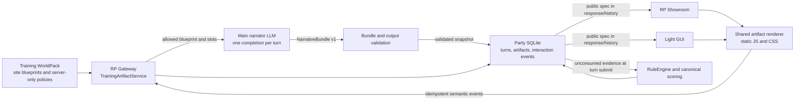

# Plan 014: Interactive Training Site Artifacts

Date: 2026-07-31

Status: Implemented locally on 2026-07-31. Deployment and live verification on
`abykovserv` remain separate, explicitly authorized steps.

## Goal

Add safe interactive web-site simulations to `training` parties in Light GUI
and RP Showroom. A training turn may contain an email or messenger message with
a link to a simulated site. The main narrator LLM produces the message and the
visible site content in the same completion; Gateway validates and snapshots
the result; the browser renders the site from an allowlisted template; Gateway
records interactions and deterministically includes them in scoring.

The initial interaction contract must record:

- opening a link;
- submitting a simulated form with one or more non-empty credential fields;
- closing or reporting the simulated site;
- the exact interaction evidence consumed by the scored training turn.

Submitting any non-empty field classified by the authored blueprint as a
credential and then pressing submit is a failed action. The actual value is
never sent to Gateway and is never persisted.

## Architectural Decision

Do not introduce another deployable backend or another runtime LLM call.

Introduce two logical components:

1. `TrainingArtifactService` inside `rp-gateway`: validates WorldPack
   blueprints and narrator output, snapshots party artifacts, records
   idempotent interaction events, and exposes evidence to `RuleEngine`.
2. A shared browser-side artifact renderer used by Light GUI and RP Showroom:
   creates DOM from public JSON using fixed renderers and themes. It never
   executes model-provided HTML, CSS, or JavaScript.

Gateway remains the authority for party ownership, current authored surface,
artifact revision, event validity, canonical state, scoring, and history. The
browser owns presentation only.



## Ownership Boundaries

| Concern | Owner | Rule |
| --- | --- | --- |
| Which site can appear on the current turn | WorldPack schedule and Gateway canonical state | The model may not invent or select the assessment surface. |
| Ten reusable site definitions | Training WorldPack authoring skill | Generate versioned blueprints referencing shared renderers and themes. |
| Visible wording for the current site | Main narrator LLM | Fill allowlisted slots in the same response as the message. |
| Renderer, theme, field semantics, displayed domain, and action policy | WorldPack blueprint validated by Gateway | These values are fixed before the narrator call when they affect assessment. |
| HTML and CSS | Shared UI renderer | Use application-owned components only. |
| Artifact ID and revision | Gateway | Never trust IDs or revisions chosen freely by the model or browser. |
| Link/form interaction evidence | Gateway persistence | Record server time and idempotency; do not trust client score claims. |
| Score and debrief | RuleEngine, canonical state, authored rules | Interaction evidence supplements explicit free-text actions and cannot be negated by later prose. |

## WorldPack Contract

### Directory layout

Extend training WorldPacks with:

```text
artifacts/
  sites/
    index.json
    corporate-sso.json
    password-reset.json
    mfa-confirmation.json
    cloud-file-share.json
    document-signing.json
    invoice-payment.json
    delivery-tracking.json
    meeting-join.json
    hr-survey.json
    support-download.json
rules/
  site-interactions.json
```

`artifacts/sites/*.json` contains player-visible blueprint data and the schema
for LLM-filled slots. `rules/site-interactions.json` contains server-only
classification and scoring mappings. Public APIs must never expose the latter.

Add the following manifest reference:

```json
{
  "training_artifacts": {
    "schema_version": "rp-training-artifacts.v1",
    "site_catalog": "artifacts/sites/index.json",
    "interaction_policy": "rules/site-interactions.json",
    "default_site_count": 10
  }
}
```

The authoring default is ten blueprints per interactive training world. A
world may use only a subset during one run, but each blueprint must be valid,
reviewable, and intentionally classified as part of a benign, ambiguous, or
hostile authored surface. Do not make only hostile links interactive; that
would reveal correctness through UI affordance.

### Shared renderer catalog

The application owns renderer code. A WorldPack references, but cannot define,
these renderer families:

| Blueprint | Renderer | Typical fixed fields and actions |
| --- | --- | --- |
| `corporate-sso` | `credential-form` | Login, password, submit, help link. |
| `password-reset` | `credential-form` | Account, new password, confirmation. |
| `mfa-confirmation` | `otp-form` | Account label, OTP field, confirm. |
| `cloud-file-share` | `file-share` | Sender, file cards, view/download, optional login. |
| `document-signing` | `document-approval` | Document title, sign/approve, optional identity field. |
| `invoice-payment` | `payment-review` | Invoice metadata, pay/approve; simulated data only. |
| `delivery-tracking` | `tracking-form` | Tracking ID, contact field, continue. |
| `meeting-join` | `meeting-join` | Organizer, time, join, optional corporate login. |
| `hr-survey` | `survey-form` | Employee fields, questions, submit. |
| `support-download` | `support-download` | Product notice, download, install/continue. |

Names are neutral. The same renderer must support authored legitimate and
suspicious instances. Use fictional brands and reserved domains such as
`.test`, `.invalid`, and `.example`; never generate live phishing destinations,
real credential collectors, malware, or executable payloads.

### Blueprint shape

Each site blueprint separates fixed assessment facts from LLM-filled copy:

```json
{
  "id": "corporate-sso",
  "revision": 1,
  "renderer": "credential-form",
  "theme": "office-blue",
  "fixed": {
    "display_url": "https://pt-office.example.test/session",
    "field_ids": ["login", "password"],
    "credential_field_ids": ["login", "password"],
    "actions": ["submit", "close", "report"]
  },
  "llm_slots": {
    "page_title": {"required": true, "max_length": 120},
    "page_subtitle": {"required": true, "max_length": 240},
    "login_label": {"required": true, "max_length": 80},
    "password_label": {"required": true, "max_length": 80},
    "submit_label": {"required": true, "max_length": 80},
    "post_submit_message": {"required": true, "max_length": 240}
  },
  "fallback_content": {
    "page_title": "Подтверждение рабочей сессии",
    "page_subtitle": "Войдите, чтобы продолжить",
    "login_label": "Корпоративная почта",
    "password_label": "Пароль",
    "submit_label": "Продолжить",
    "post_submit_message": "Запрос обработан"
  }
}
```

Values that are evidence for assessment, including URL spelling, required
field semantics, available actions, and whether a field is a credential, must
be fixed in the blueprint or server-only policy. They must not be left to
free-form model generation.

### Server-only interaction policy

`rules/site-interactions.json` maps semantic events to authored evidence and
score rules without exposing answer keys:

```json
{
  "corporate-sso": {
    "link_opened": {
      "evidence": "external-login-page-opened",
      "score_rule_id": "turn-4-link-open",
      "score_once": true
    },
    "credentials_submitted": {
      "evidence": "credentials-submitted",
      "score_rule_id": "turn-4-credential-failure",
      "score_once": true,
      "decision_result": "fail"
    },
    "reported": {
      "evidence": "site-reported",
      "score_rule_id": "turn-4-safe-report",
      "score_once": true
    }
  }
}
```

Exact point deltas remain authored in `rules/checks.md` and canonical state;
the generic artifact subsystem must not hardcode an Awareness-specific score.
For Awareness, a credential submit should at minimum increment
`credential-exposure` and `unsafe-actions`, record failed decision evidence,
and prevent the same event from scoring twice.

## Narrator Response Contract

### One LLM request

The selected party narrator continues to receive one ordinary completion
request per turn. If the current authored surface uses a site, Gateway includes:

- the required `artifact_key` generated by Gateway;
- the only allowed `blueprint_id` for this turn;
- fixed visible values that must be repeated consistently in the message;
- the exact slot names, lengths, and language constraints;
- a prohibition on HTML, CSS, JavaScript, data URLs, remote assets, answer keys,
  scoring, and correctness labels.

The model returns a JSON object inside `message.content`:

```json
{
  "schema_version": "rp-gateway.narrative-bundle.v1",
  "narrative_text": "Ход 4...\n\nПИСЬМО\n...",
  "artifacts": [
    {
      "artifact_key": "turn-4-session",
      "blueprint_id": "corporate-sso",
      "slots": {
        "page_title": "Продление корпоративной сессии",
        "page_subtitle": "Подтвердите доступ до 11:30",
        "login_label": "Корпоративная почта",
        "password_label": "Пароль",
        "submit_label": "Продолжить",
        "post_submit_message": "Сессия подтверждена"
      }
    }
  ]
}
```

Gateway parses this into a new Pydantic `NarrativeBundle`. Existing RP, novel,
and training worlds without `manifest.training_artifacts` retain the current
plain-text response contract.

### Validation and fallback

Extend `OutputValidator` with a training artifact validator that checks:

1. valid bundle JSON and supported schema version;
2. zero artifacts when the current authored turn has none;
3. exactly the required artifact and blueprint when the turn requires one;
4. exact `artifact_key` and consistent displayed link between the message and
   the fixed blueprint URL;
5. only allowlisted slots, all required slots, and all length limits;
6. no raw markup, scriptable URLs, external assets, real credential values,
   hidden classification, score delta, or answer cue;
7. exactly one existing `ПИСЬМО` or `СООБЩЕНИЕ` surface under the current
   training contract.

Reuse the existing single repair attempt. If repair still fails, use the
blueprint's authored `fallback_content` together with the existing safe
narrative fallback. A provider failure must never create a broken link or an
artifact that changes on refresh.

After validation, Gateway returns the usual assistant `message.content` as
`narrative_text` and adds a backward-compatible `artifacts` array to the API
response. Old clients can ignore it.

## Gateway Runtime and Performance

### Logical service, not a new container

Add `app/services/training_artifacts.py` or a small package under
`app/services/training_artifacts/`. It performs only:

- cached WorldPack JSON loading and schema validation;
- merge of a fixed blueprint with validated LLM slots;
- compact SQLite reads and writes;
- event normalization and idempotency;
- construction of `InteractionEvidence` for RuleEngine.

It must not perform LLM calls, HTTP requests, HTML rendering, image generation,
or filesystem scans on a link click. Load and validate each WorldPack catalog
once using a cache keyed by WorldPack ID and content revision.

### Latency constraints

- Include the public artifact snapshot in the message and history response so
  opening it requires no additional GET request.
- Render the page immediately in the browser; send `link_opened` asynchronously
  with an idempotency key.
- Flush pending artifact events before the UI submits the final player message.
- Limit an artifact snapshot to 32 KiB, one interactive site per training
  surface in v1, and at most ten blueprints per default WorldPack catalog.
- Store no base64 images. Themes and icons are static, cacheable UI assets.
- Index event lookup by `(campaign_id, artifact_id, consumed_turn_id)` and
  `(campaign_id, event_id)`.

Target: artifact merge and persistence should be small JSON/SQLite work and not
materially change narrator latency. Site open must never wait for Python
rendering or an LLM response.

## Persistence Model

Artifacts belong to the party, not to Showroom. Put persistence in
`StateStore` so Light GUI and Showroom share the same authority.

Add additive SQLite tables:

```sql
CREATE TABLE training_artifacts (
    id TEXT NOT NULL,
    campaign_id TEXT NOT NULL,
    source_turn_id INTEGER NOT NULL,
    artifact_key TEXT NOT NULL,
    blueprint_id TEXT NOT NULL,
    blueprint_revision INTEGER NOT NULL,
    public_json TEXT NOT NULL,
    policy_ref TEXT NOT NULL,
    created_at INTEGER NOT NULL,
    PRIMARY KEY (campaign_id, id),
    UNIQUE (campaign_id, artifact_key),
    FOREIGN KEY (campaign_id) REFERENCES campaigns(id),
    FOREIGN KEY (source_turn_id) REFERENCES turns(id) ON DELETE CASCADE
);

CREATE TABLE training_artifact_events (
    id INTEGER PRIMARY KEY AUTOINCREMENT,
    campaign_id TEXT NOT NULL,
    artifact_id TEXT NOT NULL,
    event_id TEXT NOT NULL,
    event_type TEXT NOT NULL,
    field_ids_json TEXT NOT NULL,
    consumed_turn_id INTEGER,
    created_at INTEGER NOT NULL,
    UNIQUE (campaign_id, event_id),
    FOREIGN KEY (campaign_id, artifact_id)
      REFERENCES training_artifacts(campaign_id, id),
    FOREIGN KEY (consumed_turn_id) REFERENCES turns(id)
);
```

Add a `record_turn_bundle(...)` transaction or equivalent so a validated turn
and its artifact snapshots appear together. An artifact must never exist
without its source turn. Keep server-only policy references out of public
history responses.

Extend `turn_history()` and the relevant full-turn/dataset reads with:

```json
{
  "artifacts": ["public snapshot objects"],
  "interaction_evidence": ["admin/review-visible semantic events"]
}
```

The ordinary player-facing history may expose public artifacts and neutral
interaction status, but never score rules, classification, or correctness.

## Interaction API

### Authenticated party endpoint

```text
POST /api/parties/{party_id}/artifact-events
```

### Anonymous Showroom wrapper

```text
POST /api/showroom/runs/{run_id}/artifact-events
```

The Showroom wrapper resolves the visitor-owned run to its hidden party ID and
delegates to the same service, matching the current start/history/message
wrappers. Raw party IDs remain private.

Request:

```json
{
  "event_id": "evt_opaque_idempotency_key",
  "artifact_id": "artifact_turn_4_session",
  "artifact_revision": 1,
  "event_type": "form_submitted",
  "filled_field_ids": ["login", "password"]
}
```

Response:

```json
{
  "accepted": true,
  "event_sequence": 42
}
```

Rules:

- accept only events and field IDs declared by the persisted public spec;
- use server time; client time is diagnostic only and must not drive scoring;
- deduplicate by `event_id` and return the existing result on retry;
- reject an unknown run, foreign party, stale revision, unknown field, or an
  event for an artifact outside the active authored surface;
- accept only field IDs, never field values, lengths, hashes, or masked values;
- do not return immediate correctness, score, or remediation.

Normalized event types for v1:

| Browser action | Stored event |
| --- | --- |
| Click link in email or messenger | `link_opened` |
| Submit form with at least one configured credential field non-empty | `credentials_submitted` |
| Submit a non-credential form | `form_submitted` |
| Close the simulated page | `site_closed` |
| Use the training UI report action | `reported` |

## Scoring Semantics

Interaction requests do not advance `meta.turn` and do not immediately mutate
score state. They are immutable sub-turn evidence.

When the player submits the final free-text action for the current turn:

1. `Adjudicator` reads all unconsumed events for the active artifact.
2. `TrainingArtifactService` maps them through the server-only policy to a
   typed `InteractionEvidence` object.
3. `RuleEngine` resolves free text and interaction evidence together.
4. Observable UI events have factual precedence: a later sentence such as
   “I did not enter credentials” cannot erase an already recorded submit.
5. RuleEngine creates one deterministic state patch for the authored turn.
6. After the turn is recorded, the consumed events are linked to `turn_id` in
   the same transaction or idempotent completion step.
7. Turn metadata records the evidence and applied rule IDs for dataset review
   and debrief explainability.

`credentials_submitted` is generated only when the browser observed at least
one non-empty `credential_field_id` and the user pressed submit. Gateway does
not inspect content. The event deterministically produces the authored failed
decision and related counters. Repeated submits may remain visible evidence
but `score_once` prevents repeated penalties.

`link_opened` is not globally a failure. Its consequence comes from the
current authored policy so legitimate links can be opened without penalty and
suspicious links can affect the appropriate security component. Reporting
after credential submission records both facts; a later safe action does not
delete the earlier unsafe action.

The narrator and UI must not reveal this assessment before the final authored
debrief. The debrief may show the evidence timeline, rule IDs translated into
human language, and canonical score components.

## Prompt Changes

### Gateway scenario prompt

Extend the `training` branch of `NarrativeClient.scenario_rules()`:

- when Gateway supplies `TRAINING_ARTIFACT_CONTRACT`, return
  `rp-gateway.narrative-bundle.v1` JSON only;
- emit exactly the supplied `artifact_key` and `blueprint_id`;
- fill only declared player-visible slots;
- keep the email/message URL consistent with the fixed blueprint URL;
- never output HTML, CSS, JS, an external asset URL, a credential value,
  artifact classification, score, correctness, or remediation;
- return an empty `artifacts` array when the authored turn has no artifact;
- keep the current one-authored-surface and no-hints rules unchanged.

Inject the artifact contract after immutable WorldPack prompts but before
dynamic state and `AUTHORITATIVE_OUTCOME`. The current state remains authority
over whether an artifact is allowed.

### WorldPack prompts

Update interactive training packs:

- `campaign-bible.md`: assign an optional blueprint to each scheduled surface,
  identify fixed visible evidence, allowed interactions, and deterministic
  consequences;
- `prompts/gm-system.md`: require the bundle contract and consistent message/site
  copy without explaining why a site is safe or unsafe;
- `prompts/authors-note.md`: control voice and realism only; it cannot change
  renderer, policy, or scoring;
- `prompts/opening-scene.md`: use a declared blueprint when the opening surface
  contains an interactive link;
- `rules/checks.md`: map typed interaction evidence to counters, component
  scores, completion, and debrief evidence;
- `state-seed.json`: add named counters such as `links-opened`,
  `credential-exposure`, `unsafe-actions`, and evidence strings required by the
  authored rubric.

## Training World-Pack Skill Changes

The versioned source is:

```text
codex-skills/training-world-pack-builder/
```

Update `SKILL.md` and `references/training-contract.md`; add a focused
`references/site-artifacts-contract.md`. The repository copy is authoritative.
After validation, synchronize the installed local skill under
`C:\Users\albykov\.codex\skills\training-world-pack-builder\` as a separate,
reported local delivery step.

The skill must:

1. Ask whether the training world uses interactive site artifacts and use ten
   blueprints as the default catalog size when enabled.
2. Select a realistic mix of legitimate, ambiguous, and hostile site instances;
   do not make interactivity itself an answer cue.
3. Generate only references to application-owned renderers and themes.
4. Create `artifacts/sites/index.json`, blueprint files, and the server-only
   interaction policy.
5. Put fixed assessment evidence in blueprints/policy and only prose slots in
   the LLM contract.
6. Ensure each scheduled link resolves to one declared artifact and each used
   artifact has an authored scoring rule.
7. Create safe fallback content for every blueprint.
8. Reject raw HTML/JS/CSS, real domains, live form actions, secrets, personal
   data, executable payloads, and external tracking assets.
9. Add counters and evidence fields to `state-seed.json` without exposing an
   answer key through public APIs.
10. Validate that credential submission is based solely on non-empty field
    presence plus submit, never on the submitted value.

Add skill validation checks for duplicate IDs, unknown renderers/themes,
unknown slots/actions, missing fallback content, public policy leakage,
unreferenced scheduled artifacts, absent score rules, and unsafe URLs.

## Light GUI and RP Showroom

### Shared renderer

Create a shared static frontend source, for example:

```text
roles/apps/files/rp-stack/ui-shared/training-artifacts.js
roles/apps/files/rp-stack/ui-shared/training-artifacts.css
roles/apps/files/rp-stack/ui-shared/training-artifacts.test.js
```

Both images currently build from separate frontend directories. Change the
Compose build context to the RP Stack source root and point each service at its
own Dockerfile, allowing both Dockerfiles to copy the same shared files. Do not
maintain two drifting renderer implementations.

The renderer must:

- create elements with DOM APIs and assign content through `textContent`;
- support only allowlisted renderer and theme IDs;
- show a simulated browser shell and `display_url` without navigating away;
- have no external network requests, form action, iframe, object, plugin, or
  script injection path;
- use accessible labels, keyboard focus management, close/report actions, and
  responsive mobile layout;
- keep field values in browser memory only, clear them after submit/close, and
  send only `filled_field_ids`;
- reduce password-manager/autofill risk with nonstandard randomized input names,
  disabled autocomplete, and no reusable real account identifiers;
- queue event requests with stable event IDs, retry safely, and flush the queue
  before the final player message.

### Light GUI

- Read `artifacts` from party message and history responses.
- Turn a structured email/message link reference into a button bound to the
  matching artifact snapshot; never convert arbitrary narrator URLs into live
  anchors.
- Post events through the authenticated party endpoint.
- Restore artifact views after reload/branch navigation from party history.
- Show interaction evidence in the existing full-turn dataset review dialog for
  administrators, separately from approve/review/exclude mutations.
- Preserve the current text-only fallback when no valid artifact is attached.

### RP Showroom

- Use the same renderer and event queue.
- Post through the visitor-owned run wrapper; never expose the underlying party
  ID.
- Restore public artifacts and neutral interaction state when a run resumes.
- Test desktop and mobile layouts against the deployed Showroom.
- Keep leaderboard changes driven only by canonical state after the authored
  turn is finalized.

### Browser security headers

Add and test an explicit Content Security Policy in both frontend nginx
configurations, including at minimum:

```text
default-src 'self';
script-src 'self';
style-src 'self';
img-src 'self' data:;
connect-src 'self';
form-action 'none';
frame-src 'none';
object-src 'none';
base-uri 'none';
frame-ancestors 'self';
```

Do not add `unsafe-inline` to support model-generated markup. Add the usual
`X-Content-Type-Options: nosniff` and a restrictive referrer policy.

## Expected Code Touchpoints

### Gateway

- `rp-gateway/app/models/schemas.py`: `NarrativeBundle`, artifact snapshot,
  event request/response, and `InteractionEvidence` models.
- `rp-gateway/app/services/party_store.py`: load and cache WorldPack artifact
  catalogs and policies.
- `rp-gateway/app/services/training_artifacts.py`: validate/materialize artifacts
  and normalize events.
- `rp-gateway/app/services/state_store.py`: additive tables, transactional turn
  bundle persistence, event reads/consumption, and history projection.
- `rp-gateway/app/services/narrative.py`: inject the allowed artifact contract.
- `rp-gateway/app/services/validator.py`: parse/validate the bundle and generate
  safe artifact fallbacks.
- `rp-gateway/app/services/adjudicator.py`: collect unconsumed interaction
  evidence and persist artifacts with the turn.
- `rp-gateway/app/services/rule_engine.py`: accept typed interaction evidence and
  apply authored rules.
- `rp-gateway/app/main.py`: party endpoint, Showroom wrapper, and artifact-aware
  message/history responses.

### Frontends and deployment

- `ui-shared/training-artifacts.js` and CSS/tests.
- `rp-light-gui/app.js`, `index.html`, Dockerfile, nginx config, and focused JS
  tests.
- `rp-showcase-gui/app.js`, `index.html`, Dockerfile, nginx config, and focused
  JS tests.
- `roles/apps/templates/rp-stack.compose.yml.j2`: shared build context.
- Interactive WorldPack manifests, prompts, artifact files, rules, and state.
- Versioned training skill and references under `codex-skills/`.
- New accepted ADR `docs/decisions/014-interactive-training-artifacts.md` after
  implementation decisions are confirmed.

## Test Plan

### Gateway unit and integration tests

Add `rp-gateway/tests/test_training_artifacts.py` covering:

- valid catalog and each of the ten renderer contracts;
- unknown renderer, theme, slot, action, unsafe URL, raw markup, or oversized
  content rejection;
- valid one-call narrative bundle and compatibility with plain-text worlds;
- inconsistent message URL/artifact rejection and repair;
- safe fallback after malformed JSON, model timeout, or validation failure;
- party and Showroom visitor isolation;
- idempotent event retry and stale revision rejection;
- no persistence of field values;
- event sequence, event consumption, and exactly-once scoring;
- `link_opened` neutral/unsafe behavior from authored policy;
- credential submit produces failed evidence even if later prose denies it;
- repeated credential submit does not double-score when `score_once=true`;
- events do not advance `meta.turn`;
- final player message consumes the correct active-surface events and advances
  exactly one authored turn;
- artifacts and evidence survive history reload, branch isolation, and run
  resume;
- public responses never expose server-only policies or score deltas;
- dataset full-turn review contains the interaction evidence.

Update `test_awareness_one_day.py`, Showroom tests, dataset tests, state migration
tests, and prompt tests accordingly.

### Frontend tests

- renderer output for all renderer families and themes;
- no `innerHTML`, live anchor navigation, external resource, or raw form action;
- links without a matching artifact remain text only;
- click opens immediately and queues exactly one `link_opened` event;
- submit sends only field IDs and clears values;
- empty credential fields do not create `credentials_submitted`;
- retry preserves event ID and does not duplicate UI actions;
- pending events flush before sending the player turn;
- reload restores the same artifact revision;
- keyboard, focus trap, close/report, narrow viewport, and high-contrast checks;
- Light GUI and Showroom consume the same shared renderer tests.

### Performance checks

Record separately:

- existing narrator turn latency before the feature;
- narrator latency with one artifact bundle;
- Gateway bundle parse/materialize/persist time;
- event POST p50/p95 and SQLite lock time;
- first and repeated client render time;
- history response size with 100 turns and artifact snapshots.

Acceptance requires no second LLM request and no external request on site open.
Gateway artifact/event work should stay negligible relative to narrator latency;
investigate if local p95 event acknowledgement exceeds 100 ms or bundle
processing exceeds 50 ms under the expected single-user load.

## Implementation Order

1. Add ADR 014 and freeze the v1 schemas, renderer allowlist, event names, and
   sub-turn scoring semantics.
2. Add WorldPack artifact schemas, a sample mixed benign/hostile catalog, and
   repository validators without changing runtime behavior.
3. Add Pydantic models, catalog loading/cache, additive SQLite tables, and
   party-scoped artifact/event service with tests.
4. Add artifact event endpoints and Showroom wrappers; verify ownership,
   idempotency, and public-policy separation.
5. Add `NarrativeBundle` parsing, prompt injection, validation, repair, fallback,
   turn/artifact persistence, and backward compatibility.
6. Feed typed interaction evidence to RuleEngine and persist consumed evidence
   in turn metadata and dataset review.
7. Build the shared browser renderer and integrate Light GUI first using mock
   artifact fixtures.
8. Integrate RP Showroom through run-scoped endpoints and visitor-cookie checks.
9. Update one training pack, preferably `awareness-one-day`, with ten blueprints
   and enable one interactive surface first. Validate that ordinary legitimate
   links use the same UI affordance.
10. Update the versioned training skill, its references, and local installed
    copy; validate generated packs against the new contract.
11. Run local static/JS checks, commit and push through the normal IaC workflow.
12. Apply through `ansible-local-apply.service`; run Gateway pytest in the
    deployed container, HTTP checks, authenticated Light GUI checks, and
    desktop/mobile Showroom browser acceptance.

Do not enable all ten runtime sites at once. Ship one credential-form surface,
one legitimate comparison surface, and the complete persistence/scoring path;
then expand the catalog after evidence and recovery behavior are verified.

## Acceptance Criteria

| Area | Pass condition |
| --- | --- |
| LLM calls | One narrator completion per normal turn; site open and form submit perform zero LLM calls. |
| Consistency | Message and site share the Gateway-assigned artifact key, fixed URL, blueprint, and revision. |
| Performance | Page opens from the response/history snapshot without waiting for Gateway HTML rendering or another artifact GET. |
| Credential privacy | No typed value, length, hash, or masked representation reaches Gateway, logs, history, audit, dataset, or telemetry. |
| Scoring | Events are immutable evidence, consumed once by the authored turn, and explainable in debrief. |
| Progression | Link/form events do not advance the schedule; the final player turn advances exactly once. |
| Safety | No model HTML/JS/CSS, external form action, real credential collector, remote asset, executable payload, or hidden policy in public data. |
| Isolation | Party, branch, anonymous visitor, and artifact revisions cannot be read or mutated across ownership boundaries. |
| Compatibility | Existing RP/novel/training worlds and clients continue to work without artifact support. |
| UI parity | Light GUI and Showroom use the same renderer contract and behave consistently after reload. |
| Delivery | Local edit, pushed commit, Ansible-applied revision, container tests, and live browser verification are reported as separate states. |

## Risks and Required Mitigations

| Risk | Mitigation |
| --- | --- |
| Model emits malformed or contradictory bundle | Pydantic validation, one repair, authored fallback, fixed Gateway IDs and URLs. |
| Python hot path grows | Cached catalogs, compact JSON, indexed SQLite, artifact included in response, no HTML/LLM/HTTP on clicks. |
| XSS or prompt-generated code | Allowlisted DOM renderer, `textContent`, strict CSP, no raw markup fields. |
| Clickability reveals phishing | Render both legitimate and suspicious authored sites through the same controls. |
| Browser autofills real credentials | Simulated inputs, disabled autocomplete, randomized/no standard names, no value transport, fictional identity cues. |
| Client retries double-score | Stable event ID, unique DB constraint, `score_once`, idempotent response. |
| Click and final message race | Client event queue must flush; server consumes sequenced events for the active artifact. |
| Free text contradicts observed action | Typed interaction evidence is factual authority for the event; preserve both in turn metadata. |
| Existing run changes after WorldPack edit | Snapshot blueprint revision and public content per party turn. |
| Dataset loses the reason for score changes | Include interaction evidence in complete turn inspection and export metadata under explicit review gates. |

## Delivery Boundary

The implementation must follow:

```text
local IaC edit and focused checks
-> commit and push origin/main
-> abykovserv ansible-local-apply.service
-> Gateway container pytest and migration checks
-> Light GUI and Showroom HTTP/browser acceptance
```

No local runtime servers and no permanent manual edits under `/srv/apps`.
Creating this plan is a local repository change only; it does not mean the
feature is implemented, pushed, applied, or live.
