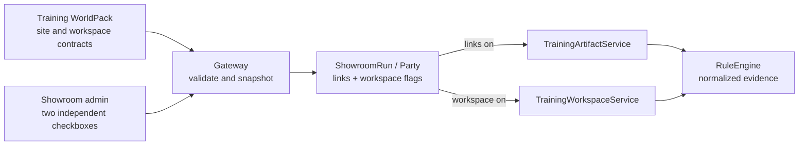

# Plan 015: Training Scenario Interaction Capabilities

Date: 2026-08-03

Status: Runtime implementation completed in the IaC repository. Deployment and
live verification remain pending.

## Goal

Give the RP Showroom scenario editor two independent training-only switches:

```text
[ ] Подключить интерактивные ссылки
[ ] Подключить интерактивный диск
```

The selected combination is validated by Gateway, snapshotted into every run
and used consistently by prompts, UI surfaces, events, scoring, datasets and
leaderboards.

## Non-goals

- Do not duplicate WorldPacks or automatically create four scenario records.
- Do not add the switches to `rp` or `novel`.
- Do not generate arbitrary HTML, JavaScript, macros or executable files.
- Do not call a second LLM when a site or file is opened.
- Do not expose real restricted organization documents through anonymous
  Showroom visitor cookies.
- Do not change current production behavior until the migration and complete
  four-combination acceptance matrix are ready.

## Runtime capability model



Support is derived from detailed WorldPack contracts:

```json
{
  "training_artifacts": {
    "schema_version": "rp-training-artifacts.v1",
    "site_catalog": "artifacts/sites/index.json",
    "interaction_policy": "rules/site-interactions.json"
  },
  "training_workspace": {
    "schema_version": "rp-training-workspace.v1",
    "folder_catalog": "artifacts/workspace/folders.json",
    "file_catalog": "artifacts/workspace/files/index.json",
    "interaction_policy": "rules/workspace-interactions.json"
  }
}
```

Gateway exposes derived admin metadata:

```json
{
  "training_capabilities": {
    "interactive_links_supported": true,
    "interactive_workspace_supported": true
  }
}
```

## Phase 1: schemas, persistence and migration

### API models

Extend `ShowroomScenarioCreate`, `ShowroomScenarioUpdate` and scenario summaries:

```json
{
  "interactive_links_enabled": false,
  "interactive_workspace_enabled": false
}
```

Extend `ShowroomRunCreate` only if the product later allows a visitor to choose
a variant. For the first implementation, run creation copies the administrator
selection and does not trust client overrides.

### Showroom database

Add to `showroom_scenarios`:

```sql
interactive_links_enabled INTEGER NOT NULL DEFAULT 0,
interactive_workspace_enabled INTEGER NOT NULL DEFAULT 0
```

Add the same snapshot columns to `showroom_runs`. Run serializers must return
the safe flags but continue hiding the internal party ID.

Migration rules:

1. add both columns as false;
2. inspect existing training scenarios through `ShowroomStore` and the current
   WorldPack manifest;
3. set links true only for existing scenarios whose pack has a valid
   `training_artifacts` contract;
4. leave workspace false because no deployed workspace contract exists;
5. record a migration/audit marker and make the operation idempotent.

### Validation helper

Add one Gateway helper, for example `TrainingCapabilityPolicy`, that receives
scenario type, manifest and requested flags. Use it from scenario create/update,
run creation and runtime endpoint guards. Do not duplicate validation in UI.

Hard failures:

- either flag true for a non-training scenario;
- links true without a valid site contract;
- workspace true without a valid workspace contract;
- required capability-off fallback missing from a publishable training pack.

## Phase 2: Showroom admin and storefront

In the scenario editor:

- show both checkboxes only after `Тип сценария = Training`;
- disable a checkbox with an explanatory hint when the selected WorldPack does
  not support it;
- clear and disable both for `rp` or `novel`;
- show the saved combination in the scenario list/detail;
- keep the server response authoritative after save.

Do not create four cards automatically. If course owners need A/B comparison,
they create separate Showroom scenarios pointing to the same WorldPack with
different flag combinations.

The storefront may show neutral capability badges. It must not reveal whether
an individual site or file is safe, hostile or scored.

## Phase 3: links capability gate

Keep Decision 014 runtime but gate it by the run snapshot:

- no site contract is added to narrator prompt when links are off;
- narrator artifacts returned while off are rejected or discarded through the
  authored off-path, never silently activated;
- public history does not expose site snapshots for disabled runs;
- both party and Showroom event endpoints reject site events while off;
- RuleEngine does not consume site evidence for that run;
- existing scenarios retain links through the migration backfill.

WorldPack schedules must define a coherent `capability_off` path. A catalog is
capacity, not permission and not a requirement to put a URL on every turn.

## Phase 4: workspace contract and static resources

### WorldPack layout

```text
artifacts/workspace/
  folders.json
  files/index.json
  files/<blueprint>.json
rules/workspace-interactions.json
```

Stable authored IDs own folder placement. Never use display names or client
paths as filesystem authority.

Each file blueprint declares:

- stable ID and positive revision;
- target `folder_id`;
- allowlisted renderer and safe media family;
- lifecycle (`party_start` or authored turn, availability interval);
- declared visible LLM slots and complete fallback;
- whether the visible/downloadable representation comes from authored JSON or
  a pinned resource revision.

### IaC resource library

The implemented first version stores reviewed resources inside the WorldPack,
binds them through stable blueprint IDs and records immutable revision plus
content hash in the party snapshot. The following admin-upload tables are a
future extension, needed only when course owners must upload outside Git/IaC:

```text
training_resources
training_resource_revisions
showroom_scenario_resource_bindings
```

That extension must store content hash, real MIME detected server-side, size,
processing status, classification and immutable revision. It must bind a
resource revision to a stable WorldPack `folder_id` and display name and pin
bindings into the run workspace snapshot.

Classifications:

- `public_training` — may be exposed to anonymous Showroom;
- `restricted_internal` — requires a future authenticated participant model
  and must be rejected for anonymous scenarios.

Real policy documents are player-visible resources only by default. Do not put
them into narrator prompts. Deterministic policy requirements used for scoring
belong in explicit server-side rules, not in free-form LLM interpretation.

## Phase 5: dynamic workspace files

Add `TrainingWorkspaceService` inside Gateway. At run creation it materializes
the initial folder tree, static blueprints and pinned resource revisions.

For an authored dynamic file, the existing main narrator completion returns
only declared visible slots:

```json
{
  "schema_version": "rp-gateway.narrative-bundle.v2",
  "narrative_text": "...",
  "artifacts": [],
  "workspace_files": [
    {
      "file_key": "turn-4-access-update",
      "blueprint_id": "access-update-pdf",
      "slots": {
        "title": "Изменение порядка доступа",
        "body": "..."
      }
    }
  ]
}
```

Gateway chooses the exact file key, blueprint, folder, renderer, MIME family,
lifecycle and policy. The narrator cannot invent them. Invalid/provider-failed
output uses the authored fallback without another completion.

Persist immutable revisions so history restores exactly the file the learner
saw. File open/list/preview is never an LLM or document-conversion request.

## Phase 6: workspace events and scoring

Use a dedicated workspace event endpoint initially:

```text
GET  /api/showroom/runs/{run_id}/workspace
GET  /api/showroom/runs/{run_id}/workspace/files/{file_id}
POST /api/showroom/runs/{run_id}/workspace-events
```

The authenticated party API exposes equivalent party-scoped endpoints; the
current workspace panel is implemented in Showroom, while Light GUI can adopt
the same API without moving authority into the browser.

Public requests send only:

```json
{
  "event_id": "opaque-idempotency-key",
  "file_id": "file_42",
  "file_revision": 3,
  "event_type": "file_opened"
}
```

Never send file classification, field values, credentials, clipboard content,
hashes or client score claims. The server-only policy maps allowed events to
evidence and score rules. An authored phishing file can treat `file_opened` as
a `score_once` failure. Reporting later adds evidence but does not erase it.

Normalize site and workspace evidence before `RuleEngine`, while retaining
separate endpoint and lifecycle validation. Site events remain tied to their
authored surface; workspace files use availability intervals across turns.

## Phase 7: UI workspace

Show the workspace only when the run snapshot enables it. Use fixed UI-owned
renderers for folder tree, file list and safe preview. No model-generated markup,
scripts, macros, active Office content, remote frames or arbitrary downloads.

Required states:

- loading and empty workspace;
- folders and breadcrumbs;
- new/unread files without correctness cues;
- safe preview unavailable/processing;
- report action and event retry;
- historical immutable revision;
- capability disabled.

## Phase 8: async ingestion worker, only if required

Do not add a new service for JSON/static preview. Introduce a background
`training-resource-worker` only when real documents require MIME inspection,
malware scanning, text extraction or Office-to-safe-preview conversion.

The worker runs on upload, outside gameplay latency. A scenario cannot be
published while a required binding is not `ready`. Gateway remains the only
authorization and event authority; the worker never serves files directly.

## Training-only enforcement

Apply all gates:

- admin controls hidden for non-training scenarios;
- create/update API rejects non-training flags;
- run snapshot always false outside training;
- runtime endpoints reject non-training runs/parties;
- narrator contracts omit both interaction surfaces;
- RP/novel schema and UI behavior remain unchanged.

## Result and dataset dimensions

Include in run result, leaderboard key, autotest metadata and dataset export:

```json
{
  "interactive_links_enabled": true,
  "interactive_workspace_enabled": false
}
```

Do not merge leaderboard results from different combinations without an
explicit dimension/filter. The workspace may supply hints and therefore change
course difficulty.

## Acceptance matrix

Test every supported combination:

| Case | Links | Workspace | Expected |
| --- | --- | --- | --- |
| A | off | off | no interactive endpoints or surfaces; training remains completable |
| B | on | off | existing site path works; workspace endpoints reject |
| C | off | on | no site snapshots/events; workspace file events score as authored |
| D | on | on | both ledgers feed one deterministic turn without duplication |

Also prove:

- flags are unavailable for RP/novel;
- unsupported WorldPack capability is rejected;
- scenario edits do not change existing run snapshots;
- event IDs are idempotent and score rules apply once;
- no click/open causes an LLM call or schedule advance;
- provider fallback preserves every scheduled enabled surface;
- capability-off fallbacks are coherent and leak no answer cues;
- public APIs/DOM contain no phishing label, policy or answer key;
- real restricted resources cannot be published anonymously;
- leaderboard and dataset records retain both dimensions.

## IaC and dependency map

Runtime implementation touches:

- `rp-gateway/app/models/schemas.py`;
- `rp-gateway/app/services/showroom.py` and its additive SQLite migration;
- `rp-gateway/app/services/training_artifacts.py` for the links gate;
- new `rp-gateway/app/services/training_workspace.py`;
- `rp-gateway/app/services/state_store.py` for workspace snapshots/events;
- `rp-gateway/app/main.py` endpoints and runtime guards;
- `rp-showcase-gui/` admin, storefront and workspace UI;
- `ui-shared/` only for reusable safe renderers;
- Gateway and browser tests for the complete matrix;
- Compose/data directories only if the optional ingestion worker is approved;
- `codex-skills/training-world-pack-builder/` and the installed skill mirror;
- affected RP Stack Wiki pages and Mermaid diagrams.

Delivery remains:

```text
local checks in a codex/ branch or worktree -> commit -> push the working branch
-> non-draft PR -> green CI -> merge into main -> user-run Ansible apply
-> container tests -> HTTP/API checks -> authenticated/visitor browser acceptance
```
